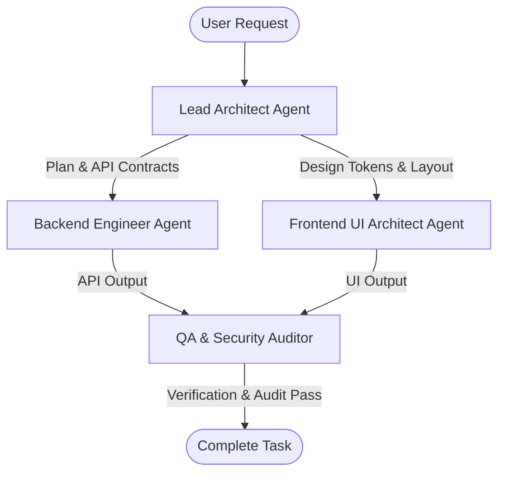

# Team Collaboration & Multi-Agent Protocols — B2B Tour Platform

> Bộ quy tắc phối hợp chuẩn Production dành cho tất cả các Agent trong dự án B2B Tour Platform.

---

## 1. Nguyên Tắc Cốt Lõi (Core Directives)

1. **Zero Placeholder Rule:**
   - Mọi đoạn code được viết ra PHẢI hoàn chỉnh 100%. Cấm tuyệt đối: `// TODO`, `// existing code`, `/* rest of code */`.
   - Viết trọn vẹn từng import, method, type definition, error handling và validation.

2. **Pre-Flight & Post-Flight Discipline:**
   - **Pre-Flight:** Phân tích kỹ file map, edge cases (null, negative, empty array, race conditions), và thiết kế architecture trước khi code.
   - **Post-Flight:** Kiểm tra lại code vừa viết, chạy build/test, verify 100% không vỡ contract.

3. **Phân Chia Trách Nhiệm Dựa Trên Vai Trò (Role Boundary):**
   - **Lead Architect:** Lập plan, thiết kế schema DB, định nghĩa API contracts, giao task cho subagents.
   - **Backend Engineer:** Viết logic server, Clean Architecture, xử lý DB transaction, bảo mật API.
   - **Frontend UI Architect:** Viết giao diện React/Next.js/HTML, HSL color system, micro-animations, responsive layout.
   - **QA & Security Auditor:** Rà soát lỗ hổng bảo mật (OWASP), kiểm thử logic nghiệp vụ B2B Travel, verify edge cases.

---

## 2. Quy Trình Phối Hợp Đa Agent (Multi-Agent Flow)

1. **Bước 1 — Phân rã Task:** Lead Architect nhận yêu cầu từ User ➔ Lập `implementation_plan.md` ➔ Định nghĩa API Contracts & DB Schema.
2. **Bước 2 — Thực thi Song Song:** 
   - Backend Agent làm việc trên môi trường Server/API.
   - Frontend Agent làm việc trên UI Component & Pages.
3. **Bước 3 — Kiểm thử & Audit:** QA & Security Agent rà soát toàn bộ code, chạy build/test, audit bảo mật trước khi trả kết quả cuối cùng cho User.
