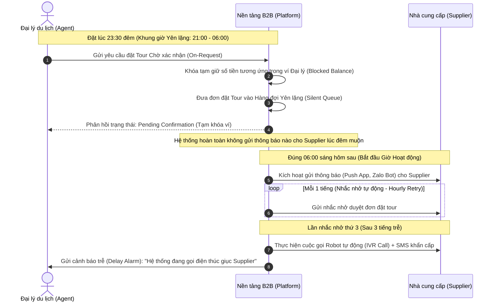
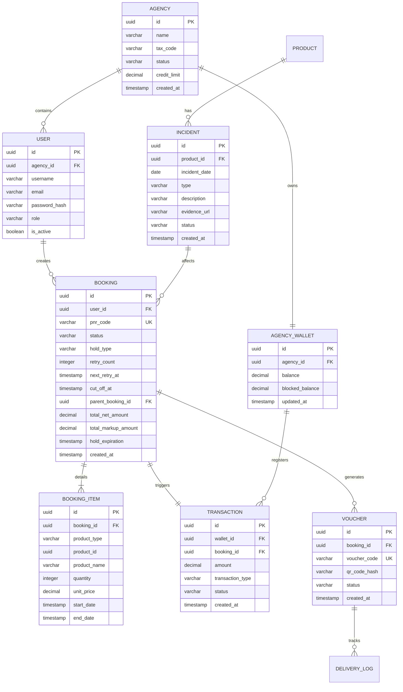

# TÀI LIỆU TỔNG HỢP TOÀN DIỆN DỰ ÁN & ĐẶC TẢ NGHIỆP VỤ CỐT LÕI
## DỰ ÁN: NỀN TẢNG DU LỊCH B2B (B2B TRAVEL PLATFORM — END-TO-END BOOKING & DELIVERY)
*Tài liệu tóm tắt toàn bộ bối cảnh, vấn đề, giải pháp, kiến trúc hệ thống và cơ sở dữ liệu chi tiết phục vụ báo cáo hội đồng giảng viên đồ án tốt nghiệp.*

---

## PHẦN 1: BỐI CẢNH DỰ ÁN & NỖI ĐAU NGHIỆP VỤ (BUSINESS CONTEXT & PAIN POINTS)

### 1.1 Tổng quan về mô hình du lịch B2B tại Việt Nam
Ngành du lịch Việt Nam chứng kiến sự phân mảnh lớn ở đầu ra. Trong khi các nền tảng OTA quốc tế lớn (Agoda, Booking.com) tập trung phục vụ đối tượng khách lẻ tự túc (B2C), hơn **70% thị phần phân phối thực tế** vẫn nằm trong tay hơn 15.000 đại lý du lịch vừa và nhỏ (Travel Agencies), đại lý gia đình và cộng tác viên tự do (Freelancers). 

Nền tảng **B2B Travel Platform** ra đời như một mô hình **SaaS (Software-as-a-Service)** chuyên biệt giúp kết nối trực tiếp các Nhà cung cấp dịch vụ địa phương (Suppliers: khách sạn, hãng xe, đơn vị tổ chức tour) đến mạng lưới Đại lý du lịch, giúp tối ưu hóa chi phí vận hành, dòng tiền và cung cấp dịch vụ xác thực số hóa khép kín.

```
[Supplier: Hotel/Airline/Tours] ──> [B2B Travel Platform (SaaS)] ──> [Travel Agencies / Sub-agents] ──> [End Customer]
                                            │
                                            ▼ (Quét QR Code check-in)
                                   [Delivery Agent / Guide / Driver]
```

### 1.2 Những "Nỗi Đau" Nghiệp Vụ Lớn (Pain Points)
Quy trình thủ công truyền thống hiện tại của các đại lý gặp phải 4 nút thắt lớn:
1. **Phân mảnh kho hàng & Báo giá chậm**: Nhân viên đại lý phải tìm kiếm giá Net từ nhiều nguồn (nhắn Zalo, gọi điện), tự tính Markup (cộng tiền lời) thủ công và báo giá cho khách mất từ 30 phút đến vài giờ, dễ sai sót hoặc mất cơ hội bán hàng.
2. **Thời gian giữ chỗ quá ngắn (Hold Time Limit)**: Các hãng bay giá rẻ chỉ cho giữ chỗ 15-30 phút, khách sạn giữ 1-2 giờ. Nếu đại lý không chốt tiền kịp với khách hoặc kế toán chuyển khoản chậm, booking bị tự động hủy, khi đặt lại giá vé đã tăng.
3. **Mất dấu và giả mạo Voucher**: Voucher dịch vụ gửi dạng file ảnh thô qua Zalo dễ bị sao chép hoặc giả mạo. Tại điểm check-in (lên xe du lịch, điểm đón tour), hướng dẫn viên và tài xế soát vé bằng mắt hoặc giấy tờ thủ công, dễ gây thất thoát doanh thu hoặc đón nhầm khách.
4. **Luồng xác nhận Tour bất đồng bộ**: Các tour du lịch địa phương thường không thể xác nhận tức thì (Instant Book) mà cần chờ kiểm tra xe, tàu và hướng dẫn viên. Việc đặt tour đêm muộn dễ bị hủy sát giờ bay, làm khách hàng cực kỳ khó chịu.

### 1.3 So sánh Market Gap (Khoảng trống thị trường)

| Tiêu chí | GDS Truyền thống (Sabre, Amadeus) | B2C OTA (Agoda, Booking.com) | Nền tảng B2B Travel Platform đề xuất |
| :--- | :--- | :--- | :--- |
| **Giá sỉ (Net Rate) & Công nợ** | Ký quỹ cực kỳ lớn (trên 100M VND), phí cổng đắt. | Chỉ có giá bán lẻ cho khách du lịch lẻ, không hỗ trợ công nợ. | **Không mất phí duy trì, nạp ví linh hoạt, cấp hạn mức nợ (Credit Line) cho đại lý uy tín.** |
| **Tích hợp dịch vụ nội địa** | Chỉ mạnh về vé máy bay quốc tế và chuỗi khách sạn 5 sao. | Yếu về các sản phẩm tour lẻ địa phương, xe đưa đón và combo tùy chọn. | **Tích hợp sâu dịch vụ nội địa: khách sạn lẻ, tour trải nghiệm, xe trung chuyển.** |
| **Bàn giao dịch vụ (Delivery)** | Hoàn toàn bỏ trống khâu bàn giao thực tế tại điểm đón. | Khách tự trình email xác nhận đặt chỗ tại lễ tân khách sạn. | **Có ứng dụng di động quét mã QR xác thực check-in thời gian thực cho tài xế/HDV tại điểm đón.** |

---

## PHẦN 2: GIẢI PHÁP PHẦN MỀM & 7 PHÂN HỆ CỐT LÕI (SYSTEM MODULES)

Hệ thống được thiết kế khép kín (End-to-End) bao gồm 7 module nghiệp vụ chính:

```
+---------------------------------------------------------------------------------------------------+
|                                     7 MODULES NGHIỆP VỤ CỐT LÕI                                   |
|                                                                                                   |
|  [M01: Auth & RBAC]   --> Đăng ký đại lý, phân quyền Owner, Staff, Supplier, Delivery             |
|  [M02: Catalog & Inv] --> Quản lý sản phẩm (Hotel/Flight/Tour), lịch kho phòng, giá theo mùa     |
|  [M03: Search Engine] --> Tìm kiếm real-time, ẩn giá Net nhanh ("Agent Mode Toggle")              |
|  [M04: Booking Flow]  --> Đặt chỗ, sinh mã PNR, đếm ngược hold time (Hold Countdown)               |
|  [M05: B2B Wallet]    --> Thanh toán bằng ví đại lý, hỗ trợ hạn mức tín dụng nợ (Credit Limit)    |
|  [M06: Fulfillment]   --> Sinh PDF E-Voucher kèm mã QR mã hóa chữ ký số HMAC-SHA256               |
|  [M07: Delivery App]  --> Flutter App cho tài xế/HDV quét QR check-in, lưu trữ offline Hive       |
+---------------------------------------------------------------------------------------------------+
```

1. **M01 - Xác thực & Phân quyền**: Đăng nhập qua JWT Token, hỗ trợ xác thực 2 lớp (2FA). Phân quyền chặt chẽ dựa trên vai trò: Chủ đại lý (quản lý ví, hạn mức), Nhân viên đại lý (chỉ tìm kiếm, đặt chỗ), Nhà cung cấp (xử lý đơn, đóng bán), Nhân viên bàn giao (chỉ quét QR).
2. **M02 - Quản lý kho hàng & Đồng bộ tồn kho**: Supplier quản lý tồn kho và giá bán sỉ theo lịch ngày trực quan. Hỗ trợ cơ chế cập nhật tự động hoặc đồng bộ qua webhook.
3. **M03 - Bộ máy Tìm kiếm & Cộng giá (Markup Engine)**: Tìm kiếm real-time phòng trống, vé xe và vé máy bay. Áp dụng Markup Engine tự động cộng biên lợi nhuận của đại lý vào giá bán hiển thị. Nút tắt "Agent Mode" giúp ẩn toàn bộ giá Net gốc khi nhân viên đang mở màn hình tư vấn trực tiếp cho khách hàng.
4. **M04 - Đặt chỗ & Hold PNR**: Giữ chỗ tạm thời để giữ vé và giữ phòng trống trong thời gian đếm ngược (Hold Limit). Hệ thống tự giải phóng tồn kho về lại Supplier nếu đại lý quá hạn thanh toán.
5. **M05 - Ví Đại lý B2B & Quản lý Công nợ**: Đại lý có số dư ví điện tử nội bộ để trừ tiền tức thì khi đặt dịch vụ. Hệ thống hỗ trợ cấp hạn mức công nợ âm tối đa (Credit Limit). Hỗ trợ nạp tiền tự động 24/7 bằng quét mã VietQR/VNPay.
6. **M06 - Phát hành E-Voucher bảo mật**: Tự động tạo E-Voucher dưới dạng PDF theo chuẩn thương hiệu riêng của đại lý. Voucher tích hợp một mã QR được mã hóa bằng chữ ký số HMAC-SHA256 để chống giả mạo thông tin.
7. **M07 - Ứng dụng Di động Xác thực Check-in**: Ứng dụng Flutter dành cho tài xế hoặc hướng dẫn viên thực hiện quét QR tại điểm đón xe/tàu/tour. Hỗ trợ chế độ offline (lưu vết quét vào database Hive nội bộ và đồng bộ khi có 4G trở lại) để phục vụ tại các vùng sóng yếu.

---

## PHẦN 3: ĐẶC TẢ CÁC NGHIỆP VỤ PHỨC TẠP & ĐỘC ĐÁO (UNIQUE CRITICAL WORKFLOWS)

Đây là những cơ chế nghiệp vụ đặc thù do nhóm tự thiết kế nhằm giải quyết triệt để các vấn đề vận hành thực tế trong ngành du lịch Việt Nam, tạo điểm nhấn kỹ thuật lớn đối với hội đồng chấm thi:

### 3.1 Quy trình đặt Tour Chờ xác nhận (On-Request) & Khung giờ Yên lặng (Quiet Hours)
Để giải quyết bài toán đặt tour đêm muộn nhưng không làm phiền Supplier ngoài giờ hành chính, hệ thống triển khai cơ chế **Quiet Hours**:



*   **Khung giờ Yên lặng (21:00 - 06:00)**: Đơn hàng ở trạng thái `Pending Confirmation`, tiền ví của đại lý bị tạm khóa (`Blocked Balance`) để đảm bảo tính thanh toán. Không gửi thông báo để tránh làm phiền Supplier.
*   **Hourly Retry & Thang cảnh báo leo thang (Active Hours)**: Bắt đầu từ 06:00, hệ thống nhắc nhở Supplier mỗi tiếng 1 lần qua Zalo/Push App. Đến lần thứ 3 (3 tiếng chưa duyệt), hệ thống tự động kích hoạt **cuộc gọi robot IVR (Voice Call tự động)** đến hotline của Supplier, đồng thời báo động về cho Đại lý biết tiến độ.

### 3.2 Ràng buộc tránh Hủy sát giờ (Dynamic Cut-off Time)
Tránh tình trạng đơn đặt tour không được xác nhận và bị hủy sát giờ đi (trước 2 tiếng) vào sáng sớm, gây bức xúc lớn cho khách hàng:
*   **Đối với Tour khởi hành sáng sớm (06:00 - 12:00 trưa hôm sau)**:
    *   **Giờ khóa sổ nhận đơn**: Đại lý bắt buộc phải gửi yêu cầu đặt tour trước **18:00 tối ngày hôm trước**.
    *   **Giờ tự động hủy**: Nếu đến **21:00 tối ngày hôm trước** mà Supplier vẫn không xác nhận, hệ thống **tự động hủy đơn và hoàn tiền** ngay lập tức. Khách hàng và đại lý sẽ biết kết quả bị hủy từ tối hôm trước để kịp thời thay đổi lịch trình.
*   **Đối với Tour khởi hành Chiều/Tối (Sau 12:00 trưa)**:
    *   Hạn chót tự động hủy được tính theo công thức:
        $$\text{Thời điểm hủy} = \min(\text{12:00 trưa ngày khởi hành}, \text{Giờ khởi hành} - 2\text{ tiếng})$$

### 3.3 Bộ máy gợi ý Vé máy bay & Xe đi kèm (Cross-product Recommendation & Synchronized Hold)
Khi đại lý thực hiện tìm kiếm một Tour (ví dụ: Tour Nha Trang 3 ngày từ 10/07 - 12/07):
1.  **Gợi ý thông minh (Cross-selling)**: Bộ máy đề xuất tự động hiển thị vé máy bay khứ hồi (HAN-CXR hạ cánh trước giờ đón tour tối thiểu 3 tiếng, cất cánh sau giờ trả tour tối thiểu 4 tiếng) và xe limousine đưa đón sân bay tương thích. Đại lý có thể chọn tích hợp combo vào 1 giỏ hàng để thanh toán 1 lần duy nhất.
2.  **Khóa giữ chỗ đồng bộ (Price Lock / Escrow Hold)**:
    *   Khi Đại lý checkout combo, hệ thống gọi API giữ chỗ vé máy bay gốc (Hold Airline PNR) và khóa giá (`Price Lock`) trên Redis trong 20 phút.
    *   Hệ thống khóa tạm giữ tiền combo trong ví Đại lý.
    *   Gửi yêu cầu đặt Tour sang cho Supplier Tour duyệt.
    *   **Nếu Supplier đồng ý**: Hệ thống tự động gọi API xuất vé máy bay chính thức (`Issue Ticket`) đồng thời, trừ ví chính thức và sinh E-Voucher combo.
    *   **Nếu Supplier từ chối/hết hạn**: Hệ thống gọi API nhả PNR vé máy bay và xe đi kèm để tránh mất phí phạt, hoàn tiền 100% về ví đại lý tức thì. Không xảy ra tình trạng đại lý bị "mồ côi" vé máy bay.

### 3.4 Quy trình Báo cáo Sự cố & Chế tài Đền bù (Incident & Stop-selling Workflow)
Giải quyết các sự cố đột xuất sau khi booking đã được thanh toán và xác nhận thành công:

```
             [Sự cố đột xuất phát sinh sau khi đặt]
                               │
            ┌──────────────────┴──────────────────┐
            ▼                                     ▼
   [Bất khả kháng - Force Majeure]      [Lỗi vận hành - Operational]
   - Bão lũ, cấm biển của chính quyền   - Hỏng phương tiện, HDV ốm...
   - Supplier chụp ảnh văn bản gửi app   - Hệ thống tự tìm đối tác khác
   - Hoàn 100% ví đại lý                - Nếu có: chuyển đơn, trừ ví công nợ Supplier cũ
   - KHÔNG phạt Supplier                - Nếu không: Hoàn 100% đại lý + Phạt Supplier 30-50%
```

*   **Quy trình Đóng bán tour nhanh (Quick Stop Selling)**: Cung cấp nút gạt đóng bán nhanh trên Supplier app để cập nhật kho chỗ trống về `0` lập tức. Nếu Supplier không cập nhật dẫn đến overbooking thực tế bên ngoài, Supplier chịu mức phạt **20% giá trị đơn hàng** để đền bù mã giảm giá bồi thường cho Đại lý.

---

## PHẦN 4: KIẾN TRÚC HỆ THỐNG & THIẾT KẾ CƠ SỞ DỮ LIỆU CHI TIẾT

### 4.1 Lựa chọn Kiến trúc phần mềm: Modular Monolith
Hệ thống sử dụng mô hình kiến trúc **Modular Monolith** triển khai trên nền tảng **.NET 8 Clean Architecture**.
*   *Lý giải lựa chọn*: Đây là giải pháp kiến trúc tối ưu nhất cho quy mô đồ án tốt nghiệp và doanh nghiệp lữ hành giai đoạn khởi nghiệp. Nó mang lại tính cô lập nghiệp vụ rất cao nhờ phân chia mã nguồn thành các module độc lập (Identity, Catalog, Booking, Payment, Notification) giao tiếp với nhau qua In-Process Event Bus (MediatR), nhưng chạy chung trong 1 tiến trình và 1 database chung (tách biệt qua schemas). Giải pháp này giảm tối đa chi phí triển khai, vận hành hạ tầng mạng phức tạp của Microservices nhưng vẫn bảo đảm tính nhất quán dữ liệu cao (ACID transactions liên schema).

### 4.2 Lược đồ quan hệ thực thể (Core Entities ERD)



### 4.3 Đặc tả Cơ sở dữ liệu chi tiết (SQL DDL Schema)

Dưới đây là lược đồ SQL đầy đủ cho cơ sở dữ liệu PostgreSQL của hệ thống, bao gồm đầy đủ 9 bảng dữ liệu và cấu hình index tối ưu hóa hiệu năng:

```sql
-- ==========================================
-- 1. SCHEMA IDENTITY & TENANT AUTH
-- ==========================================
CREATE SCHEMA auth;

CREATE TABLE auth.agencies (
    id UUID PRIMARY KEY DEFAULT gen_random_uuid(),
    name VARCHAR(255) NOT NULL,
    tax_code VARCHAR(20) UNIQUE NOT NULL,
    credit_limit DECIMAL(18,2) DEFAULT 0.00,
    status VARCHAR(50) DEFAULT 'PENDING',
    created_at TIMESTAMP WITH TIME ZONE DEFAULT CURRENT_TIMESTAMP
);

CREATE TABLE auth.users (
    id UUID PRIMARY KEY DEFAULT gen_random_uuid(),
    agency_id UUID REFERENCES auth.agencies(id),
    username VARCHAR(100) UNIQUE NOT NULL,
    email VARCHAR(255) UNIQUE NOT NULL,
    password_hash VARCHAR(255) NOT NULL,
    role VARCHAR(50) NOT NULL,
    is_active BOOLEAN DEFAULT TRUE
);

-- ==========================================
-- 2. SCHEMA CATALOG & INVENTORY MANAGEMENT
-- ==========================================
CREATE SCHEMA catalog;

CREATE TABLE catalog.products (
    id UUID PRIMARY KEY DEFAULT gen_random_uuid(),
    name VARCHAR(255) NOT NULL,
    type VARCHAR(50) NOT NULL, -- HOTEL, FLIGHT, TOUR
    base_price DECIMAL(18,2) NOT NULL,
    created_at TIMESTAMP WITH TIME ZONE DEFAULT CURRENT_TIMESTAMP
);

CREATE TABLE catalog.inventories (
    id UUID PRIMARY KEY DEFAULT gen_random_uuid(),
    product_id UUID REFERENCES catalog.products(id),
    date DATE NOT NULL,
    available_qty INT NOT NULL,
    version INT DEFAULT 0 -- Sử dụng cho Optimistic Locking chống race condition
);

-- ==========================================
-- 3. SCHEMA BOOKING & WORKFLOW STATE
-- ==========================================
CREATE SCHEMA booking;

CREATE TABLE booking.bookings (
    id UUID PRIMARY KEY DEFAULT gen_random_uuid(),
    agency_id UUID REFERENCES auth.agencies(id),
    user_id UUID REFERENCES auth.users(id),
    pnr_code VARCHAR(10) UNIQUE NOT NULL,
    status VARCHAR(50) DEFAULT 'HELD', -- HELD, PENDING_CONFIRMATION, PAID, CANCELLED, EXPIRED, COMPLETED
    hold_type VARCHAR(20) DEFAULT 'INSTANT', -- INSTANT, ON_REQUEST
    retry_count INT DEFAULT 0,
    next_retry_at TIMESTAMP WITH TIME ZONE,
    cut_off_at TIMESTAMP WITH TIME ZONE,
    parent_booking_id UUID REFERENCES booking.bookings(id) NULL, -- Thiết lập nhóm Combo Tour + Flight + Car
    total_net_amount DECIMAL(18,2) NOT NULL,
    total_markup_amount DECIMAL(18,2) NOT NULL,
    hold_expiration TIMESTAMP WITH TIME ZONE NOT NULL,
    created_at TIMESTAMP WITH TIME ZONE DEFAULT CURRENT_TIMESTAMP
);

CREATE TABLE booking.booking_items (
    id UUID PRIMARY KEY DEFAULT gen_random_uuid(),
    booking_id UUID REFERENCES booking.bookings(id),
    product_type VARCHAR(50) NOT NULL, -- HOTEL, FLIGHT, TOUR
    product_id UUID NOT NULL,
    product_name VARCHAR(255) NOT NULL,
    net_price DECIMAL(18,2) NOT NULL,
    markup_price DECIMAL(18,2) NOT NULL,
    start_date TIMESTAMP WITH TIME ZONE NOT NULL,
    end_date TIMESTAMP WITH TIME ZONE NOT NULL
);

CREATE TABLE booking.vouchers (
    id UUID PRIMARY KEY DEFAULT gen_random_uuid(),
    booking_id UUID REFERENCES booking.bookings(id),
    voucher_code VARCHAR(50) UNIQUE NOT NULL,
    qr_code_hash VARCHAR(255) NOT NULL,
    status VARCHAR(50) DEFAULT 'CONFIRMED', -- CONFIRMED, DELIVERED, CANCELLED
    created_at TIMESTAMP WITH TIME ZONE DEFAULT CURRENT_TIMESTAMP
);

CREATE TABLE booking.incidents (
    id UUID PRIMARY KEY DEFAULT gen_random_uuid(),
    booking_id UUID REFERENCES booking.bookings(id) NULL,
    product_id UUID REFERENCES catalog.products(id),
    incident_date DATE NOT NULL,
    type VARCHAR(50) NOT NULL, -- FORCE_MAJEURE, OPERATIONAL_FAILURE
    description TEXT NOT NULL,
    evidence_url VARCHAR(500) NULL,
    status VARCHAR(50) DEFAULT 'PENDING', -- PENDING, PROCESSED, REJECTED
    created_at TIMESTAMP WITH TIME ZONE DEFAULT CURRENT_TIMESTAMP
);

-- ==========================================
-- 4. SCHEMA PAYMENT & B2B WALLET
-- ==========================================
CREATE SCHEMA payment;

CREATE TABLE payment.wallets (
    id UUID PRIMARY KEY DEFAULT gen_random_uuid(),
    agency_id UUID REFERENCES auth.agencies(id) UNIQUE,
    balance DECIMAL(18,2) DEFAULT 0.00,
    blocked_balance DECIMAL(18,2) DEFAULT 0.00, -- Số dư tạm giữ khi booking chờ xác nhận
    updated_at TIMESTAMP WITH TIME ZONE DEFAULT CURRENT_TIMESTAMP
);

CREATE TABLE payment.transactions (
    id UUID PRIMARY KEY DEFAULT gen_random_uuid(),
    wallet_id UUID REFERENCES payment.wallets(id),
    booking_id UUID REFERENCES booking.bookings(id) NULL,
    amount DECIMAL(18,2) NOT NULL,
    transaction_type VARCHAR(30) NOT NULL, -- DEBIT, CREDIT, HOLD_PENDING, RELEASE_HOLD
    status VARCHAR(50) DEFAULT 'SUCCESS', -- SUCCESS, FAILED, PENDING
    created_at TIMESTAMP WITH TIME ZONE DEFAULT CURRENT_TIMESTAMP
);

-- ==========================================
-- 5. INDEXING STRATEGY (Chiến lược đánh chỉ mục tối ưu truy vấn)
-- ==========================================
CREATE INDEX idx_inventories_product_date ON catalog.inventories(product_id, date);
-- Tối ưu hóa truy vấn kiểm tra kho chỗ trống theo ngày của sản phẩm

CREATE INDEX idx_bookings_agency_status ON booking.bookings(agency_id, status);
-- Tối ưu hóa hiển thị danh sách hóa đơn theo trạng thái trên Dashboard đại lý

CREATE UNIQUE INDEX idx_vouchers_code_hash ON booking.vouchers(voucher_code);
-- Tăng tốc độ kiểm tra tính duy nhất và giải mã quét QR check-in voucher

CREATE INDEX idx_incidents_product_date ON booking.incidents(product_id, incident_date);
-- Tối ưu hóa kiểm tra nhanh các sự cố ảnh hưởng đến sản phẩm trong ngày

CREATE INDEX idx_transactions_wallet_created ON payment.transactions(wallet_id, created_at);
-- Tối ưu hiển thị lịch sử biến động số dư và sao kê ví đại lý
```

### 4.4 Các công nghệ chủ chốt (Tech Stack) & Chức năng trong hệ thống
*   **Backend Core**: **.NET 8 (C#)** kết hợp **Entity Framework Core 8**.
    *   *Vai trò*: Triển khai Clean Architecture dạng Modular Monolith. Xử lý các nghiệp vụ tính toán giá sỉ/Markup, kết nối với cổng thanh toán và quản lý transaction.
*   **Caching & Distributed Lock**: **Redis Server 7**.
    *   *Vai trò*:
        1.  *Cache*: Lưu giữ thông tin chuyến bay/phòng khách sạn tĩnh trong 5-10 phút để giảm tải trực tiếp cho DB PostgreSQL khi tần suất đại lý tìm kiếm quá cao.
        2.  *Redlock (Redis Distributed Lock)*: Khóa tài nguyên trong 10-15 giây khi 2 nhân viên cùng thanh toán cho 1 phòng cuối cùng để chống **Race Condition** gây Overbooking.
*   **Background Jobs**: **Hangfire Queue**.
    *   *Vai trò*: Quét cơ sở dữ liệu định kỳ mỗi 5 phút để tự động giải phóng các phòng giữ chỗ quá hạn (Hold Release), tự động gửi nhắc nhở và kích hoạt cuộc gọi IVR Call tới Supplier ngoài Quiet Hours.
*   **Mobile App (Delivery)**: **Flutter** kết hợp **Hive DB** nội bộ.
    *   *Vai trò*: Xây dựng ứng dụng di động đa nền tảng cho tài xế/HDV quét QR. Hive (NoSQL local) được dùng để cache danh sách hành khách và lưu lịch sử quét check-in offline, bảo đảm hoạt động tại các vùng sóng yếu.
