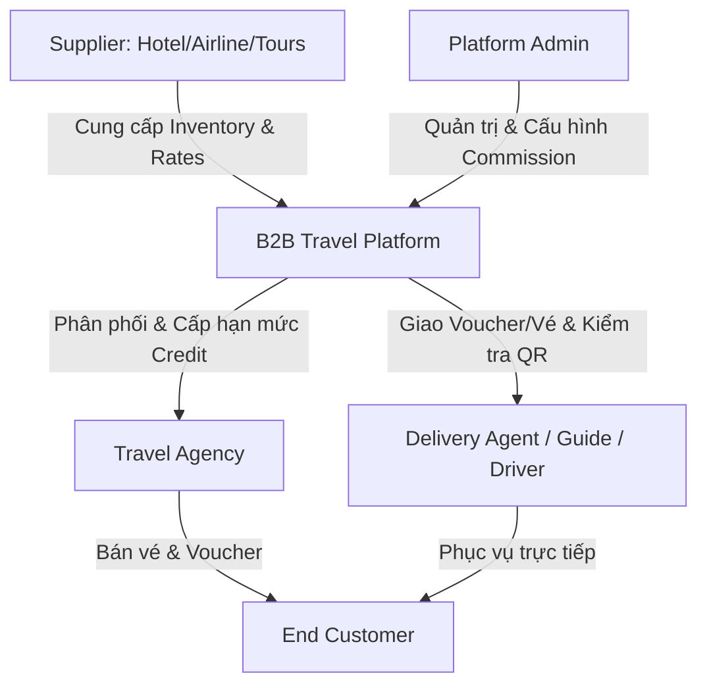
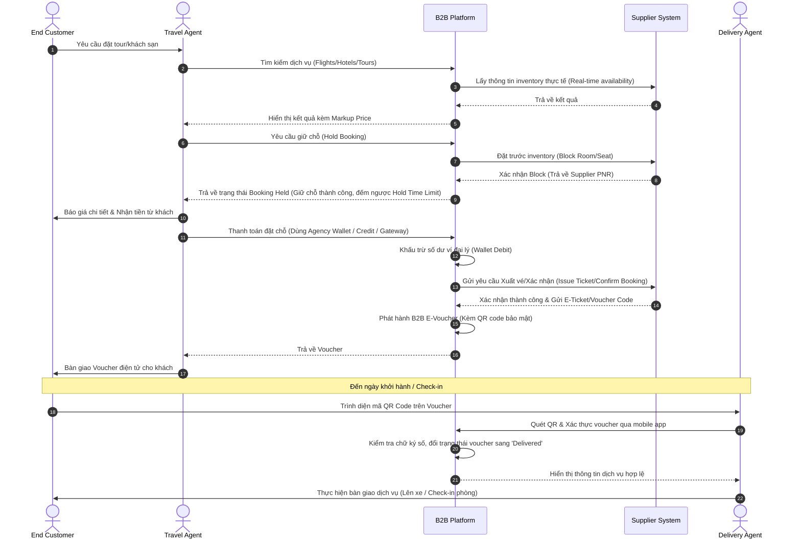
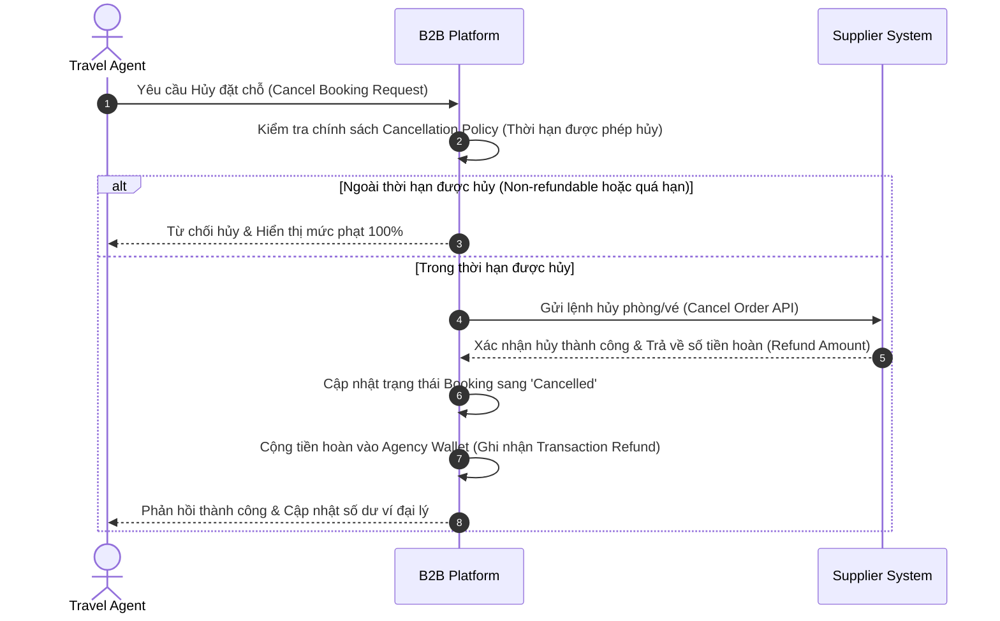
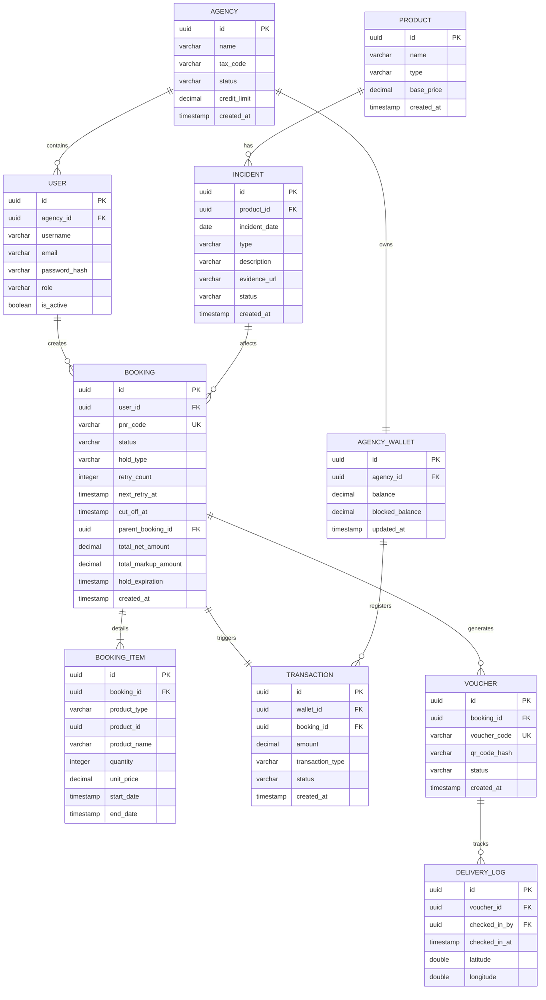
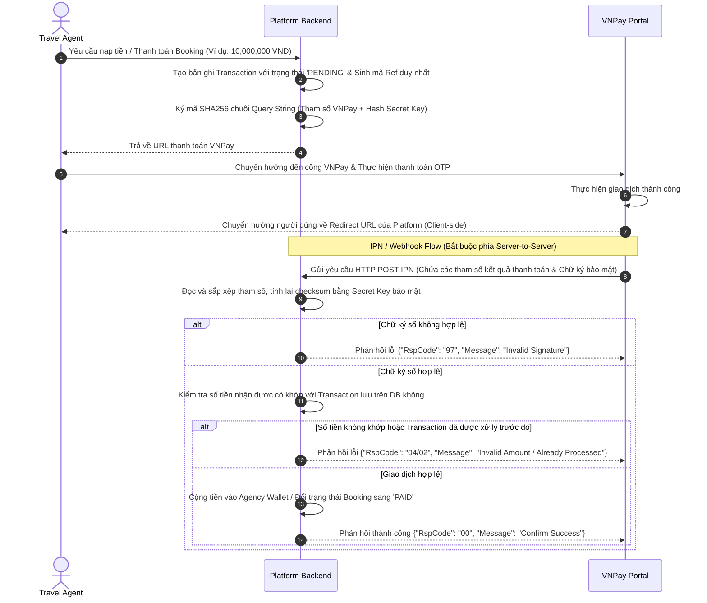
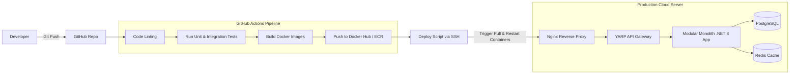

# B2B Travel Platform — End-to-End Booking & Delivery
## SOFTWARE REQUIREMENTS SPECIFICATION (SRS)

---

## 1. BUSINESS DOMAIN & CORE FLOW ANALYSIS

### 1.1. B2B Travel Business Model & Actor Matrix
Trong mô hình du lịch B2B (Business-to-Business), nền tảng hoạt động như một hệ thống quản lý phân phối dịch vụ du lịch (GDS/OTA Aggregator) kết nối các nhà cung cấp dịch vụ (Suppliers) với các đại lý du lịch (Travel Agencies) và kết thúc tại khách hàng cuối (End Customers) thông qua đội ngũ vận chuyển/phục vụ (Delivery Agents).



| Actor | Vai trò chính | Quyền hạn & Chức năng cốt lõi |
| :--- | :--- | :--- |
| **Platform Admin** | Quản trị viên hệ thống | Quản lý vòng đời Agency, đối soát tài chính, cấu hình tỷ lệ hoa hồng (Commission/Markup Engine), cấu hình nhà cung cấp (Suppliers), xem báo cáo tổng quan. |
| **Supplier** | Nhà cung cấp dịch vụ | Quản lý kho phòng (Hotels), chuyến bay (Flights), tour du lịch (Tours), cập nhật bảng giá (Rates), xử lý trạng thái đặt dịch vụ (Booking Confirmation). |
| **Travel Agency (Owner & Staff)** | Đại lý du lịch | Tìm kiếm dịch vụ, giữ chỗ (Hold Booking), thanh toán qua ví đại lý (Agency Wallet) hoặc hạn mức tín dụng (Credit Limit), phát hành hóa đơn và voucher cho End Customer. |
| **End Customer** | Khách hàng cuối | Nhận vé/voucher điện tử qua Email/SMS, sử dụng dịch vụ trực tiếp, phản hồi/đánh giá (Review/Feedback). |
| **Delivery Agent / Staff** | Nhân viên bàn giao/Hướng dẫn viên | Quét mã QR voucher, xác thực trạng thái sử dụng vé trực tiếp tại địa điểm đón/trạm kiểm soát, thực hiện bàn giao dịch vụ. |

---

### 1.2. Core Business Workflows

#### 1.2.1. End-to-End Booking & Delivery Flow
Đây là luồng nghiệp vụ cốt lõi đi qua toàn bộ vòng đời của một giao dịch đặt dịch vụ du lịch từ bước Tìm kiếm đến khi Hoàn thành.



#### 1.2.2. Refund & Cancellation Flow (Luồng Hủy & Hoàn tiền)
Xử lý các tình huống đại lý muốn hủy đặt chỗ dựa trên chính sách hoàn trả (Cancellation Policy) của từng Supplier.



---

### 1.3. Business Rules, Constraints & Edge Cases
1. **Hold Time Limit (Thời gian giữ chỗ)**: Khi đại lý đặt phòng/vé nhưng chưa thanh toán, hệ thống sẽ giữ chỗ trong một khoảng thời gian nhất định (ví dụ: 15 phút cho vé máy bay giá rẻ, 2 giờ cho phòng khách sạn). Hết thời gian này, nếu chưa có giao dịch thanh toán thành công, hệ thống phải tự động gửi lệnh hủy giữ chỗ (Release Inventory) về Supplier.
2. **Credit Limit Control (Hạn mức tín dụng)**: Đại lý được cấp một hạn mức tín dụng âm tối đa (ví dụ: cho phép nợ đến -50,000,000 VND). Nếu số dư tài khoản của Agency vượt quá hạn mức nợ cho phép, hệ thống sẽ tự động khóa chức năng "Thanh toán bằng tài khoản đại lý" và bắt buộc thanh toán qua cổng trực tuyến (VNPay/Stripe).
3. **Double Booking Prevention**: Tránh trường hợp hai nhân viên đại lý cùng thực hiện thanh toán cho một booking hoặc giữ chỗ trùng lặp một mã phòng cuối cùng. Áp dụng cơ chế **Optimistic/Pessimistic Locking** trên DB và phân tán thông qua **Redis Distributed Lock (Redlock)**.
4. **Supplier Outage Handling**: Nếu API của Supplier không phản hồi khi đang thanh toán, hệ thống phải chuyển trạng thái booking thành `Pending Confirmation`, tạm giữ tiền của đại lý, và chuyển sang hàng đợi xử lý thủ công (Manual Reconcile Queue) cho Platform Admin kiểm tra với Supplier thay vì tự động hoàn tiền hoặc báo lỗi mất dấu giao dịch.
5. **Quiet Hours & Dynamic Cut-off for Tours**: 
   - Đơn đặt Tour từ 21:00 - 06:00 sáng hôm sau được đưa vào hàng chờ yên lặng (không gửi thông báo cho Supplier).
   - Nhắc nhở Supplier mỗi tiếng 1 lần trong khung giờ hoạt động; leo thang cuộc gọi IVR/SMS sau 3 tiếng trễ và báo cho Đại lý.
   - Tour sáng sớm đi ngày mai (06:00 - 12:00) bắt buộc đặt trước 18:00 và tự động hủy lúc 21:00 tối hôm trước nếu chưa được xác nhận để tránh hủy sát giờ trước 2 tiếng. Các tour khác tự động hủy tối thiểu 2 tiếng trước giờ khởi hành.
6. **Synchronized Combo Booking**: Đặt combo Tour + Bay + Xe sẽ đồng bộ hóa việc giữ chỗ/khóa giá (`Price Lock/Hold`). Nếu Tour bị từ chối/hủy, hệ thống tự động nhả vé bay và xe đi kèm để bảo vệ tiền ví của đại lý.

---

### 1.4. Industry Benchmarks: Travelport, Amadeus, Sabre Comparison
Trong ngành Travel Tech chuyên nghiệp, các hệ thống phân phối toàn cầu (GDS) áp dụng các tiêu chuẩn rất chặt chẽ:
- **Passenger Name Record (PNR)**: Mỗi một booking thành công bắt buộc phải sinh ra một PNR (mã đặt chỗ gồm 6 ký tự chữ và số) đóng vai trò định danh duy nhất cho hồ sơ đặt chỗ của hành khách trên toàn thế giới.
- **NDC Standard (New Distribution Capability)**: Chuẩn kết nối XML/JSON mới do IATA đề xuất giúp các OTA/B2B Platform có thể truy vấn trực tiếp thông tin dịch vụ giá trị gia tăng (ancillaries) như hành lý, suất ăn, thay vì chỉ là giá vé thô.
- **Cache-Heavy Architecture**: Do tần suất tìm kiếm chuyến bay/phòng của các đại lý lớn gấp 100-1000 lần tần suất đặt thực tế, các hệ thống như Amadeus sử dụng các công nghệ cache cực lớn (Memcached/Redis) để lưu trữ lịch bay và giá vé tĩnh trong vòng vài giờ nhằm giảm tải trực tiếp cho GDS core system.

---

## 2. FUNCTIONAL REQUIREMENTS (FR)

### 2.1. System Requirements Catalog (MoSCoW Matrix)

| ID | Module | Tên Yêu cầu | Mô tả chi tiết | Ưu tiên | Ghi chú |
| :--- | :--- | :--- | :--- | :--- | :--- |
| **FR-01** | Auth | Multi-tenant Registration | Đại lý đăng ký tài khoản doanh nghiệp. Platform Admin duyệt thủ công trước khi kích hoạt. | **Must** | Yêu cầu nhập mã số thuế. |
| **FR-02** | Auth | RBAC (Role-Based Access) | Phân quyền: Agency Owner (toàn quyền), Agency Staff (chỉ đặt & tìm), Delivery Staff (chỉ quét QR). | **Must** | Phân quyền động ở phía backend. |
| **FR-03** | Inventory | Catalog Management | Quản lý thông tin Khách sạn, Chuyến bay, Tour du lịch tự phát triển hoặc đồng bộ từ bên thứ ba. | **Must** | Có phân mục giá riêng cho từng mùa. |
| **FR-03-b** | Inventory | Quick Stop Selling | Gạt nút đóng bán nhanh trên Supplier app hoặc chat Zalo/Telegram; phạt 20% đơn hàng nếu không cập nhật gây double booking. | **Must** | Đảm bảo đồng bộ chỗ trống thực tế. |
| **FR-04** | Inventory | Markup & Commission Engine | Cấu hình tỷ lệ hoa hồng hoặc số tiền cộng thêm (Markup) linh hoạt cho từng đại lý/nhóm đại lý. | **Must** | Áp dụng trực tiếp vào kết quả tìm kiếm. |
| **FR-05** | Search | Search & Filter Aggregator | Tìm kiếm tổng hợp chuyến bay, khách sạn, tour du lịch theo địa điểm, thời gian, số khách và bộ lọc nâng cao. | **Must** | Kết nối cache Redis để tối ưu tốc độ. |
| **FR-05-b** | Search | Cross-product Recommendations | Gợi ý Vé máy bay khứ hồi và Xe đưa đón sân bay tương thích khi Đại lý tìm kiếm Tour. | **Should** | Phân tích điểm đi/đến và thời gian tour. |
| **FR-06** | Booking | Hold Booking | Giữ chỗ tạm thời, khóa inventory trong thời gian đếm ngược (countdown timer). | **Must** | Chạy background job để release. |
| **FR-06-b** | Booking | Synchronized Combo Hold | Khóa giữ chỗ và nhả giữ chỗ đồng bộ cho combo gồm Tour và Vé bay/Xe đưa đón đi kèm. | **Must** | Tránh tình trạng đại lý bị mồ côi vé máy bay. |
| **FR-07** | Booking | Booking Fulfillment | Tự động hoặc thủ công xác nhận với nhà cung cấp sau khi đại lý thanh toán thành công. | **Must** | Trả về mã PNR / Voucher code. |
| **FR-07-b** | Booking | Quiet Hours & Retry Queue | Xếp đơn đặt tour đêm 21h-6h vào hàng đợi, nhắc nhở Supplier mỗi tiếng và gọi IVR/SMS sau 3 tiếng trễ. | **Must** | Quản lý bởi Hangfire background job. |
| **FR-07-c** | Booking | Dynamic Cut-off Auto-cancel | Tự động hủy đơn tour sáng sớm chưa duyệt vào lúc 21h tối hôm trước; hủy trước giờ đi 2 tiếng đối với tour khác. | **Must** | Hạn chế hủy tour sát giờ trước 2 tiếng gây khó chịu. |
| **FR-07-d** | Booking | Supplier Incident Report | Cho phép Supplier khai báo sự cố (bất khả kháng/lỗi vận hành) trên app; tự động hoàn tiền hoặc định tuyến tour thay thế. | **Must** | Áp dụng khấu trừ đền bù tự động qua ví. |
| **FR-08** | Payment | Credit & Wallet Management | Đại lý có ví số dư để thanh toán trực tiếp, hỗ trợ cấp hạn mức tín dụng trả sau (Credit Limit). | **Must** | Ghi nhật ký biến động số dư nghiêm ngặt. |
| **FR-09** | Payment | Online Payment Gateway | Tích hợp VNPay, MoMo, Stripe để nạp tiền vào ví hoặc thanh toán trực tiếp cho booking. | **Must** | Hỗ trợ IPN/Webhook an toàn. |
| **FR-10** | Delivery | Secured E-Voucher Generation | Tự động sinh file PDF Voucher có chứa mã QR bảo mật mã hóa bằng thuật toán chữ ký điện tử. | **Must** | Lưu trữ trên Object Storage. |
| **FR-11** | Delivery | QR Code Scan & Check-in | Mobile App quét mã QR để xác nhận hành khách đã check-in sử dụng dịch vụ tại chỗ. | **Must** | Yêu cầu xác định tọa độ GPS lúc quét. |
| **FR-12** | Notification | Event-driven Notifications | Gửi Email, SMS, Notification App khi booking đổi trạng thái (Held, Paid, Confirmed, Cancelled). | **Should** | Sử dụng hàng đợi tin nhắn (RabbitMQ). |
| **FR-13** | Reporting | Financial & Sales Analytics | Đại lý xem doanh thu, hoa hồng, biểu đồ tăng trưởng; Admin xem doanh thu toàn sàn, dòng tiền đại lý. | **Should** | Kết xuất dữ liệu Excel/PDF. |

---

### 2.2. Detailed User Stories & Acceptance Criteria

#### Module 1: Hold Booking (Giữ chỗ dịch vụ)
* **User Story**:
  * As an *Agency Staff*,
  * I want to *hold a booking for a specific hotel room or flight seat without immediate payment*,
  * So that *I can secure the inventory while confirming payment with my end customer*.
* **Acceptance Criteria**:
  * **Scenario 1: Hold booking thành công còn phòng/ghế**
    * **Given** nhân viên đại lý đã chọn phòng khách sạn "Deluxe Ocean View" có sẵn trong hệ thống.
    * **When** thực hiện gửi yêu cầu "Hold Booking".
    * **Then** hệ thống thực hiện trừ tạm thời số lượng tồn kho (Inventory - 1), tạo bản ghi booking với trạng thái `Held`, bắt đầu đếm ngược thời gian giữ chỗ (ví dụ: 30 phút) và trả về giao diện đếm ngược kèm thông tin chi tiết.
  * **Scenario 2: Tự động giải phóng inventory khi hết hạn giữ chỗ**
    * **Given** một booking đang ở trạng thái `Held` và thời gian đếm ngược trở về `00:00` mà chưa có giao dịch thanh toán thành công.
    * **When** hệ thống chạy background worker (cron job).
    * **Then** hệ thống tự động đổi trạng thái booking thành `Expired`, cộng trả lại số lượng tồn kho (Inventory + 1) và giải phóng phòng/ghế về trạng thái sẵn sàng bán.
  * **Scenario 3: Đặt tour sáng sớm ngày hôm sau sát giờ khóa sổ (Dynamic Cut-off)**
    * **Given** tour khởi hành lúc 08:00 sáng ngày mai.
    * **When** nhân viên đại lý gửi yêu cầu đặt tour chờ xác nhận lúc 17:50 chiều hôm nay (trước giờ khóa sổ 18:00).
    * **Then** hệ thống ghi nhận trạng thái `Pending Confirmation`, khóa ví tạm thời. Đến 21:00 tối hôm nay, nếu Supplier vẫn không phê duyệt, hệ thống tự động hủy đơn, hoàn tiền ví lập tức để khách biết trước từ tối.
  * **Scenario 4: Khóa giữ chỗ combo đồng bộ (Synchronized Combo Hold)**
    * **Given** đại lý chọn mua combo gồm Vé máy bay (xác nhận ngay) và Tour (chờ xác nhận).
    * **When** đại lý nhấn tiến hành đặt combo.
    * **Then** hệ thống tự động gọi API giữ chỗ vé máy bay (Airline PNR Hold) và gửi yêu cầu xác nhận Tour đến Supplier. Nếu Tour bị từ chối xác nhận, hệ thống tự động gọi API hủy giữ chỗ vé máy bay (Release PNR) để tránh phạt phí và hoàn tiền ví đại lý.
* **Business Rules**:
  * Không cho phép đại lý hold quá 5 booking cùng lúc để tránh đầu cơ giữ chỗ ảo (Booking Hoarding).
  * Thời gian hold tùy thuộc vào cấu hình của từng loại dịch vụ (Vé máy bay: 15-20 phút, Phòng khách sạn: 60-120 phút, Tour: 24 giờ).
  * Khung giờ yên lặng cho gửi thông báo Tour áp dụng từ 21:00 đến 06:00 sáng hôm sau. Hủy tự động tour sáng sớm đi ngày mai vào lúc 21:00 tối hôm trước. Tour khởi hành chiều/tối tự động hủy tối thiểu 2 tiếng trước giờ khởi hành.

#### Module 2: QR Code Delivery & Verification (Giao nhận & Xác thực vé)
* **User Story**:
  * As a *Delivery Agent / Driver / Tour Guide*,
  * I want to *scan the QR Code on the Customer's voucher using the mobile app*,
  * So that *I can verify the voucher validity and record service check-in instantly*.
* **Acceptance Criteria**:
  * **Scenario 1: Quét mã QR hợp lệ**
    * **Given** hành khách mang theo voucher hợp lệ có trạng thái `Confirmed` và chưa từng check-in.
    * **When** nhân viên quét mã QR bằng camera của ứng dụng Flutter.
    * **Then** ứng dụng gửi mã định danh giải mã về server, server kiểm tra chữ ký số hợp lệ, đổi trạng thái voucher thành `Delivered` (hoặc `CheckedIn`), lưu lại thời gian và tọa độ GPS của thiết bị quét, hiển thị màn hình thông báo màu xanh "Xác thực thành công - Xin mời hành khách lên xe/nhận phòng".
  * **Scenario 2: Quét mã QR đã qua sử dụng**
    * **Given** voucher đã được quét và đổi trạng thái thành `Delivered` trước đó.
    * **When** nhân viên thực hiện quét lại mã QR này.
    * **Then** ứng dụng hiển thị cảnh báo đỏ "Voucher không hợp lệ - Mã đã được sử dụng vào lúc [Time] bởi nhân viên [Name]".
* **Business Rules**:
  * Mã QR phải chứa token được mã hóa dạng AES-256 chứa thông tin `BookingId`, `VoucherId` và chữ ký số HMAC-SHA256 để chống giả mạo ngoại tuyến.
  * Thiết bị quét bắt buộc phải bật quyền định vị GPS để đối soát địa điểm bàn giao thực tế khớp với điểm đón trong tour.

---

## 3. SYSTEM ARCHITECTURE REQUIREMENTS

### 3.1. Architectural Style Selection: Modular Monolith
Đối với đồ án tốt nghiệp ngành Kỹ nghệ Phần mềm, việc chọn mô hình kiến trúc có ý nghĩa quyết định đối với khả năng hiện thực hóa và điểm số đánh giá.

* **Đề xuất**: **Modular Monolith (Kiến trúc Monolith dạng Mô-đun)**.

#### Phân tích Trade-offs giữa các mô hình kiến trúc:

| Tiêu chí so sánh | Traditional Monolith | Modular Monolith (Đề xuất) | Microservices |
| :--- | :--- | :--- | :--- |
| **Độ phức tạp phát triển** | Thấp (Tất cả chung một codebase) | Trung bình (Tách biệt logic theo module rõ ràng) | Rất cao (Quản lý phân tán, network latency, distributed transaction) |
| **Khả năng bảo trì (Maintainability)** | Kém (Code dễ bị ràng buộc chéo - Spaghetti code) | Tốt (Mỗi module cô lập về business logic và dữ liệu) | Rất tốt (Độc lập phát triển hoàn toàn) |
| **Độ phức tạp triển khai (Deployment)** | Dễ (Chỉ cần deploy 1 package ứng dụng duy nhất) | Dễ (Triển khai một khối chạy chung tiến trình) | Rất khó (Cần Kubernetes, Service Mesh, Docker Registry) |
| **Distributed Transaction** | Không cần (Sử dụng Database Transaction thông thường) | Không cần (Giao tiếp module nội bộ hoặc qua In-Memory Bus) | Bắt buộc (Sử dụng Saga Pattern / Outbox Pattern rất phức tạp) |
| **Sự phù hợp cho Đồ án tốt nghiệp** | Đơn giản, khó đạt điểm xuất sắc về mặt kiến trúc | **Rất cao (Thể hiện tư duy thiết kế tốt, dễ demo thực tế)** | Khó demo mượt mà nếu hạ tầng deploy yếu hoặc không đủ thời gian làm |

**Lý do lựa chọn Modular Monolith**:
- Giúp tách biệt rõ ràng các miền nghiệp vụ (Domain): `Identity`, `Booking`, `Catalog`, `Payment`, `Notification` thành các project thư viện riêng biệt (.NET Class Libraries) dùng chung một ASP.NET Core Host.
- Đảm bảo cơ sở dữ liệu được phân chia độc lập (mỗi module chỉ truy cập bảng của mình qua DbContext riêng biệt), sẵn sàng chuyển đổi lên Microservices trong tương lai nếu cần mà không cần viết lại toàn bộ code.

---

### 3.2. High-Level Architecture Diagram
Kiến trúc phân tầng (Clean Architecture) áp dụng bên trong mỗi Module kết hợp với cổng API Gateway trung tâm.

```
       +-------------------------------------------------------------+
       |                  Presentation Layer (Flutter App / React)   |
       +-------------------------------------------------------------+
                                      | (HTTPS / RESTful API)
                                      v
       +-------------------------------------------------------------+
       |             API Gateway / Reverse Proxy (YARP Gateway)      |
       +-------------------------------------------------------------+
                                      | (Internal Routing)
                                      v
+-----------------------------------------------------------------------------+
|                          Modular Monolith Host (.NET 8)                      |
|                                                                             |
|  +-------------------+  +-------------------+  +-------------------+        |
|  |  Identity Module  |  |   Catalog Module  |  |   Booking Module  |        |
|  |  - Controllers    |  |  - Controllers    |  |  - Controllers    |        |
|  |  - Application    |  |  - Application    |  |  - Application    |        |
|  |  - Domain         |  |  - Domain         |  |  - Domain         |        |
|  |  - Infrastructure |  |  - Infrastructure |  |  - Infrastructure |        |
|  +-------------------+  +-------------------+  +-------------------+        |
|           |                       |                       |                 |
|           | (In-Memory MediatR)   |                       |                 |
|           +-----------------------+-----------------------+                 |
|                                   v                                         |
|                 Event Bus / Message Broker (MediatR/RabbitMQ)               |
|                                   |                                         |
|                                   v                                         |
|                         +-------------------+                               |
|                         |   Payment Module  |                               |
|                         +-------------------+                               |
|                                                                             |
+-----------------------------------------------------------------------------+
                                    |
                                    v
+-----------------------------------------------------------------------------+
|                           Database Layer (PostgreSQL)                       |
|  (Schemas: auth.*)         (Schemas: catalog.*)    (Schemas: booking.*)     |
+-----------------------------------------------------------------------------+
```

---

### 3.3. Database Design (Core Entities ERD)
Thiết kế các bảng dữ liệu cốt lõi phục vụ luồng Search - Book - Pay - Deliver.



---

### 3.4. API Design Strategy (Core Endpoints Specification)

#### 3.4.1. Tìm kiếm tổng hợp (Search Aggregator API)
* **Endpoint**: `POST /api/v1/catalog/search`
* **Mô tả**: Tìm kiếm real-time sản phẩm kèm tính toán Markup Engine.
* **Request Header**: `Authorization: Bearer <Token>`
* **Request Body**:
```json
{
  "searchType": "HOTEL",
  "destination": "Da Nang",
  "startDate": "2026-07-01T14:00:00Z",
  "endDate": "2026-07-05T12:00:00Z",
  "guests": [
    { "type": "ADULT", "age": 30 },
    { "type": "CHILD", "age": 8 }
  ],
  "pageNumber": 1,
  "pageSize": 10
}
```
* **Response Body (200 OK)**:
```json
{
  "searchId": "a90dfb21-4f1e-45fa-bb28-208b5e9f8263",
  "items": [
    {
      "productId": "e30129bc-4dfb-4011-82ef-4d436cfbe241",
      "name": "InterContinental Danang Sun Peninsula Resort",
      "type": "HOTEL",
      "basePrice": 4500000.00,
      "markupPrice": 4950000.00,
      "currency": "VND",
      "availabilityStatus": "AVAILABLE",
      "details": {
        "roomType": "Classic Room Ocean View",
        "remainingRooms": 3
      }
    }
  ]
}
```

#### 3.4.2. Tạo giữ chỗ (Create Booking / PNR Creation)
* **Endpoint**: `POST /api/v1/bookings/hold`
* **Mô tả**: Nhận diện thông tin khách hàng, thực hiện khóa giữ chỗ tạm thời.
* **Request Body**:
```json
{
  "productId": "e30129bc-4dfb-4011-82ef-4d436cfbe241",
  "guests": [
    {
      "firstName": "Minh",
      "lastName": "Nguyen Van",
      "passportNumber": "B1234567",
      "type": "ADULT"
    }
  ],
  "contactEmail": "agent.staff@travelagency.com",
  "specialRequests": "High floor, non-smoking room"
}
```
* **Response Body (201 Created)**:
```json
{
  "bookingId": "c9ba8201-9c3f-4279-bf72-35a12efbc0d5",
  "pnrCode": "TVP89B",
  "status": "HELD",
  "totalAmount": 4950000.00,
  "holdExpiration": "2026-06-05T10:54:00Z",
  "message": "Booking held successfully. Please complete payment before expiration."
}
```

#### 3.4.3. Xác thực Check-in bằng QR (Voucher Delivery Verification)
* **Endpoint**: `POST /api/v1/delivery/verify`
* **Mô tả**: Dành cho Mobile App của Delivery Agent thực hiện xác thực mã QR ngoại tuyến hoặc trực tuyến.
* **Request Body**:
```json
{
  "voucherCode": "VCH-DANANG-2026-9871A",
  "qrSignature": "8f83ab32c028ba88f34bc4498aa29fa82112e431f138ec3011a09d3b",
  "latitude": 16.0544,
  "longitude": 108.2022
}
```
* **Response Body (200 OK)**:
```json
{
  "verified": true,
  "status": "DELIVERED",
  "bookingDetails": {
    "passengerName": "Nguyen Van Minh",
    "serviceName": "Day Tour Ba Na Hills - Premium Seat",
    "pickupPoint": "Grand Tourane Hotel Da Nang",
    "pickupTime": "2026-07-02T08:00:00Z"
  },
  "timestamp": "2026-07-02T08:05:12Z"
}
```

---

### 3.5. Tech Stack Recommendation & Technical Rationale

```
+--------------------------------------------------------------------------+
|                              TECH STACK                                  |
|                                                                          |
|  [Frontend Portal]  --->  React.js / Next.js (TailwindCSS, Zustand)      |
|  [Mobile App]       --->  Flutter (State Management: BLoC, Local: Hive)  |
|  [Backend API]      --->  .NET 8 Web API / C# (Entity Framework Core)    |
|  [Relational DB]    --->  PostgreSQL (Multi-schema for modules)          |
|  [In-Memory Db]     --->  Redis (Search Cache, Distributed Lock, Session)  |
|  [Message Queue]    --->  RabbitMQ (Event-Driven System Integration)     |
|  [Deployment]       --->  Docker Containers, Nginx Reverse Proxy         |
+--------------------------------------------------------------------------+
```

1. **Backend Core: .NET 8 (C#)**
   - *Lý do*: Hiệu năng cực cao nhờ cơ chế biên dịch JIT tối ưu, hỗ trợ lập trình bất đồng bộ (Async/Await) hoàn hảo phù hợp với các ứng dụng xử lý nhiều I/O bound (gọi API bên thứ ba). Khung kiểm thử phong phú (xUnit, FluentAssertions).
2. **Cross-Platform Mobile App: Flutter**
   - *Lý do*: Viết một lần (Single Codebase) chạy được cả ứng dụng dành cho Đại lý (dùng để quản lý booking trên điện thoại) và ứng dụng quét QR của Delivery Agent. Engine render Skia mang lại UI mượt mà 60 FPS, hỗ trợ tích hợp sâu thư viện quét camera nhanh chóng.
3. **Database: PostgreSQL & Redis**
   - *PostgreSQL*: Hỗ trợ kiểu dữ liệu JSONB mạnh mẽ giúp lưu vết Payload API từ các Supplier (vốn luôn thay đổi cấu trúc). Rất mạnh trong việc xử lý các giao dịch ACID khắt khe của tài chính đại lý.
   - *Redis*: Lưu trữ bộ đệm các truy vấn tìm kiếm giúp giảm thời gian phản hồi từ vài giây xuống dưới 100ms. Sử dụng Redis Pub/Sub cho các tác vụ thời gian thực nhẹ.
4. **Message Broker: RabbitMQ**
   - *Lý do*: Khi thanh toán thành công, việc tạo hóa đơn, gửi email, sinh file PDF voucher có thể chạy bất đồng bộ. Đẩy các tác vụ này vào RabbitMQ giúp giải phóng API Thread ngay lập tức, tăng trải nghiệm người dùng tối đa.

---

## 4. NON-FUNCTIONAL REQUIREMENTS (NFR)

### 4.1. Performance & Scalability Targets
- **API Response Time**:
  - API Tìm kiếm (Search Aggregator): Trung bình < 1200ms (khi hit Supplier API trực tiếp) và < 150ms (khi hit Cache).
  - API Giữ chỗ (Hold Booking) và Thanh toán (Payment APIs): < 500ms.
- **Throughput**: Hệ thống chịu tải tối thiểu 500 yêu cầu đồng thời (Concurrent Requests/Second) không bị drop package hoặc lỗi 502/504.
- **Database Scale**: Thiết kế sẵn sàng hỗ trợ dữ liệu phát sinh 1.000.000 booking/năm không làm chậm tốc độ truy vấn báo cáo (sử dụng partition table theo tháng trên PostgreSQL cho bảng `BOOKING`).

### 4.2. Security Architecture (OWASP Top 10 Coverage)
1. **Broken Object Level Authorization (BOLA/IDOR)**: Đảm bảo nhân viên Agency A không thể xem/hủy booking của Agency B bằng cách can thiệp thay đổi ID trên URL/Payload. Sử dụng cơ chế Tenant Filter tự động áp dụng trong EF Core Query Filter dựa trên `TenantID` (AgencyID) trích xuất từ JWT Claims.
2. **Authentication & Data Protection**:
   - Sử dụng **OAuth 2.0 / OpenID Connect** với luồng Authorization Code Flow kèm PKCE cho Mobile App.
   - Token JWT ký bằng khóa đối xứng HS256 hoặc bất đối xứng RS256, thời gian sống ngắn (Access Token: 15 phút, Refresh Token: 7 ngày lưu trữ bảo mật dưới HttpOnly Cookie hoặc Secure Storage của điện thoại).
   - Mã hóa toàn bộ dữ liệu truyền tải qua HTTPS (TLS 1.3). Mã hóa cột dữ liệu nhạy cảm (số hộ chiếu khách hàng, số tài khoản ngân hàng đại lý) trong Database bằng thuật toán AES-256 ở tầng ứng dụng (Application-Level Encryption).

### 4.3. Availability & SLA Targets
- **Uptime SLA**: Đạt chỉ số 99.9% thời gian hoạt động liên tục (tương đương tối đa khoảng 8.76 giờ downtime trong cả năm).
- **Auto-Recovery**: Thiết lập cơ chế kiểm tra sức khỏe hệ thống (Health Check endpoints) cho tất cả các Module. Sử dụng Docker Compose / Kubernetes tự động khởi động lại container bị crash.
- **Database Backups**: Thực hiện sao lưu dữ liệu tự động hàng ngày (Daily Auto-backup) lúc 02:00 AM (giờ ít giao dịch nhất), lưu trữ 3 phiên bản gần nhất trên Cloud Storage khác nhà cung cấp hạ tầng chính để phòng ngừa thảm họa vật lý (Disaster Recovery).

---

## 5. INTEGRATION & THIRD-PARTY SERVICES

### 5.1. Payment Gateway Integration (VNPay / Stripe Flow)
Để đảm bảo dòng tiền tự động, hệ thống tích hợp sâu với Cổng thanh toán VNPay (nội địa Việt Nam) và Stripe (quốc tế). Quy trình xử lý lỗi kết nối và Verify Signature cực kỳ nghiêm ngặt nhằm tránh việc đại lý giả mạo giao dịch thành công.



**Kịch bản xử lý lỗi kết nối (Timeout/Failures)**:
- **Trường hợp mất mạng giữa chừng**: Người dùng thanh toán xong nhưng IPN chưa gửi tới hoặc gửi thất bại. Hệ thống có cơ chế "Reconciliation Job" tự động chạy mỗi 10 phút, gọi API truy vấn giao dịch của VNPay (`QueryDR API`) để cập nhật trạng thái của tất cả các giao dịch `PENDING` quá 15 phút.

### 5.2. Notification, Maps & Cloud Storage Integration

```
+-------------------------------------------------------------------------+
|                          INTEGRATION SERVICES                           |
|                                                                         |
|  [Notifications] ----> Firebase Cloud Messaging (FCM) / SendGrid API    |
|  [Maps & Route]  ----> Goong Maps SDK / Google Maps (Bản đồ đón trả)    |
|  [Storage]       ----> S3 Compatible Storage (MinIO / AWS S3)           |
+-------------------------------------------------------------------------+
```

- **Notification Service**:
  - Email: Tích hợp SendGrid / Mailgun để gửi hóa đơn VAT và vé PDF voucher tự động.
  - Push: Sử dụng Firebase Cloud Messaging (FCM) để gửi tin nhắn thông báo tức thời (Push Notification) lên thiết bị di động của Delivery Agent khi có khách hàng vừa đặt dịch vụ mới cần đón.
- **Map & Location API**:
  - Tích hợp Goong Maps API (dịch vụ bản đồ tối ưu cho Việt Nam) hoặc Google Maps API để lấy danh sách địa chỉ gợi ý, tính toán khoảng cách di chuyển giữa điểm đón và điểm trả của khách hàng, vẽ lộ trình di chuyển trực quan trên app của tài xế/hướng dẫn viên.
- **File & Document Storage**:
  - Lưu trữ tài liệu pháp lý đại lý, file PDF voucher, hình ảnh khách sạn lên dịch vụ lưu trữ hướng đối tượng tương thích chuẩn AWS S3 (ví dụ: MinIO dùng cho môi trường thử nghiệm và AWS S3 cho môi trường chạy thật).

---

## 6. UI/UX REQUIREMENTS

### 6.1. Sitemap & Navigation Structure
Cấu trúc cây màn hình phân bổ theo 3 phân hệ giao diện chính:

```
[Main Portal - Web & Mobile]
  ├── Public Homepage (Tìm kiếm dịch vụ, Đăng ký làm đại lý)
  ├── Agent Dashboard (Sau khi đăng nhập)
  │     ├── Search Engines (Flight Search, Hotel Search, Tour Search)
  │     ├── Booking Ledger (Danh sách đặt chỗ, lọc theo trạng thái, ngày đi)
  │     ├── Financial Room (Số dư ví, Yêu cầu nạp tiền, Hạn mức tín dụng)
  │     └── Agent Settings (Quản lý nhân viên, cấu hình Markup riêng)
  ├── Delivery App (Mobile App Flutter)
  │     ├── Login Screen (Tài khoản nhân viên hoặc tài khoản nhà xe)
  │     ├── Scanner Screen (Giao diện camera quét QR Code)
  │     ├── Checklist Passenger (Danh sách khách hàng của chuyến đi hôm nay)
  │     └── Delivery History (Lịch sử các vé đã bàn giao thành công)
  └── Admin Control Center (Web Portal - React/Next.js)
        ├── Agency Management (Xét duyệt đại lý mới, cấu hình Credit limit)
        ├── Inventory Management (Quản lý danh mục khách sạn, tour, nhà xe)
        ├── Commission Configurator (Cài đặt tỷ lệ hoa hồng toàn sàn)
        └── Reconciliation & Accounting (Đối soát giao dịch, thống kê doanh thu)
```

---

### 6.2. Detailed Wireframe Descriptions

#### Màn hình 1: Agent Search Dashboard (Giao diện Tìm kiếm của Đại lý)
- **Bố cục (Layout)**: Dạng 3 cột chính. Thanh tìm kiếm nằm ngang ở đầu trang (Header Search Bar).
- **Chi tiết các thành phần chính**:
  1. *Cột bộ lọc bên trái (Left Sidebar Filter)*: Lọc theo khoảng giá (slider), xếp hạng sao khách sạn (checkbox), hãng hàng không (checkbox), giờ bay (range slider).
  2. *Khu vực hiển thị kết quả trung tâm (Center Content Grid)*: Danh sách thẻ kết quả khách sạn/chuyến bay. Mỗi thẻ hiển thị: Hình ảnh đại diện, Tên khách sạn, Loại phòng, Giá gốc ban đầu (Base Price - hiển thị mờ cho Agent biết), Giá đã cộng hoa hồng (Markup Price - hiển thị to làm giá bán), Nút "Giữ chỗ ngay" và nút "Xem chi tiết".
  3. *Thanh tóm tắt giỏ hàng bên phải (Right Sticky Cart Summary)*: Lưu vết các lựa chọn hiện tại giúp kiểm tra nhanh tổng tiền phòng/ghế trước khi chuyển sang bước điền thông tin khách hàng.

#### Màn hình 2: Delivery Agent QR Scanner (Giao diện quét QR của Tài xế/Hướng dẫn viên)
- **Bố cục**: Giao diện ứng dụng di động dọc (Mobile Portrait View).
- **Chi tiết các thành phần chính**:
  1. *Khung quét Camera ở giữa*: Camera quét real-time tự động lấy nét mã QR.
  2. *Thanh nhập mã thủ công*: Ô văn bản phía dưới cho phép nhân viên nhập trực tiếp chuỗi ký tự Voucher Code nếu camera bị mờ/xước điện thoại không quét được.
  3. *Khu vực phản hồi trạng thái động (Popup Feedback overlay)*:
     - Nếu hợp lệ: Xuất hiện popup màu xanh lục phủ toàn màn hình, phát tiếng chuông bíp ngắn, hiển thị thông tin: Họ tên khách, số ghế/số phòng, điểm trả.
     - Nếu lỗi: Popup đỏ, rung máy điện thoại kèm âm thanh cảnh báo lỗi dài, hiển thị lý do cụ thể (Ví dụ: "Voucher đã hết hạn sử dụng", "Mã QR giả mạo signature").

---

### 6.3. Core UX Principles
- **The 3-Click Booking Rule**: Thiết kế luồng thao tác từ lúc bắt đầu tìm kiếm đến khi ra được màn hình giữ chỗ (Hold PNR) tối đa trong vòng 3 thao tác click chuột lớn.
- **Price Transparency**: Đại lý luôn kiểm soát được 2 con số giá: Giá nhập (Net Price) và Giá bán ra sau khi Markup. Tránh hiển thị nhầm lẫn giá Net cho End Customer nhìn thấy khi đại lý thực hiện giao dịch trước mặt khách hàng (sử dụng phím tắt ẩn/hiển thị giá Net nhanh trên màn hình - "Agent Mode Toggle").
- **Graceful Degradation**: Khi kết nối mạng di động của Delivery Agent bị yếu (chạy 3G chập chờn tại các khu vực núi cao của điểm du lịch), ứng dụng di động Flutter phải tự lưu kết quả quét offline vào SQLite/Hive nội bộ, ký nhận thời gian offline bằng hệ thống đồng hồ nội bộ đã đồng bộ trước đó và tự động đồng bộ ngược lên server khi có mạng trở lại.

---

## 7. DATA & REPORTING REQUIREMENTS

### 7.1. Critical B2B Analytical Reports
Nền tảng cung cấp các báo cáo phân tích sâu phục vụ cho việc vận hành và tối ưu hóa doanh nghiệp:

1. **Báo cáo Dòng tiền & Doanh thu Đại lý (Agency Revenue Ledger)**:
   - Các cột thông tin: `Ngày giao dịch`, `Mã giao dịch`, `Loại dịch vụ (Khách sạn/Bay/Tour)`, `Giá Net`, `Giá bán (Markup)`, `Lợi nhuận gộp (Commission)`, `Số dư ví sau giao dịch`.
   - Lọc theo khoảng thời gian, theo từng nhân viên đại lý tạo lệnh.
2. **Báo cáo Tỷ lệ chuyển đổi đặt chỗ (Booking Conversion Rate Report)**:
   - Thống kê tỷ lệ chuyển đổi từ bước tìm kiếm sản phẩm -> giữ chỗ (Hold) -> đặt chỗ thành công thực tế (Paid/Issued).
   - Chỉ ra lý do hủy phòng nhiều nhất (do hết hạn thanh toán hold time limit, hay do đại lý chủ động hủy) để Platform Admin tối ưu cấu hình thời gian hold.
3. **Báo cáo Công nợ & Hạn mức (Credit Exposure Report)**:
   - Danh sách các đại lý đang sử dụng hạn mức tín dụng trả sau.
   - Hiển thị: Tổng hạn mức được cấp, Số tiền đã nợ hiện tại, Khoảng cách an toàn trước khi bị khóa đặt dịch vụ (Buffer credit).

---

### 7.2. Data Retention & Privacy Policy
- **Lưu trữ nhật ký giao dịch tài chính (Financial Audit Logs)**: Toàn bộ lịch sử nạp tiền, rút tiền, thanh toán booking, hoàn tiền phải được lưu trữ vĩnh viễn (hoặc tối thiểu 10 năm theo quy định Luật kế toán Việt Nam) trong các bảng cơ sở dữ liệu có tính chất chỉ thêm (Append-only) nhằm phục vụ công tác thanh tra.
- **Lưu trữ dữ liệu cá nhân khách hàng (GDPR/Personal Data Protection)**: Thông tin cá nhân của khách hàng cuối (Họ tên, Số hộ chiếu/CCCD, Email) sẽ được mã hóa trên DB. Hệ thống tự động ẩn danh hóa (Anonymize) dữ liệu định danh của khách hàng trong cơ sở dữ liệu sau 12 tháng kể từ ngày hoàn thành chuyến đi (chỉ giữ lại quốc tịch, độ tuổi, giới tính phục vụ phân tích xu hướng du lịch mà không lưu lại tên hay số giấy tờ cá nhân).

---

## 8. TESTING STRATEGY

### 8.1. Test Pyramid Specification
Để đảm bảo chất lượng mã nguồn đạt chuẩn đồ án xuất sắc, chiến lược kiểm thử phần mềm được thiết kế phân tầng:

```
      /\
     /  \     End-to-End Tests (10% - UI Flows, Playwright/Flutter Driver)
    /----\
   /      \   Integration Tests (30% - API Endpoints, EF Core, Testcontainers)
  /--------\
 /          \ Unit Tests (60% - Business Logic, Domain Entities, MediatR Handlers)
/------------\
```

- **Unit Tests (60% coverage)**: Tập trung kiểm thử logic tính toán hoa hồng (Markup Engine), kiểm tra tính hợp lệ của thời gian giữ chỗ (Hold Limit Validation), kiểm thử các hàm mã hóa QR code. Sử dụng thư viện xUnit, Moq để mock dữ liệu.
- **Integration Tests (30% coverage)**: Kiểm thử các truy vấn cơ sở dữ liệu thực tế, các API endpoints của hệ thống. Sử dụng thư viện **Testcontainers** để dựng database PostgreSQL và Redis tạm thời trong container Docker khi chạy kiểm thử tự động, đảm bảo kết quả test không phụ thuộc vào dữ liệu có sẵn trên máy phát triển.
- **End-to-End Tests (10% coverage)**: Kiểm thử luồng đi trọn vẹn từ lúc Đại lý tìm kiếm, nhấn đặt vé, chạy qua webhook mock thanh toán của VNPay và xuất vé thành công. Sử dụng **Playwright** cho giao diện Web Portal và **Flutter Driver** cho ứng dụng Mobile.

---

### 8.2. Critical Test Scenarios (Booking Concurrency & Payment)
1. **Scenario: Phòng cuối cùng và giao dịch đồng thời (Race Condition)**
   - *Mục tiêu*: Đảm bảo không xảy ra tình trạng "Overbooking" (bán quá số lượng phòng thực tế có sẵn).
   - *Cách test*: Giả lập 20 luồng gửi yêu cầu thanh toán đồng thời (Concurrent Threads) cho cùng 1 phòng khách sạn duy nhất còn lại.
   - *Kết quả mong đợi*: Chỉ có đúng 1 yêu cầu thanh toán thành công được ghi nhận, 19 yêu cầu còn lại bị từ chối ở tầng database transaction/Redis Lock và nhận được thông báo lỗi phòng đã được bán hết, số tiền của 19 người dùng này không bị trừ trong ví.
2. **Scenario: Lỗi mất gói tin Webhook thanh toán (Idempotency Key)**
   - *Mục tiêu*: Đảm bảo hệ thống không cộng tiền hai lần nếu cổng thanh toán VNPay gửi trùng lặp IPN Webhook cho cùng một giao dịch thành công.
   - *Cách test*: Gửi liên tục 3 request IPN giống hệt nhau về chữ ký số và mã giao dịch đến cổng backend API.
   - *Kết quả mong đợi*: Server xử lý thành công ở request đầu tiên. Request thứ 2 và thứ 3 phải trả về ngay lập tức mã thành công `"02" (Order already confirmed)` mà không thực hiện cộng tiền lại hay cập nhật lại trạng thái cơ sở dữ liệu.

---

## 9. DEVOPS & DEPLOYMENT

### 9.1. Dockerization Strategy (Multi-stage Builds)
Mỗi thành phần của hệ thống sẽ được đóng gói bằng Docker container riêng biệt để đảm bảo tính nhất quán giữa môi trường phát triển (Local Development) và môi trường chạy thật (Staging/Production).

#### Ví dụ Dockerfile tối ưu cho ASP.NET Core Backend Module:
```dockerfile
# Stage 1: Build & Publish
FROM mcr.microsoft.com/dotnet/sdk:8.0 AS build-env
WORKDIR /app

# Copy csproj and restore dependencies
COPY *.sln ./
COPY src/Identity.Api/*.csproj ./src/Identity.Api/
COPY src/Booking.Api/*.csproj ./src/Booking.Api/
COPY src/Catalog.Api/*.csproj ./src/Catalog.Api/
COPY src/Shared/*.csproj ./src/Shared/
RUN dotnet restore

# Copy remaining source code and build
COPY . ./
RUN dotnet publish -c Release -o out

# Stage 2: Runtime Environment
FROM mcr.microsoft.com/dotnet/aspnet:8.0
WORKDIR /app
COPY --from=build-env /app/out .

# Non-root user execution for security hardening
USER 1000
EXPOSE 8080
ENV ASPNETCORE_URLS=http://+:8080

ENTRYPOINT ["dotnet", "B2BTravel.WebApi.dll"]
```

---

### 9.2. Infrastructure Architecture & CI/CD Pipeline
Mô hình triển khai hạ tầng sử dụng Cloud VPS (AWS EC2 hoặc DigitalOcean Droplet) kết hợp CI/CD tự động bằng GitHub Actions.



- **Quy trình triển khai tự động (CI/CD Stages)**:
  1. *Build & Test*: Tự động kích hoạt khi có lệnh merge code vào nhánh `main`. Chạy toàn bộ xUnit test. Nếu thất bại, dừng pipeline và báo về Discord/Slack.
  2. *Containerize*: Đóng gói mã nguồn thành Docker Image, gắn tag theo version git commit hash. Đẩy lên Docker Hub.
  3. *Zero-Downtime Deployment*: Sử dụng kịch bản script Bash thực hiện pull docker image mới trên Cloud VPS, khởi động container mới song song container cũ, kiểm tra trạng thái Health Check thành công rồi mới ngắt và xóa container cũ (Blue-Green deployment đơn giản qua Docker Compose).

---

## 10. DOCUMENTATION & SRS TEMPLATE

### 10.1. Graduation Thesis Outline Structure (Gợi ý Bố cục Đồ án Tốt nghiệp)
Dành cho sinh viên ngành SE tham khảo viết tài liệu báo cáo thuyết minh đồ án tốt nghiệp chính thức:

* **MỞ ĐẦU**: Giới thiệu đề tài, lý do chọn đề tài (Travel Tech B2B), mục tiêu và phạm vi nghiên cứu của đồ án.
* **CHƯƠNG 1: CƠ SỞ LÝ THUYẾT & CÔNG NGHỆ CORE**:
  - Nghiên cứu mô hình B2B du lịch, nghiệp vụ phân phối dịch vụ.
  - Giới thiệu các công nghệ chủ chốt: ASP.NET Core 8 Modular Monolith, Flutter framework, cơ chế lưu trữ phân tầng Redis + Postgres, và kiến trúc Clean Architecture.
* **CHƯƠNG 2: PHÂN TÍCH YÊU CẦU HỆ THỐNG**:
  - Đặc tả Actor, vẽ Use Case Diagram toàn diện.
  - Phân tích chi tiết yêu cầu chức năng (FR) dưới dạng User Story và Acceptance Criteria (như Chương 2 của tài liệu này).
  - Đặc tả yêu cầu phi chức năng (NFR).
* **CHƯƠNG 3: THIẾT KẾ KIẾN TRÚC & DỮ LIỆU**:
  - Thiết kế chi tiết Modular Monolith, cơ chế giao tiếp liên module (MediatR In-Memory Bus).
  - Thiết kế lược đồ thực thể cơ sở dữ liệu (ERD) chi tiết, chuẩn hóa dữ liệu.
  - Đặc tả thiết kế các API đầu cuối (RESTful API Specification).
* **CHƯƠNG 4: HIỆN THỰC HÓA & TRIỂN KHAI HỆ THỐNG**:
  - Mô tả cấu trúc thư mục code thực tế, cách triển khai Clean Architecture.
  - Quy trình tích hợp các dịch vụ bên thứ ba (VNPay, Goong Maps).
  - Quy trình cấu hình Docker và CI/CD tự động hóa.
* **CHƯƠNG 5: KIỂM THỬ & ĐÁNH GIÁ KẾT QUẢ**:
  - Báo cáo kết quả chạy Unit Test và Integration Test (Coverage Report).
  - Kết quả kiểm thử hiệu năng chịu tải hệ thống (sử dụng công cụ k6 hoặc JMeter).
* **KẾT LUẬN & HƯỚNG PHÁT TRIỂN**: Tổng kết những mục tiêu đã đạt được, hạn chế hiện tại của hệ thống và định hướng mở rộng (ví dụ: phát triển AI Recommender Engine gợi ý tour thông minh cho đại lý).

---

### 10.2. SRS Template & API Documentation Standard
Để duy trì tính chuẩn hóa trong suốt quá trình phát triển mã nguồn của đồ án, tất cả các API đầu cuối phải được tài liệu hóa tự động bằng **OpenAPI 3.0 / Swagger UI**.

**Quy định chuẩn đặt tên API (API Guideline)**:
- URI phải sử dụng danh từ số nhiều ở dạng chữ thường (kebab-case hoặc camelCase nhất quán). Ví dụ: `/api/v1/booking-items` thay vì `/api/v1/getBookingItems`.
- Phiên bản hóa API (API Versioning) bắt buộc phải nằm trên đường dẫn URL (URI Versioning), vị tế: `/api/v1/...` để đảm bảo khả năng nâng cấp ngược trong tương lai.
- Cấu trúc phản hồi lỗi chuẩn (Standard Error Response) theo định dạng RFC 7807 (Problem Details for HTTP APIs):
```json
{
  "type": "https://tools.ietf.org/html/rfc7231#section-6.5.1",
  "title": "One or more validation errors occurred.",
  "status": 400,
  "traceId": "00-9b4f2c8d20384a-9b12e831c-00",
  "errors": {
    "Guests[0].PassportNumber": [
      "Passport number must be 8 or 9 alphanumeric characters."
    ]
  }
}
```
Cấu trúc lỗi này giúp ứng dụng Flutter dễ dàng bóc tách thông tin lỗi chi tiết để hiển thị lên UI thông báo trực quan cho người dùng cuối mà không cần tự xử lý chuỗi ký tự thô từ server.
