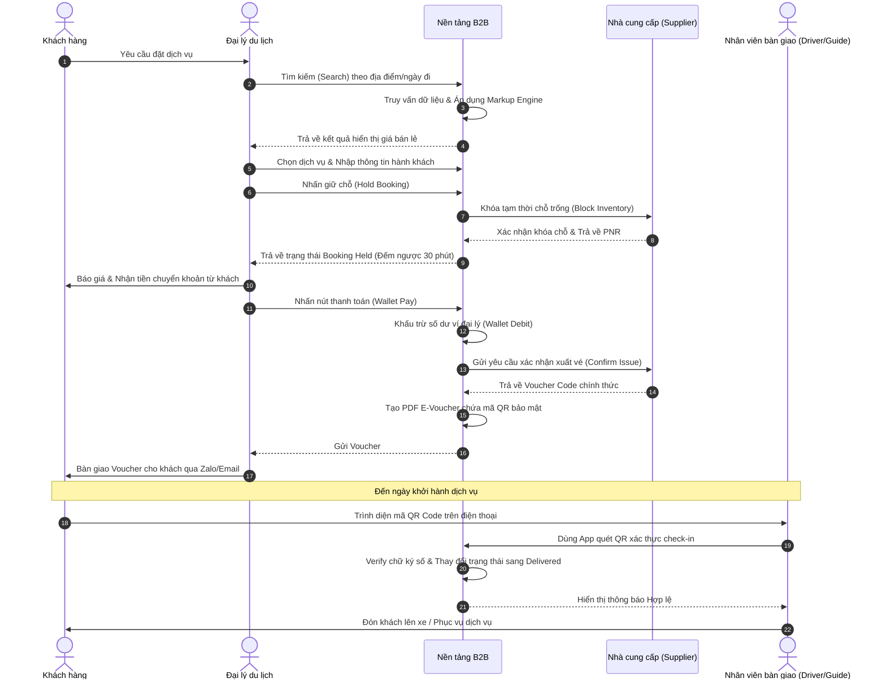
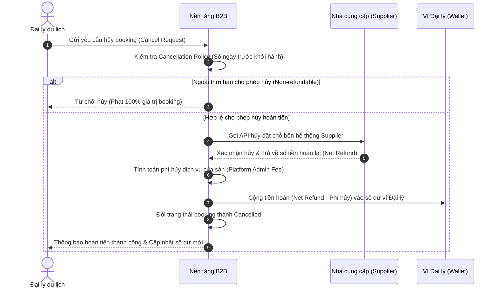
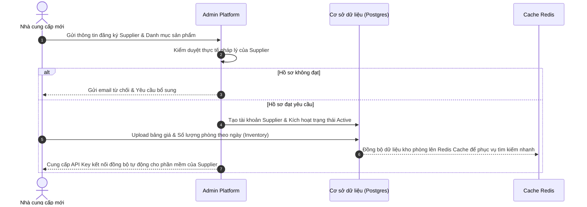
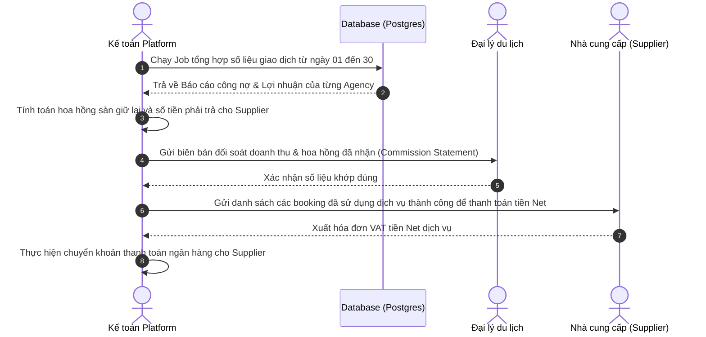

# B2B Travel Platform — End-to-End Booking & Delivery
## ĐẶC TẢ PHÂN TÍCH & THIẾT KẾ HỆ THỐNG ĐỒ ÁN TỐT NGHIỆP

---

## TÀI LIỆU 1: PROJECT OVERVIEW & BUSINESS CONTEXT

### 1.1 Tổng quan dự án (Executive Summary)
Dự án "B2B Travel Platform — End-to-End Booking & Delivery" là một giải pháp nền tảng công nghệ dạng B2B SaaS (Software-as-a-Service) chuyên biệt cho ngành du lịch (Travel Tech). Hệ thống được thiết kế để giải quyết toàn bộ chuỗi quy trình kinh doanh khép kín từ tìm kiếm dịch vụ trực tuyến (phòng khách sạn, vé máy bay, tour), tạo giữ chỗ (Hold Booking), thanh toán tự động, cho tới phân phối vé điện tử (E-Voucher) và bàn giao dịch vụ cuối cùng (Delivery) đến tay khách hàng.

Nền tảng hướng tới mục tiêu tối ưu hóa hiệu quả hoạt động cho các đại lý du lịch (Travel Agents), cung cấp kênh phân phối hiệu quả cho nhà cung cấp (Suppliers) và bảo đảm tính xác thực của dịch vụ dành cho khách hàng cuối (End Customers) thông qua ứng dụng di động quét mã QR bảo mật. Bằng cách áp dụng mô hình kiến trúc Modular Monolith hiện đại trên nền tảng .NET Core và Flutter, dự án mang lại khả năng xử lý giao dịch thời gian thực với độ trễ thấp, tính ổn định cao và sẵn sàng khả năng mở rộng.

---

### 1.2 Bối cảnh thị trường B2B Travel tại Việt Nam & Đông Nam Á
Thị trường du lịch trực tuyến tại Đông Nam Á đang chứng kiến sự bùng nổ mạnh mẽ sau đại dịch, dự kiến đạt quy mô hơn 30 tỷ USD theo báo cáo của Google, Temasek và Bain & Company. Tại Việt Nam, xu hướng chuyển đổi số trong ngành du lịch diễn ra vô cùng nhanh chóng. 

*   **Quy mô và Tăng trưởng**: Ngành du lịch Việt Nam đặt mục tiêu đón hàng chục triệu lượt khách quốc tế và nội địa mỗi năm. Tuy nhiên, hơn 70% thị phần phân phối dịch vụ vẫn đang nằm trong tay các đại lý truyền thống vừa và nhỏ (Sub-agents / Freelance agents).
*   **Xu hướng số hóa**: Các đại lý này không trực tiếp kết nối với các hệ thống phân phối lớn (GDS) hay chuỗi khách sạn quốc tế do chi phí duy trì công nghệ và tiền ký quỹ quá cao. Họ có nhu cầu lớn đối với các nền tảng trung gian B2B (B2B Travel Aggregators) cung cấp giao diện thân thiện, giá sỉ tốt (Net Rate) và cơ chế thanh toán linh hoạt.
*   **Xu hướng tích hợp đa dịch vụ (Multi-product bundling)**: Đại lý không muốn đặt vé máy bay ở một nơi, phòng khách sạn ở một nơi khác và tour du lịch ở một bên thứ ba. Họ cần một giải pháp "All-in-One" để tạo hành trình trọn gói (Customized Itinerary) cho khách hàng nhanh chóng.

---

### 1.3 Vấn đề hiện tại của đại lý du lịch truyền thống (Pain Points)
Các đại lý du lịch truyền thống đang gặp phải những hạn chế nghiêm trọng về mặt quy trình vận hành và công nghệ:

1.  **Quy trình báo giá thủ công (Manual & Slow Quoting)**: Nhân viên đại lý phải tìm kiếm giá trên nhiều trang web khác nhau, tự cộng thêm tiền lời (Markup), soạn file báo giá gửi qua Zalo/Email cho khách. Quy trình này mất từ 30 phút đến vài giờ, làm giảm tỷ lệ chốt deal.
2.  **Rủi ro giữ chỗ ảo (Hold Booking Expiration)**: Việc giữ chỗ vé máy bay hoặc phòng khách sạn trên hệ thống của nhà cung cấp thường có thời gian hết hạn (Time Limit) rất khắt khe. Nếu nhân viên quên thanh toán hoặc khách chuyển tiền chậm, booking sẽ tự động hủy, gây mất uy tín hoặc đền bù chênh lệch giá.
3.  **Quản lý dòng tiền và công nợ phức tạp**: Việc đối soát thủ công các giao dịch nạp tiền, hạn mức tín dụng và công nợ trả sau giữa chủ đại lý và nhân viên dễ gây thất thoát, nhầm lẫn tiền nong.
4.  **Mất dấu và giả mạo Voucher dịch vụ**: Khi bàn giao voucher cho khách hàng, tình trạng trùng lặp mã voucher, voucher giả, hoặc khách hàng đã sử dụng dịch vụ rồi nhưng vẫn cố check-in lại tại điểm đón xe/khách sạn gây thiệt hại lớn cho nhà xe hoặc đơn vị tổ chức tour.
5.  **Thiếu thông tin thời gian thực**: Kho phòng và vé máy bay biến động liên tục. Việc không đồng bộ được real-time dẫn đến lỗi "Overbooking" (Đại lý báo khách còn chỗ nhưng khi đặt thực tế thì nhà cung cấp đã hết phòng).

---

### 1.4 Giải pháp đề xuất và giá trị mang lại cho Stakeholders
Dự án đề xuất xây dựng hệ thống **B2B Travel Platform** tích hợp luồng xử lý từ đầu đến cuối (End-to-End):

*   **Đối với Travel Agency (Chủ & Nhân viên đại lý)**:
    *   *Giá trị*: Cung cấp cổng thông tin tìm kiếm thời gian thực, tích hợp bộ máy cộng giá linh hoạt (Markup Engine). Hỗ trợ giữ chỗ (Hold Booking) tự động đếm ngược. Hệ thống ví điện tử nội bộ giúp thanh toán tức thời không cần nhập thẻ ngân hàng nhiều lần.
*   **Đối với Supplier (Khách sạn, Hãng xe, Nhà tổ chức Tour)**:
    *   *Giá trị*: Tiếp cận trực tiếp mạng lưới hàng ngàn đại lý nhỏ lẻ mà không cần đội ngũ sales hùng hậu. Quản lý kho sản phẩm và giá cả trực quan thông qua Supplier Portal.
*   **Đối với End Customer (Khách hàng cuối)**:
    *   *Giá trị*: Nhận vé/voucher điện tử tức thì qua Email/SMS chứa mã QR an toàn. Trải nghiệm dịch vụ liền mạch, chính xác tại điểm bàn giao.
*   **Đối với Platform Admin & Finance Team**:
    *   *Giá trị*: Hệ thống tự động đối soát tài chính, chia sẻ hoa hồng (Commission Split) tự động. Báo cáo doanh thu, công nợ theo thời gian thực giúp giảm thiểu nhân sự đối soát thủ công.

---

### 1.5 So sánh với các hệ thống hiện có (Competitor Analysis & Market Gap)

| Tiêu chí so sánh | Global GDS (Amadeus, Sabre) | OTA truyền thống (Agoda, Booking.com) | Nền tảng B2B Travel Platform đề xuất |
| :--- | :--- | :--- | :--- |
| **Đối tượng mục tiêu** | Hãng hàng không, Đại lý vé máy bay cấp 1 lớn. | Khách du lịch lẻ tự túc (B2C). | Đại lý du lịch vừa, nhỏ và CTV (B2B). |
| **Chi phí tích hợp & Ký quỹ** | Cực kỳ cao, yêu cầu đặt cọc lớn. | Không có phí ký quỹ nhưng không có giá sỉ cho đại lý bán lại. | Thấp, nạp tiền vào ví dùng tới đâu trừ tới đó, hỗ trợ cấp hạn mức công nợ. |
| **Khả năng cộng giá (Markup)** | Phức tạp, giao diện dòng lệnh cũ (Command-line). | Không hỗ trợ (Chỉ có giá cố định cho khách lẻ). | Linh hoạt, tự động cộng Markup theo % hoặc số tiền cố định trên giao diện web. |
| **Độ phủ dịch vụ nội địa** | Chỉ mạnh về Vé máy bay và Khách sạn lớn. | Mạnh về Khách sạn, yếu về Tour lẻ nội địa và Vé xe khách. | Tích hợp sâu Khách sạn, Vé máy bay và Tour du lịch địa phương. |
| **Bàn giao dịch vụ (Delivery)** | Không hỗ trợ khâu bàn giao thực tế tại điểm đón. | Khách tự trình email đặt phòng cho lễ tân. | **Có ứng dụng di động quét mã QR xác thực check-in thời gian thực cho tài xế/HDV**. |

**Market Gap**: Khoảng trống thị trường nằm ở việc kết nối các dịch vụ du lịch địa phương (Tours, phương tiện vận chuyển nội địa) vào hệ thống đặt chỗ trực tuyến B2B và cơ chế **xác thực bàn giao tại điểm check-in (Delivery Verification)** mà các hệ thống lớn của nước ngoài chưa hỗ trợ sâu.

---

### 1.6 Revenue Model (Mô hình doanh thu) — 3 Kịch bản
Nền tảng tạo ra dòng tiền thông qua 3 nguồn chính: Commission, Subscription và Transaction Fee.

```
       [ Doanh thu Nền tảng ]
                 │
                 ├── Commission (Phí chênh lệch giá Net và giá Markup)
                 ├── Subscription (Thuê bao phần mềm Agent Portal)
                 └── Transaction Fee (Phí xử lý giao dịch thanh toán trực tuyến)
```

#### Kịch bản 1: Conservative (Thận trọng - Giai đoạn khởi đầu 1-2 năm)
*   **Commission**: Sàn lấy 2% trên tổng giá trị giao dịch (GMV).
*   **Subscription**: Miễn phí cho 100 đại lý đầu tiên để thu hút người dùng.
*   **Transaction Fee**: Thu 0.5% phí xử lý trên mỗi booking thanh toán thành công qua cổng thanh toán trực tuyến.
*   *Mục tiêu*: Đạt doanh số GMV 10 tỷ VND/năm. Doanh thu nền tảng đạt ~250 triệu VND/năm (hòa vốn vận hành máy chủ).

#### Kịch bản 2: Realistic (Khả thi - Giai đoạn tăng trưởng năm thứ 3-4)
*   **Commission**: Sàn lấy 3% - 5% trên GMV (thương lượng giá tốt hơn với Supplier khi sản lượng lớn).
*   **Subscription**: Thu phí phiên bản Premium (tính năng báo cáo nâng cao, phân quyền nhân viên) với mức giá 200.000 VND/tháng/đại lý.
*   **Transaction Fee**: Thu 1% trên các giao dịch rút tiền hoặc nạp tiền trực tiếp.
*   *Mục tiêu*: 500 đại lý hoạt động thường xuyên. GMV đạt 50 tỷ VND/năm. Doanh thu nền tảng đạt ~2.5 tỷ VND/năm.

#### Kịch bản 3: Optimistic (Lạc quan - Đạt quy mô lớn sau 5 năm)
*   **Commission**: Đạt mức chiết khấu trung bình 7% từ các nhà cung cấp do độc quyền phân phối.
*   **Subscription**: 100% đại lý trả phí thuê bao gói cơ bản (150.000 VND/tháng) và gói nâng cao (500.000 VND/tháng).
*   **White-label Solution**: Cung cấp dịch vụ tùy biến giao diện (White-label) cho các đại lý lớn với giá 10.000.000 VND/năm.
*   *Mục tiêu*: 2000 đại lý. GMV đạt 200 tỷ VND/năm. Doanh thu nền tảng đạt ~15 tỷ VND/năm.

---
--- KẾT THÚC TÀI LIỆU 1 ---

## TÀI LIỆU 2: STAKEHOLDER & USER ANALYSIS

### 2.1 Định danh Actor trong hệ thống
Hệ thống bao gồm 5 nhóm tác nhân chính tương tác trực tiếp hoặc gián tiếp:

1.  **Travel Agent (Nhân viên & Chủ đại lý)**: Đối tượng sử dụng chính của hệ thống. Họ thực hiện các thao tác tìm kiếm, giữ chỗ, thanh toán và gửi voucher cho khách hàng.
2.  **Supplier (Nhà cung cấp)**: Đơn vị sở hữu dịch vụ (Khách sạn, Hãng xe, Công ty lữ hành). Họ quản lý và cập nhật số lượng phòng/ghế có sẵn lên hệ thống.
3.  **End Customer (Khách hàng cuối)**: Người trực tiếp sử dụng dịch vụ. Họ nhận voucher chứa mã QR và trình diện khi check-in.
4.  **Delivery Agent (Nhân viên bàn giao)**: Tài xế xe du lịch, hướng dẫn viên, hoặc lễ tân khách sạn sử dụng Mobile App quét QR Code để ghi nhận việc bàn giao dịch vụ.
5.  **Platform Admin & Finance (Quản trị viên & Kế toán)**: Kiểm soát hệ thống, xét duyệt công nợ đại lý, thực hiện đối soát tiền thu chi với các cổng thanh toán và nhà cung cấp.

---

### 2.2 User Personas (Chân dung người dùng chi tiết)

#### Persona 1: Hoàng Thu Trang — Chủ đại lý du lịch (Agency Owner)
*   **Tuổi**: 34
*   **Vai trò**: Quản lý và điều hành đại lý du lịch "Trang Travel" tại Đà Nẵng (quy mô 5 nhân viên).
*   **Mục tiêu**: Tối ưu hóa lợi nhuận, kiểm soát chặt chẽ doanh thu của từng nhân viên, giảm thiểu sai sót đặt phòng của nhân viên, mở rộng tệp nhà cung cấp giá sỉ.
*   **Nỗi đau (Frustrations)**: Khó theo dõi dòng tiền nạp/rút của nhân viên; thường xuyên bị nhà cung cấp hủy booking do nhân viên quên thanh toán đúng hạn giữ chỗ; mất nhiều thời gian đối soát công nợ cuối tháng với kế toán.
*   **Day-in-the-life Scenario**: Bắt đầu ngày làm việc bằng việc kiểm tra số dư ví đại lý trên hệ thống. Xem danh sách các booking sắp hết hạn giữ chỗ (Hold Expiration) để nhắc nhở nhân viên chốt tiền với khách. Cuối ngày, xuất file Excel báo cáo doanh thu để kiểm tra lợi nhuận gộp trong ngày.

#### Persona 2: Nguyễn Minh Tuấn — Nhân viên kinh doanh đại lý (Agency Staff)
*   **Tuổi**: 24
*   **Vai trò**: Nhân viên tư vấn và đặt dịch vụ (Sales & Operations).
*   **Mục tiêu**: Tìm kiếm thông tin nhanh chóng để báo giá cho khách; thực hiện booking chính xác, giữ chỗ được phòng đẹp cho khách khi khách đang cân nhắc.
*   **Nỗi đau**: Giao diện đặt phòng của các đối tác cũ quá phức tạp; thời gian tìm kiếm chuyến bay kết hợp khách sạn mất quá nhiều công đoạn; sợ bị đền tiền do đặt sai thông tin khách trên vé máy bay.
*   **Day-in-the-life Scenario**: Tiếp nhận cuộc gọi của khách hỏi đặt Tour Bà Nà 1 ngày cho 4 người. Tuấn mở hệ thống, tìm kiếm Tour, nhập thông tin khách và nhấn "Hold Booking" trong vòng 1 phút. Hệ thống gửi mã PNR giữ chỗ tạm thời và xuất file PDF báo cáo giá đã tự động cộng 10% Markup. Tuấn gửi nhanh file báo cáo này cho khách qua Zalo và chốt thanh toán.

#### Persona 3: Lê Quốc Huy — Tài xế / Nhân viên bàn giao dịch vụ (Delivery Agent)
*   **Tuổi**: 42
*   **Vai trò**: Tài xế xe du lịch 16 chỗ chuyên đưa đón khách đi Tour.
*   **Mục tiêu**: Đón đúng khách, đúng giờ, không bị nhầm lẫn người; hoàn thành thủ tục check-in lên xe nhanh gọn để xuất phát đúng lịch trình.
*   **Nỗi đau**: Khách đưa mã đặt chỗ viết tay mờ nhòe; không biết thông tin liên hệ của khách khi không thấy khách tại điểm hẹn; mất thời gian đếm và kiểm tra tên khách trên danh sách giấy.
*   **Day-in-the-life Scenario**: Sáng sớm mở app Flutter của B2B Platform, xem danh sách đón khách (Checklist) của ngày hôm nay. Đến điểm hẹn thứ nhất, khách hàng xuất trình mã QR trên điện thoại. Huy mở tính năng camera quét mã QR trên app, hệ thống báo bíp "Hợp lệ - Ghế số 5,6". Huy mời khách lên xe và trạng thái của khách tự động cập nhật sang "Delivered" trên hệ thống của đại lý.

---

### 2.3 Stakeholder Map (Bản đồ các bên liên quan)
Mức độ ảnh hưởng và mức độ quan tâm của các nhóm stakeholder đối với dự án:

```
                  High Influence
                  ┌───────────────────────┬───────────────────────┐
                  │ Keep Satisfied        │ Key Players           │
                  │                       │                       │
                  │ - Suppliers           │ - Travel Agency Owner │
                  │ - Finance Teams       │ - Platform Admin      │
                  │                       │                       │
                  ├───────────────────────┼───────────────────────┤
                  │ Minimal Effort        │ Keep Informed         │
                  │                       │                       │
                  │ - Delivery Agents     │ - Agency Staff        │
                  │                       │ - End Customers       │
                  │                       │                       │
                  └───────────────────────┴───────────────────────┘
Low Influence                                                      High Interest
```

---

### 2.4 RACI Matrix cho các quy trình nghiệp vụ chính

| Quy trình nghiệp vụ | Platform Admin | Travel Agency | Supplier | Delivery Agent | Finance Team |
| :--- | :--- | :--- | :--- | :--- | :--- |
| **Đăng ký & Phê duyệt Đại lý** | **A** | **R** | **N/A** | **N/A** | **C** |
| **Cấu hình Markup / Commission** | **A** | **R** | **N/A** | **N/A** | **C** |
| **Giữ chỗ dịch vụ (Hold Booking)** | **I** | **R** | **A** | **N/A** | **N/A** |
| **Thanh toán & Xuất vé (Fulfillment)** | **I** | **R** | **A** | **N/A** | **R** |
| **Bàn giao & Quét QR check-in** | **I** | **I** | **I** | **R** | **N/A** |
| **Hủy & Hoàn tiền (Refund)** | **A** | **R** | **R** | **N/A** | **R** |
| **Đối soát tài chính cuối tháng** | **A** | **C** | **C** | **N/A** | **R** |

*Chú thích: **R** (Responsible - Người thực hiện), **A** (Accountable - Người chịu trách nhiệm chính/phê duyệt), **C** (Consulted - Người được tham vấn), **I** (Informed - Người nhận thông tin).*

---
--- KẾT THÚC TÀI LIỆU 2 ---

## TÀI LIỆU 3: FUNCTIONAL REQUIREMENTS (SRS)

### 3.1 Bảng tổng hợp Yêu cầu chức năng (System Requirements Catalog)

| ID | Module | Tên yêu cầu chức năng | Mô tả tóm tắt | Độ ưu tiên (MoSCoW) | Ghi chú |
| :--- | :--- | :--- | :--- | :--- | :--- |
| **FR-AUTH-01** | Auth | Đăng nhập & Đăng ký Multi-tenant | Đại lý đăng ký tài khoản doanh nghiệp. Cho phép phân tách dữ liệu tuyệt đối giữa các Agency. | **Must** | Dùng JWT + TenantId. |
| **FR-AUTH-02** | Auth | Phân quyền dựa trên vai trò (RBAC) | Định nghĩa các vai trò: Owner, Staff, Delivery, Admin. | **Must** | Quyền hạn được kiểm tra ở cấp API. |
| **FR-ONB-01** | Onboarding | Xét duyệt hồ sơ Agency | Quản trị viên kiểm duyệt giấy phép kinh doanh, mã số thuế trước khi kích hoạt tài khoản đại lý. | **Must** | Admin Panel xử lý. |
| **FR-INV-01** | Inventory | Đồng bộ kho sản phẩm tự động | Cho phép Supplier đẩy thông tin phòng, vé và đồng bộ thời gian thực qua Webhook/API. | **Must** | Ngăn chặn lỗi overbooking. |
| **FR-INV-02** | Inventory | Bộ máy tính phí Markup (Markup Engine) | Chủ đại lý thiết lập quy tắc cộng tiền lời tự động theo phần trăm hoặc số tiền cố định cho từng loại sản phẩm. | **Must** | Giá hiển thị cho nhân viên = Giá Net + Markup. |
| **FR-SRCH-01** | Search | Tìm kiếm đa sản phẩm đồng thời | Tìm kiếm chuyến bay, phòng khách sạn, tour du lịch trong một giao diện hợp nhất. | **Must** | Cần tích hợp Cache Redis. |
| **FR-SRCH-02** | Search | Gợi ý sản phẩm chéo | Gợi ý Vé máy bay khứ hồi và Xe đưa đón sân bay tương thích khi Đại lý tìm kiếm Tour. | **Should** | Phân tích điểm đi/đến và thời gian tour. |
| **FR-CART-01** | Cart | Giỏ hàng tạm thời (Shopping Cart) | Cho phép gom nhiều dịch vụ (Flight + Hotel + Tour) của một hành trình vào giỏ hàng trước khi đặt. | **Must** | Lưu thông tin giỏ hàng vào Redis/LocalStorage. |
| **FR-CART-02** | Cart | Đồng bộ khóa giữ chỗ | Khóa giữ chỗ và nhả giữ chỗ đồng bộ cho combo gồm Tour và Vé bay/Xe đưa đón đi kèm. | **Must** | Tránh tình trạng đại lý bị mồ côi vé máy bay/phòng. |
| **FR-BOOK-01** | Booking | Khóa giữ chỗ (Hold Booking) | Hệ thống tạm giữ chỗ trống từ nhà cung cấp và đếm ngược thời gian thanh toán. | **Must** | Sinh mã PNR tạm thời. |
| **FR-BOOK-02** | Booking | Hủy & Hoàn đặt chỗ | Cho phép đại lý gửi yêu cầu hủy dịch vụ và tự động tính phí phạt dựa trên chính sách hủy. | **Must** | Tự động cộng tiền hoàn vào ví. |
| **FR-BOOK-03** | Booking | Khung giờ yên lặng & nhắc nhở | Xếp đơn đặt tour đêm 21h-6h vào hàng đợi, nhắc nhở Supplier mỗi tiếng và gọi IVR/SMS sau 3 tiếng trễ. | **Must** | Quản lý bởi Hangfire background job. |
| **FR-BOOK-04** | Booking | Khóa sổ & Hủy tự động (Cut-off) | Tự động hủy đơn tour sáng sớm chưa duyệt vào lúc 21h tối hôm trước; hủy trước giờ đi 2 tiếng đối với tour khác. | **Must** | Hạn chế hủy tour sát giờ trước 2 tiếng gây khó chịu. |
| **FR-PAY-01** | Payment | Ví điện tử đại lý (Agency Wallet) | Cung cấp tài khoản số dư cho mỗi đại lý để thanh toán nhanh chóng. | **Must** | Ghi nhật ký Transaction. |
| **FR-PAY-02** | Payment | Hạn mức công nợ (Credit Limit) | Cấp hạn mức tín dụng âm cho các đại lý uy tín được phép đặt vé trước trả tiền sau. | **Must** | Quản lý bởi Platform Admin. |
| **FR-PAY-03** | Payment | Tích hợp cổng thanh toán | Tích hợp VNPay nạp tiền trực tiếp vào ví đại lý. | **Must** | Verify SHA256 checksum an toàn. |
| **FR-DELI-01** | Delivery | Phát hành E-Voucher bảo mật | Sinh file PDF voucher chứa mã QR được ký bằng thuật toán SHA256 chống giả mạo. | **Must** | Lưu trữ trên Cloud Storage. |
| **FR-DELI-02** | Delivery | Quét mã QR check-in trên Mobile | Ứng dụng di động của Delivery Agent quét mã QR để xác nhận bàn giao dịch vụ, ghi nhận tọa độ GPS. | **Must** | Hỗ trợ quét offline tạm thời. |
| **FR-NOTI-01** | Notification | Hệ thống thông báo tự động | Gửi Email xác nhận đặt vé cho khách hàng, gửi SMS cảnh báo hết hạn giữ chỗ cho đại lý. | **Should** | Dùng RabbitMQ xử lý background. |
| **FR-SUPP-01** | Supplier | Quản lý kho phòng trực quan | Giao diện dành cho nhà cung cấp tự cập nhật số lượng phòng và đóng/mở kho phòng theo ngày. | **Should** | Supplier Portal. |

---

### 3.2 Chi tiết User Story & Điều kiện nghiệm thu (Acceptance Criteria)

#### Module: Agent Onboarding & Profile Management
*   **Epic**: Quản lý vòng đời Đại lý (Agency Lifecycle)
*   **User Story**:
    *   *As a* Chủ doanh nghiệp lữ hành (Agency Owner),
    *   *I want to* đăng ký tài khoản đại lý trên nền tảng trực tuyến bằng cách nhập thông tin doanh nghiệp và tải lên giấy phép kinh doanh,
    *   *So that* tôi có thể được cấp quyền truy cập hệ thống giá sỉ của nền tảng sau khi được phê duyệt.
*   **Acceptance Criteria**:
    *   **Scenario 1: Đăng ký thành công thông tin hợp lệ**
        *   **Given** chủ đại lý đang ở trang đăng ký doanh nghiệp.
        *   **When** họ nhập đầy đủ Tên đại lý, Mã số thuế, Số điện thoại người đại diện, và tải lên 1 file PDF giấy phép kinh doanh hợp lệ, sau đó nhấn "Gửi yêu cầu".
        *   **Then** hệ thống ghi nhận hồ sơ ở trạng thái `Pending Approval`, gửi email thông báo xác nhận đã nhận hồ sơ cho đại lý, và tạo thông báo cho Platform Admin trên Admin Panel.
    *   **Scenario 2: Trùng lặp Mã số thuế**
        *   **Given** một đại lý khác đã đăng ký thành công với mã số thuế `0102030405`.
        *   **When** người dùng mới nhập mã số thuế trùng `0102030405` và nhấn "Gửi yêu cầu".
        *   **Then** hệ thống hiển thị cảnh báo lỗi màu đỏ: "Mã số thuế này đã được đăng ký trên hệ thống. Vui lòng liên hệ bộ phận hỗ trợ."
*   **Business Rules**:
  - Mã số thuế bắt buộc phải đúng định dạng 10 hoặc 13 chữ số.
  - File giấy phép kinh doanh tải lên định dạng PDF hoặc hình ảnh (PNG, JPG) dung lượng không quá 5MB.

#### Module: Shopping Cart & Checkout
*   **Epic**: Luồng giao dịch đặt dịch vụ (Transaction Flow)
*   **User Story**:
    *   *As an* Nhân viên đại lý (Agency Staff),
    *   *I want to* thêm nhiều dịch vụ (ví dụ: vé máy bay Vietjet và phòng khách sạn Mường Thanh) vào cùng một giỏ hàng và tiến hành checkout một lần,
    *   *So that* tôi có thể tạo một hành trình du lịch trọn gói cho nhóm khách hàng mà không cần phải thực hiện đặt chỗ riêng lẻ nhiều lần.
*   **Acceptance Criteria**:
    *   **Scenario 1: Checkout giỏ hàng còn đủ số lượng tồn kho**
        *   **Given** giỏ hàng đang có 1 vé máy bay khứ hồi Hà Nội - Đà Nẵng và 2 đêm phòng khách sạn.
        *   **When** nhân viên nhấn nút "Tiến hành giữ chỗ hành trình".
        *   **Then** hệ thống gọi API đồng thời đến hãng bay và khách sạn để khóa chỗ, tạo một mã booking tổng (Parent Booking) chứa các booking con (Child Bookings), trạng thái chuyển thành `Held` và bắt đầu đếm ngược thời gian giữ chỗ chung (lấy thời gian hết hạn ngắn nhất của các dịch vụ trong giỏ hàng).
    *   **Scenario 2: Một trong các dịch vụ bị hết chỗ lúc checkout**
        *   **Given** phòng khách sạn trong giỏ hàng vừa bị một bên khác đặt hết trước khi nhân viên nhấn checkout.
        *   **When** nhân viên nhấn nút "Tiến hành giữ chỗ hành trình".
        *   **Then** hệ thống dừng luồng xử lý, không trừ tiền, hiển thị thông báo lỗi chi tiết: "Phòng khách sạn Deluxe Double Room đã hết chỗ. Vui lòng chọn phòng khác hoặc xóa khỏi giỏ hàng."
*   **Business Rules**:
  - Giỏ hàng tự động bị xóa sau 24 giờ nếu không có hoạt động checkout.
  - Tối đa 10 mặt hàng dịch vụ trong một giỏ hàng.
  - **Đồng bộ khóa giữ chỗ Combo**: Khi đặt combo chứa cả vé máy bay (xác nhận ngay) và Tour (chờ xác nhận), hệ thống tự động khóa giữ chỗ vé máy bay (`Price Lock/Hold`) và tạm giữ số dư ví. Nếu Tour bị từ chối xác nhận, hệ thống tự động hủy giữ chỗ vé máy bay, mở khóa ví đại lý để hoàn tiền 100%.
  - **Dynamic Cut-off & Khung giờ yên lặng cho Tour**:
    - Không gửi thông báo đặt tour cho Supplier từ 21:00 đến 06:00 sáng hôm sau (đưa vào hàng đợi).
    - Tour khởi hành từ 06:00 - 12:00 trưa ngày hôm sau phải đặt trước 18:00 ngày hôm trước, và sẽ tự động hủy lúc 21:00 tối ngày hôm trước nếu chưa được duyệt.
    - Tour khởi hành chiều/tối tự động hủy trước giờ đi tối thiểu 2 tiếng.

---

#### Module: Payment & Invoicing
*   **Epic**: Đối soát tài chính (Financial Management)
*   **User Story**:
    *   *As a* Nhân viên đại lý (Agency Staff),
    *   *I want to* thanh toán hóa đơn đặt phòng bằng số dư ví điện tử của đại lý (Agency Wallet),
    *   *So that* giao dịch được hoàn tất tức thì và nhận được E-Voucher ngay lập tức cho khách hàng.
*   **Acceptance Criteria**:
    *   **Scenario 1: Số dư ví đủ thanh toán**
        *   **Given** booking có tổng tiền thanh toán là 5,000,000 VND và số dư ví đại lý hiện tại là 12,000,000 VND.
        *   **When** nhân viên nhập mã PIN bảo mật và xác nhận thanh toán bằng ví.
        *   **Then** hệ thống thực hiện trừ 5,000,000 VND trong tài khoản ví, cập nhật số dư mới thành 7,000,000 VND, ghi nhận 1 bản ghi Transaction loại `Debit`, chuyển trạng thái booking thành `Paid`, đồng thời kích hoạt lệnh sinh E-Voucher tự động.
    *   **Scenario 2: Số dư ví không đủ nhưng có hạn mức tín dụng**
        *   **Given** booking giá 5,000,000 VND, số dư ví hiện tại là 1,000,000 VND nhưng đại lý được cấp hạn mức công nợ tối đa (Credit Limit) là 10,000,000 VND.
        *   **When** nhân viên xác nhận thanh toán.
        *   **Then** hệ thống cho phép thanh toán thành công, trừ số dư ví xuống mức âm `-4,000,000 VND`, tạo bản ghi Transaction ghi nợ công nợ, chuyển trạng thái booking sang `Paid`.
*   **Business Rules**:
  - Mọi giao dịch trừ tiền ví bắt buộc phải có mã PIN xác thực giao dịch gồm 6 chữ số.
  - Hệ thống tự động khóa tài khoản ví nếu nhập sai mã PIN quá 5 lần liên tiếp.

#### Module: Fulfillment & Delivery
*   **Epic**: Bàn giao dịch vụ & Xác thực (Service Fulfillment)
*   **User Story**:
    *   *As a* Nhân viên bàn giao xe/hướng dẫn viên du lịch (Delivery Agent),
    *   *I want to* sử dụng điện thoại quét mã QR của hành khách tại điểm tập trung xe,
    *   *So that* tôi có thể kiểm tra vé thật giả và xác nhận khách đã lên xe mà không cần đối chiếu danh sách giấy.
*   **Acceptance Criteria**:
    *   **Scenario 1: Quét mã QR hợp lệ đúng hành trình**
        *   **Given** khách hàng xuất trình QR code chứa thông tin booking ID `BK-9992`.
        *   **When** tài xế mở camera trên app và quét mã QR này.
        *   **Then** hệ thống hiển thị dấu tích xanh và âm thanh báo thành công, ghi nhận trạng thái vé thành `CheckedIn`, lưu thời gian thực tế và tọa độ GPS của tài xế vào bảng lịch sử bàn giao (`DELIVERY_LOG`).
    *   **Scenario 2: Quét mã QR đã bị hủy (Cancelled)**
        *   **Given** khách hàng đã yêu cầu hủy tour trước đó và được hoàn tiền, nhưng vẫn giữ file voucher cũ đi check-in.
        *   **When** tài xế thực hiện quét mã QR của voucher này.
        *   **Then** hệ thống hiển thị màn hình cảnh báo màu đỏ chéo: "Voucher không hợp lệ - Trạng thái: ĐÃ HỦY. Từ chối phục vụ."
*   **Business Rules**:
  - Mã QR code tự động thay đổi hash bảo mật (Dynamic QR) sau mỗi 30 giây nếu mở trên ứng dụng của khách hàng để chống chụp ảnh màn hình gửi cho người khác.
  - Vị trí GPS lúc quét phải nằm trong bán kính tối đa 500m so với tọa độ điểm đón được thiết lập trong lộ trình tour.

---
--- KẾT THÚC TÀI LIỆU 3 ---

## TÀI LIỆU 4: NON-FUNCTIONAL REQUIREMENTS (NFR)

### 4.1 Performance (Chỉ tiêu Hiệu năng hệ thống)

```
[ API Request ] ───> [ API Gateway ] ───> [ Cache Hit (Redis) ] ───> Phản hồi < 150ms
                                     ───> [ Cache Miss ] ───────────> Phản hồi < 500ms
                                     ───> [ Supplier Sync (GDS) ] ──> Phản hồi < 1500ms
```

*   **Thời gian phản hồi API (Response Time)**:
    *   API Tìm kiếm tổng hợp (Search Engine): < 150ms đối với dữ liệu đã lưu cache Redis; < 1.5 giây đối với dữ liệu cần gọi đồng bộ thời gian thực từ API của hãng bay/GDS.
    *   API Tạo giữ chỗ (Hold Booking): < 800ms.
    *   API Thanh toán và Trừ ví (Wallet Transaction): < 300ms.
    *   API Xác thực QR Code (Delivery Scan): < 200ms để đảm bảo luồng khách lên xe di chuyển nhanh chóng.
*   **Tải trang (Page Load Time)**: Thời gian tải trang giao diện Web Portal dành cho đại lý (FCP - First Contentful Paint) phải dưới 2.0 giây trong điều kiện mạng 4G tiêu chuẩn.
*   **Độ trễ xử lý nền (Background Job Latency)**: Tác vụ sinh file PDF E-Voucher và gửi email tự động phải được xử lý trong hàng đợi hàng đợi tin nhắn (Message Queue) với thời gian hoàn thành dưới 5 giây sau khi thanh toán thành công.

---

### 4.2 Scalability (Khả năng mở rộng quy mô)
*   **Số lượng người dùng đồng thời (Concurrent Users - CCU)**: Hệ thống đáp ứng tối thiểu 1.000 người dùng hoạt động đồng thời (Active Sessions) trên cổng Portal Web và 500 nhân viên quét mã đồng thời trên Mobile App mà không có dấu hiệu suy giảm hiệu năng.
*   **Thông lượng hệ thống (Throughput)**: Xử lý tối thiểu 200 yêu cầu giao dịch đặt chỗ trên một giây (TPS - Transactions Per Second) ở tầng API.
*   **Chiến lược Tự động co giãn (Auto-scaling Strategy)**:
    *   Sử dụng cơ chế tự động mở rộng theo chiều ngang (Horizontal Pod Autoscaling - HPA) dựa trên chỉ số CPU (> 70%) và Memory (> 80%) tiêu thụ của các container.
    *   Phần tầng cơ sở dữ liệu: Thiết lập kiến trúc cơ sở dữ liệu Read/Write Splitting với 1 Database Master xử lý ghi giao dịch và 2 Database Replicas chuyên phục vụ các truy vấn đọc dữ liệu tìm kiếm (Search/Filter).

---

### 4.3 Security (An toàn thông tin & Bảo mật)
*   **OWASP Top 10 Coverage**:
    *   *Injection (SQLi, XSS)*: Sử dụng ORM (Entity Framework Core) với cơ chế parameterized query tự động để ngăn chặn SQL Injection. Áp dụng thư viện lọc mã độc đầu vào (Input Sanitization) cho các trường văn bản.
    *   *Broken Authentication*: Triển khai giao thức **OAuth 2.0 / OpenID Connect** thông qua Keycloak hoặc IdentityServer4. Token JWT phải có chữ ký số bảo mật thuật toán RS256, hết hạn sau 15 phút.
    *   *Sensitive Data Exposure*: Toàn bộ dữ liệu truyền đi giữa Client và Server bắt buộc mã hóa qua HTTPS/TLS 1.3. Mã hóa một chiều mật khẩu bằng thuật toán PBKDF2 hoặc BCrypt.
*   **Mã hóa dữ liệu lưu trữ (Encryption at Rest)**: Cơ sở dữ liệu PostgreSQL chạy trên ổ cứng được cấu hình mã hóa toàn bộ dữ liệu vật lý (Transparent Data Encryption). Các trường thông tin cá nhân đặc biệt như số hộ chiếu, số điện thoại khách hàng được mã hóa đối xứng AES-256 ở tầng ứng dụng trước khi lưu vào DB.

---

### 4.4 Availability (Tính sẵn sàng & Khôi phục thảm họa)
*   **Chỉ số SLA (Service Level Agreement)**: Cam kết thời gian hoạt động liên tục đạt **99.9%** (tối đa không quá 43.8 phút ngừng hoạt động trong một tháng).
*   **Khôi phục thảm họa (Disaster Recovery)**:
    *   **RPO (Recovery Point Objective)**: Tối đa 1 giờ. Trong trường hợp xảy ra thảm họa phá hủy máy chủ chính, lượng dữ liệu giao dịch bị mất mát không được vượt quá 1 giờ gần nhất.
    *   **RTO (Recovery Time Objective)**: Tối đa 2 giờ. Hệ thống phải phục hồi hoạt động bình thường trên hạ tầng dự phòng (DR Site) trong vòng 2 giờ kể từ khi sự cố được xác nhận.
*   **Cơ chế sao lưu (Backup Policy)**:
    *   Auto-backup toàn bộ cơ sở dữ liệu hàng ngày (Daily Full Backup) vào lúc 02:00 AM.
    *   Sao lưu nhật ký giao dịch tài chính liên tục mỗi 15 phút (Transaction Log Shipping) sang Cloud Object Storage ở một Region độc lập vật lý.

---

### 4.5 Maintainability, Testability & Code Quality Standards
*   **Chất lượng mã nguồn (Code Quality)**:
    *   Mã nguồn phải tuân thủ nghiêm ngặt nguyên lý thiết kế **SOLID** và quy chuẩn Clean Code.
    *   Tỷ lệ trùng lặp code (Duplicate Code) dưới 5% kiểm tra tự động qua công cụ SonarQube.
*   **Khả năng kiểm thử (Testability)**:
    *   Toàn bộ mã nguồn cốt lõi trong thư mục Domain và Application (Core Layer) phải đạt độ bao phủ kiểm thử đơn vị (**Unit Test Coverage**) tối thiểu **80%**.
    *   Thiết kế mã nguồn theo cơ chế Dependency Injection giúp dễ dàng thay thế (mock) các dịch vụ bên ngoài (cổng thanh toán, Supplier API) khi chạy kiểm thử tự động.
*   **Nhật ký hệ thống (Logging & Observability)**: Triển khai giải pháp ghi log tập trung ELK Stack (Elasticsearch, Logstash, Kibana) hoặc Grafana Loki. Mọi lỗi phát sinh phải ghi lại đầy đủ thông tin: TraceId, Exception Message, StackTrace, và Request Payload định danh.

---
--- KẾT THÚC TÀI LIỆU 4 ---

## TÀI LIỆU 5: SYSTEM ARCHITECTURE

### 5.1 So sánh và Lựa chọn Kiến trúc phần mềm

| Tiêu chí | Traditional Monolith | Microservices | Modular Monolith (Đề xuất) |
| :--- | :--- | :--- | :--- |
| **Tính cô lập nghiệp vụ** | Kém (Mọi thứ chung một cụm dự án, dễ phá vỡ kiến trúc) | Rất cao (Mỗi dịch vụ là một tiến trình độc lập hoàn toàn) | **Cao (Tách biệt thư viện Class Library theo từng Module Domain)** |
| **Độ trễ mạng (Latency)** | Cực thấp (Gọi hàm trực tiếp trong bộ nhớ) | Cao (Giao tiếp giữa các service qua REST/gRPC trên mạng) | **Cực thấp (Gọi hàm trực tiếp hoặc truyền tin qua Event Bus trong bộ nhớ)** |
| **Tính phức tạp triển khai** | Rất thấp (Deploy 1 file build duy nhất) | Cực cao (Yêu cầu CI/CD phức tạp, Kubernetes, Service Mesh) | **Thấp (Deploy 1 khối chạy chung nhưng có cấu trúc rõ ràng)** |
| **Tính nhất quán dữ liệu** | Rất dễ (Database Transaction thông thường) | Rất khó (Cần Saga Pattern, Eventual Consistency, Outbox) | **Dễ (Database Transaction liên schema trong cùng 1 DB)** |

**Khuyến nghị kỹ thuật**: Lựa chọn kiến trúc **Modular Monolith**. 
*Kiến giải*: Phù hợp hoàn hảo cho quy mô đồ án tốt nghiệp và các dự án khởi nghiệp du lịch. Kiến trúc này mang lại cấu trúc mã nguồn sạch sẽ, tách biệt rõ ràng trách nhiệm giữa các module (Identity, Catalog, Booking, Payment, Notification) giúp đội ngũ sinh viên chia việc phát triển dễ dàng mà không phải gánh chịu chi phí vận hành hạ tầng vô cùng đắt đỏ và phức tạp của Microservices.

---

### 5.2 High-Level Architecture Diagram
Mô hình tổ chức các lớp kiến trúc của hệ thống:

```
+-------------------------------------------------------------------------------+
|                       Presentation Layer (Flutter App & React Web)            |
+-------------------------------------------------------------------------------+
                                        │ (HTTPS / WebSockets)
                                        ▼
+-------------------------------------------------------------------------------+
|                         API Gateway & Reverse Proxy                           |
|                       (YARP - Yet Another Reverse Proxy)                      |
+-------------------------------------------------------------------------------+
                                        │ (Routing)
                                        ▼
+-------------------------------------------------------------------------------+
|                       Modular Monolith Host (.NET 8 Web API)                  |
|                                                                               |
|   +-----------------------+ +-----------------------+ +-------------------+   |
|   |    Identity Module    | |    Catalog Module     | |  Booking Module   |   |
|   | (Auth & Multi-tenant) | |  (Hotel/Flight/Tour)  | |  (Hold & Cancel)  |   |
|   +-----------------------+ +-----------------------+ +-------------------+   |
|               │                         │                       │             |
|               └─────────────────────────┼───────────────────────┘             |
|                                         ▼ (MediatR In-Process Event Bus)      |
|   +-----------------------------------------------------------------------+   |
|   |         Notification Module        │         Payment Module           |   |
|   +------------------------------------+----------------------------------+   |
+-------------------------------------------------------------------------------+
                                        │ (Entity Framework Core)
                                        ▼
+-------------------------------------------------------------------------------+
|                      Shared Database Layer (PostgreSQL)                       |
|   - Schema: identity.*    - Schema: catalog.*     - Schema: booking.*         |
+-------------------------------------------------------------------------------+
```

---

### 5.3 Component Diagram (Giao tiếp giữa các Module chính)
Cách thức các Module giao tiếp phi đồng bộ thông qua Event Handler để giữ tính độc lập:

```
+────────────────────────+                 +─────────────────────────+
|     Booking Module     |                 |     Payment Module      |
|                        |                 |                         |
|  [CreateBookingCmd]    |                 |  [ProcessPaymentCmd]    |
|         │              |                 |           │             |
|         ▼              |                 |           ▼             |
|  Publish Event: ───────┼──(MediatR)─────>│  OnBookingPaidEvent:    |
|  "BookingCreated"      |                 |  Subract Balance        |
+────────────────────────+                 +───────────┬─────────────+
                                                       │
                                                       ▼ Publish Event:
                                                       "PaymentCompleted"
                                                       │
                                           +───────────▼─────────────+
                                           |   Notification Module   |
                                           |                         |
                                           |  OnPaymentCompleted:    |
                                           |  Send Email & SMS       |
                                           +─────────────────────────+
```

---

### 5.4 Database Design (Thiết kế cơ sở dữ liệu chi tiết)

#### Danh sách các bảng dữ liệu cốt lõi
1.  `auth.agencies`: Lưu trữ thông tin định danh và pháp lý của đại lý.
2.  `auth.users`: Tài khoản người dùng phân quyền (Owner, Staff, Admin, Delivery).
3.  `catalog.products`: Danh mục sản phẩm (loại: Khách sạn, Chuyến bay, Tour).
4.  `catalog.inventories`: Kho số lượng phòng/ghế trống theo ngày.
5.  `booking.bookings`: Thông tin đặt chỗ tổng (PNR, trạng thái, tổng tiền).
6.  `booking.vouchers`: Mã voucher điện tử và hash chữ ký số QR Code.
7.  `booking.incidents`: Báo cáo sự cố khẩn cấp từ nhà cung cấp (hủy tour).
8.  `payment.wallets`: Số dư tài khoản ví của từng đại lý.
9.  `payment.transactions`: Lịch sử biến động số dư và giao dịch qua cổng thanh toán.

#### Lược đồ quan hệ và kiểu dữ liệu (Schema Definition DDL)
```sql
-- Schema Identity
CREATE SCHEMA auth;

CREATE TABLE auth.agencies (
    id UUID PRIMARY KEY DEFAULT gen_random_uuid(),
    name VARCHAR(255) NOT NULL,
    tax_code VARCHAR(20) UNIQUE NOT NULL,
    credit_limit DECIMAL(18,2) DEFAULT 0.00,
    status VARCHAR(50) DEFAULT 'PENDING',
    created_at TIMESTAMP WITH TIME ZONE DEFAULT CURRENT_TIMESTAMP
);

CREATE TABLE auth.users (
    id UUID PRIMARY KEY DEFAULT gen_random_uuid(),
    agency_id UUID REFERENCES auth.agencies(id),
    username VARCHAR(100) UNIQUE NOT NULL,
    email VARCHAR(255) UNIQUE NOT NULL,
    password_hash VARCHAR(255) NOT NULL,
    role VARCHAR(50) NOT NULL,
    is_active BOOLEAN DEFAULT TRUE
);

-- Schema Catalog
CREATE SCHEMA catalog;

CREATE TABLE catalog.products (
    id UUID PRIMARY KEY DEFAULT gen_random_uuid(),
    name VARCHAR(255) NOT NULL,
    type VARCHAR(50) NOT NULL, -- HOTEL, FLIGHT, TOUR
    base_price DECIMAL(18,2) NOT NULL,
    created_at TIMESTAMP WITH TIME ZONE DEFAULT CURRENT_TIMESTAMP
);

CREATE TABLE catalog.inventories (
    id UUID PRIMARY KEY DEFAULT gen_random_uuid(),
    product_id UUID REFERENCES catalog.products(id),
    date DATE NOT NULL,
    available_qty INT NOT NULL,
    version INT DEFAULT 0 -- Dùng cho Optimistic Locking
);

-- Schema Booking
CREATE SCHEMA booking;

CREATE TABLE booking.bookings (
    id UUID PRIMARY KEY DEFAULT gen_random_uuid(),
    agency_id UUID REFERENCES auth.agencies(id),
    user_id UUID REFERENCES auth.users(id),
    pnr_code VARCHAR(10) UNIQUE NOT NULL,
    status VARCHAR(50) DEFAULT 'HELD', -- HELD, PENDING_CONFIRMATION, PAID, CANCELLED, EXPIRED, COMPLETED
    hold_type VARCHAR(20) DEFAULT 'INSTANT', -- INSTANT, ON_REQUEST
    retry_count INT DEFAULT 0,
    next_retry_at TIMESTAMP WITH TIME ZONE,
    cut_off_at TIMESTAMP WITH TIME ZONE,
    parent_booking_id UUID REFERENCES booking.bookings(id) NULL, -- Nhóm combo Tour + Bay + Xe
    total_net_amount DECIMAL(18,2) NOT NULL,
    total_markup_amount DECIMAL(18,2) NOT NULL,
    hold_expiration TIMESTAMP WITH TIME ZONE NOT NULL,
    created_at TIMESTAMP WITH TIME ZONE DEFAULT CURRENT_TIMESTAMP
);

CREATE TABLE booking.vouchers (
    id UUID PRIMARY KEY DEFAULT gen_random_uuid(),
    booking_id UUID REFERENCES booking.bookings(id),
    voucher_code VARCHAR(50) UNIQUE NOT NULL,
    qr_code_hash VARCHAR(255) NOT NULL,
    status VARCHAR(50) DEFAULT 'CONFIRMED', -- CONFIRMED, DELIVERED, CANCELLED
    created_at TIMESTAMP WITH TIME ZONE DEFAULT CURRENT_TIMESTAMP
);

CREATE TABLE booking.incidents (
    id UUID PRIMARY KEY DEFAULT gen_random_uuid(),
    booking_id UUID REFERENCES booking.bookings(id) NULL,
    product_id UUID REFERENCES catalog.products(id),
    incident_date DATE NOT NULL,
    type VARCHAR(50) NOT NULL, -- FORCE_MAJEURE, OPERATIONAL_FAILURE
    description TEXT NOT NULL,
    evidence_url VARCHAR(500) NULL,
    status VARCHAR(50) DEFAULT 'PENDING', -- PENDING, PROCESSED, REJECTED
    created_at TIMESTAMP WITH TIME ZONE DEFAULT CURRENT_TIMESTAMP
);

-- Schema Payment
CREATE SCHEMA payment;

CREATE TABLE payment.wallets (
    id UUID PRIMARY KEY DEFAULT gen_random_uuid(),
    agency_id UUID REFERENCES auth.agencies(id) UNIQUE,
    balance DECIMAL(18,2) DEFAULT 0.00,
    blocked_balance DECIMAL(18,2) DEFAULT 0.00,
    updated_at TIMESTAMP WITH TIME ZONE DEFAULT CURRENT_TIMESTAMP
);

CREATE TABLE payment.transactions (
    id UUID PRIMARY KEY DEFAULT gen_random_uuid(),
    wallet_id UUID REFERENCES payment.wallets(id),
    booking_id UUID REFERENCES booking.bookings(id) NULL,
    amount DECIMAL(18,2) NOT NULL,
    transaction_type VARCHAR(30) NOT NULL, -- DEBIT, CREDIT, HOLD_PENDING, RELEASE_HOLD
    status VARCHAR(50) DEFAULT 'SUCCESS', -- SUCCESS, FAILED, PENDING
    created_at TIMESTAMP WITH TIME ZONE DEFAULT CURRENT_TIMESTAMP
);
```

#### Indexing Strategy (Chiến lược đánh chỉ mục tối ưu hiệu năng)
Để đảm bảo tốc độ truy vấn khi dữ liệu lớn, cần cấu hình các chỉ mục sau:
*   `CREATE INDEX idx_inventories_product_date ON catalog.inventories(product_id, date);`
    *   *Lý do*: Tối ưu hóa truy vấn kiểm tra kho phòng trống khi tìm kiếm theo khoảng ngày.
*   `CREATE INDEX idx_bookings_agency_status ON booking.bookings(agency_id, status);`
    *   *Lý do*: Tối ưu hiển thị danh sách hóa đơn cho màn hình Dashboard quản lý của từng đại lý.
*   `CREATE UNIQUE INDEX idx_vouchers_code_hash ON booking.vouchers(voucher_code);`
    *   *Lý do*: Tăng tốc độ xác thực mã QR khi nhân viên quét check-in.
*   `CREATE INDEX idx_incidents_product_date ON booking.incidents(product_id, incident_date);`
    *   *Lý do*: Tối ưu hóa kiểm tra các sự cố ảnh hưởng đến sản phẩm trong ngày cụ thể.
*   `CREATE INDEX idx_transactions_wallet_created ON payment.transactions(wallet_id, created_at);`
    *   *Lý do*: Tối ưu hiển thị lịch sử giao dịch và đối soát ví của đại lý.

---

### 5.5 API Design (Tài liệu đặc tả các Endpoint chính)

#### 1. Đăng ký Đại lý (Agent Onboarding)
*   **Method & Path**: `POST /api/v1/auth/register-agency`
*   **Request Schema**:
```json
{
  "agencyName": "Trang Travel Company",
  "taxCode": "0102030405",
  "ownerEmail": "trang.hoang@trangtravel.com",
  "ownerUsername": "trangowner",
  "password": "SecurePassword123!"
}
```
*   **Response Schema (201 Created)**:
```json
{
  "agencyId": "7e382bca-df42-4b21-9988-5da12ebbc088",
  "status": "PENDING_APPROVAL",
  "message": "Agency registered successfully. Please wait for Admin approval."
}
```

#### 2. Khóa giữ chỗ (Hold Booking)
*   **Method & Path**: `POST /api/v1/bookings/hold`
*   **Request Schema**:
```json
{
  "productId": "3fa85f64-5717-4562-b3fc-2c963f66afa6",
  "date": "2026-07-15",
  "quantity": 2,
  "passengerDetails": [
    {
      "firstName": "Van A",
      "lastName": "Nguyen",
      "passportNumber": "C8927182"
    }
  ]
}
```
*   **Response Schema (200 OK)**:
```json
{
  "bookingId": "cba90df2-f81e-45da-9c88-12efbc89fa01",
  "pnrCode": "B2B89X",
  "totalAmount": 3800000.00,
  "holdExpiration": "2026-06-05T11:06:08Z",
  "status": "HELD"
}
```

#### 3. Thanh toán bằng ví (Wallet Pay)
*   **Method & Path**: `POST /api/v1/payments/wallet-pay`
*   **Request Schema**:
```json
{
  "bookingId": "cba90df2-f81e-45da-9c88-12efbc89fa01",
  "securePin": "123456"
}
```
*   **Response Schema (200 OK)**:
```json
{
  "transactionId": "tx-890123-ab",
  "bookingId": "cba90df2-f81e-45da-9c88-12efbc89fa01",
  "status": "SUCCESS",
  "newWalletBalance": 8200000.00
}
```

#### 4. Quét xác thực Voucher (Delivery Scan)
*   **Method & Path**: `POST /api/v1/delivery/checkin`
*   **Request Schema**:
```json
{
  "voucherCode": "VCH-2026-X892",
  "gpsLatitude": 16.0544,
  "gpsLongitude": 108.2022
}
```
*   **Response Schema (200 OK)**:
```json
{
  "success": true,
  "passengerName": "Nguyen Van A",
  "serviceName": "Bana Hills Tour 1-Day",
  "seatNumber": "12A",
  "checkedInAt": "2026-06-05T10:36:08Z"
}
```

---

### 5.6 Tech Stack Recommendation & Technical Rationale

#### Backend Stack: .NET 8 Web API / C#
*   *Lý do chọn*: .NET 8 cung cấp hiệu năng thực thi hàng đầu thế giới (vượt trội hơn Node.js và Python trong các bài test benchmark). Cơ chế xử lý luồng bất đồng bộ (async/await) và quản lý bộ nhớ cực tốt giúp tối ưu hóa tài nguyên phần cứng. Tương thích hoàn hảo với kiến trúc Clean Architecture giúp tổ chức dự án gọn gàng.

#### Frontend Stack: React.js (cho Web Portal) & Flutter (cho Mobile App)
*   *React.js*: Khả năng tái sử dụng component cao, cộng đồng thư viện UI lớn (Ant Design, TailwindCSS). Phù hợp xây dựng các trang Dashboard báo cáo phức tạp cho Admin và Agent.
*   *Flutter*: Cho phép dựng ứng dụng di động cho cả iOS và Android chỉ với 1 mã nguồn duy nhất. Thao tác mượt mà nhờ engine đồ họa tự vẽ, tích hợp camera quét mã QR cực nhạy với thư viện `mobile_scanner`.

#### Database & Caching: PostgreSQL & Redis
*   *PostgreSQL*: Hệ quản trị cơ sở dữ liệu quan hệ mã nguồn mở mạnh mẽ nhất hiện nay. Hỗ trợ đầy đủ các tính năng ACID cho bài toán giao dịch tài chính, đồng thời hỗ trợ kiểu dữ liệu JSONB linh hoạt.
*   *Redis*: Đóng vai trò bộ đệm (Caching) cho các dữ liệu ít thay đổi nhưng tần suất truy vấn cực cao như bảng giá vé, thông tin khách sạn. Đồng thời sử dụng làm Distributed Lock để xử lý concurrency.

#### Message Queue: RabbitMQ
*   *Lý do*: Đảm bảo tính phi đồng bộ giữa các module. Ví dụ, khi nhận webhook thanh toán, backend đẩy message vào RabbitMQ và phản hồi ngay lập tức cho cổng thanh toán. Sau đó, Worker sẽ tiêu thụ tin nhắn để sinh PDF Voucher và gửi Email trong background, đảm bảo API không bị timeout.

---

### 5.7 Third-Party Integrations
Hệ thống cần tích hợp các API dịch vụ bên thứ ba sau để hoàn thành luồng nghiệp vụ:
1.  **Cổng thanh toán VNPay**: Tích hợp luồng nạp tiền tự động qua VNPay SDK bằng cách tạo và đối soát chữ ký số bảo mật SHA256.
2.  **Mock GDS/Supplier API**: Kết nối lấy dữ liệu chuyến bay trực tiếp từ một Mock API giả lập Sabre/Amadeus nhằm phục vụ việc demo tìm kiếm thời gian thực.
3.  **Firebase Cloud Messaging (FCM)**: Gửi thông báo đẩy (Push Notification) thời gian thực tới ứng dụng Flutter của tài xế xe khi có lịch trình đón khách mới.
4.  **MinIO (Local) / AWS S3 (Cloud)**: Nơi lưu trữ vật lý các tệp PDF E-Voucher và ảnh chụp hóa đơn giao dịch đại lý.
5.  **Goong Maps API**: Bản đồ hiển thị lộ trình đón trả và tọa độ điểm check-in của khách du lịch tại Việt Nam.

---
--- KẾT THÚC TÀI LIỆU 5 ---

## TÀI LIỆU 6: BUSINESS FLOW & USE CASE

### 6.1 End-to-End Booking Flow
Mô hình hóa toàn bộ quá trình từ lúc tìm kiếm đến khi hoàn thành bàn giao voucher.



---

### 6.2 Cancellation & Refund Flow (Quy trình Hủy & Hoàn tiền)
Xử lý nghiệp vụ hủy booking khi đại lý yêu cầu.



---

### 6.3 Supplier Onboarding & Inventory Sync Flow
Quy trình thêm nhà cung cấp mới và đồng bộ kho phòng tự động.



---

### 6.4 Finance & Commission Reconciliation Flow (Quy trình đối soát cuối kỳ)
Thực hiện thanh toán tiền thu hộ và chia sẻ hoa hồng cuối tháng.



---

### 6.5 Use Case Diagram (Đặc tả 5 Use Case cốt lõi)

```
================================================================================
                                USE CASE MAP
                                
   [ Travel Agent ]  ───────> ( UC-01: Tìm kiếm & Giữ chỗ dịch vụ )
                     ───────> ( UC-02: Thanh toán bằng Ví điện tử )
                     
   [ Delivery Agent] ───────> ( UC-03: Quét QR xác thực bàn giao vé )
   
   [ Supplier ]      ───────> ( UC-04: Cập nhật Kho phòng & Bảng giá )
   
   [ Platform Admin] ───────> ( UC-05: Cấu hình tỷ lệ hoa hồng Markup )
================================================================================
```

#### 1. UC-01: Tìm kiếm & Giữ chỗ dịch vụ (Search & Hold Booking)
*   **Actor chính**: Travel Agent.
*   **Mô tả**: Cho phép đại lý tìm kiểm phòng trống/vé trống và thực hiện khóa giữ chỗ tạm thời trong vòng 30 phút để chốt tiền với khách.
*   **Luồng cơ bản**:
    1.  Đại lý nhập thông tin điểm đến, ngày đi, số khách.
    2.  Hệ thống hiển thị danh sách sản phẩm kèm giá đã Markup.
    3.  Đại lý chọn dịch vụ, nhập thông tin hành khách.
    4.  Đại lý nhấn "Hold Booking". Hệ thống ghi nhận trạng thái và đếm ngược thời gian giữ chỗ.

#### 2. UC-02: Thanh toán bằng Ví đại lý (Wallet Payment)
*   **Actor chính**: Travel Agent.
*   **Mô tả**: Thanh toán booking đang giữ chỗ bằng tài khoản số dư ví điện tử của đại lý để đổi trạng thái booking thành công ngay lập tức.
*   **Luồng cơ bản**:
    1.  Đại lý mở booking đang giữ chỗ (Held).
    2.  Chọn phương thức thanh toán "Ví đại lý".
    3.  Nhập mã PIN bảo mật giao dịch.
    4.  Hệ thống kiểm tra số dư ví, trừ tiền, cập nhật trạng thái booking thành `Paid` và gửi lệnh sinh E-Voucher.

#### 3. UC-03: Quét QR xác thực bàn giao vé (Delivery QR Scan)
*   **Actor chính**: Delivery Agent (Tài xế/Hướng dẫn viên).
*   **Mô tả**: Quét và xác thực mã QR trên voucher của hành khách trực tiếp tại điểm khởi hành để cho khách lên xe.
*   **Luồng cơ bản**:
    1.  Nhân viên mở app Flutter, chọn tính năng quét QR.
    2.  Quét camera vào hình ảnh QR trên voucher của khách.
    3.  Hệ thống giải mã, verify chữ ký số, kiểm tra trạng thái vé trên server.
    4.  Hiển thị thông tin khách hàng hợp lệ và lưu log tọa độ GPS.

#### 4. UC-04: Cập nhật Kho phòng & Bảng giá (Inventory Update)
*   **Actor chính**: Supplier.
*   **Mô tả**: Nhà cung cấp chủ động đóng/mở kho phòng hoặc điều chỉnh giá bán theo ngày cao điểm/thấp điểm.
*   **Luồng cơ bản**:
    1.  Supplier đăng nhập hệ thống Supplier Portal.
    2.  Chọn lịch quản lý kho phòng (Calendar View).
    3.  Chọn ngày cụ thể, nhập số lượng phòng trống mới hoặc điều chỉnh giá sỉ (Net Rate).
    4.  Nhấn lưu hệ thống cập nhật Database và đẩy dữ liệu mới lên Redis Cache.

#### 5. UC-05: Cấu hình tỷ lệ hoa hồng Markup (Markup Configuration)
*   **Actor chính**: Platform Admin / Agency Owner.
*   **Mô tả**: Cài đặt tỷ lệ phần trăm cộng thêm vào giá gốc để tạo ra giá bán lẻ tự động hiển thị cho khách hàng.
*   **Luồng cơ bản**:
    1.  Người dùng truy cập trang thiết lập cấu hình Markup Engine.
    2.  Chọn nhóm đại lý hoặc loại sản phẩm áp dụng (Ví dụ: Khách sạn Đà Nẵng).
    3.  Thiết lập quy tắc: Cộng thêm 8% trên giá Net của Supplier.
    4.  Hệ thống áp dụng quy tắc này vào tất cả các lượt tìm kiếm tiếp theo của đại lý thuộc nhóm đó.

---
--- KẾT THÚC TÀI LIỆU 6 ---

## TÀI LIỆU 7: UI/UX REQUIREMENTS

### 7.1 Sitemap đầy đủ cho các phân hệ

#### 1. Agent Portal (Dành cho Đại lý du lịch)
```
[Agent Portal Home]
  ├── [Tìm kiếm dịch vụ]
  │     ├── Tìm Khách sạn (Địa điểm, Ngày check-in/out, Số phòng)
  │     ├── Tìm Vé máy bay (Điểm đi/đến, Khứ hồi/Một chiều, Ngày bay)
  │     └── Tìm Tour du lịch (Thời gian, Loại tour, Số người)
  ├── [Quản lý Đặt chỗ (Bookings)]
  │     ├── Booking đang giữ chỗ (Held) - Có đếm ngược thời gian
  │     ├── Booking đã thanh toán (Paid/Confirmed) - Tải E-Voucher PDF
  │     └── Lịch sử đặt chỗ (Hoàn thành / Đã hủy)
  ├── [Ví & Tài chính]
  │     ├── Lịch sử biến động số dư ví (Transaction History)
  │     ├── Giao diện nạp tiền (Liên kết VNPay)
  │     └── Yêu cầu cấp hạn mức công nợ (Credit Request)
  └── [Cài đặt Đại lý]
        ├── Quản lý danh sách nhân viên đặt phòng
        └── Cấu hình tỷ lệ Markup tự động cho nhân viên sử dụng
```

#### 2. Admin Panel (Dành cho Quản trị viên hệ thống)
```
[Admin Dashboard]
  ├── [Phê duyệt Đại lý] -> Danh sách Agency đăng ký mới, duyệt/từ chối
  ├── [Quản trị Đối tác (Suppliers)] -> Danh sách Khách sạn, Nhà xe đối tác
  ├── [Công cụ cấu hình Markup toàn sàn] -> Thiết lập hoa hồng hệ thống thu
  ├── [Đối soát tài chính] -> Xem dòng tiền, duyệt giao dịch nạp/rút tiền lớn
  └── [Báo cáo vận hành] -> Doanh số sàn, tỷ lệ hủy phòng, đại lý tích cực nhất
```

#### 3. Supplier Panel (Dành cho Nhà cung cấp dịch vụ)
```
[Supplier Dashboard]
  ├── [Lịch quản lý Kho (Inventory Calendar)] -> Đóng/Mở phòng, sửa số lượng phòng trống theo ngày
  ├── [Bảng giá sỉ (Net Rate Manager)] -> Điều chỉnh giá phòng theo ngày lễ, ngày cuối tuần
  └── [Danh sách Booking nhận từ sàn] -> Xem thông tin khách chuẩn bị check-in
```

---

### 7.2 Mô tả thiết kế Wireframe cho 5 màn hình quan trọng nhất

#### Màn hình 1: Agent Portal - Trang kết quả tìm kiếm khách sạn (Search Results)
*   **Bố cục chung**: Giao diện dạng 2 cột (Left Sidebar và Main Content). Thiết kế tối ưu hóa diện tích hiển thị thông tin giá bán.
*   **Left Sidebar (Bộ lọc lọc nhanh)**:
    *   Thanh trượt chọn khoảng giá sỉ/lẻ.
    *   Hộp kiểm (Checkbox) lọc hạng sao khách sạn (1 sao - 5 sao).
    *   Hộp kiểm lọc các tiện ích đi kèm (Có hồ bơi, Bữa sáng miễn phí, Cho phép hủy miễn phí).
*   **Main Content (Danh sách khách sạn)**:
    *   Phần đầu: Hiển thị bộ lọc sắp xếp (Giá từ thấp đến cao, Khuyến nghị, Đánh giá cao nhất).
    *   Mỗi thẻ khách sạn (Hotel Card) gồm:
        *   Bên trái: Ảnh đại diện lớn của khách sạn (tỉ lệ 4:3).
        *   Ở giữa: Tên khách sạn (chữ in đậm), số sao (icon sao vàng), địa chỉ bản đồ và các tiện ích nổi bật dạng tag nhỏ.
        *   Bên phải: Khung hiển thị giá tiền. Hiển thị hai loại giá rõ ràng: **Giá Net (Giá đại lý nhập)** và **Giá Markup (Giá đại lý bán cho khách - cỡ chữ to hơn, nổi bật màu xanh lá)**. Nút màu xanh "Xem phòng trống" để chuyển sang bước chọn loại phòng.

#### Màn hình 2: Agent Portal - Trang Chi tiết đặt chỗ & Thanh toán (Checkout Screen)
*   **Bố cục**: Dạng 2 cột không đối xứng (Cột trái 65% điền thông tin, Cột phải 35% tóm tắt đơn hàng).
*   **Cột trái (Form nhập liệu)**:
    *   Khu vực nhập thông tin hành khách (Họ tên viết hoa không dấu, Số hộ chiếu/CCCD, Số điện thoại liên hệ).
    *   Khu vực điền yêu cầu đặc biệt (Ghi chú cho khách sạn/tài xế).
    *   Khu vực lựa chọn phương thức thanh toán: Radio button chọn "Ví số dư đại lý" hoặc "Cổng thanh toán VNPay".
*   **Cột phải (Sticky Order Summary)**:
    *   Hiển thị tóm tắt dịch vụ đặt: Tên khách sạn, Loại phòng, Ngày đi/về.
    *   Chi tiết giá tiền: Giá gốc phòng + Giá vé bay + Tỷ lệ Markup tự chọn. Tổng số tiền thanh toán cuối cùng hiển thị rất lớn ở góc dưới cùng.
    *   Nút hành động: Nút màu vàng cam nổi bật **"Thanh toán ngay bằng ví"** kèm theo ô nhập mã PIN bảo mật 6 số ở ngay phía trên.

#### Màn hình 3: Agent Portal - Ledger quản lý danh sách Đặt chỗ (Booking Ledger)
*   **Bố cục**: Bảng dữ liệu (Data Table) chiếm toàn bộ chiều ngang trang web. Phía trên là thanh tìm kiếm và lọc nhanh.
*   **Thành phần lọc**:
    *   Thanh tìm kiếm theo mã PNR hoặc Tên khách hàng.
    *   Dropdown chọn trạng thái booking: `Tất cả`, `Giữ chỗ (Held)`, `Đã thanh toán (Paid)`, `Đã hủy (Cancelled)`.
    *   Bộ chọn khoảng ngày khởi hành (Date Range Picker).
*   **Thành phần Bảng dữ liệu**:
    *   Các cột thông tin: `Mã PNR`, `Tên khách hàng`, `Ngày đặt`, `Ngày khởi hành`, `Tổng tiền`, `Trạng thái (Badge màu phân biệt: Held - Vàng, Paid - Xanh lá, Cancelled - Đỏ)`, `Thao tác`.
    *   Cột Thao tác chứa các nút: Icon tải file PDF voucher (chỉ sáng lên khi trạng thái là Paid), nút "Yêu cầu hủy" (chỉ sáng lên nếu trong thời hạn cho phép hủy).

#### Màn hình 4: Delivery App - Giao diện Quét QR check-in của tài xế (QR Code Scanner)
*   **Bố cục**: Ứng dụng di động (Mobile App Portrait View).
*   **Thành phần giao diện**:
    *   Góc trên: Nút bật/tắt đèn Flash hỗ trợ quét ban đêm và thông tin chuyến xe hiện tại (Ví dụ: "Xe đón Đà Nẵng - Bà Nẵng lúc 08:00 AM").
    *   Khu vực trung tâm: Khung camera hình vuông quét mã QR trực tiếp với hiệu ứng đường quét laser màu xanh lá cây chạy lên xuống liên tục.
    *   Phần dưới:
        *   Ô nhập mã voucher thủ công bằng bàn phím trong trường hợp mã QR bị hỏng.
        *   Khu vực phản hồi kết quả (Bottom Sheet Popup): Tự động đẩy lên khi quét xong, hiển thị tên khách, số lượng ghế, ghi chú đón trả và nút bấm "Xác nhận lên xe".

#### Màn hình 5: Admin Panel - Trang cấu hình Markup Engine (Hoa hồng & Cộng giá)
*   **Bố cục**: Giao diện Dashboard quản trị hiện đại.
*   **Thành phần chính**:
    *   Bảng thiết lập quy tắc (Rules Configurator):
        *   Dropdown chọn cấp độ áp dụng: `Toàn sàn (Global)`, `Theo Đại lý cụ thể`, `Theo Nhóm đại lý (Vàng/Bạc/Đồng)`.
        *   Dropdown chọn loại sản phẩm áp dụng: `Khách sạn`, `Vé máy bay`, `Tour du lịch`.
    *   Trường nhập giá trị:
        *   Chọn kiểu cộng giá: `Phần trăm (%)` hoặc `Số tiền cố định (VND)`.
        *   Nhập giá trị cụ thể (Ví dụ: 8.5%).
    *   Nút "Lưu và áp dụng": Khi nhấn, hệ thống tự động cập nhật cấu hình và hiển thị bảng lịch sử các quy tắc Markup đang hoạt động phía dưới để dễ dàng theo dõi, tắt/bật quy tắc cũ.

---

### 7.3 Core UX Principles (Nguyên tắc UX cốt lõi)
1.  **Thiết kế đáp ứng (Responsive Design)**: Cổng thông tin Agent Portal và Admin Panel chạy mượt mà trên cả máy tính để bàn (Desktop), máy tính bảng (Tablet). Ứng dụng quét QR của tài xế được thiết kế theo tư duy **Mobile-First**, tối ưu thao tác bằng một tay khi đang đứng đón khách tại điểm hẹn.
2.  **Khả năng tiếp cận (Accessibility - WCAG 2.1 AA)**:
    *   Độ tương phản màu sắc (Color Contrast Ratio) giữa chữ và nền tối thiểu đạt tỷ lệ 4.5:1.
    *   Mọi nút bấm tương tác tương thích tốt với các công cụ đọc màn hình (Screen Readers) dành cho người dùng bị suy giảm thị lực.
3.  **Tối ưu hóa tốc độ nhập liệu (Speed-first)**: Cho phép nhân viên đại lý thao tác hoàn toàn bằng bàn phím (sử dụng phím Tab để chuyển trường nhanh, Enter để xác nhận) để tăng tốc độ đặt vé khi có đông khách tại quầy.

---

### 7.4 Design System Tokens

```
================================================================================
                              DESIGN SYSTEM TOKENS
                              
   [ Brand Colors ] ─── Primary (Deep Teal: #008080) ─── Secondary (Coral: #FF7F50)
   [ Semantic ]     ─── Success (#2E7D32) ─── Warning (#EF6C00) ─── Error (#C62828)
   [ Typography ]   ─── Font: Inter / Outfits ─── Scales: 12px to 32px
================================================================================
```

#### Color Palette (Bảng màu thương hiệu)
*   **Primary Color (Màu chủ đạo)**: `Deep Teal (#008080)` - Mang lại cảm giác tin cậy, chuyên nghiệp trong lĩnh vực du lịch và tài chính B2B.
*   **Secondary Color (Màu phụ)**: `Warm Coral (#FF7F50)` - Sử dụng cho các nút hành động quan trọng như "Đặt ngay", "Thanh toán".
*   **Neutral Colors (Màu trung tính)**:
    *   Nền tối (Dark Background): `#1A1A1A`
    *   Nền sáng (Light Background): `#F5F7FA`
    *   Chữ chính (Primary Text): `#2D3748`
*   **Semantic Colors (Màu thông báo trạng thái)**:
    *   Thành công (Success): `#2E7D32` (Xanh lục đậm cho trạng thái Paid)
    *   Cảnh báo (Warning): `#EF6C00` (Màu cam cho trạng thái Held)
    *   Thất bại/Lỗi (Error): `#C62828` (Màu đỏ cho trạng thái Cancelled/Expired)

#### Typography (Hệ thống kiểu chữ)
*   **Font Family**: `Inter, system-ui, sans-serif` - Đảm bảo khả năng hiển thị chữ số rõ ràng trên các bảng thống kê tài chính.
*   **Font Size Scale**:
    *   Hồ sơ/Tên tiêu đề chính (H1): `32px`
    *   Tiêu đề mục (H2): `24px`
    *   Tiêu đề nhỏ (H3): `18px`
    *   Chữ nội dung chính (Body Text): `14px` (Kích thước tiêu chuẩn dễ đọc)
    *   Chữ chú thích nhỏ (Caption): `12px` (Dùng cho thông tin ngày tháng, đếm ngược thời gian)

---
--- KẾT THÚC TÀI LIỆU 7 ---

## TÀI LIỆU 8: TESTING & QA STRATEGY

### 8.1 Test Pyramid Targets (Mục tiêu kiểm thử phân tầng)
Chiến lược QA của dự án tuân thủ nghiêm ngặt mô hình kim tự tháp kiểm thử phần mềm để tối ưu hóa chi phí và phát hiện lỗi sớm:

*   **Unit Tests (Chiếm 60% tổng lượng test)**:
    *   *Mục tiêu*: Đảm bảo độ bao phủ mã nguồn (Code Coverage) đạt tối thiểu **80%** trên toàn bộ các lớp nghiệp vụ cốt lõi (Domain Services, Command/Query Handlers trong kiến trúc Clean Architecture).
    *   *Công nghệ*: Sử dụng thư viện xUnit, FluentAssertions để viết test và Moq để giả lập dữ liệu.
*   **Integration Tests (Chiếm 30% tổng lượng test)**:
    *   *Mục tiêu*: Kiểm tra sự tích hợp giữa các module phần mềm với Cơ sở dữ liệu Postgres, Redis Cache và các cổng thanh toán.
    *   *Công nghệ*: Sử dụng thư viện **Testcontainers** để dựng database tạm thời trong Docker khi chạy kiểm thử tự động, tránh phụ thuộc vào database local.
*   **End-to-End (E2E) Tests (Chiếm 10% tổng lượng test)**:
    *   *Mục tiêu*: Giả lập hành vi thực tế của người dùng đi qua toàn bộ luồng từ Tìm kiếm -> Chọn phòng -> Thanh toán -> Nhận vé QR thành công trên giao diện web và mobile.
    *   *Công nghệ*: Sử dụng **Playwright** cho kiểm thử giao diện Web và **Flutter Integration Test** cho Mobile App.

---

### 8.2 10 Test Scenarios quan trọng nhất cho Booking & Payment Flow

| ID | Tên kịch bản kiểm thử | Dữ liệu đầu vào (Input) | Điều kiện tiên quyết (Pre-conditions) | Kết quả mong đợi (Expected Results) |
| :--- | :--- | :--- | :--- | :--- |
| **TC-01** | Giữ chỗ thành công khi kho phòng còn trống | ProductId, Date, Qty=1, Thông tin khách | Khách sạn còn 5 phòng trống trong ngày cần đặt. | Tạo booking trạng thái `Held`, Inventory giảm đi 1, bắt đầu đếm ngược thời gian giữ chỗ. |
| **TC-02** | Từ chối giữ chỗ khi kho phòng đã hết | ProductId, Date, Qty=1 | Khách sạn còn 0 phòng trống trong ngày đó. | Hệ thống trả về lỗi 400 Bad Request: "Sản phẩm đã hết chỗ". Không tạo booking mới. |
| **TC-03** | Tự động giải phóng phòng khi hết hạn giữ chỗ | BookingId đang giữ chỗ | Booking đã hết hạn giữ chỗ (Hold Expiration < Now) và chưa thanh toán. | Background Job chạy đổi trạng thái booking sang `Expired`, cộng trả lại 1 vào Inventory. |
| **TC-04** | Thanh toán thành công bằng ví đại lý | BookingId, Mã PIN đúng | Số dư ví đại lý lớn hơn hoặc bằng tổng tiền booking. | Ví đại lý bị trừ tiền, tạo bản ghi Transaction Debit, trạng thái booking chuyển thành `Paid`. |
| **TC-05** | Từ chối thanh toán ví do sai mã PIN | BookingId, Mã PIN sai | Số dư ví đại lý đầy đủ tiền. | Trả về lỗi xác thực, không trừ tiền ví, trạng thái booking giữ nguyên là `Held`. |
| **TC-06** | Xử lý thanh toán đồng thời phòng cuối cùng | 2 luồng yêu cầu thanh toán đồng thời gửi lên cho 1 phòng duy nhất còn lại | Booking đang ở trạng thái giữ chỗ của 2 nhân viên khác nhau. | 1 luồng xử lý thành công chuyển trạng thái `Paid`. Luồng thứ 2 bị từ chối do xung đột dữ liệu (Concurrency Exception) và tự động hoàn tiền. |
| **TC-07** | Nhận Webhook IPN VNPay thành công | Chuỗi query tham số của VNPay, Signature hợp lệ | Booking đang ở trạng thái `Pending Payment`. | Verify signature thành công, trả về JSON phản hồi VNPay `{"RspCode":"00"}`, cập nhật booking thành `Paid`. |
| **TC-08** | Chống xử lý trùng lặp Webhook VNPay | Gửi liên tiếp 2 request Webhook IPN có cùng mã giao dịch ngân hàng | Booking đã được cập nhật thành `Paid` ở request thứ nhất. | Request thứ 2 trả về ngay lập tức mã phản hồi `{"RspCode":"02", "Message":"Order already confirmed"}` mà không thực hiện trừ/cộng tiền lại. |
| **TC-09** | Quét QR Voucher hợp lệ tại điểm đón | Voucher Code hợp lệ | Voucher đang ở trạng thái `Confirmed` và chưa check-in. | App di động hiển thị thông tin khách hợp lệ, trạng thái voucher chuyển thành `Delivered`, lưu tọa độ GPS thành công. |
| **TC-10** | Từ chối quét check-in voucher đã sử dụng | Quét lại mã QR đã quét check-in trước đó | Voucher đã có trạng thái là `Delivered`. | App di động hiển thị cảnh báo đỏ lỗi: "Voucher đã được sử dụng trước đó". Cấm check-in trùng lặp. |

---

### 8.3 Performance Testing Approach (Chiến lược kiểm thử hiệu năng)
Để đảm bảo hệ thống vận hành ổn định dưới áp lực tải thực tế, bộ phận QA thực hiện 3 loại kiểm thử hiệu năng bằng công cụ **k6** (hoặc **JMeter**):

1.  **Load Test (Kiểm thử tải tiêu chuẩn)**:
    *   *Kịch bản*: Tăng dần số lượng người dùng ảo (Virtual Users - VUs) từ 0 đến 500 người dùng trong vòng 10 phút, duy trì tải trong 20 phút.
    *   *Mục tiêu*: Đo lường thời gian phản hồi trung bình (Average Response Time) của các API tìm kiếm và thanh toán xem có đạt chỉ tiêu NFR thiết lập ban đầu hay không.
2.  **Stress Test (Kiểm thử tải giới hạn)**:
    *   *Kịch bản*: Đẩy đột ngột lượng người dùng ảo lên gấp 3 lần thiết kế tiêu chuẩn (1.500 VUs) trong vòng 2 phút để tìm ra điểm nghẽn (Bottleneck) làm crash hệ thống.
    *   *Mục tiêu*: Xác định giới hạn chịu tải tối đa của hệ thống và kiểm tra xem hệ thống có phục hồi tự động (Auto-recovery) sau khi hạ tải hay không.
3.  **Soak Test (Kiểm thử độ bền bỉ)**:
    *   *Kịch bản*: Duy trì tải liên tục ở mức 300 VUs hoạt động không ngừng nghỉ trong vòng 48 giờ liên tiếp.
    *   *Mục tiêu*: Phát hiện các lỗi rò rỉ bộ nhớ (Memory Leak) ở tầng Backend API hoặc lỗi tràn kết nối (Connection Pool Leak) của Database Postgres.

---

### 8.4 Security Testing Checklist
Danh sách kiểm tra bảo mật bắt buộc phải hoàn thành trước khi nghiệm thu đưa sản phẩm vào vận hành:
*   [ ] **Chống lỗi IDOR (Insecure Direct Object Reference)**: Kiểm tra xem tài khoản nhân viên của Agency A có thể đọc thông tin booking của Agency B thông qua việc đổi trực tiếp ID trên URL API hay không. (Yêu cầu: API trả về 403 Forbidden).
*   [ ] **Kiểm tra JWT Signature**: Thử nghiệm sửa đổi nội dung payload của token JWT (ví dụ: thay đổi quyền từ Staff lên Admin) nhưng giữ nguyên chữ ký số. (Yêu cầu: API từ chối token và trả về lỗi 401 Unauthorized).
*   [ ] **Xác thực mã hóa HTTPS**: Quét toàn bộ hệ thống bằng công cụ SSL Labs để đảm bảo điểm đánh giá đạt loại A, cấm sử dụng các thuật toán mã hóa lỗi thời (như SSLv3, TLS 1.0).
*   [ ] **Chống Brute Force**: Thử nghiệm gửi liên tiếp 20 yêu cầu đăng nhập sai mật khẩu lên server. (Yêu cầu: Hệ thống tự động khóa tài khoản hoặc bắt buộc nhập mã Captcha sau lần thử sai thứ 5).

---
--- KẾT THÚC TÀI LIỆU 8 ---

## TÀI LIỆU 9: PROJECT MANAGEMENT & DELIVERY

### 9.1 Work Breakdown Structure (WBS)
Phân rã cấu trúc công việc toàn bộ dự án từ thiết kế đến triển khai trong vòng 6 tháng:

```
[B2B Travel Platform Project]
  ├── Phase 1: Phân tích & Thiết kế hệ thống (Tháng 1)
  │     ├── Đặc tả yêu cầu phần mềm (SRS Document)
  │     ├── Thiết kế kiến trúc & Lược đồ Database (ERD)
  │     └── Thiết kế UI/UX Figma (Web Portal & Mobile App)
  ├── Phase 2: Xây dựng Backend Core Services (Tháng 2 - 3)
  │     ├── Phát triển Module Identity & Quản lý Multi-tenant
  │     ├── Phát triển Module Catalog & Kho sản phẩm (Inventory)
  │     ├── Phát triển Module Booking & Xử lý Giữ chỗ (Hold PNR)
  │     └── Tích hợp Cổng thanh toán VNPay & Mock GDS API
  ├── Phase 3: Phát triển Giao diện Người dùng (Tháng 4)
  │     ├── Xây dựng Web Portal dành cho Đại lý (React.js)
  │     ├── Xây dựng Admin Panel quản trị (React.js)
  │     └── Xây dựng Mobile App Quét QR bàn giao (Flutter)
  ├── Phase 4: Tích hợp hệ thống & Kiểm thử (Tháng 5)
  │     ├── Viết Unit Test & Run Integration Test
  │     ├── Thực hiện Load Testing bằng k6
  │     └── Kiểm thử chấp nhận người dùng cuối (UAT)
  └── Phase 5: DevOps & Triển khai Production (Tháng 6)
        ├── Cấu hình Docker & Docker Compose
        ├── Xây dựng CI/CD Pipeline (GitHub Actions)
        └── Cấu hình giám sát hệ thống (Grafana & Loki)
```

---

### 9.2 Sprint Plan đề xuất cho MVP trong vòng 6 tháng (12 Sprints - 2 tuần/Sprint)

*   **Sprint 1 - 2 (Tháng 1)**:
    *   *Mục tiêu*: Thiết lập môi trường dự án, xây dựng khung kiến trúc Modular Monolith .NET 8, tạo cơ sở dữ liệu Postgres ban đầu, triển khai Module Identity (Đăng ký/Đăng nhập/JWT).
*   **Sprint 3 - 4 (Tháng 2)**:
    *   *Mục tiêu*: Phát triển Module Catalog, thiết kế database kho phòng/ghế trống (`catalog.inventories`), xây dựng API tìm kiếm sản phẩm kết hợp lưu cache trên Redis.
*   **Sprint 5 - 6 (Tháng 3)**:
    *   *Mục tiêu*: Xây dựng Module Booking (luồng giữ chỗ, đếm ngược thời gian, release inventory tự động), tích hợp MediatR xử lý Event nội bộ.
*   **Sprint 7 - 8 (Tháng 4)**:
    *   *Mục tiêu*: Tích hợp thanh toán ví đại lý (Wallet), nạp tiền qua cổng VNPay, xử lý IPN Webhook và đối soát chữ ký số an toàn. Xây dựng lõi sinh PDF voucher chứa mã QR.
*   **Sprint 9 - 10 (Tháng 5)**:
    *   *Mục tiêu*: Cắt giao diện React Web Portal cho đại lý và admin; xây dựng ứng dụng di động Flutter quét camera QR cho tài xế/hướng dẫn viên.
*   **Sprint 11 - 12 (Tháng 6)**:
    *   *Mục tiêu*: Chạy thử nghiệm kiểm thử hiệu năng k6, fix bug bảo mật, viết tài liệu hướng dẫn triển khai, cấu hình Docker Compose đưa hệ thống chạy thật trên Cloud VPS.

---

### 9.3 Top 10 Rủi ro dự án & Biện pháp phòng ngừa (Risk Matrix)

| ID | Mô tả rủi ro | Mức độ | Biện pháp phòng ngừa (Mitigation) | Kế hoạch dự phòng (Contingency) |
| :--- | :--- | :--- | :--- | :--- |
| **R-01** | Supplier API thay đổi cấu trúc dữ liệu không báo trước. | **Critical** | Thiết kế lớp cổng kết nối (Adapter Pattern) ở phần hạ tầng để cô lập thay đổi API bên ngoài. | Tạo Mock API dự phòng để duy trì hoạt động trong khi cập nhật code Adapter mới. |
| **R-02** | Xảy ra lỗi trừ tiền ví nhưng không tạo được đặt chỗ bên Supplier (Outage). | **Critical** | Sử dụng Database Transaction đảm bảo tính toàn vẹn dữ liệu. | Tự động chuyển trạng thái booking sang `Pending Support` và gửi cảnh báo đỏ cho Admin xử lý thủ công. |
| **R-03** | Tài xế không quét được mã QR ở vùng núi do mất mạng di động (Offline). | **High** | Cho phép lưu lịch sử quét ngoại tuyến trên bộ nhớ cục bộ (Hive Database) của điện thoại. | Tự động đồng bộ hóa dữ liệu lên server ngay khi ứng dụng Flutter phát hiện thiết bị có kết nối Internet trở lại. |
| **R-04** | Tràn bộ nhớ (Out of Memory) hệ thống do lượng tìm kiếm quá tải. | **High** | Cấu hình Redis Cache lưu trữ kết quả tìm kiếm trong thời gian ngắn (ví dụ: 5 phút). | Cài đặt cảnh báo tự động gửi về Telegram khi chỉ số sử dụng RAM vượt quá 85%. |
| **R-05** | Đại lý cố tình khai thác lỗ hổng để nạp khống tiền vào ví. | **High** | Verify nghiêm ngặt chữ ký SHA256 trả về từ cổng thanh toán VNPay ở tầng server-side (IPN). | Tạm khóa giao dịch nạp tiền nếu phát hiện chênh lệch số tiền thực nạp và yêu cầu đối soát lại tự động. |
| **R-06** | Sai lệch múi giờ giữa hệ thống máy chủ và nhà cung cấp. | **Medium** | Quy định đồng bộ lưu trữ toàn bộ trường ngày giờ trên Database theo định dạng chuẩn UTC. | Chuyển đổi định dạng giờ địa phương (Local Time) ở tầng hiển thị của ứng dụng client. |
| **R-07** | Hiệu năng ứng dụng Flutter bị giật lag trên các dòng điện thoại cũ. | **Medium** | Tối ưu hóa việc render danh sách bằng cách sử dụng cơ chế Lazy Loading (ListView.builder). | Giảm độ phân giải hình ảnh camera khi thực hiện quét quét mã QR trên điện thoại đời cũ. |
| **R-08** | Lộ lọt thông tin mã PIN ví của đại lý. | **Medium** | Không bao giờ lưu trữ mật khẩu/PIN dạng chữ thô, bắt buộc băm bằng thuật toán BCrypt. | Yêu cầu xác thực OTP qua email/SMS khi người dùng có nhu cầu đổi mã PIN ví. |
| **R-09** | Trễ tiến độ phát triển phần mềm do thiếu nhân sự. | **Medium** | Chia nhỏ công việc thành các tác vụ độc lập trong Jira/Trello theo từng tuần. | Cắt bớt các tính năng thuộc diện Could/Won't của ma trận MoSCoW để tập trung hoàn thành MVP đúng hạn. |
| **R-10** | Hệ thống không tương thích trên trình duyệt Web Safari của iOS. | **Medium** | Kiểm thử tương thích đa trình duyệt (Cross-browser testing) thường xuyên từ đầu dự án. | Sử dụng các thư viện CSS tiêu chuẩn, hạn chế viết CSS ad-hoc không tương thích trình duyệt. |

---

### 9.4 Definition of Done (Định nghĩa trạng thái hoàn thành - DoD)
Một yêu cầu chức năng (Feature/User Story) được coi là hoàn thành hoàn toàn và sẵn sàng bàn giao khi đáp ứng các tiêu chí sau:
1.  **Code Completed**: Mã nguồn đã được viết hoàn thiện, không chứa code thừa hoặc code comment cũ, tuân thủ quy chuẩn viết code của dự án.
2.  **Code Reviewed**: Đã được tối thiểu 1 thành viên khác trong nhóm phát triển review mã nguồn và phê duyệt Pull Request trên GitHub.
3.  **Testing Passed**: Đã viết Unit Test đầy đủ và đạt tỷ lệ bao phủ dòng code tối thiểu 80%. Không còn lỗi bảo mật thuộc danh mục High/Critical.
4.  **Documentation Updated**: Các tài liệu thiết kế database, tài liệu API Swagger đã được cập nhật tương ứng với các thay đổi mã nguồn mới.

---
--- KẾT THÚC TÀI LIỆU 9 ---

## TÀI LIỆU 10: DOCUMENTATION & SRS TEMPLATE

### 10.1 Danh sách tài liệu cần nộp kèm đồ án tốt nghiệp
Để đảm bảo tính đầy đủ của bộ hồ sơ nghiệm thu đồ án tốt nghiệp, sinh viên cần hoàn thiện các tài liệu sau:

1.  **Thuyết minh Đồ án Tốt nghiệp (Thesis Report)**: File Word/PDF dung lượng khoảng 80-120 trang trình bày chi tiết toàn bộ quá trình nghiên cứu, đặc tả yêu cầu, thiết kế kiến trúc và kết quả thực nghiệm.
2.  **Tài liệu Hướng dẫn Triển khai & Cài đặt (Deployment Guide)**: Hướng dẫn cài đặt môi trường cho nhà phát triển, cấu hình Docker Compose và triển khai lên máy chủ VPS.
3.  **Tài liệu Hướng dẫn Sử dụng (User Manual)**: File PDF chứa hình ảnh chụp màn hình hướng dẫn thao tác cụ thể cho 3 nhóm đối tượng: Travel Agent, Platform Admin, và Delivery Agent.
4.  **Thư mục Mã nguồn chính (Source Code Repository)**: Đường dẫn git chứa toàn bộ mã nguồn backend .NET Core, frontend React, mobile app Flutter và các script tạo database.
5.  **Biên bản bàn giao và thử nghiệm chấp nhận (UAT Sign-off Sheet)**: Biên bản ký nhận xác nhận hệ thống đã chạy thử nghiệm ổn định, các lỗi critical đã được xử lý triệt để.

---

### 10.2 API Documentation Standard (OpenAPI / Swagger Outline)
Nền tảng sử dụng thư viện **Swashbuckle.AspNetCore** để tự động tạo tài liệu API chuẩn OpenAPI 3.0. Dưới đây là cấu trúc khung tài liệu API hiển thị trên giao diện Swagger UI:

```yaml
openapi: 3.0.1
info:
  title: B2B Travel Platform API Specification
  description: API Core Engine phục vụ luồng Search, Hold Booking, Payment và QR Check-in.
  version: v1
servers:
  - url: https://api.b2btravelplatform.com/api/v1
    description: Production Server
  - url: http://localhost:5000/api/v1
    description: Local Development Server
paths:
  /auth/login:
    post:
      summary: Đăng nhập hệ thống lấy Token JWT
      responses:
        200:
          description: Đăng nhập thành công trả về Access Token.
  /bookings/hold:
    post:
      summary: Khóa chỗ tạm thời (Hold Booking)
      security:
        - BearerAuth: []
      responses:
        201:
          description: Tạo giữ chỗ thành công.
components:
  securitySchemes:
    BearerAuth:
      type: http
      scheme: bearer
      bearerFormat: JWT
```

---

### 10.3 Deployment Guide Outline
Tài liệu hướng dẫn triển khai hệ thống chi tiết bao gồm các mục chính sau:

#### 1. Yêu cầu môi trường tối thiểu (System Requirements)
*   **Operating System**: Ubuntu 22.04 LTS (được khuyến nghị cho môi trường Production).
*   **Hardware**: Tối thiểu 2 Cores CPU, 4GB RAM, 40GB SSD.
*   **Software**: Docker Engine v20.10+, Docker Compose v2.0+, Git.

#### 2. Cấu trúc file Docker Compose mẫu (`docker-compose.yml`)
```yaml
version: '3.8'

services:
  database:
    image: postgres:15-alpine
    container_name: b2b-postgres
    environment:
      POSTGRES_DB: b2b_travel
      POSTGRES_USER: admin
      POSTGRES_PASSWORD: SecureDbPassword123
    ports:
      - "5432:5432"
    volumes:
      - pgdata:/var/lib/postgresql/data

  cache:
    image: redis:7-alpine
    container_name: b2b-redis
    ports:
      - "6379:6379"

  backend-api:
    image: b2btravel/api:latest
    container_name: b2b-api
    depends_on:
      - database
      - cache
    ports:
      - "8080:8080"
    environment:
      ConnectionStrings__DefaultConnection: "Host=database;Database=b2b_travel;Username=admin;Password=SecureDbPassword123"
      Redis__ConnectionString: "cache:6379"

volumes:
  pgdata:
```

#### 3. Quy trình Triển khai Môi trường Staging/Production qua CI/CD
1.  **Bước 1**: Cấu hình các biến bí mật (GitHub Secrets) trên repository GitHub: `DOCKER_USERNAME`, `DOCKER_PASSWORD`, `SSH_HOST`, `SSH_PRIVATE_KEY`.
2.  **Bước 2**: Khi lập trình viên merge code vào nhánh `main`, pipeline của GitHub Actions tự động kích hoạt:
    *   Tự động chạy script build Docker image.
    *   Đẩy (Push) image mới lên tài khoản Docker Hub.
3.  **Bước 3**: Pipeline kết nối SSH trực tiếp vào máy chủ VPS thông qua khóa bảo mật:
    *   Chạy câu lệnh `docker compose pull` để tải về phiên bản ứng dụng mới nhất.
    *   Chạy câu lệnh `docker compose up -d --no-deps backend-api` để khởi động lại container API mà không gây downtime dịch vụ cơ sở dữ liệu.

---
--- KẾT THÚC TÀI LIỆU 10 ---
