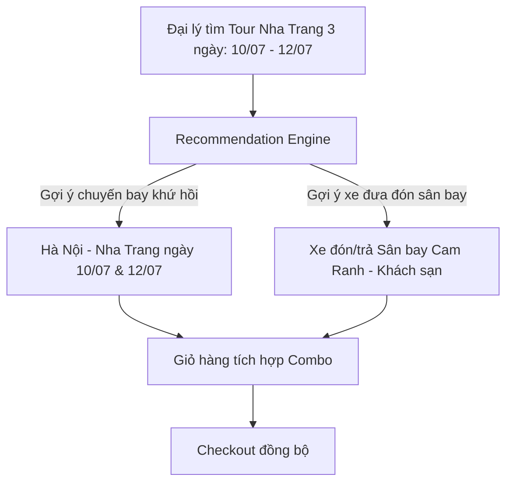
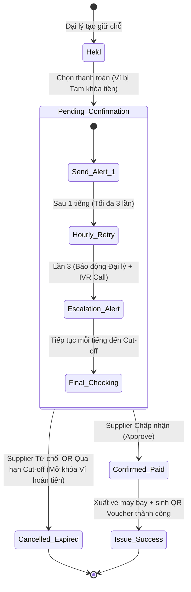

# TÀI LIỆU ĐẶC TẢ LUỒNG ĐẶT TOUR ĐÊM MUỘN & GỢI Ý ĐI KÈM (RETRY & RECOMMENDATION WORKFLOW)
## DỰ ÁN: B2B TRAVEL PLATFORM — END-TO-END BOOKING & DELIVERY

---

## 1. QUY TRÌNH NGHIỆP VỤ ĐẶT TOUR CHỜ XÁC NHẬN (ON-REQUEST TOUR)

Trong thực tế vận hành B2B Travel, nhiều sản phẩm Tour của nhà cung cấp địa phương (Suppliers) không thể xác nhận tức thì (Instant Book) mà cần thời gian để kiểm tra xe, tàu, hướng dẫn viên. Luồng nghiệp vụ dưới đây được thiết kế để giải quyết việc đặt chỗ bất đồng bộ, tối ưu hóa giao tiếp với Supplier và bảo vệ dòng tiền của Đại lý (Agencies).

### 1.1 Khung giờ Yên lặng & Giờ Hoạt động (Quiet & Active Hours)
Để tránh làm phiền Supplier ngoài giờ làm việc hành chính nhưng vẫn giữ được trải nghiệm đặt phòng 24/7 của Đại lý, hệ thống chia thời gian trong ngày làm 2 khung giờ:

*   **Khung giờ Yên lặng (Quiet Hours) — [21:00 tối đến 06:00 sáng hôm sau]**:
    *   Mọi yêu cầu đặt Tour của Đại lý gửi trong thời gian này sẽ được ghi nhận vào hệ thống với trạng thái `Pending Confirmation` (Chờ xác nhận).
    *   Hệ thống **tạm giữ (Hold/Block)** số tiền tương ứng trong Ví đại lý (`Blocked Balance`).
    *   Hệ thống **không gửi bất kỳ thông báo** (Push App, SMS, Zalo) nào đến Supplier trong khung giờ này. Đơn hàng được xếp vào hàng đợi chờ xử lý (`Pending Queue`).
*   **Khung giờ Hoạt động (Active Hours) — [06:00 sáng đến 21:00 tối]**:
    *   Các đơn hàng nằm trong hàng đợi của Khung giờ Yên lặng sẽ được **tự động kích hoạt gửi hàng loạt** cho các Supplier bắt đầu từ lúc 06:00 sáng.
    *   Mọi đơn hàng mới phát sinh trong khung giờ này sẽ được gửi trực tiếp và tức thời đến thiết bị của Supplier.

---

### 1.2 Luồng Nhắc nhở theo Giờ & Thang Leo thang Cảnh báo (Hourly Retry & Escalation)
Khi một yêu cầu đặt Tour được gửi đi trong Khung giờ Hoạt động, Supplier cần phản hồi nhanh nhất có thể. Hệ thống vận hành cơ chế tự động nhắc nhở và báo động như sau:

```
[Khởi tạo Booking]
       │
       ▼ (Gửi thông báo lần 1 - 0h)
[Mỗi 1 tiếng nhắc nhở 1 lần] ── (Lần 1 & 2: App Push / Zalo Bot)
       │
       ├─> [Nhắc nhở lần 3 - sau 3 tiếng] ──> [Báo động khẩn cấp tới Đại lý (Delay Alarm)]
       │                                     └─> (Gửi SMS / Gọi IVR đến Supplier)
       │
       ▼ (Tiếp tục gửi nhắc nhở mỗi tiếng)
[Đến hạn Hủy tự động (Cut-off)] ──> [Hủy đơn - Hoàn tiền ví - Giải phóng vé máy bay/xe đi kèm]
```

1.  **Chu kỳ Nhắc nhở (Hourly Retry)**:
    *   Sau lần thông báo đầu tiên, nếu Supplier chưa phản hồi, cứ **mỗi 1 tiếng** hệ thống sẽ tự động gửi lại thông báo nhắc nhở (Retry Alert).
    *   **Lần 1 & Lần 2 (Giờ thứ 1 và thứ 2)**: Gửi thông báo qua App Push (đối với Supplier cài app di động) và tin nhắn Zalo/Telegram Bot (chi phí thấp).
2.  **Mốc Leo thang Cảnh báo (Escalation - Sau 3 tiếng)**:
    *   **Nhắc nhở lần 3 (Giờ thứ 3)**:
        *   Hệ thống chuyển sang kênh khẩn cấp: Gửi tin nhắn SMS trực tiếp hoặc thực hiện **cuộc gọi tự động IVR Call** (Robot gọi điện phát kịch bản thoại) đến hotline của Supplier.
        *   Đồng thời, hệ thống gửi thông báo cảnh báo trễ (Delay Warning) cho **Đại lý**: *"Nhà cung cấp chưa phản hồi yêu cầu đặt chỗ sau 3 giờ. Chúng tôi đang tiếp tục liên hệ khẩn cấp."*
3.  **Hạn chót Hủy tự động (Hard Cut-off Deadline)**:
    *   Nếu Supplier vẫn im lặng sau các lần nhắc nhở, đơn hàng sẽ được gửi nhắc nhở liên tục mỗi tiếng 1 lần cho đến hạn chót (Cut-off Time) và tự động bị hủy (`Expired/Cancelled`), hoàn tiền về ví Đại lý.

---

### 1.3 Ràng buộc tránh Hủy sát giờ (Dynamic Cut-off Time)
Để tránh tình trạng khách hàng chuẩn bị đi tour vào sáng sớm hôm sau mới nhận được thông báo hủy tour (gây bức xúc cực kỳ lớn), hệ thống áp dụng cơ chế **Dynamic Cut-off Time** như sau:

*   **Quy tắc đối với Tour khởi hành Sáng sớm (Từ 06:00 đến 12:00 trưa ngày hôm sau)**:
    *   **Giờ khóa sổ nhận đơn**: Đại lý bắt buộc phải gửi yêu cầu đặt tour trước **18:00 tối ngày hôm trước**.
    *   **Giờ tự động hủy**: Nếu đến **21:00 tối ngày hôm trước** (trước khi bước vào Khung giờ Yên lặng) mà Supplier vẫn chưa nhấn xác nhận, hệ thống sẽ **tự động hủy ngay lập tức**.
    *   *Kết quả*: Khách hàng và Đại lý sẽ biết kết quả bị hủy từ tối hôm trước để kịp thời đổi lịch trình hoặc đặt nhà cung cấp khác, không bị động vào sáng sớm ngày hôm sau.
*   **Quy tắc đối với Tour khởi hành Chiều/Tối (Sau 12:00 trưa)**:
    *   Hạn chót tự động hủy sẽ tính theo công thức:
        $$\text{Thời điểm hủy} = \min(\text{12:00 trưa ngày khởi hành}, \text{Giờ khởi hành} - 2 \text{ tiếng})$$
    *   Đảm bảo luôn hủy trước giờ đi tối thiểu 2 tiếng để bảo vệ trải nghiệm của khách.

---

### 1.4 Quy trình Báo cáo Sự cố & Đền bù tự động (Incident & Auto-refund/Compensation)
Khi Tour đã ở trạng thái được xác nhận (`CONFIRMED/PAID`) nhưng xảy ra sự cố đột xuất sát giờ đi (ví dụ: hỏng phương tiện, bão lũ, hướng dẫn viên gặp tai nạn), Supplier thực hiện khai báo sự cố qua hệ thống:

1. **Khai báo Sự cố trên Supplier App**:
   - Supplier chọn Tour bị ảnh hưởng trên ứng dụng di động, bấm **"Báo cáo sự cố khẩn cấp"**.
   - Bắt buộc chọn Phân loại Sự cố:
     - **Bất khả kháng (Force Majeure)**: Bão lũ, sạt lở, cấm biển của chính quyền. (Yêu cầu chụp ảnh đính kèm văn bản/dự báo thời tiết).
     - **Lỗi vận hành (Operational Failure)**: Hỏng xe, hỏng tàu, HDV ốm đột xuất.
2. **Xử lý Tự động từ Hệ thống**:
   - Chuyển trạng thái kho hàng ngày hôm đó của Tour này thành `SOLD_OUT` tức thời để ngăn chặn booking mới.
   - Gửi thông báo đẩy khẩn cấp (Push Notification + Zalo SMS) cho Đại lý và Khách hàng cuối để cảnh báo.
3. **Chế tài xử phạt & Đền bù**:
   - **Trường hợp Bất khả kháng**:
     - Hệ thống tự động hủy đơn, hoàn trả **100% số tiền** từ Ví tạm giữ về Ví đại lý (`RELEASE_HOLD` -> `CREDIT`).
     - Supplier **không chịu hình phạt tài chính**.
   - **Trường hợp Lỗi vận hành của Supplier**:
     - **Ưu tiên 1 - Tự động định tuyến lại (Auto-re-routing)**: Hệ thống tìm kiếm các Supplier đối tác khác trên sàn có cùng lịch trình đi ngày hôm đó còn chỗ trống. Nếu tìm thấy, tự động chuyển đơn sang Supplier mới. Phần chênh lệch giá (nếu tour đối tác đắt hơn) sẽ tự động trừ vào Ví công nợ của Supplier cũ.
     - **Ưu tiên 2 - Phạt tiền đền bù**: Nếu không có tour thay thế, hệ thống hủy đơn, hoàn **100% tiền cho Đại lý**, đồng thời phạt Supplier **30% - 50% giá trị đơn hàng** (khấu trừ trực tiếp vào Ví đối soát của Supplier) để bồi thường cho Đại lý và Khách hàng cuối.

---

### 1.5 Quy trình Đóng bán tour nhanh & Ràng buộc Overbooking (Quick Stop Selling)
Để hạn chế tối đa việc Supplier hết chỗ thực tế bên ngoài (do bán offline hoặc bán qua kênh khác) nhưng không cập nhật ứng dụng, hệ thống áp dụng cơ chế ràng buộc:

1. **Nút gạt Đóng bán nhanh (Quick Stop Selling)**:
   - Trên màn hình chính của Supplier App, hệ thống cung cấp nút gạt **"Đóng bán nhanh hôm nay"** hoặc cập nhật nhanh số chỗ trống về `0` chỉ với 2 thao tác chạm.
2. **Ràng buộc Phạt Double Booking**:
   - Nếu Supplier không cập nhật kho chỗ trống trên ứng dụng, dẫn đến Đại lý đặt chỗ thành công trên sàn, nhưng sau đó Supplier từ chối với lý do "Đã hết chỗ ngoài thực tế".
   - Hệ thống ghi nhận đây là lỗi vận hành của Supplier. Supplier sẽ bị phạt **20% giá trị đơn hàng** để đền bù code giảm giá bồi thường cho Đại lý. Ràng buộc tài chính này sẽ bắt buộc Supplier phải chủ động cập nhật kho chỗ trống trên app thường xuyên.

---

## 2. BỘ MÁY GỢI Ý VÉ MÁY BAY & XE ĐI KÈM (CROSS-PRODUCT RECOMMENDATION)

Để biến B2B Travel Platform thành một giải pháp "All-in-One" thực thụ, hệ thống tích hợp bộ máy gợi ý tự động vé máy bay và xe đưa đón trong quá trình Đại lý tìm kiếm Tour.



### 2.1 Cơ chế gợi ý thông minh
Khi Đại lý tìm kiếm một Tour có điểm đến xác định (ví dụ: Tour Nha Trang 3 ngày từ ngày 10/07 đến ngày 12/07):
1.  **Vé máy bay khứ hồi (Roundtrip Flights)**:
    *   Dựa trên vị trí của Đại lý (ví dụ: Hà Nội), hệ thống gọi API tìm chuyến bay từ HAN đến CXR (Sân bay Cam Ranh).
    *   *Chuyến đi*: Gợi ý các chuyến bay hạ cánh trước giờ bắt đầu Tour tối thiểu 3 tiếng (ví dụ: Tour đón lúc 08:00 sáng 10/07, gợi ý chuyến bay đáp trước 05:00 sáng hoặc tối hôm trước).
    *   *Chuyến về*: Gợi ý các chuyến bay cất cánh sau giờ kết thúc Tour tối thiểu 4 tiếng (ví dụ: Tour trả khách lúc 17:00 chiều 12/07, gợi ý chuyến bay cất cánh sau 21:00 tối).
2.  **Xe đưa đón (Airport Transfers)**:
    *   Gợi ý xe limousine hoặc xe riêng 4-7-16 chỗ đón từ Sân bay Cam Ranh về khách sạn/điểm tập trung Tour vào ngày 10/07 và trả ngược lại ngày 12/07.

---

### 2.2 Cơ chế khóa giữ chỗ đồng bộ (Synchronized Price Lock & Escrow Hold)
Khi đại lý đặt một Combo chứa cả dịch vụ xác nhận ngay (Vé máy bay/Khách sạn) và dịch vụ chờ xác nhận (Tour/Xe đưa đón địa phương), hệ thống xử lý để tránh rủi ro "mồ côi vé máy bay" (có vé bay nhưng không đi được tour):

1.  **Bước 1: Giữ chỗ tạm thời (Hold / Price Lock)**:
    *   Hệ thống gọi API giữ chỗ vé máy bay gốc (Hold Airline PNR) và phòng khách sạn. Giá vé được khóa (`Price Lock`) trên Redis với TTL là 20 phút (hoặc theo quy định hãng bay).
    *   Hệ thống chuyển trạng thái ví đại lý thành tạm khóa tổng số tiền combo (`Blocked Balance`).
2.  **Bước 2: Gửi yêu cầu xác nhận Tour/Xe**:
    *   Hệ thống gửi yêu cầu đặt chỗ đến nhà cung cấp Tour và Xe theo quy trình tại **Phần 1**.
3.  **Bước 3: Quyết toán giao dịch (Fulfillment / Release)**:
    *   **Kịch bản 1 — Tất cả được xác nhận**: Ngay khi Supplier xác nhận Tour/Xe thành công, backend tự động gọi API xuất vé máy bay chính thức (`Issue Ticket`), trừ số dư ví chính thức (`Debit`) và sinh E-Voucher chung cho cả hành trình.
    *   **Kịch bản 2 — Tour hoặc Xe bị từ chối/Hết hạn**:
        *   Hệ thống gửi lệnh hủy giữ chỗ vé máy bay (Release PNR) và khách sạn lên Supplier gốc để tránh mất phí phạt.
        *   Tự động giải phóng tiền tạm khóa (`Unblock Balance`) trả lại vào ví đại lý ngay lập tức.
        *   Gửi thông báo: *"Đặt tour không thành công. Hệ thống đã tự động hủy giữ chỗ vé máy bay và xe đi kèm để bảo toàn số dư ví của bạn."*

---

## 3. THIẾT KẾ KIẾN TRÚC KỸ THUẬT (.NET 8 & POSTGRESQL)

### 3.1 Thiết kế Cơ sở dữ liệu (Database Schema)

Để lưu vết luồng xử lý và thời gian nhắc nhở, các bảng dữ liệu được thiết kế mở rộng như sau:

#### Bảng `booking.bookings` (Bổ sung trạng thái & các mốc thời gian)
```sql
ALTER TABLE booking.bookings ADD COLUMN status VARCHAR(50) DEFAULT 'HELD'; 
-- Trạng thái bổ sung: 'PENDING_CONFIRMATION', 'EXPIRED'
ALTER TABLE booking.bookings ADD COLUMN hold_type VARCHAR(20) DEFAULT 'INSTANT'; -- 'INSTANT', 'ON_REQUEST'
ALTER TABLE booking.bookings ADD COLUMN retry_count INT DEFAULT 0;
ALTER TABLE booking.bookings ADD COLUMN next_retry_at TIMESTAMP WITH TIME ZONE;
ALTER TABLE booking.bookings ADD COLUMN cut_off_at TIMESTAMP WITH TIME ZONE;
ALTER TABLE booking.bookings ADD COLUMN parent_booking_id UUID NULL; -- Để nhóm combo Tour + Bay + Xe
```

#### Bảng `payment.transactions` (Bổ sung log tạm khóa tiền)
```sql
-- Thêm cột loại giao dịch
-- Loại giao dịch: 'DEBIT' (Trừ tiền ví), 'CREDIT' (Hoàn tiền), 'HOLD_PENDING' (Tạm khóa ví), 'RELEASE_HOLD' (Mở khóa ví)
ALTER TABLE payment.transactions ADD COLUMN transaction_type VARCHAR(30) NOT NULL;
```

---

### 3.2 Sơ đồ chuyển đổi trạng thái Tour Booking (State Machine)



---

### 3.3 Thiết kế Background Worker (Hangfire Job)

Hệ thống sử dụng **Hangfire** để định kỳ quét và thực hiện cuộc gọi/tin nhắn nhắc nhở.

#### 1. Định nghĩa Background Job gửi nhắc nhở (`TourReminderJob.cs`)
```csharp
public class TourReminderJob
{
    private readonly IBookingRepository _bookingRepository;
    private readonly INotificationService _notificationService;
    private readonly IVoiceCallService _voiceCallService; // Cho cuộc gọi IVR
    
    public TourReminderJob(
        IBookingRepository bookingRepository, 
        INotificationService notificationService,
        IVoiceCallService voiceCallService)
    {
        _bookingRepository = bookingRepository;
        _notificationService = notificationService;
        _voiceCallService = voiceCallService;
    }

    public async Task ExecuteAsync()
    {
        var now = DateTimeOffset.UtcNow;

        // Lấy danh sách booking đang chờ xác nhận và đã đến giờ nhắc nhở (nằm ngoài Quiet Hours)
        var pendingBookings = await _bookingRepository.GetBookingsForRetryAsync(now);

        foreach (var booking in pendingBookings)
        {
            // Kiểm tra Quiet Hours (21:00 - 06:00 Local Time)
            if (IsQuietHours(booking.LocalTimeZone))
            {
                continue; // Bỏ qua không gửi nhắc nhở
            }

            // Kiểm tra nếu đã quá giờ Cut-off -> Thực hiện hủy
            if (now >= booking.CutOffAt)
            {
                await CancelAndReleaseBookingAsync(booking);
                continue;
            }

            // Thực hiện gửi nhắc nhở tùy theo số lần đã retry
            booking.RetryCount++;
            if (booking.RetryCount == 3)
            {
                // Gọi kênh khẩn cấp (SMS/IVR Call) tới Supplier + Báo động tới Đại lý
                await _voiceCallService.MakeIvrCallAsync(booking.SupplierPhone, "Bạn có một đơn đặt tour khẩn cấp cần duyệt");
                await _notificationService.NotifyAgentAboutDelayAsync(booking.AgentId, booking.Id);
            }
            else
            {
                // Kênh thông thường (App Push/Zalo Bot)
                await _notificationService.SendSupplierAlertAsync(booking.SupplierId, booking.Id, booking.RetryCount);
            }

            // Thiết lập thời gian nhắc nhở tiếp theo là 1 tiếng sau
            booking.NextRetryAt = now.AddHours(1);
            await _bookingRepository.UpdateAsync(booking);
        }
    }

    private bool IsQuietHours(string timeZoneId)
    {
        var tz = TimeZoneInfo.FindSystemTimeZoneById(timeZoneId);
        var localTime = TimeZoneInfo.ConvertTime(DateTimeOffset.UtcNow, tz).TimeOfDay;
        
        var quietStart = new TimeSpan(21, 0, 0); // 21:00
        var quietEnd = new TimeSpan(6, 0, 0);    // 06:00

        return localTime >= quietStart || localTime < quietEnd;
    }

    private async Task CancelAndReleaseBookingAsync(Booking booking)
    {
        // 1. Cập nhật trạng thái booking -> EXPIRED
        // 2. Gọi API nhả PNR vé máy bay + xe đi kèm nếu có parent_booking_id
        // 3. Gọi Repo Payment thực hiện mở khóa ví đại lý (RELEASE_HOLD)
        // 4. Gửi email/thông báo thông tin hủy cho Đại lý
    }
}
```

#### 2. Đăng ký Recurring Job trong Startup.cs
```csharp
// Đăng ký Hangfire chạy quét mỗi 5 phút một lần để xử lý kịp thời các đơn hàng
RecurringJob.AddOrUpdate<TourReminderJob>(
    "tour-booking-reminder-processor",
    job => job.ExecuteAsync(),
    "*/5 * * * *" // Cron expression chạy mỗi 5 phút
);
```

---

## 4. CHIẾN LƯỢC KIỂM THỬ (UAT TEST CASES)

Để đảm bảo tính đúng đắn của logic thời gian khóa sổ và nhắc nhở, các test case sau cần được bao phủ trong bộ kiểm thử tích hợp (Integration Tests):

*   **TC-WORKFLOW-01: Đặt Tour đi sáng sớm trước 18:00 hôm trước**
    *   *Đầu vào*: Đặt tour khởi hành 08:00 sáng ngày 18/06. Thực hiện đặt lúc 15:00 chiều ngày 17/06.
    *   *Kỳ vọng*: Hệ thống cho phép đặt ở trạng thái `Pending Confirmation`, tạm giữ tiền ví. Gửi thông báo đến Supplier mỗi tiếng. Nếu đến 21:00 ngày 17/06 không xác nhận -> Tự động hủy đơn, hoàn tiền.
*   **TC-WORKFLOW-02: Đặt Tour đi sáng sớm sau 18:00 hôm trước**
    *   *Đầu vào*: Đặt tour khởi hành 08:00 sáng ngày 18/06. Thực hiện đặt lúc 19:30 tối ngày 17/06.
    *   *Kỳ vọng*: Hệ thống từ chối cho đặt và báo lỗi *"Đã qua giờ khóa sổ đặt tour cho sáng mai. Vui lòng chọn tour/ngày khác."*
*   **TC-WORKFLOW-03: Đặt Tour đêm muộn đi chiều ngày hôm sau**
    *   *Đầu vào*: Đặt tour khởi hành 14:00 chiều ngày 18/06. Thực hiện đặt lúc 23:30 đêm ngày 17/06.
    *   *Kỳ vọng*: Hệ thống cho phép đặt, tạm giữ tiền ví. Không gửi thông báo cho Supplier từ 23:30 đến 06:00. Bắt đầu gửi nhắc nhở từ 06:00 sáng ngày 18/06. Hạn chót hủy tự động là 12:00 trưa ngày 18/06 (2 tiếng trước giờ đi).
*   **TC-WORKFLOW-04: Hủy giữ chỗ đồng bộ khi tour bị từ chối**
    *   *Đầu vào*: Combo gồm Vé máy bay (đang giữ chỗ `Held` 20 phút) và Tour (trạng thái `Pending Confirmation`). Supplier Tour bấm từ chối đơn hàng sau 10 phút.
    *   *Kỳ vọng*: Hệ thống tự động gọi API hủy giữ chỗ vé máy bay, mở khóa ví đại lý hoàn 100% tiền tạm giữ, không xuất vé máy bay mồ côi.
