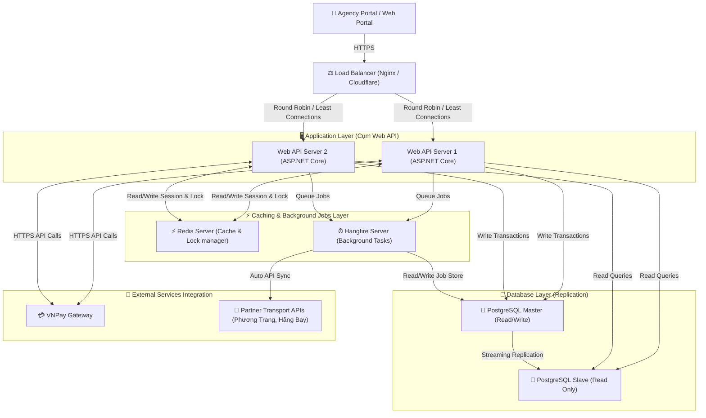

# 🖥️ Thiết Kế Kiến Trúc Phần Cứng Dự Án — B2B Travel Platform

> Tài liệu này mô tả mô hình triển khai hạ tầng vật lý / điện toán đám mây (Cloud Infrastructure Deployment) phục vụ cho việc vận hành sàn du lịch B2B B2B Travel Platform.

---

## 🗺️ 1. Sơ Đồ Triển Khai Vật Lý (Deployment Diagram)

Dưới đây là sơ đồ Mermaid mô tả mô hình kiến trúc hạ tầng phần cứng gồm Load Balancer, các cụm máy chủ ứng dụng Web API, máy chủ Database và các dịch vụ bổ trợ:

---

## 🎛️ 2. Cấu Hình Phần Cứng Chi Tiết (Đề Xuất Dự Kiến)

Để dự án được duyệt tốt trước hội đồng, chúng ta cần đưa ra thông số cấu hình phần cứng cụ thể (cho môi trường Staging/Production trên Google Cloud Platform - GCP hoặc AWS):

| Cụm Máy Chủ / Thiết Bị | Số Lượng | Thông Số Kỹ Thuật Đề Xuất (Spec) | Vai Trò |
| :--- | :--- | :--- | :--- |
| **Load Balancer (Nginx)** | 01 | e2-micro (2 vCPU, 1 GB RAM) | Nhận request, mã hóa SSL/TLS, phân phối tải. |
| **Web API Servers** | 02 | e2-standard-2 (2 vCPU, 8 GB RAM) | Chạy ứng dụng ASP.NET Core, xử lý logic nghiệp vụ. |
| **Redis Cache Server** | 01 | Cloud Memorystore (1 GB RAM Core) | Quản lý cache dữ liệu và thực thi khóa phân tán (Distributed Lock). |
| **Database Server (Master)** | 01 | db-custom-2-7680 (2 vCPU, 7.5 GB RAM, SSD 50GB) | Lưu trữ chính CSDL PostgreSQL (Tài chính, Ví, Booking). |
| **Database Server (Replica)** | 01 | db-custom-2-7680 (2 vCPU, 7.5 GB RAM, SSD 50GB) | Đồng bộ dữ liệu để phục vụ đọc báo cáo, backup giảm tải cho Master. |

---

## 🛠️ Bước Tiếp Theo (Tôi và bạn cùng làm)

Để hoàn thiện tài liệu này, chúng ta cần thảo luận các nội dung sau:
1. **Mô hình triển khai:** Chúng ta nên chọn hạ tầng On-Premises (tự dựng Server vật lý) hay hạ tầng Cloud (AWS / Azure / Google Cloud) làm hướng thuyết minh?
2. **Chi phí vận hành hạ tầng dự kiến:** Có cần thêm bảng dự toán chi phí phần cứng hàng tháng không?
3. **Giải pháp an toàn thông tin:** Bạn muốn thiết kế cơ chế backup CSDL tự động như thế nào (hàng ngày/hàng tuần)?

*Hãy cho tôi biết ý kiến của bạn về sơ đồ deployment trên để chúng ta tiếp tục hoàn thiện tài liệu nhé!*
