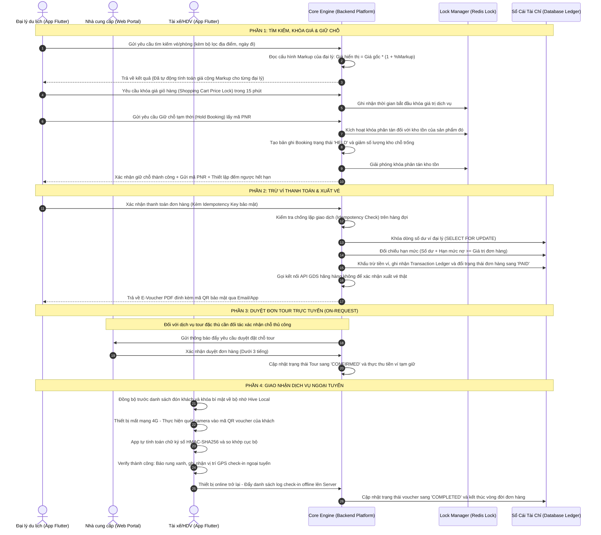
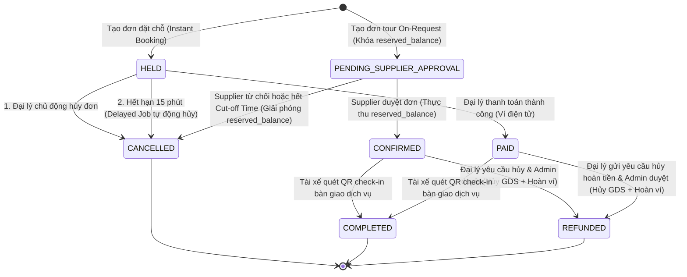
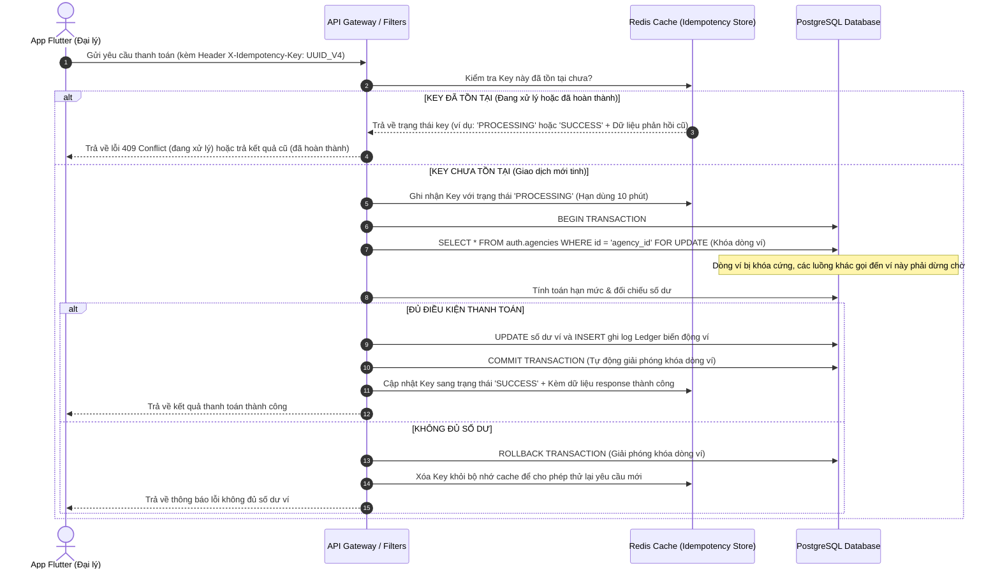
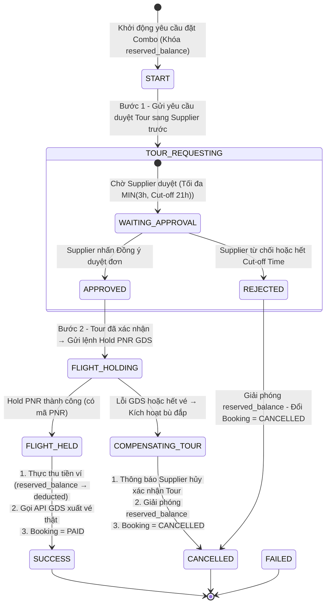
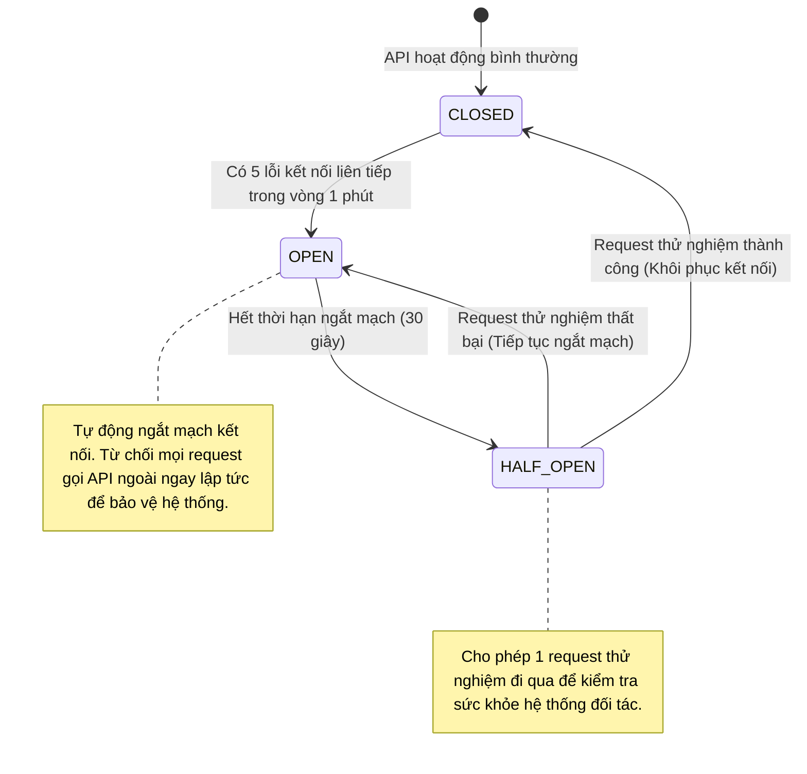
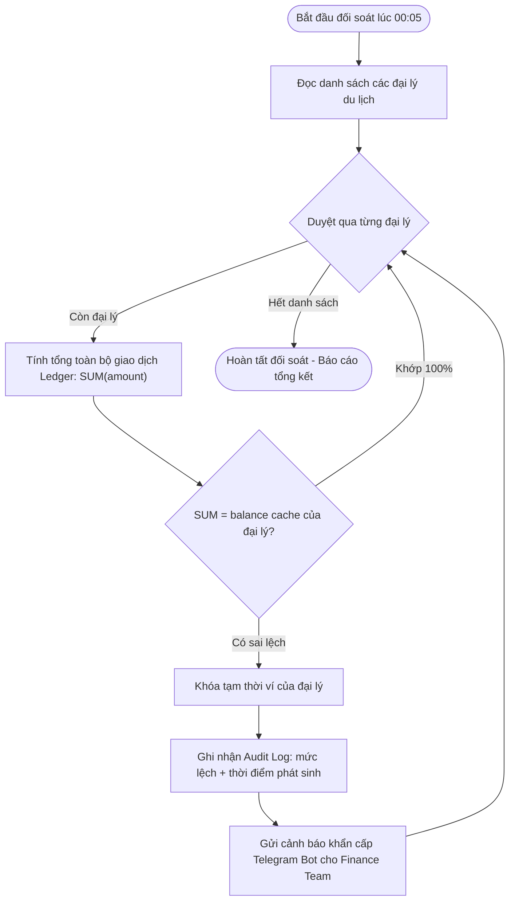

# TÀI LIỆU 3: MÔ TẢ CHI TIẾT DỰ ÁN & GIẢI PHÁP LOGIC HỆ THỐNG
## DỰ ÁN: B2B TRAVEL PLATFORM — END-TO-END BOOKING & DELIVERY

---

## 1. MÔ TẢ CHI TIẾT VỀ DỰ ÁN & LUỒNG HOẠT ĐỘNG CỦA HỆ THỐNG

### 1.1 Khái quát Nghiệp vụ hệ thống B2B Travel Platform
Hệ thống **B2B Travel Platform** (Booking to Delivery) được xây dựng để cung cấp một hạ tầng giao dịch khép kín dành riêng cho các Đại lý du lịch vừa/nhỏ (Travel Agents) và Cộng tác viên (CTV) lữ hành tại Việt Nam.

Nền tảng đóng vai trò làm trung gian phân phối và điều phối dịch vụ từ các nhà cung cấp sỉ (Suppliers) đến các đại lý bán lẻ, tối ưu hóa các quy trình giữ chỗ, thanh toán ví điện tử nội bộ, và bàn giao vé điện tử an toàn cho khách hàng cuối (End Customers) thông qua ứng dụng di động quét mã QR Code bảo mật.

---

### 1.2 Luồng xử lý nghiệp vụ khép kín (End-to-End Sequence Diagram)
Dưới đây là sơ đồ Mermaid Sequence mô tả chi tiết luồng tương tác logic giữa các tác nhân và hệ thống từ khi tìm kiếm cho đến khi hoàn thành bàn giao dịch vụ:

---

## 2. 5 VẤN ĐỀ LOGIC HỆ THỐNG TRONG APP & PHƯƠNG PHÁP GIẢI QUYẾT TRIỆT ĐỂ

Dưới đây là phần phân tích sâu sắc về 5 bài toán kỹ thuật phức tạp nhất trong ứng dụng và cách thiết kế giải pháp giải quyết bằng thuật toán, kiến trúc logic và luật nghiệp vụ (tuyệt đối không chứa mã nguồn).

---

### VẤN ĐỀ 1: Tránh đặt chồng chỗ (Overbooking / Race Conditions) khi nhiều đại lý cùng đặt phòng/vé cuối cùng đồng thời.

#### 1. Mô tả bản chất kỹ thuật
Khi kho phòng khách sạn hoặc chỗ ngồi chuyến bay chỉ còn lại **1 sản phẩm** cuối cùng. Tại cùng một thời điểm (mili-giây), hai nhân viên bán hàng của đại lý $A$ và đại lý $B$ cùng gửi yêu cầu giữ chỗ.
*   *Nếu không có cơ chế kiểm soát xử lý đồng thời (Concurrency Control)*: Luồng API $A$ và luồng API $B$ cùng đọc trạng thái kho tồn lúc đó và thấy số lượng chỗ trống $\text{Available} = 1$. Cả hai luồng xử lý đều tiến hành tạo đơn hàng và trừ kho về $0$, lưu trạng thái thành công.
*   *Hậu quả*: Một phòng khách sạn bị bán cho hai đại lý khác nhau. Một khách hàng sẽ bị từ chối phục vụ khi đến lễ tân, gây đền bù tài chính và làm suy giảm uy tín nghiêm trọng của sàn du lịch.

#### 2. Giải pháp phân tích thiết kế hệ thống
Hệ thống sử dụng giải pháp **Khóa phân tán (Distributed Lock)** tại tầng ứng dụng kết hợp **Kiểm soát phiên bản tối ưu (Optimistic Concurrency Control - OCC)** tại tầng lưu trữ dữ liệu.

##### Bước A: Khóa phân tán (Distributed Lock) tại tầng ứng dụng
Hệ thống sử dụng một máy quản lý khóa phân tán tập trung (Lock Manager).
1. Trước khi thực hiện truy vấn đọc kho tồn dưới database, tiến trình xử lý API bắt buộc phải đăng ký quyền sở hữu một mã khóa duy nhất đại diện cho tài nguyên cần đặt chỗ (ví dụ mã khóa: `lock:inventory:room_type_102:2026-06-25`).
2. Nếu tiến trình $A$ gửi yêu cầu trước một phần mili-giây, máy quản lý khóa sẽ cấp khóa cho tiến trình $A$ với thời hạn hết hạn tự động (Time-to-Live - TTL) là 10 giây.
3. Tiến trình $B$ gửi yêu cầu sau đó sẽ bị từ chối cấp khóa và phải chuyển sang chế độ xếp hàng đợi (Wait and Retry). Tiến trình $B$ sẽ thực hiện thử lại việc lấy khóa sau mỗi 200 mili-giây, tối đa trong vòng 2 giây. Nếu sau 2 giây vẫn không lấy được khóa, hệ thống lập tức hủy yêu cầu và trả về thông báo lỗi bận hệ thống.

##### Bước B: Kiểm soát phiên bản tối ưu (Optimistic Concurrency Control - OCC) tại tầng database
Hệ thống cấu hình cấu trúc bảng kho tồn chứa một thuộc tính đặc biệt là Số phiên bản tăng dần `version` (kiểu dữ liệu nguyên).
1. Khi tiến trình $A$ được phép truy cập cơ sở dữ liệu để đọc kho phòng trống, nó sẽ lưu lại giá trị phiên bản hiện tại (Ví dụ đọc được: $\text{Available} = 1$, $\text{Version} = 10$).
2. Khi thực hiện giao dịch cập nhật kho phòng, hệ thống bắt buộc phải kiểm tra điều kiện so khớp phiên bản:
   $$\text{UPDATE hotel_rooms SET Available} = \text{Available} - 1, \text{Version} = \text{Version} + 1$$
   $$\text{WHERE Id = 'Room_Id' AND Available} \ge 1 \text{AND Version} = 10$$
3. Nếu dòng dữ liệu cập nhật thành công, database trả về số lượng dòng bị ảnh hưởng bằng $1$. Phiên bản dữ liệu lúc này tự động tăng lên $11$.
4. Trong trường hợp luồng $B$ bằng cách nào đó bỏ qua được tầng khóa phân tán và thực hiện ghi song song: Khi luồng $B$ chạy câu lệnh cập nhật với điều kiện lọc $\text{Version} = 10$, hệ thống database sẽ trả về số lượng dòng bị ảnh hưởng bằng $0$ (vì phiên bản thực tế dưới database đã bị luồng $A$ nâng lên $11$). Hệ thống phát hiện xung đột dữ liệu, tự động hủy bỏ giao dịch của luồng $B$ và thông báo hết phòng.

##### So sánh hiệu năng và ưu/nhược điểm hai cơ chế khóa:

| Tiêu chí so sánh | Khóa tối ưu (Optimistic Locking - OCC) | Khóa bi quan (Pessimistic Locking) |
| :--- | :--- | :--- |
| **Cơ chế hoạt động** | Cho phép nhiều luồng đọc đồng thời, chỉ kiểm tra xung đột khi ghi dữ liệu. | Khóa cứng bản ghi ngay khi đọc, bắt các luồng khác phải chờ đợi hoàn toàn. |
| **Phù hợp nhất với** | Môi trường có tỷ lệ tranh chấp thấp hoặc trung bình (đọc nhiều hơn ghi). | Môi trường có tỷ lệ tranh chấp cực kỳ cao (ghi liên tục). |
| **Tải trên Database**| Rất nhẹ, không chiếm giữ kết nối DB lâu. | Nặng, dễ gây tình trạng nghẽn hàng đợi (Connection Pool) hoặc lỗi khóa chết (Deadlock). |

---

### VẤN ĐỀ 2: Quản lý vòng đời giữ chỗ (Hold Booking Lifecycle) & Hủy tự động (Auto-release/Cleanup).

#### 1. Mô tả bản chất kỹ thuật
Khi đại lý tạo đơn giữ chỗ thành công, hệ thống khóa phòng/vé của nhà cung cấp để đại lý chốt tiền với khách hàng lẻ. Mốc thời gian giữ chỗ (Hold Expiry) được quy định chặt chẽ (ví dụ: 15 phút).
*   Nếu đại lý thực hiện thanh toán trong vòng 15 phút, đơn hàng chuyển sang trạng thái hợp lệ chính thức.
*   Nếu quá 15 phút đại lý không thanh toán, hệ thống bắt buộc phải giải phóng kho phòng/vé ngay lập tức để trả lại kho sỉ, tránh tình trạng giam giữ kho ảo gây thiệt hại cho nhà cung cấp.
*   *Vấn đề*: Hệ thống cần một cơ chế giải phóng kho tự động hoạt động chính xác đến từng giây mà không tạo tải quét liên tục (`SELECT` quét diện rộng) làm nghẽn năng lực xử lý của máy chủ dữ liệu.

#### 2. Giải pháp phân tích thiết kế hệ thống
Hệ thống sử dụng cơ chế **Máy trạng thái đơn hàng (State Machine)** kết hợp với **Hàng đợi tác vụ trễ bất đồng bộ (Delayed Message Queue / Hangfire Job)**.

##### Sơ đồ chuyển đổi trạng thái của Booking (State Machine Diagram - Thống nhất):

> **Lưu ý**: Hệ thống có **hai luồng đặt chỗ song song**: (1) Luồng tức thì (Instant Booking) — áp dụng cho vé máy bay và phòng khách sạn tiêu chuẩn; (2) Luồng duyệt thủ công (On-Request) — áp dụng cho tour lẻ địa phương cần Supplier xác nhận.

##### Quy trình giải phóng kho tự động qua hàng đợi tác vụ trễ:
1.  **Bước 1**: Khi một đơn hàng ở trạng thái `HELD` được tạo thành công vào lúc $T$, hệ thống tính toán thời gian hết hạn là $T + 15\text{ phút}$.
2.  **Bước 2**: Hệ thống đăng ký một tác vụ trễ (Delayed Job) vào hàng đợi. Thông điệp này chứa tham số đầu vào duy nhất là mã định danh `BookingId` và được đặt lịch chạy sau chính xác 15 phút. Thông điệp này được lưu trữ trong hàng đợi chạy nền dưới dạng nén và không tốn CPU quét database.
3.  **Bước 3**: Đúng mốc giờ $T + 15\text{ phút}$, worker chạy nền tự động lấy thông điệp ra khỏi hàng đợi và thực thi quy trình xử lý:
    *   *Truy vấn kiểm tra*: Đọc thông tin đơn hàng của `BookingId` từ cơ sở dữ liệu.
    *   *Đánh giá trạng thái*:
        *   Nếu trạng thái của đơn hàng đã được cập nhật thành `PAID` hoặc `CONFIRMED`: Hệ thống lập tức hủy bỏ tác vụ trễ và kết thúc tiến trình.
        *   Nếu trạng thái vẫn là `HELD`: Hệ thống mở một Database Transaction, đổi trạng thái booking sang `CANCELLED`, lấy danh sách các sản phẩm và số lượng tương ứng trong đơn hàng để cộng trả lại số lượng kho vào bảng quản lý kho tồn (Inventory).
    *   *Đồng bộ giao diện*: Sau khi cập nhật DB thành công, hệ thống gửi một thông báo thay đổi trạng thái thời gian thực thông qua SignalR xuống thiết bị của đại lý để tự động đổi giao diện màn hình sang trạng thái hủy đơn.

---

### VẤN ĐỀ 3: Đảm bảo tính nhất quán ví tài chính & chống tiêu trùng (Double Spending Prevention).

#### 1. Mô tả bản chất kỹ thuật
Ví đại lý du lịch (Agency Wallet) là tài sản trực tiếp dùng để thực hiện các giao dịch trừ tiền thanh toán.
*   **Tiêu trùng do nhấn lặp (Double Submission)**: Trong điều kiện mạng di động không ổn định, nhân viên đại lý nhấn nút "Thanh toán" liên tiếp 3-4 lần. Thiết bị di động gửi dồn dập nhiều yêu cầu API thanh toán giống hệt nhau lên Server cùng một lúc. Nếu hệ thống không chặn lặp, tài khoản ví của đại lý sẽ bị khấu trừ tiền nhiều lần cho cùng một đơn hàng.
*   **Tranh chấp hạn mức nợ khả dụng (Credit Limit Race Condition)**: Đại lý được cấp hạn mức tín dụng công nợ là -50 triệu đồng. Số dư hiện tại đang âm 49 triệu đồng (chỉ còn hạn mức nợ khả dụng 1 triệu đồng). Hai nhân viên sales cùng đăng nhập và nhấn thanh toán hai đơn hàng khác nhau có giá trị lần lượt là 2 triệu và 3 triệu đồng vào cùng một tích tắc. Nếu không có cơ chế khóa, cả hai tiến trình cùng đọc ra hạn mức khả dụng là 1 triệu đồng -> Cùng cho phép trừ nợ -> Số dư ví đại lý bị âm vượt hạn mức quy định.

#### 2. Giải pháp phân tích thiết kế hệ thống
Áp dụng cơ chế **Idempotency Key (Mã giao dịch bất biến)** ở cổng đón API kết hợp với **Khóa bi quan cấp dòng dữ liệu (Pessimistic Row-level Locking)** ở tầng cơ sở dữ liệu.

##### Sơ đồ logic kiểm tra chống lặp Idempotency và Khóa trừ tiền ví:

---

### VẤN ĐỀ 4: Xác thực E-Voucher Ngoại tuyến (Offline QR Code Verification) cho Tài xế ở vùng mất sóng.

#### 1. Mô tả bản chất kỹ thuật
Tại các điểm đón khách đặc thù (bến tàu du lịch biển đảo, khu vực leo núi cao Sapa), sóng điện thoại 4G/Wifi thường bị mất hoàn toàn.
*   Tài xế du lịch (Delivery Staff) cần quét mã QR Code trên màn hình điện thoại của khách hàng để check-in cho họ lên phương tiện vận chuyển.
*   Nếu thiết bị bắt buộc phải kết nối Internet để gửi API xác thực lên máy chủ, tài xế sẽ bị kẹt tại điểm đón, gây tắc nghẽn giao thông và trễ giờ khởi hành của đoàn.
*   Nếu kiểm tra ngoại tuyến hoàn toàn bằng cách đọc thông tin văn bản thô hiển thị trong mã QR, khách hàng có thể dùng ảnh chụp màn hình cũ hoặc tự ý chỉnh sửa thông tin trong ảnh mã QR (sửa lại ngày đi tour, sửa tên người đi) để gian lận.

#### 2. Giải pháp phân tích thiết kế hệ thống
Sử dụng giải pháp **Ký số đối xứng HMAC-SHA256 với khóa riêng biệt từng tài xế (Per-driver Key)** kết hợp cơ chế lưu trữ NoSQL cục bộ tốc độ cao trên thiết bị di động của tài xế.

> **Cải tiến bảo mật then chốt**: Hệ thống **không dùng một Shared Secret Key chung cho toàn bộ tài xế** (rủi ro: nếu một thiết bị bị lộ, toàn bộ hệ thống QR bị phá vỡ). Thay vào đó, mỗi Delivery Agent được cấp một `DriverSecretKey` riêng. Key được tự động xoay vòng (Key Rotation) mỗi 24 giờ. Khi tài xế mất thiết bị, Admin thu hồi key ngay lập tức khiến tất cả QR trên thiết bị đó vô hiệu lực.

##### Bước A: Nguyên lý sinh mã QR bảo mật động trên máy chủ hệ thống
Khi đại lý thực hiện thanh toán đơn hàng thành công, Server sinh mã E-Voucher. Mã QR hiển thị cho khách hàng thực chất chứa một chuỗi thông điệp được ký số bảo mật:
1.  **Thông điệp (Message)**: Nối chuỗi các thông tin cốt lõi của voucher để giảm độ dài:
    $$\text{Message} = \text{BookingId} + "|" + \text{VoucherCode} + "|" + \text{ExpiryDate} + "|" + \text{Timestamp}$$
2.  **Chữ ký số (Signature)**: Sử dụng `DriverSecretKey` riêng của tài xế được phân công chuyến đó để băm thông điệp qua thuật toán mật mã HMAC-SHA256:
    $$\text{Signature} = \text{HMAC-SHA256}(\text{Message}, \text{DriverSecretKey})$$
    Server lưu `DriverSecretKey` được mã hóa trong bảng `driver_keys`, liên kết với `DriverId` và ngày có hiệu lực.
3.  **Mã QR động**: Khách hàng mở app di động để trình vé, ứng dụng tự động chèn mốc thời gian hiện tại vào trường `Timestamp` và tính toán lại `Signature` sau mỗi 30 giây để ngăn chặn việc sử dụng ảnh chụp màn hình cũ được chia sẻ qua tin nhắn.

##### Bước B: Thuật toán xác thực ngoại tuyến trên thiết bị di động tài xế
1.  **Đồng bộ dữ liệu đầu ngày (Có kết nối mạng)**: Tài xế đăng nhập ứng dụng tại văn phòng. Thiết bị tự động tải danh sách mã voucher hợp lệ trong ngày khởi hành cùng với **`DriverSecretKey` riêng của tài xế đó** (đã được mã hóa AES-256 trước khi lưu vào Hive Local NoSQL Database trên thiết bị).
2.  **Quét ngoại tuyến (Mất kết nối mạng hoàn toàn)**:
    *   Tài xế quét camera vào mã QR động của khách hàng.
    *   App di động giải mã chuỗi JSON từ QR, bóc tách ra các trường dữ liệu: BookingId, VoucherCode, ExpiryDate, Timestamp và chuỗi Signature.
    *   *Kiểm tra mốc thời gian động (OTP)*: Đọc thời gian của điện thoại tài xế và so sánh với trường dữ liệu `Timestamp` trong mã QR. Nếu chênh lệch quá 5 phút (300 giây), ứng dụng lập tức từ chối vé và yêu cầu khách mở ứng dụng trực tiếp thay vì trình ảnh chụp màn hình cũ.
    *   *Xác thực chữ ký mật mã cục bộ*: App di động sử dụng chính thuật toán HMAC-SHA256 tích hợp sẵn trong nhân của ứng dụng để tính toán lại chữ ký số dựa trên thông điệp voucher vừa đọc được kết hợp với `DriverSecretKey` đang lưu trong bộ nhớ máy:
        $$\text{ComputedSignature} = \text{HMAC-SHA256}(\text{BookingId|VoucherCode|ExpiryDate|Timestamp}, \text{DriverSecretKey})$$
    *   *So khớp chữ ký*:
        *   Nếu $\text{ComputedSignature} == \text{Signature}$: Chứng minh thông tin trong voucher là nguyên bản 100% từ Server Platform phát ra, được ký đúng cho tài xế này, và không bị chỉnh sửa bởi bất kỳ phần mềm nào.
        *   Nếu không trùng khớp: Hệ thống lập tức hiển thị cảnh báo đỏ báo hiệu vé giả mạo hoặc đã bị can thiệp thay đổi thông tin.
3.  **Ghi nhận log check-in offline**: Khi vé hợp lệ, app đổi trạng thái cục bộ sang `CheckedIn`, tự động kích hoạt cảm biến phần cứng của điện thoại để lấy tọa độ vị trí GPS hiện thời và thời gian quét thực tế, ghi nhận vào hàng đợi lưu trữ offline.
4.  **Tự động đồng bộ khi online**: Khi app di động phát hiện thiết bị khôi phục lại kết nối mạng 3G/4G, một tiến trình chạy nền sẽ tự động đóng gói danh sách log check-in offline gửi lên Server để đồng bộ trạng thái cuối cùng của đơn hàng trong vòng tối đa **60 giây**.

---

### VẤN ĐỀ 5: Xử lý Đơn hàng Combo phức tạp (Distributed Transactions / Saga Pattern).

#### 1. Mô tả bản chất kỹ thuật
Khi đại lý du lịch đặt một đơn hàng combo phức tạp chứa nhiều dịch vụ thành phần:
*   **Dịch vụ Flight**: Gọi sang API hãng hàng không, hệ thống có khả năng tự động giữ chỗ tức thời (Instant Hold PNR) thành công. **Thời gian PNR Hold tiêu chuẩn trên GDS thường từ 30 phút đến 24 giờ** tùy hãng bay và đường bay.
*   **Dịch vụ Tour**: Dịch vụ đặc thù cần gửi yêu cầu chờ nhà xe/hướng dẫn viên đối tác duyệt thủ công (On-Request). Thời gian duyệt tối đa: **MIN(giờ gửi + 3h, 21:00 đêm hôm trước ngày đi)**.
*   *Vấn đề*: Nếu thời gian Supplier duyệt Tour (tối đa 3 tiếng) vượt qua thời gian PNR Hold còn lại của hãng bay, hệ thống GDS có thể tự động hủy mã giữ chỗ gây mất vé. Nếu hệ thống không xử lý tự động, số tiền đặt cọc của đại lý sẽ bị giam giữ gây tranh chấp tài chính.
*   *Ràng buộc thiết kế*: Saga Orchestrator **không được gọi GDS hold vé ngay** khi bắt đầu combo. Thay vào đó phải đợi Tour được duyệt xong trước (vì thời gian tour duyệt ≤ thời gian PNR Hold của hãng bay), sau đó mới tiến hành Hold PNR vé máy bay — tránh PNR hết hạn trong lúc chờ.

#### 2. Giải pháp phân tích thiết kế hệ thống
Áp dụng mô hình thiết kế điều phối giao dịch phân tán **Saga Orchestrator** dạng **Máy trạng thái hướng sự kiện (Event-driven State Machine)** để tự động thực thi các **Hành động bù đắp (Compensating Transactions)** khi xảy ra lỗi ở một khâu trong chuỗi dịch vụ.

##### Sơ đồ chuyển đổi trạng thái của Saga Orchestrator (Thiết kế Tour-First):

> **Nguyên tắc thiết kế then chốt**: Luồng combo áp dụng chiến lược **Tour-First** — duyệt tour trước, hold vé máy bay sau. Điều này đảm bảo khi GDS nhận lệnh Hold PNR, Supplier đã xác nhận khả năng phục vụ, loại bỏ hoàn toàn rủi ro PNR hết hạn trong khi chờ duyệt.

---

## 3. CÁC VẤN ĐỀ PHÁT SINH TRONG THỰC TẾ VẬN HÀNH & PHƯƠNG PHÁP KHẮC PHỤC

Dưới đây là phân tích chi tiết về 4 sự cố vận hành điển hình khi đưa hệ thống chạy trên môi trường thực tế (Production) và phương án khắc phục lỗi chủ động.

---

### VẤN ĐỀ PHÁT SINH 1: API GDS/Supplier bên ngoài gặp lỗi, phản hồi chậm hoặc sập hệ thống.

#### 1. Biểu hiện thực tế
Các cổng API của các hãng hàng không hoặc đối tác phân phối khách sạn toàn cầu thường có độ trễ kết nối không ổn định (phản hồi dao động từ 5 đến 15 giây). Đôi khi hệ thống của họ bị quá tải hoặc sập nguồn dẫn đến lỗi timeout.
*   **Hậu quả**: Khiến giao diện của ứng dụng di động đại lý bị treo xoay tròn không phản hồi; luồng xử lý API của backend bị nghẽn làm cạn kiệt tài nguyên kết nối của máy chủ (Thread Pool Starvation), dẫn đến sập dây chuyền toàn bộ nền tảng B2B.

#### 2. Giải pháp khắc phục (Không dùng Code)
Hệ thống triển khai bộ lọc chống chịu lỗi tự động thông qua hai mẫu thiết kế: **Giới hạn thời gian kết nối (Timeout)** và **Tự động ngắt mạch (Circuit Breaker)**.

*   **Giới hạn kết nối (Timeout)**: Thiết lập cấu hình thời gian chờ tối đa cho các request gọi ra hệ thống API bên thứ ba là 8 giây. Quá 8 giây, hệ thống tự động ngắt kết nối và giải phóng tiến trình xử lý của backend.
*   **Bộ ngắt mạch tự động (Circuit Breaker)**: Thiết lập một máy giám sát trạng thái kết nối có 3 trạng thái hoạt động chính:

---

### VẤN ĐỀ PHÁT SINH 2: Trôi lệch dữ liệu ví tài chính (Data Drift) giữa tổng lịch sử giao dịch và số dư ví thực tế.

#### 1. Biểu hiện thực tế
Sau một thời gian chạy thực tế, do sự cố mất kết nối cơ sở dữ liệu đột ngột giữa chừng hoặc lỗi logic ở các module phụ trợ, trường số dư hiển thị (`balance`) của đại lý trong bảng thông tin tài khoản không bằng tổng giá trị của các dòng biến động tiền (nạp/trừ) ghi nhận trong bảng lịch sử giao dịch.
*   **Hậu quả**: Sai lệch dữ liệu số dư tài chính, đại lý có thể tiêu vượt số tiền đang có hoặc bị mất tiền oan không rõ nguyên nhân.

#### 2. Giải pháp khắc phục (Không dùng Code)
Hệ thống thiết lập nguyên tắc **Sổ cái kép bất biến (Double-entry Ledger)** kết hợp hai lớp bảo vệ: kiểm tra nhất quán tức thời sau mỗi giao dịch (Lớp 1) và tiến trình đối soát toàn bộ hàng đêm (Lớp 2).

*   **Sổ cái bất biến**: Cấm hoàn toàn mọi câu lệnh cập nhật (Update) trực tiếp giá trị cột số dư ví mà không đi kèm bản ghi biến động trong bảng nhật ký giao dịch. Số dư ví thực chất chỉ là giá trị cache đọc nhanh, mọi con số thực tế phải được tính toán từ lịch sử giao dịch.
*   **Lớp 1 — Kiểm tra nhất quán tức thời (Real-time Balance Assertion)**: Sau mỗi giao dịch ghi Ledger thành công, hệ thống ngay lập tức tính lại `balance` từ toàn bộ Ledger của đại lý đó và so sánh với giá trị `balance` đang cache trong bảng tài khoản. Nếu phát hiện lệch → khóa ví ngay và gửi cảnh báo tức thì, không chờ đến ban đêm.
*   **Lớp 2 — Tiến trình đối soát toàn diện hàng đêm (Batch Reconciliation Engine)**:

---

### VẤN ĐỀ PHÁT SINH 3: Sự cố Webhook từ cổng thanh toán VNPay bị mất gói tin (VNPay IPN Webhook Failure).

#### 1. Biểu hiện thực tế
Đại lý thực hiện nạp tiền vào ví bằng cách quét mã QR VNPay. Ngân hàng của đại lý đã trừ tiền thành công, tuy nhiên đúng thời điểm đó, server của Platform gặp sự cố rớt mạng cục bộ, làm mất gói tin gọi Webhook (IPN API) báo thanh toán thành công từ VNPay gửi sang.
*   **Hậu quả**: Ví đại lý không được cộng tiền tự động. Đại lý phải chờ đợi rất lâu và khiếu nại với bộ phận hỗ trợ kỹ thuật của sàn.

#### 2. Giải pháp khắc phục (Không dùng Code)
Thiết lập cơ chế **Tự động đối soát chủ động (Active Query Reconciliation Job)** định kỳ ngắn.

1. Khi đại lý khởi tạo yêu cầu nạp tiền, hệ thống tạo bản ghi giao dịch ở trạng thái chờ duyệt `PENDING` kèm theo mã giao dịch duy nhất gửi sang VNPay.
2. Thiết lập một tác vụ chạy ngầm quét định kỳ 5 phút một lần.
3. Tác vụ ngầm tìm tất cả các yêu cầu nạp tiền đang ở trạng thái `PENDING` có thời gian tạo quá 10 phút.
4. Tác vụ thực hiện gọi API truy vấn trạng thái giao dịch đối soát (`QueryDR API`) của VNPay:
   *   Nếu VNPay trả về trạng thái **Thành công (Pay Success)**: Hệ thống lập tức thực hiện cộng tiền ví cho đại lý và đổi trạng thái giao dịch sang `SUCCESS`.
   *   Nếu VNPay trả về trạng thái **Thất bại hoặc Chưa thanh toán**: Giữ nguyên trạng thái để quét tiếp hoặc tự động hủy giao dịch sau 1 tiếng.

---

### VẤN ĐỀ PHÁT SINH 4: Xung đột dữ liệu đồng bộ ngoại tuyến (Offline Sync Conflicts) của tài xế.

#### 1. Biểu hiện thực tế
Tài xế đi đón khách ở vùng mất sóng biển đảo, quét xác thực mã QR voucher của khách A thành công và lưu log offline vào app. Tuy nhiên, khách hàng A trước đó đã chụp lại màn hình mã QR này và gửi cho người B. Người B đã sử dụng ảnh để quét check-in trực tuyến tại một điểm soát vé khác có mạng 4G trước đó 10 phút.
*   **Hậu quả**: Khi điện thoại tài xế khôi phục mạng và gửi log sync offline lên Server, hệ thống phát hiện voucher này đã được check-in trực tuyến thành công trước đó trên database. Xảy ra xung đột tranh chấp dữ liệu check-in (Double Check-In).

#### 2. Giải pháp khắc phục (Không dùng Code)
Áp dụng luật kiểm tra thời gian QR động, quy tắc xử lý xung đột "First Write Wins" và phân loại cảnh báo vi phạm.

1.  **Chặn tại thiết bị quét (QR động)**: Mã QR voucher hiển thị trên app khách hàng bắt buộc phải tự động thay đổi sau mỗi 30 giây. Khi quét offline, app của tài xế kiểm tra thời gian tạo mã QR động. Nếu thời gian tạo mã lệch quá 5 phút so với đồng hồ hệ thống của điện thoại tài xế, app sẽ từ chối quét ngay lập tức. Điều này buộc khách hàng phải hiển thị ứng dụng trực tiếp thay vì chụp ảnh màn hình cũ gửi cho người khác.
2.  **Xử lý xung đột tại Server khi đồng bộ**: Khi Server nhận danh sách log sync offline tải lên từ điện thoại tài xế:
    *   Hệ thống kiểm tra trạng thái voucher hiện tại trong PostgreSQL:
        *   Nếu voucher **Chưa được check-in**: Đổi trạng thái sang hoàn thành (`Delivered`) và lưu log check-in bình thường.
        *   Nếu voucher **Đã được check-in trực tuyến**: Server từ chối cập nhật trạng thái đơn hàng để tránh ghi đè dữ liệu sai lệch. Chuyển bản ghi sync này vào bảng danh sách nghi vấn gian lận (`fraud_alerts`) kèm theo tọa độ GPS và thời gian quét offline của cả 2 lần quét để Admin đối chiếu và xử lý xử phạt đại lý/khách hàng vi phạm quy chế sử dụng vé.
