# 📊 Đặc Tả Actor & Use Case — B2B Travel Platform

> Tài liệu mô tả toàn bộ tác nhân (Actor), chức năng, luồng hoạt động hệ thống và sơ đồ Use Case cho dự án B2B Travel Platform.

---

## 1. Tổng Quan Hệ Thống

**B2B Travel Platform** là nền tảng giao dịch khép kín dành cho đại lý du lịch vừa/nhỏ tại Việt Nam. Hệ thống đóng vai trò trung gian phân phối dịch vụ từ nhà cung cấp sỉ (Supplier) đến đại lý bán lẻ, tối ưu hóa quy trình: **Tìm kiếm → Giữ chỗ → Thanh toán ví → Xuất voucher → Bàn giao dịch vụ QR offline**.

### Kiến trúc module hệ thống

```mermaid
graph LR
    subgraph Core["🏗 Hệ thống B2B Travel Platform"]
        M01["M01: Auth & RBAC"]
        M02["M02: KYC & Onboarding"]
        M03["M03: Inventory"]
        M04["M04: Search & Markup"]
        M05["M05: Shopping Cart"]
        M06["M06: Booking Engine"]
        M07["M07: Wallet & Payment"]
        M08["M08: Invoicing & VAT"]
        M09["M09: Voucher & QR"]
        M10["M10: Notification"]
        M11["M11: Claims & After-Sales"]
        M12["M12: Reporting & BI"]
        M13["M13: System Config"]
        M14["M14: Supplier Extranet"]
    end
```

---

## 2. Danh Sách Actor

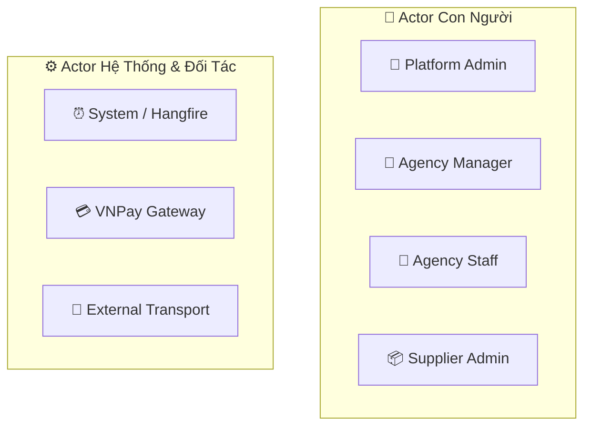
```mermaid
graph TB
    subgraph Human["👥 Actor Con Người"]
        PA["🔑 Platform Admin"]
        AM["🏢 Agency Manager"]
        AS["👤 Agency Staff"]
        SA["📦 Supplier Admin"]
    end

    subgraph System["⚙️ Actor Hệ Thống & Đối Tác"]
        SYS["⏰ System / Hangfire"]
        VNPAY["💳 VNPay Gateway"]
        EXT["🚌 External Transport"]
    end
```

| # | Actor | Loại | Mô tả |
|---|-------|------|-------|
| 1 | **Platform Admin** | Con người | Quản trị viên cấp cao nhất, toàn quyền quản lý hệ thống |
| 2 | **Agency Manager** | Con người | Chủ / Quản lý đại lý du lịch |
| 3 | **Agency Staff** | Con người | Nhân viên bán hàng tại đại lý |
| 4 | **Supplier Admin** | Con người | Quản trị viên nhà cung cấp dịch vụ (khách sạn, tour...) |
| 5 | **External Transport** | Bên ngoài | Đối tác vận chuyển (nhà xe Phương Trang, hãng bay) kết nối qua API |
| 6 | **System / Hangfire** | Hệ thống | Tác vụ nền chạy tự động (auto-cancel, đồng bộ đặt vé đối tác, nhắc KYC) |
| 7 | **VNPay Gateway** | Bên ngoài | Cổng thanh toán — gọi IPN callback khi nạp tiền thành công |

---

## 3. Chi Tiết Từng Actor & Chức Năng

---

### 3.1 🔑 Platform Admin

**Vai trò:** Quản trị viên toàn hệ thống. Phê duyệt đại lý, quản lý tài chính, cấu hình hệ thống, giải quyết khiếu nại.

**Chức năng:**

| # | Chức năng | Module | Mô tả |
|---|-----------|--------|-------|
| 1 | Duyệt KYC đại lý | KYC | Phê duyệt hoặc từ chối hồ sơ KYC của đại lý mới đăng ký |
| 2 | Đình chỉ đại lý | KYC | Đình chỉ hoạt động đại lý vi phạm chính sách |
| 3 | Xem danh sách đại lý | KYC | Xem toàn bộ đại lý, lọc theo trạng thái KYC |
| 4 | Nạp tiền ví đại lý | Wallet | Nạp tiền (Credit) vào ví đại lý sau khi xác nhận chuyển khoản |
| 5 | Trừ tiền ví đại lý | Wallet | Điều chỉnh thủ công số dư ví (kèm audit log) |
| 6 | Xem tất cả booking | Booking | Xem toàn bộ đơn đặt chỗ trên hệ thống |
| 7 | Quản lý kho dịch vụ | Inventory | Tạo/cập nhật/ngừng bán dịch vụ du lịch |
| 8 | Phát hành voucher | Voucher | Phát hành voucher/phiếu dịch vụ sau khi đơn PAID |
| 9 | Duyệt khiếu nại | Claim | Duyệt hoặc từ chối yêu cầu khiếu nại từ đại lý |
| 10 | Xem dashboard & báo cáo | Report | Dashboard tổng quan, báo cáo doanh thu, giao dịch ví |
| 11 | Xuất báo cáo | Report | Xuất dữ liệu giao dịch dạng Excel |
| 12 | Cấu hình hệ thống | Config | Thiết lập tham số (phí dịch vụ, thời gian hold, API đối tác) |

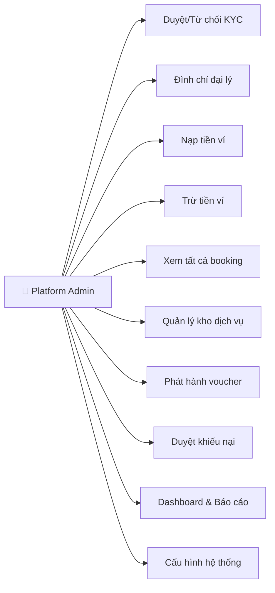
```mermaid
graph LR
    PA["🔑 Platform Admin"]

    PA --> UC_KYC["Duyệt/Từ chối KYC"]
    PA --> UC_SUSPEND["Đình chỉ đại lý"]
    PA --> UC_CREDIT["Nạp tiền ví"]
    PA --> UC_DEBIT["Trừ tiền ví"]
    PA --> UC_VIEW_BK["Xem tất cả booking"]
    PA --> UC_INV["Quản lý kho dịch vụ"]
    PA --> UC_VOUCHER["Phát hành voucher"]
    PA --> UC_CLAIM["Duyệt khiếu nại"]
    PA --> UC_REPORT["Dashboard & Báo cáo"]
    PA --> UC_CONFIG["Cấu hình hệ thống"]
```

---

### 3.2 🏢 Agency Manager

**Vai trò:** Chủ hoặc quản lý đại lý du lịch. Đăng ký đại lý, quản lý nhân viên, cấu hình markup, thực hiện giao dịch.

**Chức năng:**

| # | Chức năng | Module | Mô tả |
|---|-----------|--------|-------|
| 1 | Đăng ký đại lý mới | Onboard | Đăng ký đại lý vào hệ thống, nộp hồ sơ KYC |
| 2 | Tìm kiếm dịch vụ | Search | Tìm kiếm khách sạn, tour, vé (giá đã cộng markup) |
| 3 | Cấu hình markup | Search | Cập nhật tỷ lệ markup (phí dịch vụ) cho đại lý |
| 4 | Giữ chỗ (Hold) | Booking | Giữ chỗ tạm thời, nhận mã PNR, đếm ngược 15 phút |
| 5 | Thanh toán (Pay) | Booking | Thanh toán đơn hàng bằng ví đại lý → xuất voucher |
| 6 | Xem số dư ví | Wallet | Xem số dư khả dụng, hạn mức tín dụng công nợ |
| 7 | Nạp ví qua VNPay | Payment | Tạo URL thanh toán VNPay để nạp tiền vào ví |
| 8 | Tạo khiếu nại | Claim | Gửi yêu cầu hoàn tiền, hủy vé, giải quyết tranh chấp |
| 9 | Xem thông báo | Notification | Nhận và quản lý thông báo hệ thống |

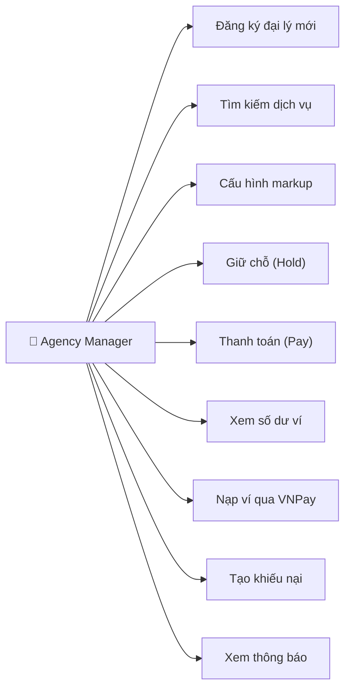
```mermaid
graph LR
    AM["🏢 Agency Manager"]

    AM --> UC_REG["Đăng ký đại lý mới"]
    AM --> UC_SEARCH["Tìm kiếm dịch vụ"]
    AM --> UC_MARKUP["Cấu hình markup"]
    AM --> UC_HOLD["Giữ chỗ (Hold)"]
    AM --> UC_PAY["Thanh toán (Pay)"]
    AM --> UC_BAL["Xem số dư ví"]
    AM --> UC_VNPAY["Nạp ví qua VNPay"]
    AM --> UC_CLAIM["Tạo khiếu nại"]
    AM --> UC_NOTI["Xem thông báo"]
```

**Phân biệt với Agency Staff:** Agency Manager có thêm quyền đăng ký đại lý và cập nhật cấu hình markup.

---

### 3.3 👤 Agency Staff

**Vai trò:** Nhân viên bán hàng tại đại lý. Thực hiện nghiệp vụ hàng ngày: tìm kiếm, đặt chỗ, thanh toán.

**Chức năng:**

| # | Chức năng | Module | Mô tả |
|---|-----------|--------|-------|
| 1 | Tìm kiếm dịch vụ | Search | Tìm kiếm dịch vụ du lịch (giá đã cộng markup) |
| 2 | Xem cấu hình markup | Search | Xem (chỉ đọc) tỷ lệ markup hiện tại |
| 3 | Giữ chỗ (Hold) | Booking | Giữ chỗ tạm, lock slot kho, đếm ngược 15 phút |
| 4 | Thanh toán (Pay) | Booking | Trừ ví đại lý để thanh toán đơn hàng |
| 5 | Xem số dư ví | Wallet | Xem số dư khả dụng (chỉ đọc) |
| 6 | Nạp ví qua VNPay | Payment | Tạo URL thanh toán VNPay nạp ví |
| 7 | Tạo khiếu nại | Claim | Gửi yêu cầu khiếu nại dịch vụ |
| 8 | Xem thông báo | Notification | Nhận thông báo hệ thống |

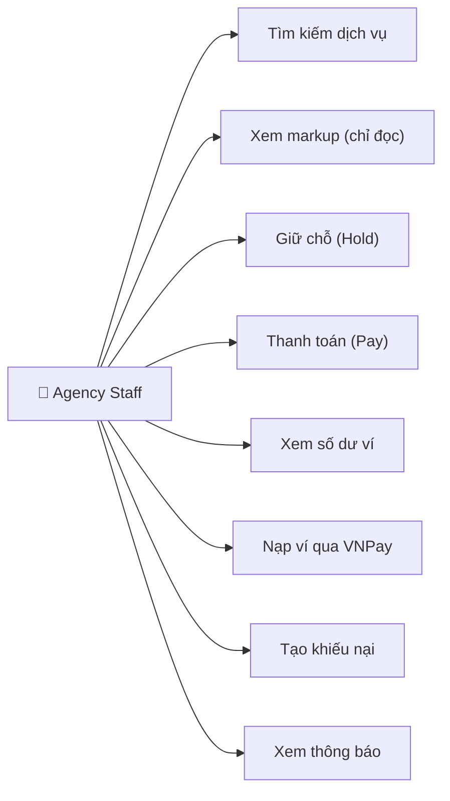
```mermaid
graph LR
    AS["👤 Agency Staff"]

    AS --> UC_SEARCH["Tìm kiếm dịch vụ"]
    AS --> UC_MARKUP_R["Xem markup (chỉ đọc)"]
    AS --> UC_HOLD["Giữ chỗ (Hold)"]
    AS --> UC_PAY["Thanh toán (Pay)"]
    AS --> UC_BAL["Xem số dư ví"]
    AS --> UC_VNPAY["Nạp ví qua VNPay"]
    AS --> UC_CLAIM["Tạo khiếu nại"]
    AS --> UC_NOTI["Xem thông báo"]
```

**Giới hạn so với Agency Manager:**
- ❌ Không được đăng ký đại lý mới
- ❌ Không được cập nhật cấu hình markup
- Chỉ hoạt động trong phạm vi đại lý mà mình thuộc về

---

### 3.4 📦 Supplier Admin

**Vai trò:** Quản trị viên nhà cung cấp dịch vụ du lịch. Quản lý kho dịch vụ, duyệt đơn đặt chỗ On-Request từ đại lý.

**Chức năng:**

| # | Chức năng | Module | Mô tả |
|---|-----------|--------|-------|
| 1 | Xem dashboard NCC | Supplier | Thống kê đơn hàng, doanh thu của nhà cung cấp |
| 2 | Xem đơn chờ duyệt | Supplier | Danh sách booking On-Request đang chờ xác nhận |
| 3 | Duyệt đơn đặt chỗ | Booking | Xác nhận đơn On-Request → chuyển CONFIRMED |
| 4 | Từ chối đơn đặt chỗ | Booking | Từ chối đơn → hoàn tiền tạm giữ cho đại lý |
| 5 | Xem dịch vụ | Inventory | Xem danh sách dịch vụ của NCC mình |
| 6 | Tạo dịch vụ mới | Inventory | Tạo tour, phòng khách sạn, vé mới |
| 7 | Cập nhật slot | Inventory | Cập nhật số lượng, giá slot theo ngày |
| 8 | Ngừng bán dịch vụ | Inventory | Dừng bán 1 dịch vụ |
| 9 | Xem thông báo | Notification | Nhận thông báo đơn mới, yêu cầu duyệt |

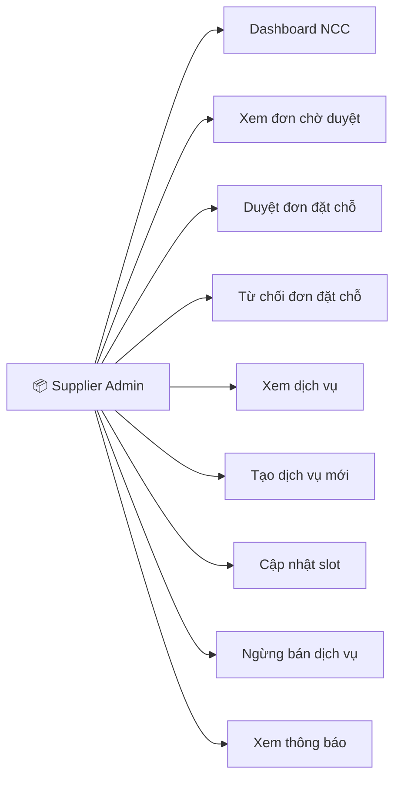
```mermaid
graph LR
    SA["📦 Supplier Admin"]

    SA --> UC_DASH["Dashboard NCC"]
    SA --> UC_PENDING["Xem đơn chờ duyệt"]
    SA --> UC_APPROVE["Duyệt đơn đặt chỗ"]
    SA --> UC_REJECT["Từ chối đơn đặt chỗ"]
    SA --> UC_LIST_SVC["Xem dịch vụ"]
    SA --> UC_CREATE_SVC["Tạo dịch vụ mới"]
    SA --> UC_SLOT["Cập nhật slot"]
    SA --> UC_STOP["Ngừng bán dịch vụ"]
    SA --> UC_NOTI["Xem thông báo"]
```

**Quy tắc nghiệp vụ quan trọng:**
- Duyệt đơn On-Request phải trong **3 tiếng** (hoặc trước 21:00 đêm hôm trước ngày đi)
- Thay đổi giá sỉ chỉ áp dụng cho booking mới (Price Freeze)
- Chỉ quản lý dịch vụ của nhà cung cấp mình

---

### 3.5 🚌 External Transport (Đối tác vận chuyển bên ngoài)

**Vai trò:** Đối tác vận chuyển ngoại vi (Nhà xe như Phương Trang, Hãng máy bay) kết nối qua API tích hợp.

**Chức năng:**

| # | Chức năng | Module | Mô tả |
|---|-----------|--------|-------|
| 1 | Nhận thông tin đặt chỗ | Voucher | Nhận dữ liệu đặt chỗ và thông tin khách hàng từ hệ thống qua API |
| 2 | Xác minh check-in | Voucher | Xác minh và làm thủ tục lên xe/lên máy bay cho khách hàng bằng vé điện tử/E-Voucher |

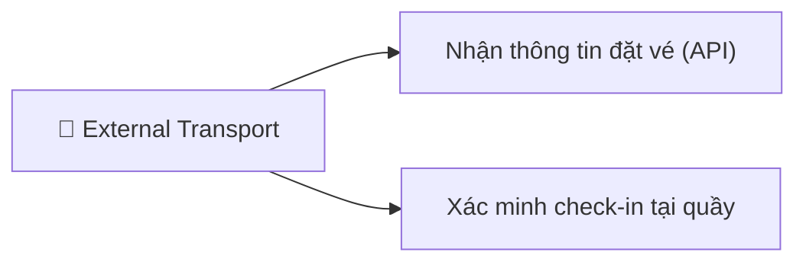
```mermaid
graph LR
    EXT["🚌 External Transport"]

    EXT --> UC_API["Nhận thông tin đặt vé (API)"]
    EXT --> UC_CI["Xác minh check-in tại quầy"]
```

**Đặc điểm vận hành đặc biệt:**
- Không sử dụng ứng dụng di động nội bộ của hệ thống; việc tương tác được tự động hóa qua API kết nối hệ thống bên thứ ba.
- Khách hàng tự chịu trách nhiệm và chi phí di chuyển từ nhà tới bến xe/nhà ga/sân bay.

---

### 3.6 ⏰ System / Hangfire (Tác vụ nền)

**Vai trò:** Actor phi con người. Thực hiện các tác vụ tự động chạy nền theo lịch hoặc sự kiện.

**Chức năng:**

| # | Tác vụ | Trigger | Mô tả |
|---|--------|---------|-------|
| 1 | Auto-cancel đơn HELD quá hạn | Mỗi phút | Hủy booking HELD sau 15 phút, hoàn slot kho |
| 2 | Auto-cancel On-Request quá hạn | Mỗi phút | Hủy đơn PENDING_SUPPLIER_APPROVAL quá 3 tiếng hoặc quá 21:00 |
| 3 | Đồng bộ đặt vé đối tác | Tức thời / Định kỳ | Gọi API chuyển thông tin đặt chỗ sang Nhà xe/Hãng bay |
| 4 | Nhắc KYC sắp hết hạn | Hàng ngày | Gửi thông báo 30 ngày trước ngày hết hạn KYC |
| 5 | Auto-suspend KYC quá hạn | Hàng ngày | Chuyển đại lý sang SUSPENDED nếu KYC hết hạn mà chưa gia hạn |

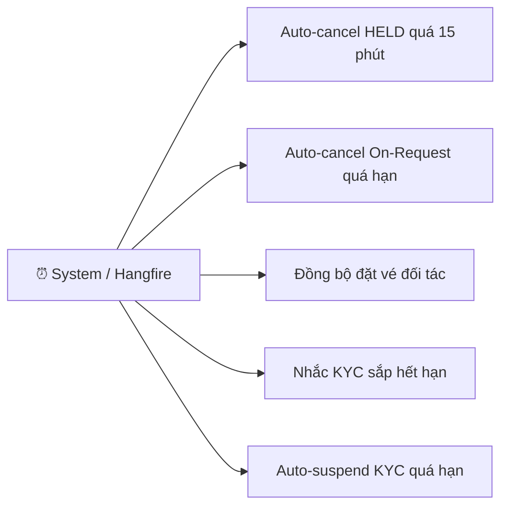
```mermaid
graph LR
    SYS["⏰ System / Hangfire"]

    SYS --> JOB1["Auto-cancel HELD quá 15 phút"]
    SYS --> JOB2["Auto-cancel On-Request quá hạn"]
    SYS --> JOB3["Đồng bộ đặt vé đối tác"]
    SYS --> JOB4["Nhắc KYC sắp hết hạn"]
    SYS --> JOB5["Auto-suspend KYC quá hạn"]
```

---

### 3.7 💳 VNPay Gateway (Bên ngoài)

**Vai trò:** Cổng thanh toán bên ngoài hệ thống. Gọi IPN callback khi giao dịch nạp ví hoàn tất.

**Chức năng:**

| # | Chức năng | Mô tả |
|---|-----------|-------|
| 1 | IPN Callback | Gửi kết quả thanh toán (thành công/thất bại) về endpoint hệ thống |

**Luồng hoạt động:**
1. Đại lý tạo URL thanh toán VNPay
2. Chuyển hướng sang trang thanh toán VNPay
3. Khách hoàn tất thanh toán
4. VNPay gọi IPN callback → hệ thống xác minh hash → nạp ví đại lý → ghi Wallet Ledger

---

## 4. Luồng Hoạt Động Tổng Thể Hệ Thống

### 4.1 Luồng chính: Tìm kiếm → Đặt chỗ → Thanh toán → Bàn giao

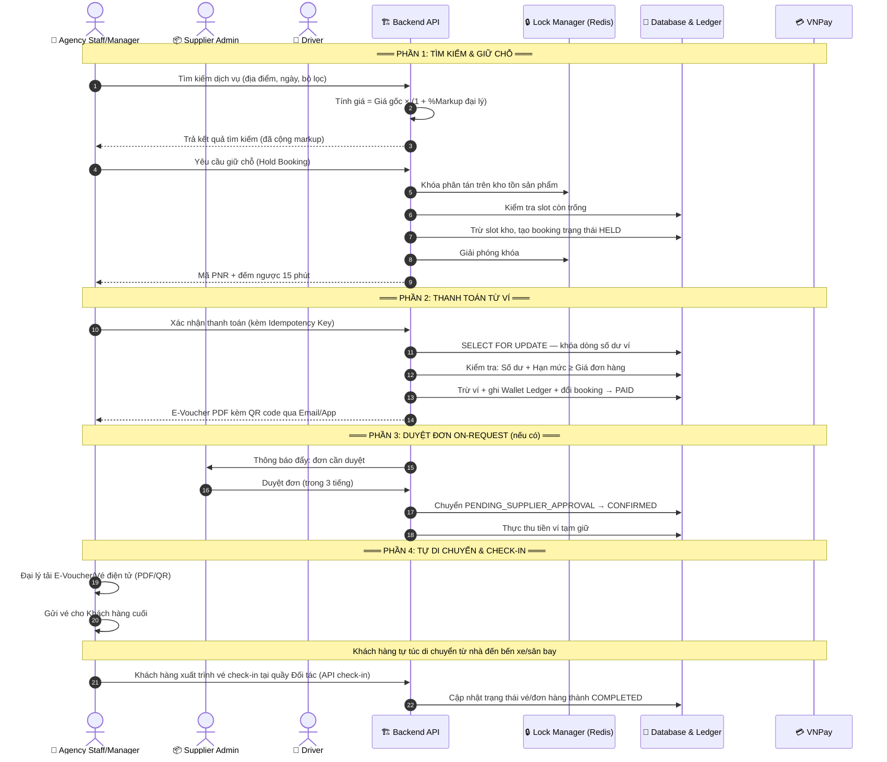
```mermaid
sequenceDiagram
    autonumber
    actor Staff as 👤 Agency Staff/Manager
    actor Supplier as 📦 Supplier Admin
    actor Driver as 🚗 Driver
    participant API as 🏗 Backend API
    participant Lock as 🔒 Lock Manager (Redis)
    participant DB as 💾 Database & Ledger
    participant VNPay as 💳 VNPay

    Note over Staff, VNPay: ═══ PHẦN 1: TÌM KIẾM & GIỮ CHỖ ═══

    Staff->>API: Tìm kiếm dịch vụ (địa điểm, ngày, bộ lọc)
    API->>API: Tính giá = Giá gốc × (1 + %Markup đại lý)
    API-->>Staff: Trả kết quả tìm kiếm (đã cộng markup)

    Staff->>API: Yêu cầu giữ chỗ (Hold Booking)
    API->>Lock: Khóa phân tán trên kho tồn sản phẩm
    API->>DB: Kiểm tra slot còn trống
    API->>DB: Trừ slot kho, tạo booking trạng thái HELD
    API->>Lock: Giải phóng khóa
    API-->>Staff: Mã PNR + đếm ngược 15 phút

    Note over Staff, VNPay: ═══ PHẦN 2: THANH TOÁN TỪ VÍ ═══

    Staff->>API: Xác nhận thanh toán (kèm Idempotency Key)
    API->>DB: SELECT FOR UPDATE — khóa dòng số dư ví
    API->>DB: Kiểm tra: Số dư + Hạn mức ≥ Giá đơn hàng
    API->>DB: Trừ ví + ghi Wallet Ledger + đổi booking → PAID
    API-->>Staff: E-Voucher PDF kèm QR code qua Email/App

    Note over Staff, VNPay: ═══ PHẦN 3: DUYỆT ĐƠN ON-REQUEST (nếu có) ═══

    API->>Supplier: Thông báo đẩy: đơn cần duyệt
    Supplier->>API: Duyệt đơn (trong 3 tiếng)
    API->>DB: Chuyển PENDING_SUPPLIER_APPROVAL → CONFIRMED
    API->>DB: Thực thu tiền ví tạm giữ

    Note over Staff, VNPay: ═══ PHẦN 4: TỰ DI CHUYỂN & CHECK-IN ═══

    Staff->>Staff: Đại lý tải E-Voucher/Vé điện tử (PDF/QR)
    Staff->>Staff: Gửi vé cho Khách hàng cuối
    Note over Staff, VNPay: Khách hàng tự túc di chuyển từ nhà đến bến xe/sân bay
    Staff->>API: Khách hàng xuất trình vé check-in tại quầy Đối tác (API check-in)
    API->>DB: Cập nhật trạng thái vé/đơn hàng thành COMPLETED
```

### 4.2 Luồng nạp ví qua VNPay

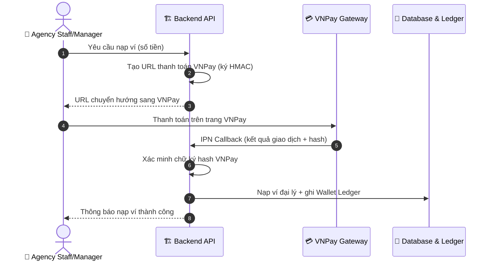
```mermaid
sequenceDiagram
    autonumber
    actor Staff as 👤 Agency Staff/Manager
    participant API as 🏗 Backend API
    participant VNPay as 💳 VNPay Gateway
    participant DB as 💾 Database & Ledger

    Staff->>API: Yêu cầu nạp ví (số tiền)
    API->>API: Tạo URL thanh toán VNPay (ký HMAC)
    API-->>Staff: URL chuyển hướng sang VNPay

    Staff->>VNPay: Thanh toán trên trang VNPay
    VNPay->>API: IPN Callback (kết quả giao dịch + hash)

    API->>API: Xác minh chữ ký hash VNPay
    API->>DB: Nạp ví đại lý + ghi Wallet Ledger
    API-->>Staff: Thông báo nạp ví thành công
```

### 4.3 Luồng KYC đại lý

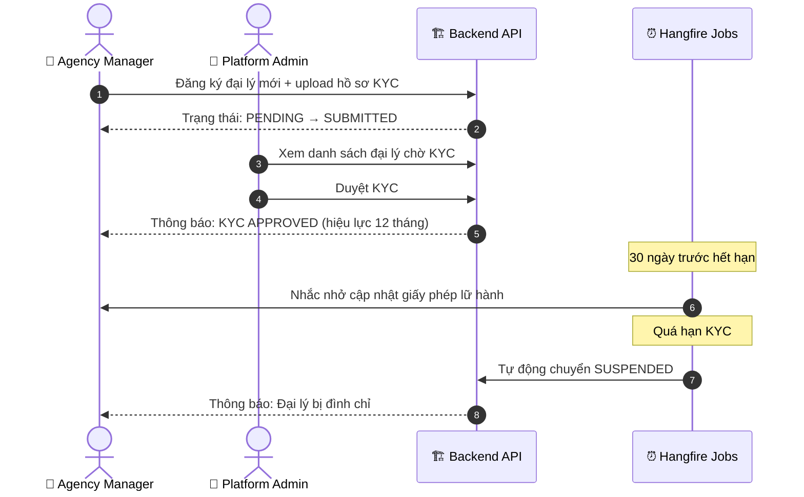
```mermaid
sequenceDiagram
    autonumber
    actor AM as 🏢 Agency Manager
    actor PA as 🔑 Platform Admin
    participant API as 🏗 Backend API
    participant Jobs as ⏰ Hangfire Jobs

    AM->>API: Đăng ký đại lý mới + upload hồ sơ KYC
    API-->>AM: Trạng thái: PENDING → SUBMITTED

    PA->>API: Xem danh sách đại lý chờ KYC
    PA->>API: Duyệt KYC
    API-->>AM: Thông báo: KYC APPROVED (hiệu lực 12 tháng)

    Note over Jobs: 30 ngày trước hết hạn
    Jobs->>AM: Nhắc nhở cập nhật giấy phép lữ hành

    Note over Jobs: Quá hạn KYC
    Jobs->>API: Tự động chuyển SUSPENDED
    API-->>AM: Thông báo: Đại lý bị đình chỉ
```

---

## 5. Sơ Đồ Use Case Tổng Hợp Theo Module

### 5.1 Module: Xác thực & Quản lý người dùng

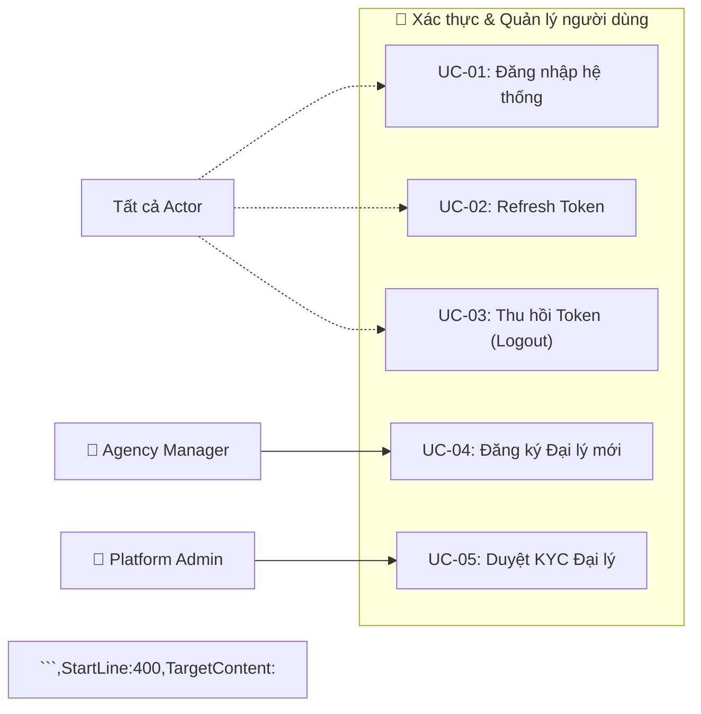
```mermaid
graph LR
    subgraph UC_Auth["🔐 Xác thực & Quản lý người dùng"]
        UC01["UC-01: Đăng nhập hệ thống"]
        UC02["UC-02: Refresh Token"]
        UC03["UC-03: Thu hồi Token (Logout)"]
        UC04["UC-04: Đăng ký Đại lý mới"]
        UC05["UC-05: Duyệt KYC Đại lý"]
    end

    ALL["Tất cả Actor"] -.-> UC01
    ALL -.-> UC02
    ALL -.-> UC03
    PA["🔑 Platform Admin"] --> UC05
    AM["🏢 Agency Manager"] --> UC04
```,StartLine:400,TargetContent:
```

### 5.2 Module: KYC & Quản lý Đại lý

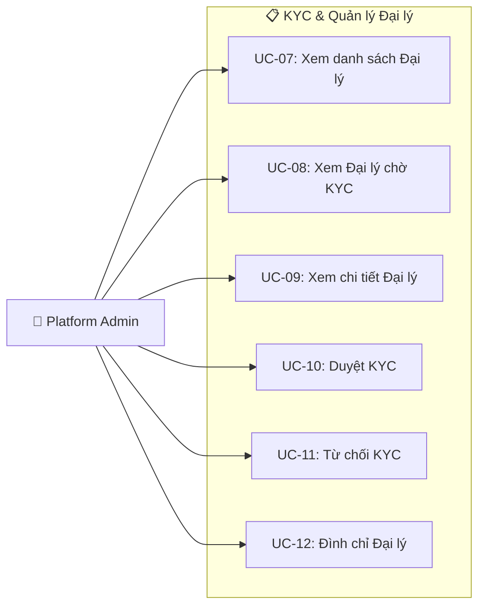
```mermaid
graph LR
    subgraph UC_KYC["📋 KYC & Quản lý Đại lý"]
        UC07["UC-07: Xem danh sách Đại lý"]
        UC08["UC-08: Xem Đại lý chờ KYC"]
        UC09["UC-09: Xem chi tiết Đại lý"]
        UC10["UC-10: Duyệt KYC"]
        UC11["UC-11: Từ chối KYC"]
        UC12["UC-12: Đình chỉ Đại lý"]
    end

    PA["🔑 Platform Admin"] --> UC07
    PA --> UC08
    PA --> UC09
    PA --> UC10
    PA --> UC11
    PA --> UC12
```

### 5.3 Module: Tìm kiếm & Markup

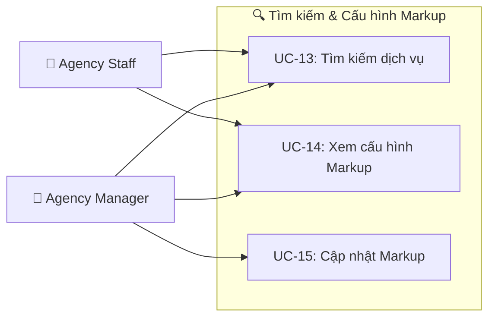
```mermaid
graph LR
    subgraph UC_Search["🔍 Tìm kiếm & Cấu hình Markup"]
        UC13["UC-13: Tìm kiếm dịch vụ"]
        UC14["UC-14: Xem cấu hình Markup"]
        UC15["UC-15: Cập nhật Markup"]
    end

    AS["👤 Agency Staff"] --> UC13
    AS --> UC14
    AM["🏢 Agency Manager"] --> UC13
    AM --> UC14
    AM --> UC15
```

### 5.4 Module: Đặt chỗ (Booking)

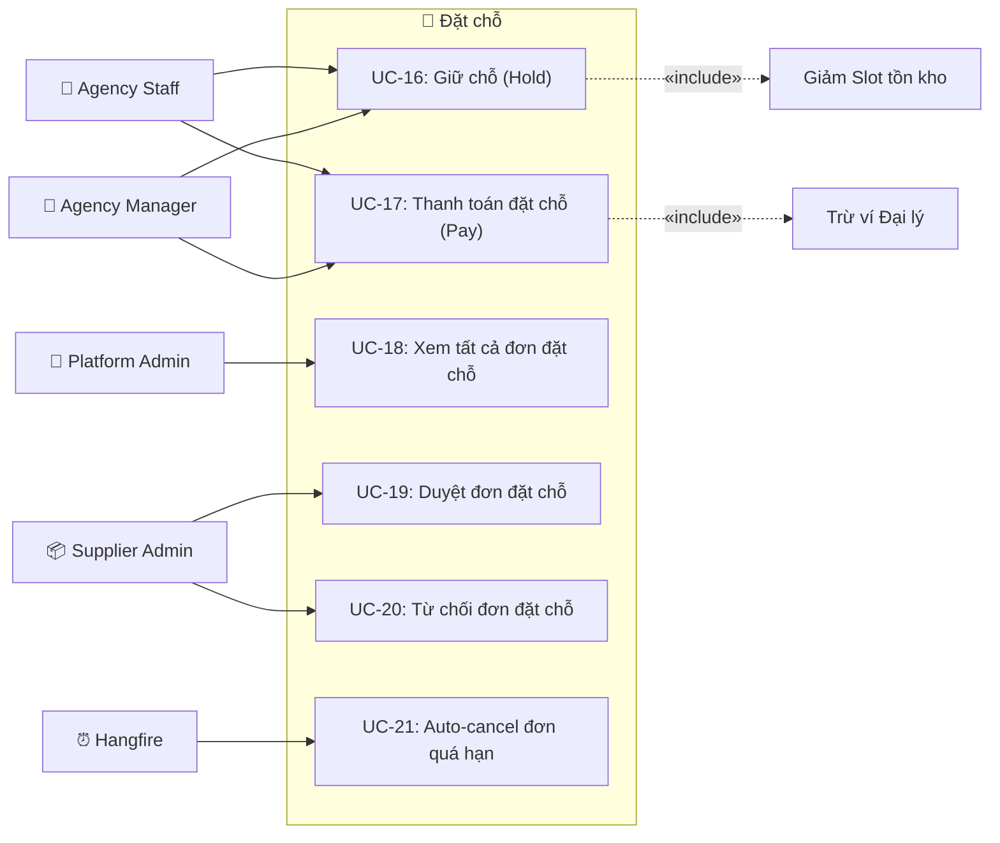
```mermaid
graph LR
    subgraph UC_Booking["📝 Đặt chỗ"]
        UC16["UC-16: Giữ chỗ (Hold)"]
        UC17["UC-17: Thanh toán đặt chỗ (Pay)"]
        UC18["UC-18: Xem tất cả đơn đặt chỗ"]
        UC19["UC-19: Duyệt đơn đặt chỗ"]
        UC20["UC-20: Từ chối đơn đặt chỗ"]
        UC21["UC-21: Auto-cancel đơn quá hạn"]
    end

    AS["👤 Agency Staff"] --> UC16
    AS --> UC17
    AM["🏢 Agency Manager"] --> UC16
    AM --> UC17
    PA["🔑 Platform Admin"] --> UC18
    SA["📦 Supplier Admin"] --> UC19
    SA --> UC20
    SYS["⏰ Hangfire"] --> UC21

    UC17 -.-> |"«include»"| PAY_DEBIT["Trừ ví Đại lý"]
    UC16 -.-> |"«include»"| SLOT_DEC["Giảm Slot tồn kho"]
```

### 5.5 Module: Ví tài chính (Wallet)

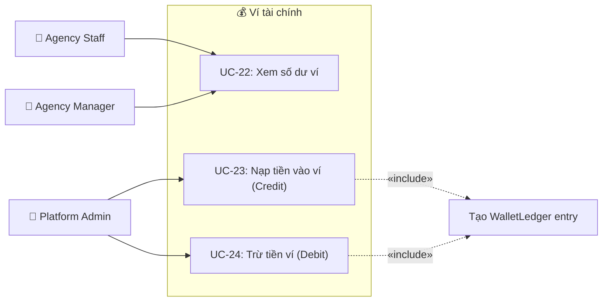
```mermaid
graph LR
    subgraph UC_Wallet["💰 Ví tài chính"]
        UC22["UC-22: Xem số dư ví"]
        UC23["UC-23: Nạp tiền vào ví (Credit)"]
        UC24["UC-24: Trừ tiền ví (Debit)"]
    end

    AS["👤 Agency Staff"] --> UC22
    AM["🏢 Agency Manager"] --> UC22
    PA["🔑 Platform Admin"] --> UC23
    PA --> UC24

    UC23 -.-> |"«include»"| LEDGER["Tạo WalletLedger entry"]
    UC24 -.-> |"«include»"| LEDGER
```

### 5.6 Module: Thanh toán VNPay

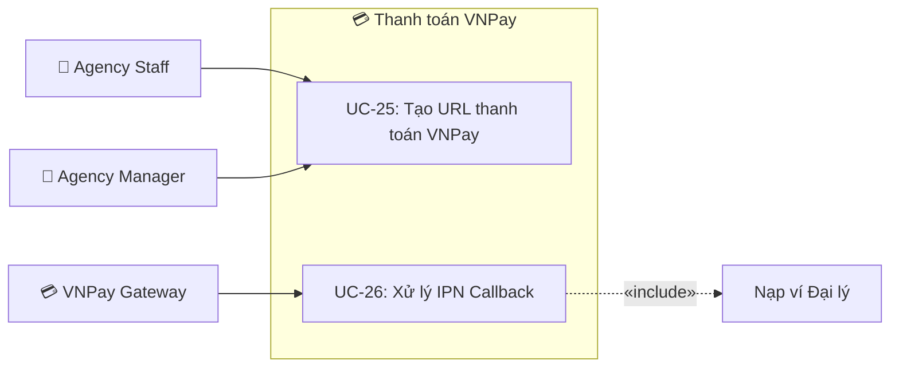
```mermaid
graph LR
    subgraph UC_Payment["💳 Thanh toán VNPay"]
        UC25["UC-25: Tạo URL thanh toán VNPay"]
        UC26["UC-26: Xử lý IPN Callback"]
    end

    AS["👤 Agency Staff"] --> UC25
    AM["🏢 Agency Manager"] --> UC25
    VNPAY["💳 VNPay Gateway"] --> UC26

    UC26 -.-> |"«include»"| CREDIT["Nạp ví Đại lý"]
```

### 5.7 Module: Kho dịch vụ (Inventory)

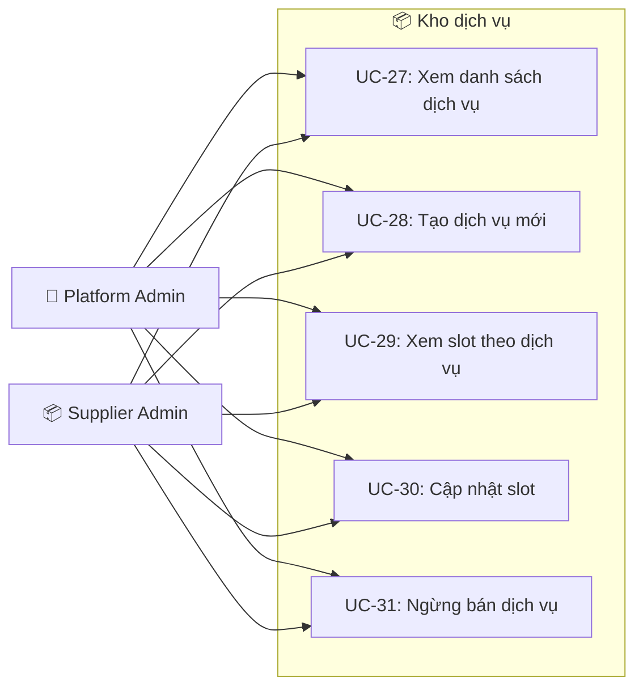
```mermaid
graph LR
    subgraph UC_Inventory["📦 Kho dịch vụ"]
        UC27["UC-27: Xem danh sách dịch vụ"]
        UC28["UC-28: Tạo dịch vụ mới"]
        UC29["UC-29: Xem slot theo dịch vụ"]
        UC30["UC-30: Cập nhật slot"]
        UC31["UC-31: Ngừng bán dịch vụ"]
    end

    PA["🔑 Platform Admin"] --> UC27
    PA --> UC28
    PA --> UC29
    PA --> UC30
    PA --> UC31
    SA["📦 Supplier Admin"] --> UC27
    SA --> UC28
    SA --> UC29
    SA --> UC30
    SA --> UC31
```

### 5.8 Module: Nhà cung cấp (Supplier Extranet)

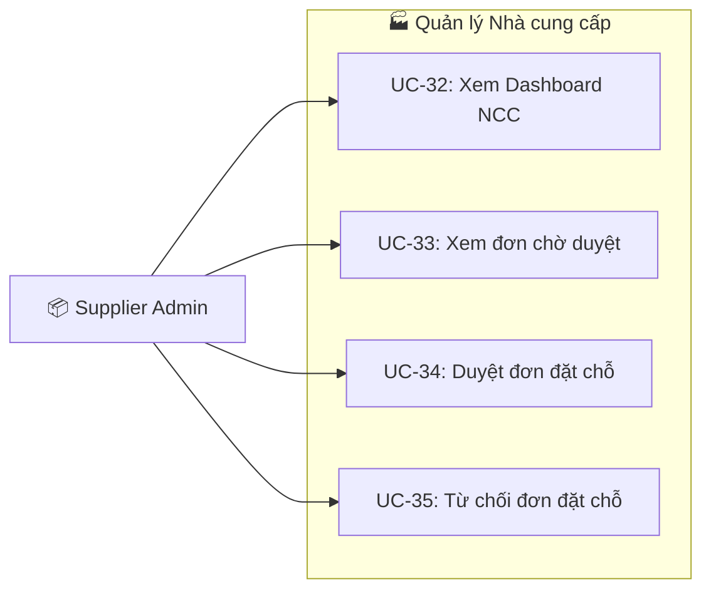
```mermaid
graph LR
    subgraph UC_Supplier["🏭 Quản lý Nhà cung cấp"]
        UC32["UC-32: Xem Dashboard NCC"]
        UC33["UC-33: Xem đơn chờ duyệt"]
        UC34["UC-34: Duyệt đơn đặt chỗ"]
        UC35["UC-35: Từ chối đơn đặt chỗ"]
    end

    SA["📦 Supplier Admin"] --> UC32
    SA --> UC33
    SA --> UC34
    SA --> UC35
```

### 5.9 Module: Voucher & Tích hợp vận chuyển

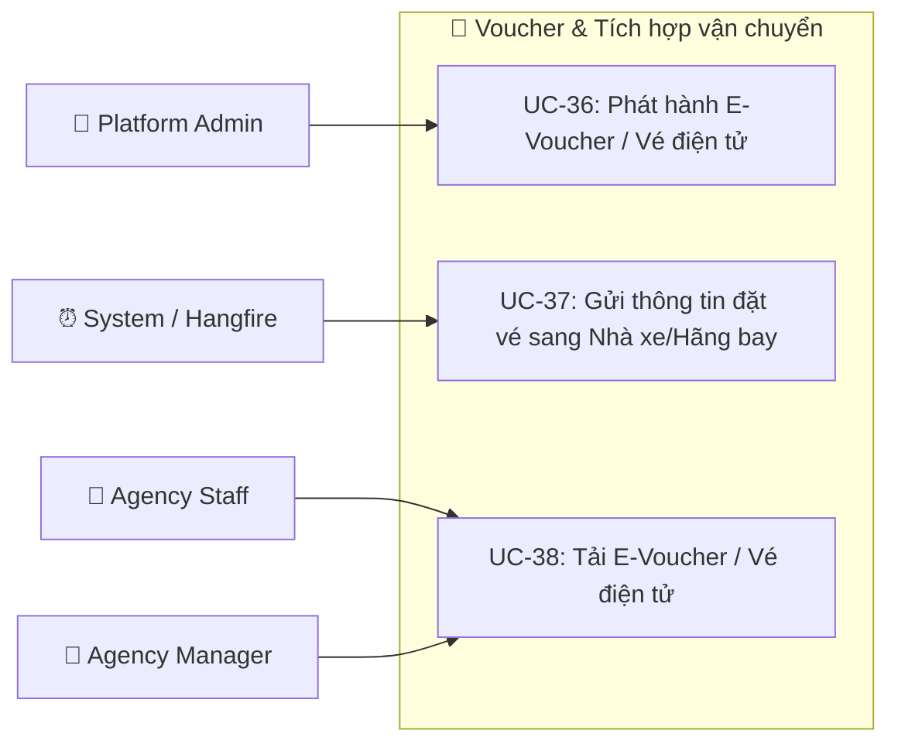
```mermaid
graph LR
    subgraph UC_Voucher["🎫 Voucher & Tích hợp vận chuyển"]
        UC36["UC-36: Phát hành E-Voucher / Vé điện tử"]
        UC37["UC-37: Gửi thông tin đặt vé sang Nhà xe/Hãng bay"]
        UC38["UC-38: Tải E-Voucher / Vé điện tử"]
    end

    PA["🔑 Platform Admin"] --> UC36
    SYS["⏰ System / Hangfire"] --> UC37
    AS["👤 Agency Staff"] --> UC38
    AM["🏢 Agency Manager"] --> UC38
```

### 5.10 Module: Khiếu nại (Claim)

```mermaid
graph LR
    subgraph UC_Claim["📢 Khiếu nại"]
        UC39["UC-39: Tạo khiếu nại"]
        UC40["UC-40: Xem chi tiết khiếu nại"]
        UC41["UC-41: Xem danh sách khiếu nại"]
        UC42["UC-42: Duyệt khiếu nại"]
        UC43["UC-43: Từ chối khiếu nại"]
    end

    AS["👤 Agency Staff"] --> UC39
    AS --> UC40
    AS --> UC41
    AM["🏢 Agency Manager"] --> UC39
    AM --> UC40
    AM --> UC41
    PA["🔑 Platform Admin"] --> UC42
    PA --> UC43
```

### 5.11 Module: Thông báo (Notification)

```mermaid
graph LR
    subgraph UC_Notify["🔔 Thông báo"]
        UC44["UC-44: Xem thông báo"]
        UC45["UC-45: Đánh dấu đã đọc"]
        UC46["UC-46: Đánh dấu tất cả đã đọc"]
    end

    ALL["Tất cả User đã đăng nhập"] --> UC44
    ALL --> UC45
    ALL --> UC46
```

### 5.12 Module: Báo cáo & Cấu hình hệ thống

```mermaid
graph LR
    subgraph UC_Report["📊 Báo cáo & Cấu hình"]
        UC47["UC-47: Xem Dashboard tổng quan"]
        UC48["UC-48: Xem báo cáo doanh thu"]
        UC49["UC-49: Xem giao dịch ví"]
        UC50["UC-50: Xuất báo cáo giao dịch"]
        UC51["UC-51: Xem cấu hình hệ thống"]
        UC52["UC-52: Cập nhật cấu hình hệ thống"]
    end

    PA["🔑 Platform Admin"] --> UC47
    PA --> UC48
    PA --> UC49
    PA --> UC50
    PA --> UC51
    PA --> UC52
```

---

## 6. Ma Trận Actor × Module

| Module | Platform Admin | Agency Manager | Agency Staff | Supplier Admin | External Transport | System | VNPay |
|--------|:---:|:---:|:---:|:---:|:---:|:---:|:---:|
| Auth (Đăng nhập/Token) | ✅ | ✅ | ✅ | ✅ | — | — | — |
| KYC (Quản lý đại lý) | ✅ Duyệt | 📝 Nộp | — | — | — | ⏰ Nhắc | — |
| Search (Tìm kiếm) | — | ✅ R/W | ✅ R | — | — | — | — |
| Booking (Đặt chỗ) | 👁 Xem all | ✅ Hold/Pay | ✅ Hold/Pay | ✅ Approve | — | ⏰ Cancel | — |
| Wallet (Ví) | ✅ Credit/Debit | 👁 View | 👁 View | — | — | — | — |
| Payment (VNPay) | — | ✅ | ✅ | — | — | — | 📩 IPN |
| Inventory (Kho) | ✅ | — | — | ✅ | — | — | — |
| Voucher & Vận chuyển | ✅ Issue | 👁 View (Tải) | 👁 View (Tải) | — | 🚌 (Nhận API) | ⏰ Đồng bộ | — |
| Claim (Khiếu nại) | ✅ Resolve | ✅ Create | ✅ Create | — | — | — | — |
| Report & Config | ✅ | — | — | — | — | — | — |
| Notification | ✅ | ✅ | ✅ | ✅ | — | — | — |

**Chú thích:** ✅ Toàn quyền · 👁 Chỉ xem · 📝 Tạo/Nộp · ⏰ Tự động · 🚌 Kết nối API · 📩 Callback · R/W Đọc-Ghi · R Chỉ đọc

---

## 7. Phân Quyền RBAC

```mermaid
graph TD
    subgraph Roles["🔐 Vai trò hệ thống"]
        R1["PLATFORM_ADMIN"]
        R2["AGENCY_MANAGER"]
        R3["AGENCY_STAFF"]
        R4["SUPPLIER_ADMIN"]
    end

    R1 -->|"Toàn quyền"| ALL["Tất cả 14 Module"]
    R2 -->|"Quản lý đại lý"| AGM["Auth, Search (R/W), Booking, Wallet (R), Payment, Claim, Notification"]
    R3 -->|"Bán hàng"| AGS["Search (R), Booking, Wallet (R), Payment, Claim, Notification"]
    R4 -->|"Quản lý NCC"| SUP["Inventory, Booking (Approve), Supplier Portal, Notification"]
```

### Quy tắc phân quyền
1. **Mỗi User chỉ có 1 Role** — không hỗ trợ đa vai trò
2. **Agency Staff thuộc về 1 Agency** — chỉ truy cập dữ liệu đại lý mình
3. **Supplier Admin thuộc về 1 Supplier** — chỉ quản lý NCC mình
4. **Platform Admin** — không bị giới hạn phạm vi dữ liệu

---

## 📌 Ghi Chú Tài Liệu

- **Đường nét liền (→)**: Actor trực tiếp sử dụng Use Case
- **Đường nét đứt (-.->)**: Tất cả Actor đều có quyền / Use Case «include»
- **System / Hangfire**: Tác vụ tự động chạy nền (auto-cancel, đồng bộ vé đối tác, nhắc KYC)
- **VNPay Gateway**: Actor ngoài hệ thống — chỉ gọi IPN callback
- Tài liệu này được tổng hợp từ SRS và Use Case Diagram gốc của dự án
