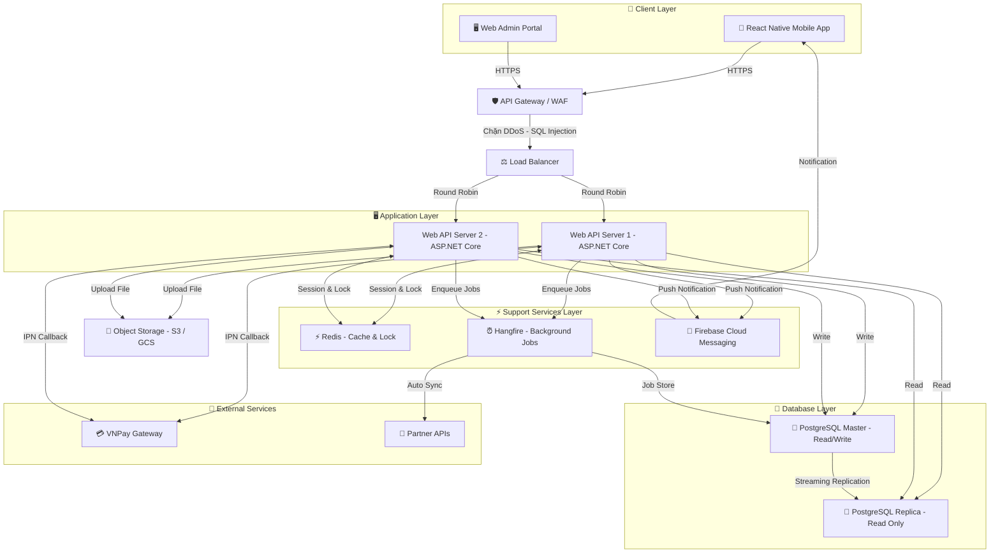

# 🖥️ Thiết Kế Kiến Trúc Phần Cứng Dự Án — B2B Travel Platform

> Tài liệu này mô tả toàn bộ mô hình triển khai hạ tầng phần cứng (Hardware Deployment Architecture) phục vụ cho việc vận hành sàn du lịch B2B Travel Platform, bao gồm: sơ đồ triển khai vật lý, cấu hình phần cứng chi tiết, phương án phòng tránh lỗi hệ thống và đề xuất mô hình triển khai thực tế.

---

## 🗺️ 1. Sơ Đồ Triển Khai Vật Lý (Deployment Diagram)

Sơ đồ bên dưới mô tả đầy đủ luồng đi của request từ người dùng cuối (Mobile App / Web Portal) qua các tầng bảo vệ, xử lý nghiệp vụ, lưu trữ dữ liệu cho đến kết nối với hệ thống đối tác bên ngoài:



---

## 🎛️ 2. Cấu Hình Phần Cứng Chi Tiết

Bảng dưới đây liệt kê đầy đủ các thành phần hạ tầng cần thiết để vận hành hệ thống B2B Travel Platform, kèm thông số kỹ thuật đề xuất cho môi trường Production:

| # | Thành Phần Hạ Tầng | Số Lượng | Thông Số Kỹ Thuật | Vai Trò Trong Hệ Thống |
| :---: | :--- | :---: | :--- | :--- |
| 1 | **API Gateway / WAF (Cloudflare)** | 01 | Dịch vụ SaaS (Gói Free/Pro) | Chặn DDoS, brute-force, SQL Injection. Cấp chứng chỉ SSL/TLS miễn phí. |
| 2 | **Load Balancer (Nginx)** | 01 | 2 vCPU, 1 GB RAM | Phân phối tải đều giữa các Web API Server bằng thuật toán Round Robin. |
| 3 | **Web API Server** | 02 | 2 vCPU, 8 GB RAM mỗi server | Chạy ứng dụng ASP.NET Core (Stateless). Xử lý toàn bộ logic nghiệp vụ. |
| 4 | **Redis Server** | 01 | 1 GB RAM (In-memory) | Cache dữ liệu tần suất cao, quản lý Distributed Lock chống Race Condition, lưu Idempotent Key chống trùng Webhook. |
| 5 | **Hangfire Worker** | 01 | 2 vCPU, 4 GB RAM | Xử lý tác vụ nền: tự động hủy đơn quá hạn, gọi API đối tác, gửi Push Notification. |
| 6 | **PostgreSQL Master** | 01 | 2 vCPU, 8 GB RAM, SSD 50 GB | CSDL chính xử lý ghi (INSERT/UPDATE/DELETE) cho dữ liệu tài chính, ví, đơn hàng. |
| 7 | **PostgreSQL Replica** | 01 | 2 vCPU, 8 GB RAM, SSD 50 GB | Bản sao đồng bộ liên tục từ Master phục vụ đọc (SELECT) cho tìm kiếm, báo cáo. |
| 8 | **Object Storage (S3 / GCS)** | 01 | 10 GB khởi điểm, tự mở rộng | Lưu trữ file nhị phân: ảnh CCCD/Giấy phép KYC, file PDF Voucher/Vé điện tử. |
| 9 | **Firebase Cloud Messaging** | 01 | Dịch vụ SaaS (Miễn phí) | Gửi Push Notification tức thì đến điện thoại đại lý (đơn sắp hết hạn, nạp tiền thành công). |
| 10 | **Monitoring (Cloud Monitoring)** | 01 | Dịch vụ SaaS | Giám sát CPU/RAM/Disk/Network 24/7. Gửi cảnh báo qua Email/Telegram khi server quá tải hoặc sập. |

---

## 🛡️ 3. Phương Án Phòng Tránh Lỗi Hệ Thống Kinh Điển

Hệ thống phần cứng được thiết kế để giải quyết triệt để 4 lỗi kỹ thuật nghiêm trọng nhất trong vận hành sàn du lịch B2B:

### Lỗi 1: Tranh chấp giữ chỗ (Race Condition / Overbooking)
*   **Kịch bản lỗi:** 2 đại lý cùng đặt chỗ 1 chiếc vé xe cuối cùng tại cùng 1 mili-giây. Nếu Database xử lý chậm, cả 2 đơn đều được chấp nhận nhưng nhà xe chỉ còn 1 chỗ thực tế.
*   **Giải pháp bằng hạ tầng:**
    *   Tích hợp **Redis Server làm Lock Manager (Quản lý khóa phân tán tập trung)**.
    *   Khi có request đặt giữ chỗ, Web API bắt buộc phải xin cấp khóa duy nhất (ví dụ: `lock:slot:chuyen_xe_102`) lên Redis trước khi kiểm tra kho tồn. Do Redis xử lý lệnh đơn luồng (Single-thread) trên bộ nhớ RAM siêu tốc (< 1ms), nó đảm bảo chỉ cấp khóa cho duy nhất 1 request, request thứ hai sẽ bị từ chối cấp khóa ngay lập tức.
    *   Kết hợp thêm **Optimistic Concurrency Control (OCC)** tại tầng Database bằng cột `version` trên bảng tồn kho, đảm bảo an toàn 2 lớp.

### Lỗi 2: Trùng lặp giao dịch tài chính (Double-Spending / Webhook Retry)
*   **Kịch bản lỗi:** VNPay gọi IPN Webhook báo nạp tiền thành công. Do mạng chập chờn, VNPay tự động gọi lại 2-3 lần liên tiếp, dẫn đến đại lý được cộng tiền gấp đôi/gấp ba.
*   **Giải pháp bằng hạ tầng:**
    *   Sử dụng cơ chế **Idempotent Webhook Receiver** kết hợp **Redis Cache**.
    *   Mỗi giao dịch nạp tiền có một mã Transaction ID duy nhất. Khi Web API nhận IPN từ VNPay, nó lập tức kiểm tra mã này trong Redis Cache. Nếu chưa tồn tại thì xử lý và lưu mã vào Redis với TTL = 5 phút. Nếu VNPay gửi lại request trùng ID, hệ thống sẽ bỏ qua và trả về kết quả thành công mà không cộng tiền lần 2.

### Lỗi 3: Sập hệ thống khi API Đối Tác bị chậm/chết (Cascading Failure)
*   **Kịch bản lỗi:** Web API gọi API Phương Trang để xuất vé nhưng đối tác đang bảo trì. Nhiều luồng xử lý cùng đứng chờ 30 giây (Timeout) làm cạn kiệt Connection Pool, khiến toàn bộ sàn B2B bị nghẽn sập.
*   **Giải pháp bằng hạ tầng:**
    *   Tách biệt hoàn toàn tác vụ gọi API đối tác sang **Hangfire Background Server** chạy trên tiến trình riêng biệt.
    *   Khi thanh toán thành công, Web API chỉ cập nhật trạng thái đơn là `PAID` và đẩy một Background Job vào hàng đợi. Web API phản hồi đại lý ngay trong dưới 1 giây.
    *   Hangfire Worker tự lấy Job ra và gọi API đối tác. Nếu đối tác sập, Hangfire tự động thử lại (**Retry Policy với Exponential Backoff**: thử sau 1 phút → 5 phút → 15 phút → 1 giờ) mà không ảnh hưởng đến bất kỳ luồng xử lý chính nào.

### Lỗi 4: Tấn công từ bên ngoài (DDoS, Brute-force, Injection)
*   **Kịch bản lỗi:** Kẻ tấn công gửi hàng triệu request giả mạo vào API đăng nhập, hoặc chèn mã SQL độc hại vào ô tìm kiếm để đánh cắp dữ liệu tài chính của đại lý.
*   **Giải pháp bằng hạ tầng:**
    *   Đặt lớp **Cloudflare WAF (Web Application Firewall)** ở tuyến đầu tiên trước cả Load Balancer. Cloudflare tự động phát hiện và chặn:
        *   **DDoS attack**: Giới hạn số request/giây từ mỗi IP (Rate Limiting).
        *   **SQL Injection & XSS**: Phân tích pattern request và chặn các payload độc hại trước khi chúng chạm đến Web API Server.
        *   **Brute-force login**: Hiển thị CAPTCHA sau 5 lần đăng nhập sai liên tiếp.
    *   Toàn bộ traffic từ Client đến Load Balancer được mã hóa **TLS 1.3** (HTTPS) do Cloudflare cấp chứng chỉ SSL miễn phí.

---

## ☁️ 4. Đề Xuất Mô Hình Triển Khai Thực Tế

Dự án đề xuất sử dụng mô hình **Docker Compose** triển khai trên VPS Cloud để đảm bảo tính đơn giản, dễ demo và tiết kiệm chi phí cho đồ án tốt nghiệp:

### Phương án A: Docker Compose trên VPS Cloud (Đề xuất cho đồ án)

Đóng gói toàn bộ hệ thống thành các Docker Container được quản lý bởi 1 file `docker-compose.yml` duy nhất:

```text
┌─────────────────────────────────────────────────────────┐
│                VPS Cloud (8 vCPU, 16 GB RAM)            │
│                                                         │
│  ┌──────────┐  ┌──────────┐  ┌──────────┐              │
│  │  Nginx   │  │  API #1  │  │  API #2  │              │
│  │  (LB)    │→ │  (.NET)  │  │  (.NET)  │              │
│  └──────────┘  └──────────┘  └──────────┘              │
│                                                         │
│  ┌──────────┐  ┌──────────┐  ┌──────────────────────┐  │
│  │  Redis   │  │ Hangfire │  │  PostgreSQL (Master)  │  │
│  │  (Cache) │  │ (Worker) │  │  + Replica (Read)     │  │
│  └──────────┘  └──────────┘  └──────────────────────┘  │
└─────────────────────────────────────────────────────────┘
         ↑                              ↑
    Cloudflare                   Cloud Storage
    (WAF + SSL)                  (S3 / GCS)
```

*   **Ưu điểm:** Chỉ cần 1 lệnh `docker-compose up -d` để khởi động toàn bộ hệ thống. Dễ demo trước hội đồng. Chi phí thấp (khoảng 500.000 - 1.000.000 VNĐ/tháng cho 1 VPS).
*   **Dịch vụ bên ngoài (SaaS miễn phí):** Cloudflare Free (WAF + SSL), Firebase Cloud Messaging Free (Push Notification), Cloudinary hoặc S3 Free Tier (Object Storage).

### Phương án B: Google Cloud Run (Serverless — nâng cao, dành cho Production thực tế)

Nếu hệ thống phát triển lên quy mô sản xuất với hàng trăm đại lý sử dụng đồng thời, có thể nâng cấp lên:
*   **Google Cloud Run:** Triển khai Docker Image của ASP.NET Core, tự động co giãn từ 0 đến N container theo lượng tải (Auto-scaling). Chỉ tính tiền khi có request thực tế.
*   **Google Cloud SQL:** PostgreSQL được quản trị hoàn toàn (Auto-backup hàng ngày, Auto-failover khi Master sập chỉ trong 30 giây).
*   **Google Memorystore:** Redis được quản trị, đảm bảo tính sẵn sàng cao 99.9%.

---

## 📊 5. Tổng Kết Công Nghệ Hạ Tầng

| Tầng Hệ Thống | Công Nghệ Sử Dụng | Mục Đích |
| :--- | :--- | :--- |
| **Client (Frontend)** | React Native (Mobile App), React/Next.js (Web Admin) | Giao diện đặt chỗ cho đại lý (App) và quản trị sàn (Web). |
| **Security Gateway** | Cloudflare WAF + SSL/TLS 1.3 | Chặn DDoS, Injection, cấp HTTPS miễn phí. |
| **Load Balancer** | Nginx (Reverse Proxy) | Phân phối tải đều vào cụm Web API Server. |
| **Application** | ASP.NET Core 8 (Stateless, Docker Container) | Xử lý logic nghiệp vụ: Booking, Wallet, KYC, Claims. |
| **Cache & Lock** | Redis 7 (In-memory) | Cache dữ liệu, Distributed Lock, Idempotent Key. |
| **Background Jobs** | Hangfire (Worker Service) | Tự động hủy đơn quá hạn, gọi API đối tác, gửi Push. |
| **Push Notification** | Firebase Cloud Messaging (FCM) | Gửi thông báo đẩy tức thì về điện thoại đại lý. |
| **Database** | PostgreSQL 16 (Master-Replica Replication) | Lưu trữ chính: tách biệt đọc/ghi để tối ưu hiệu năng. |
| **File Storage** | AWS S3 / Google Cloud Storage | Lưu ảnh KYC, file PDF Voucher/Vé điện tử. |
| **Monitoring** | Google Cloud Monitoring / Grafana | Giám sát CPU/RAM/Disk 24/7, cảnh báo qua Telegram. |
| **Container Runtime** | Docker + Docker Compose | Đóng gói và triển khai toàn bộ hệ thống bằng 1 lệnh. |
