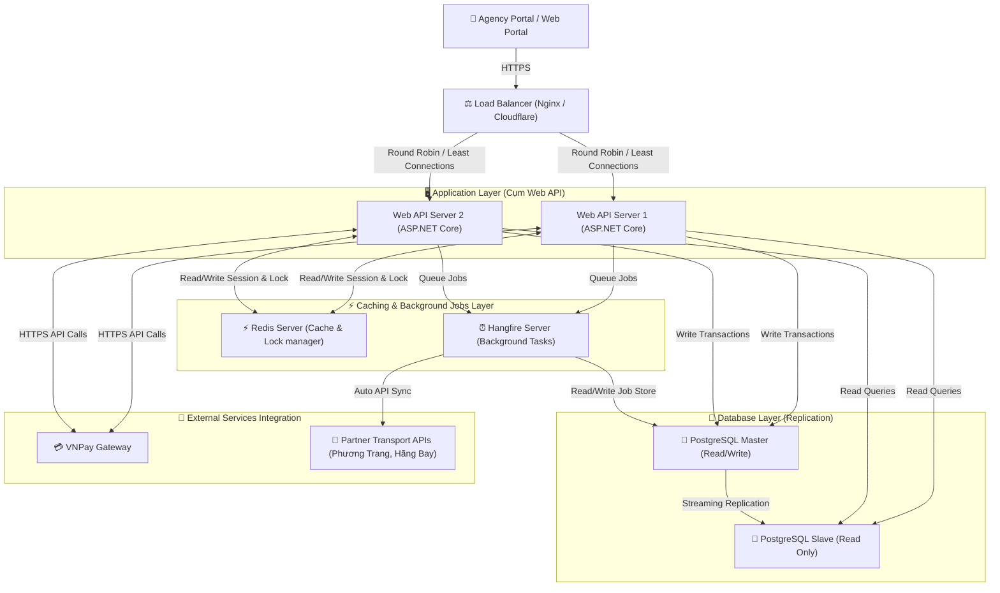

# 🖥️ Thiết Kế Kiến Trúc Phần Cứng Dự Án — B2B Travel Platform

> Tài liệu này mô tả mô hình triển khai hạ tầng vật lý / điện toán đám mây (Cloud Infrastructure Deployment) phục vụ cho việc vận hành sàn du lịch B2B B2B Travel Platform.

---

## 🗺️ 1. Sơ Đồ Triển Khai Vật Lý (Deployment Diagram)

Dưới đây là sơ đồ Mermaid mô tả mô hình kiến trúc hạ tầng phần cứng gồm Load Balancer, các cụm máy chủ ứng dụng Web API, máy chủ Database và các dịch vụ bổ trợ:

---

## 🎛️ 2. Cấu Hình Phần Cứng Chi Tiết (Đề Xuất Dự Kiến)

Để dự án được duyệt tốt trước hội đồng, chúng ta cần đưa ra thông số cấu hình phần cứng cụ thể (cho môi trường Staging/Production trên Google Cloud Platform - GCP hoặc AWS):

| Cụm Máy Chủ / Thiết Bị | Số Lượng | Thông Số Kỹ Thuật Đề Xuất (Spec) | Vai Trò |
| :--- | :--- | :--- | :--- |
| **Load Balancer (Nginx)** | 01 | e2-micro (2 vCPU, 1 GB RAM) | Nhận request, mã hóa SSL/TLS, phân phối tải. |
| **Web API Servers** | 02 | e2-standard-2 (2 vCPU, 8 GB RAM) | Chạy ứng dụng ASP.NET Core, xử lý logic nghiệp vụ. |
| **Redis Cache Server** | 01 | Cloud Memorystore (1 GB RAM Core) | Quản lý cache dữ liệu và thực thi khóa phân tán (Distributed Lock). |
| **Database Server (Master)** | 01 | db-custom-2-7680 (2 vCPU, 7.5 GB RAM, SSD 50GB) | Lưu trữ chính CSDL PostgreSQL (Tài chính, Ví, Booking). |
| **Database Server (Replica)** | 01 | db-custom-2-7680 (2 vCPU, 7.5 GB RAM, SSD 50GB) | Đồng bộ dữ liệu để phục vụ đọc báo cáo, backup giảm tải cho Master. |

---

## 🛡️ 3. Phương Án Phòng Tránh Lỗi Hệ Thống Kinh Điển Bằng Hạ Tầng

Để dự án hoạt động ổn định 24/7 và đạt điểm tối đa trước Hội đồng tốt nghiệp, hệ thống phần cứng được thiết kế để giải quyết triệt để 3 lỗi kỹ thuật nghiêm trọng sau:

### Lỗi 1: Tranh chấp giữ chỗ (Race Condition / Overbooking)
*   **Vấn đề:** 2 đại lý cùng đặt chỗ 1 chiếc vé xe cuối cùng tại cùng 1 mili-giây. Nếu Database xử lý chậm, cả 2 đơn đều báo đặt thành công nhưng thực tế nhà xe chỉ còn 1 chỗ.
*   **Giải pháp hạ tầng:** 
    *   Tích hợp **Redis Server làm máy quản lý khóa tập trung (Lock Manager)**.
    *   Khi có request đặt giữ chỗ, Web API bắt buộc phải gửi yêu cầu xin cấp khóa duy nhất (ví dụ: `lock:slot:chuyen_xe_102`) lên Redis. Do Redis chạy đơn luồng (Single-thread) trên bộ nhớ RAM siêu tốc, nó đảm bảo chỉ cấp khóa thành công cho duy nhất 1 đại lý, đại lý thứ hai sẽ bị từ chối cấp khóa ngay lập tức và đưa vào hàng đợi thử lại. Điều này giúp ngăn chặn 100% hiện tượng Overbooking.

### Lỗi 2: Trùng lặp giao dịch ví tài chính (Double-Spending / Webhook Retry)
*   **Vấn đề:** Cổng thanh toán VNPay gọi Webhook (IPN Callback) báo khách hàng nạp tiền thành công. Do mạng chập chờn, VNPay tự động gọi lại IPN Webhook 2-3 lần liên tiếp, dẫn đến tài khoản đại lý được cộng tiền gấp đôi/gấp ba.
*   **Giải pháp hạ tầng:**
    *   Sử dụng cơ chế **Idempotent Webhook Receiver** kết hợp Redis Cache.
    *   Mỗi giao dịch nạp tiền có một mã ID duy nhất. Khi Web API nhận request từ VNPay, nó lập tức kiểm tra và lưu mã ID này vào Redis Cache với thời gian sống (TTL) là 5 phút. Nếu VNPay gửi lại request trùng ID trong 5 phút đó, hệ thống sẽ chặn và trả về kết quả thành công ngay mà không thực hiện trừ/nạp ví lần 2.

### Lỗi 3: Nghẽn và sập hệ thống khi API Đối Tác (Phương Trang / Hãng Bay) bị chậm/chết
*   **Vấn đề:** Khi đại lý thanh toán, Web API của ta phải gọi API sang đối tác Phương Trang để xuất vé. Nếu hệ thống đối tác bị lỗi/chậm, Web API của ta sẽ phải giữ kết nối chờ đợi (Timeout thường là 30s). Nhiều luồng xử lý cùng chờ sẽ làm cạn kiệt Connection Pool của máy chủ Web API, khiến toàn bộ sàn B2B bị sập (Crash).
*   **Giải pháp hạ tầng:**
    *   Tách biệt tác vụ gọi API bên ngoài bằng **Hangfire Background Server (Worker Service)**.
    *   Khi thanh toán thành công, Web API chỉ cập nhật trạng thái đơn là `PAID`, đẩy một Job đặt vé vào Database Store và phản hồi ngay cho đại lý là "Đang xuất vé" (Dưới 1 giây).
    *   Hangfire Server chạy ngầm trên một tiến trình riêng biệt sẽ lấy Job ra và gọi API đối tác Phương Trang. Nếu đối tác sập, Hangfire tự động áp dụng chính sách thử lại (**Retry Policy với Exponential Backoff** - ví dụ thử lại sau 1 phút, 5 phút, 15 phút) mà hoàn toàn không ảnh hưởng đến luồng đặt chỗ chính của đại lý khác.

---

## ☁️ 4. Đề Xuất Mô Hình Triển Khai Thực Tế: Cloud Managed Services

Để tối ưu hóa chi phí vận hành và không cần nhân sự vận hành hạ tầng chuyên trách (DevOps), dự án đề xuất sử dụng mô hình hạ tầng **Cloud Managed Services** trên nền tảng **Google Cloud Platform (GCP)** hoặc **Amazon Web Services (AWS)**:

1.  **Web API Layer (ASP.NET Core):** Đóng gói ứng dụng thành Docker Image và triển khai trên **Google Kubernetes Engine (GKE)** hoặc **AWS ECS (Fargate)** để tự động co giãn số lượng máy chủ (Auto-scaling) theo lượng tải thực tế của mùa du lịch.
2.  **Database Layer (PostgreSQL):** Sử dụng **Google Cloud SQL** hoặc **Amazon RDS (PostgreSQL)** được bật tính năng **Multi-AZ Deployment**. Cơ sở dữ liệu sẽ tự động sao lưu hàng ngày (Auto-backup), tự động cấu hình Replication (Master-Replica) và tự động chuyển vùng khi server Master bị lỗi (Auto-Failover) chỉ trong 30 giây.
3.  **Job & Cache Layer:** Sử dụng **GCP Memorystore** (cho Redis) để bảo đảm Redis luôn hoạt động với băng thông và RAM mở rộng không giới hạn.

---

## 🛠️ Bước Tiếp Theo (Tôi và bạn cùng làm)

Để hoàn thiện tài liệu này, chúng ta cần thảo luận các nội dung sau:
1. **Mô hình triển khai:** Chúng ta nên chọn hạ tầng On-Premises (tự dựng Server vật lý) hay hạ tầng Cloud (AWS / Azure / Google Cloud) làm hướng thuyết minh?
2. **Chi phí vận hành hạ tầng dự kiến:** Có cần thêm bảng dự toán chi phí phần cứng hàng tháng không?
3. **Giải pháp an toàn thông tin:** Bạn muốn thiết kế cơ chế backup CSDL tự động như thế nào (hàng ngày/hàng tuần)?

*Hãy cho tôi biết ý kiến của bạn về sơ đồ deployment trên để chúng ta tiếp tục hoàn thiện tài liệu nhé!*
