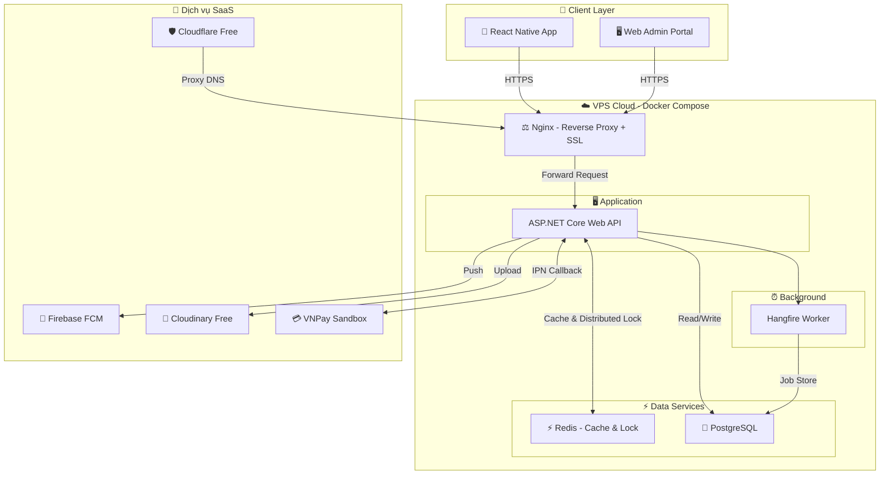

# 🚀 Giai Đoạn 1: Triển Khai Hạ Tầng Ban Đầu (MVP Deployment)

> Tài liệu mô tả hạ tầng phần cứng tối thiểu cần thiết để hệ thống B2B Travel Platform hoạt động ổn định, phục vụ demo đồ án tốt nghiệp và vận hành thực tế với quy mô nhỏ (dưới 50 đại lý đồng thời).

---

## 🎯 Mục Tiêu Giai Đoạn 1

*   Hệ thống chạy được đầy đủ nghiệp vụ cốt lõi: **Đăng ký đại lý → KYC → Tìm kiếm → Giữ chỗ → Thanh toán ví → Xuất vé**.
*   Chi phí vận hành thấp nhất có thể (dưới 500.000 VNĐ/tháng).
*   Dễ dàng demo trước hội đồng bảo vệ đồ án bằng 1 lệnh duy nhất.
*   Đảm bảo an toàn dữ liệu tài chính (không mất tiền ví, không đặt trùng chỗ).

---

## 🗺️ 1. Sơ Đồ Triển Khai Giai Đoạn 1

Toàn bộ hệ thống được đóng gói trong **Docker Compose** chạy trên **1 VPS Cloud duy nhất**:

---

## 🎛️ 2. Cấu Hình Phần Cứng Giai Đoạn 1

| # | Thành Phần | Cấu Hình | Chi Phí/Tháng | Ghi Chú |
| :---: | :--- | :--- | :--- | :--- |
| 1 | **VPS Cloud** (DigitalOcean / Vultr / Contabo) | 4 vCPU, 8 GB RAM, SSD 80 GB | ~300.000 - 500.000 VNĐ | Chạy toàn bộ Docker Compose trên 1 máy. |
| 2 | **Cloudflare Free** | SaaS miễn phí | 0 VNĐ | DNS, SSL/TLS, WAF cơ bản, DDoS protection. |
| 3 | **Firebase FCM** | SaaS miễn phí | 0 VNĐ | Push Notification không giới hạn. |
| 4 | **Cloudinary Free** | 25 GB Storage, 25 GB Bandwidth | 0 VNĐ | Lưu ảnh KYC (CCCD, Giấy phép lữ hành). |
| | **Tổng chi phí** | | **~300.000 - 500.000 VNĐ** | |

---

## 🧱 3. Các Thành Phần Triển Khai & Lý Do Lựa Chọn

### 3.1 Nginx (Reverse Proxy)
*   **Vai trò:** Nhận toàn bộ request HTTPS từ Client, chuyển tiếp (forward) đến ASP.NET Core Web API Container phía sau.
*   **Tại sao cần:** Không nên để ứng dụng .NET tiếp xúc trực tiếp với Internet. Nginx đóng vai trò lá chắn, xử lý SSL/TLS termination và giới hạn rate-limit request.

### 3.2 ASP.NET Core Web API (1 Instance)
*   **Vai trò:** Xử lý toàn bộ logic nghiệp vụ (Auth, KYC, Booking, Wallet, Claims, Reports).
*   **Tại sao 1 instance là đủ:** Ở giai đoạn MVP, lượng đại lý sử dụng dưới 50 người đồng thời. ASP.NET Core 8 trên 4 vCPU có thể xử lý hàng nghìn request/giây. 1 instance hoàn toàn đáp ứng.
*   **Hangfire chạy chung:** Ở giai đoạn này, Hangfire Background Worker được cấu hình chạy chung tiến trình với Web API (In-Process) để tiết kiệm RAM. Các Job nền (hủy đơn quá hạn, gửi Push, gọi API đối tác) vẫn hoạt động đầy đủ.

### 3.3 Redis (Cache & Distributed Lock)
*   **Vai trò:** Cache dữ liệu tần suất cao (danh sách nhà xe, cấu hình hệ thống) và thực thi **Distributed Lock** để chống Race Condition khi giữ chỗ.
*   **Tại sao bắt buộc từ đầu:** Dù chỉ 1 Web API instance, vẫn có thể có nhiều request đồng thời từ nhiều đại lý. Redis Lock đảm bảo an toàn tuyệt đối cho tồn kho.

### 3.4 PostgreSQL (Single Instance)
*   **Vai trò:** CSDL chính lưu trữ toàn bộ dữ liệu nghiệp vụ (tài khoản, ví tiền, đơn hàng, sổ cái Ledger).
*   **Tại sao chưa cần Replica:** Ở quy mô nhỏ, tải đọc/ghi chưa đủ lớn để cần tách biệt. 1 instance PostgreSQL đủ xử lý mượt mà. Replica sẽ được bổ sung ở Giai đoạn 2 khi cần scale.

### 3.5 Cloudflare Free (DNS + SSL + WAF)
*   **Vai trò:** Trỏ domain về VPS, cấp chứng chỉ SSL/TLS miễn phí, chặn DDoS cơ bản và brute-force.
*   **Tại sao chọn:** Hoàn toàn miễn phí, cấu hình đơn giản (chỉ cần thay đổi DNS), hiệu quả bảo vệ cao.

---

## ✅ 4. Điều Kiện Chuyển Sang Giai Đoạn 2 (Scale Up)

Khi hệ thống đạt **bất kỳ 1 trong các ngưỡng** sau, cần chuyển sang Giai đoạn 2:

| Chỉ Số Giám Sát | Ngưỡng Cảnh Báo | Ý Nghĩa |
| :--- | :--- | :--- |
| **CPU trung bình VPS** | Liên tục > 70% trong 1 giờ | Web API đang quá tải, cần tách Hangfire ra worker riêng hoặc thêm API instance. |
| **RAM trung bình VPS** | Liên tục > 80% (6.4 GB / 8 GB) | Redis hoặc PostgreSQL đang chiếm quá nhiều RAM, cần tách máy riêng. |
| **Thời gian phản hồi API (P95)** | > 500ms | Tải đọc Database quá lớn, cần bổ sung PostgreSQL Replica. |
| **Số đại lý đồng thời** | > 50 người | Vượt qua tải thiết kế của 1 instance, cần scale horizontal (thêm API server). |
| **Dung lượng ổ SSD** | > 60 GB / 80 GB | Dữ liệu Database tăng nhanh, cần chuyển sang dịch vụ Database quản trị (Cloud SQL). |
