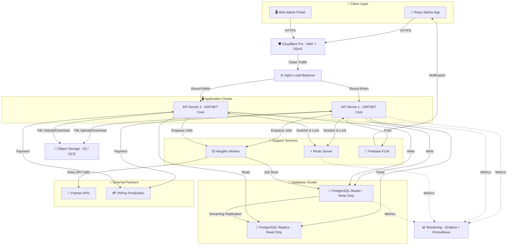

# 📈 Giai Đoạn 2: Mở Rộng Hạ Tầng Khi Hệ Thống Ổn Định (Scale-Up Deployment)

> Tài liệu mô tả kế hoạch nâng cấp hạ tầng phần cứng khi hệ thống B2B Travel Platform đã vận hành ổn định ở Giai đoạn 1 và bắt đầu chạm ngưỡng tải. Giai đoạn này phục vụ quy mô vận hành thực tế từ 50 đến 500 đại lý đồng thời.

---

## 🎯 Mục Tiêu Giai Đoạn 2

*   **Tính sẵn sàng cao (High Availability):** Hệ thống không bị gián đoạn kể cả khi 1 server bị sập (Zero Downtime).
*   **Tối ưu hiệu năng:** Tách biệt tải đọc/ghi Database, tách Hangfire Worker ra tiến trình riêng biệt.
*   **Giám sát chủ động:** Phát hiện sự cố trước khi người dùng cảm nhận được, tự động cảnh báo qua Telegram.
*   **Quy mô phục vụ:** 50 - 500 đại lý truy cập đồng thời, hàng nghìn đơn hàng mỗi ngày.

---

## 🗺️ 1. Sơ Đồ Triển Khai Giai Đoạn 2

Tách biệt các thành phần ra nhiều máy chủ / dịch vụ quản trị độc lập:

---

## 🔄 2. So Sánh Giai Đoạn 1 vs Giai Đoạn 2

Bảng dưới đây thể hiện rõ từng thành phần đã được nâng cấp như thế nào:

| Thành Phần | Giai Đoạn 1 (MVP) | Giai Đoạn 2 (Scale-Up) | Lý Do Nâng Cấp |
| :--- | :--- | :--- | :--- |
| **Web API** | 1 instance (chạy chung VPS) | **2 instances** (tách riêng, Load Balanced) | Loại bỏ Single Point of Failure. Nếu 1 server sập, server còn lại tiếp tục phục vụ. |
| **Hangfire Worker** | Chạy chung process với API (In-process) | **Tách riêng process** hoặc container độc lập | Job nền nặng (gọi API đối tác, gửi email) không còn tranh chấp CPU/RAM với luồng xử lý API chính. |
| **PostgreSQL** | 1 instance (Read + Write chung) | **Master (Write) + Replica (Read)** | Tách biệt đọc/ghi. Tải tìm kiếm + báo cáo (80% request) chuyển hết sang Replica, giảm áp lực cho Master. |
| **Redis** | Chạy chung VPS | **Redis Server riêng** (hoặc Managed Redis) | Đảm bảo RAM dành riêng cho cache và lock, không bị PostgreSQL hoặc API tranh chấp. |
| **WAF / Bảo mật** | Cloudflare Free (cơ bản) | **Cloudflare Pro** (WAF Rules nâng cao, Rate Limit chi tiết) | Bảo vệ chuyên sâu hơn khi hệ thống có nhiều đại lý và dòng tiền lớn hơn. |
| **Monitoring** | Không có (kiểm tra thủ công) | **Grafana + Prometheus** (Dashboard giám sát 24/7) | Phát hiện CPU/RAM quá tải, API chậm, DB nghẽn và gửi cảnh báo Telegram tự động. |
| **Object Storage** | Cloudinary Free (25 GB) | **AWS S3 / Google Cloud Storage** (không giới hạn) | Cloudinary Free Tier không đủ dung lượng khi có hàng trăm đại lý upload ảnh KYC + Voucher PDF hàng ngày. |

---

## 🎛️ 3. Cấu Hình Phần Cứng Giai Đoạn 2

| # | Thành Phần | Cấu Hình | Chi Phí/Tháng (ước tính) | Vai Trò |
| :---: | :--- | :--- | :--- | :--- |
| 1 | **Load Balancer (Nginx)** | 2 vCPU, 1 GB RAM | ~100.000 VNĐ | Phân phối tải đều vào 2 API Server. |
| 2 | **Web API Server 1** | 2 vCPU, 8 GB RAM | ~400.000 VNĐ | Xử lý logic nghiệp vụ (Stateless). |
| 3 | **Web API Server 2** | 2 vCPU, 8 GB RAM | ~400.000 VNĐ | Bản sao API Server 1, đảm bảo High Availability. |
| 4 | **Hangfire Worker** | 2 vCPU, 4 GB RAM | ~250.000 VNĐ | Xử lý tác vụ nền: hủy đơn, gọi API đối tác, gửi Push. |
| 5 | **Redis Server** | 2 GB RAM (Dedicated) | ~150.000 VNĐ | Cache & Distributed Lock (tách riêng để đảm bảo hiệu năng). |
| 6 | **PostgreSQL Master** | 2 vCPU, 8 GB RAM, SSD 100 GB | ~500.000 VNĐ | CSDL chính ghi dữ liệu (Wallet, Booking, Ledger). |
| 7 | **PostgreSQL Replica** | 2 vCPU, 8 GB RAM, SSD 100 GB | ~500.000 VNĐ | Bản sao đọc cho tìm kiếm, báo cáo, xuất Excel. |
| 8 | **Object Storage (S3)** | 50 GB+ (Pay-as-you-go) | ~50.000 VNĐ | Ảnh KYC, PDF Voucher. |
| 9 | **Cloudflare Pro** | SaaS | ~500.000 VNĐ | WAF nâng cao, Rate Limit, Analytics. |
| 10 | **Monitoring (Grafana)** | Chạy Docker trên VPS LB | 0 VNĐ (Self-hosted) | Dashboard giám sát + cảnh báo Telegram. |
| | **Tổng chi phí ước tính** | | **~2.850.000 VNĐ/tháng** | |

---

## 🛡️ 4. Các Cơ Chế Bảo Vệ Mới Ở Giai Đoạn 2

### 4.1 Auto-Failover cho Web API
*   Nginx Load Balancer kiểm tra sức khỏe (Health Check) của mỗi API Server mỗi 10 giây bằng cách gọi endpoint `/health`.
*   Nếu API Server 1 không phản hồi trong 3 lần liên tiếp (30 giây), Nginx tự động loại bỏ Server 1 khỏi danh sách và chuyển 100% traffic sang Server 2. Khi Server 1 phục hồi, Nginx tự động đưa trở lại.

### 4.2 Database Streaming Replication
*   PostgreSQL Master liên tục đẩy WAL (Write-Ahead Log) sang Replica qua kết nối mạng nội bộ.
*   Độ trễ đồng bộ (Replication Lag) thường dưới 1 giây. Nếu lag vượt 5 giây, hệ thống Monitoring gửi cảnh báo Telegram ngay lập tức.
*   Trong trường hợp Master sập hoàn toàn, Replica có thể được chuyển đổi vai trò thành Master mới (Manual Failover) chỉ trong 2-5 phút.

### 4.3 Giám Sát Chủ Động (Proactive Monitoring)
*   **Grafana Dashboard** hiển thị các chỉ số thời gian thực: CPU, RAM, Disk I/O, Request/s, Latency P95, Database Connections, Redis Memory.
*   **Cảnh báo Telegram tự động** khi:
    *   CPU > 80% liên tục 5 phút.
    *   API Latency P95 > 1 giây.
    *   Database Replication Lag > 5 giây.
    *   Disk usage > 85%.
    *   Hangfire Job bị thất bại > 3 lần liên tiếp.

---

## 📋 5. Lộ Trình Chuyển Đổi Từ Giai Đoạn 1 Sang Giai Đoạn 2

Quá trình nâng cấp được thực hiện **từng bước một**, không cần dừng hệ thống (Zero Downtime Migration):

| Bước | Hành Động | Rủi Ro | Thời Gian Ước Tính |
| :---: | :--- | :--- | :--- |
| 1 | **Tách Hangfire Worker** ra container Docker riêng trên cùng VPS. | Thấp — chỉ thay đổi cấu hình Docker Compose. | 1 giờ |
| 2 | **Thêm PostgreSQL Replica** trên VPS mới, cấu hình Streaming Replication từ Master. | Thấp — Replica chỉ đọc, không ảnh hưởng Master đang chạy. | 2-3 giờ |
| 3 | **Cấu hình Read/Write Split** trong code ứng dụng: Write → Master, Read → Replica. | Trung bình — cần test kỹ trước khi bật. | 1 ngày |
| 4 | **Thêm API Server 2** trên VPS mới, cấu hình Nginx Load Balancer phân phối tải. | Thấp — thêm upstream vào Nginx config, reload. | 2-3 giờ |
| 5 | **Tách Redis** ra VPS riêng hoặc chuyển sang Managed Redis (Memorystore/ElastiCache). | Trung bình — cần đổi connection string trong config. | 1-2 giờ |
| 6 | **Cài đặt Monitoring** (Prometheus + Grafana) trên VPS Load Balancer. | Thấp — hoàn toàn độc lập, không ảnh hưởng hệ thống chính. | 2-3 giờ |
| 7 | **Nâng cấp Cloudflare Pro** và cấu hình WAF Rules chi tiết. | Thấp — thay đổi trên dashboard Cloudflare. | 30 phút |
