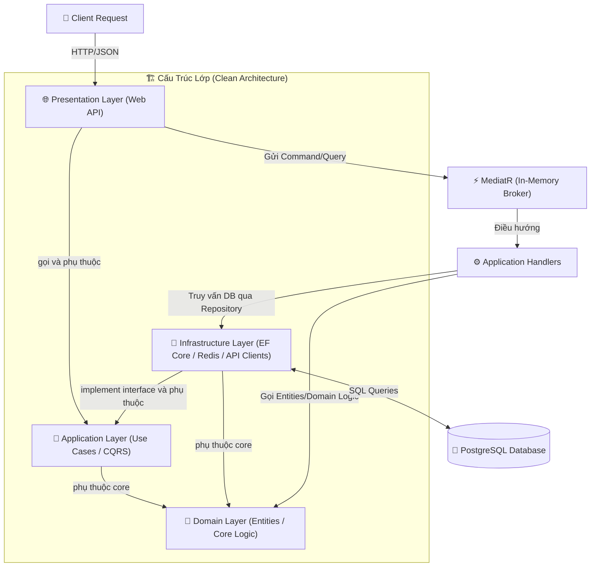

# 🧱 Thiết Kế Kiến Trúc Phần Mềm — B2B Travel Platform

> Tài liệu này mô tả chi tiết mô hình kiến trúc phần mềm (Software Architecture), cấu trúc thư mục code, các design patterns được áp dụng và thiết kế tầng dữ liệu cho dự án B2B Travel Platform.

---

## 🗺️ 1. Sơ Đồ Kiến Trúc Hệ Thống (Clean Architecture & DDD)

Dự án được thiết kế theo mô hình **Clean Architecture** kết hợp phương pháp **Domain-Driven Design (DDD)** để đảm bảo tính module hóa cao, dễ viết unit test, độc lập với cơ sở dữ liệu và dễ bảo trì mở rộng.



---

## 🗂️ 2. Cấu Trúc Thư Mục Code Dự Án (Proposed Solution Structure)

Cấu trúc mã nguồn đề xuất cho đề tài tốt nghiệp, phản ánh đúng các tầng trong Clean Architecture:

```text
src/
├── B2BTravelPlatform.Domain/          # Tầng Domain (Core) - Không phụ thuộc thư viện ngoài
│   ├── Entities/                      # Các thực thể nghiệp vụ (Booking, Wallet, WalletLedger)
│   ├── Enums/                         # Các trạng thái (BookingStatus, TransactionType)
│   ├── Exceptions/                    # Domain Exceptions tự định nghĩa
│   └── ValueObjects/                  # Các đối tượng giá trị (Money, Address)
│
├── B2BTravelPlatform.Application/     # Tầng Application - Chứa nghiệp vụ (Use Cases)
│   ├── Common/                        # Interfaces, Behaviors, DTOs chung
│   ├── Features/                      # Tổ chức CQRS theo từng Feature nghiệp vụ
│   │   ├── Bookings/                  # Module Đặt chỗ (Commands: CreateBooking, PayBooking)
│   │   ├── Wallets/                   # Module Ví (Commands: TopUpWallet, Queries: GetBalance)
│   │   └── Accounts/                  # Module Auth & KYC
│   └── Validators/                    # Khối kiểm tra tính hợp lệ dữ liệu (FluentValidation)
│
├── B2BTravelPlatform.Infrastructure/  # Tầng Infrastructure - Cài đặt kỹ thuật ngoại vi
│   ├── Persistence/                   # Cấu hình DbContext, Migrations, Fluent API
│   ├── Services/                      # Tích hợp dịch vụ (VNPay Client, Transport APIs Client)
│   ├── Caching/                       # Cài đặt Redis Cache & Distributed Lock
│   └── BackgroundJobs/                # Đăng ký tác vụ nền (Hangfire Jobs)
│
└── B2BTravelPlatform.WebApi/          # Tầng Presentation - Điểm đầu vào của hệ thống
    ├── Controllers/                   # REST API Controllers (V1, V2)
    ├── Middlewares/                   # Exception Handler, Logging, Security Headers
    └── Program.cs                     # Cấu hình Dependency Injection (DI) & App Bootstrapping
```

---

## 🚀 3. Các Design Patterns Chủ Đạo Được Áp Dụng

1.  **CQRS (Command Query Responsibility Segregation):** 
    *   Tách biệt tác vụ ghi dữ liệu (Command) và tác vụ đọc dữ liệu (Query) thông qua thư viện **MediatR**.
    *   *Lợi ích:* Giúp tối ưu hóa hiệu năng đọc/ghi độc lập, code sạch sẽ và tập trung.
2.  **Repository & Unit of Work Pattern:**
    *   Trừu tượng hóa tầng truy cập dữ liệu ra khỏi tầng Application.
    *   *Lợi ích:* Đảm bảo tính nhất quán của dữ liệu (Data Consistency), bao bọc nhiều lệnh Database trong 1 transaction duy nhất của Unit of Work.
3.  **Dependency Injection (DI):**
    *   Đăng ký và quản lý vòng đời của các Service (`Transient`, `Scoped`, `Singleton`) tại `Program.cs`.
4.  **Distributed Lock (Redis):**
    *   Áp dụng khóa tài nguyên phân tán tại tầng Infrastructure để giải quyết tranh chấp dữ liệu (Race Condition) khi đặt giữ chỗ tồn kho.

---

## 🛠️ Bước Tiếp Theo (Tôi và bạn cùng làm)

1.  **Thiết kế Cơ sở dữ liệu:** Bạn muốn mô tả chi tiết sơ đồ ERD (Entity Relationship Diagram) ở tài liệu này hay thiết kế riêng một file database design?
2.  **Thiết kế API:** Chúng ta có cần lên danh sách các API Endpoint cơ bản (Swagger specs) cho các Layer của Controller không?
3.  **Công nghệ bảo mật:** Bạn muốn sử dụng JWT Token thông thường hay cấu hình thêm Refresh Token xoay vòng (Token Rotation) để báo cáo hội đồng?
