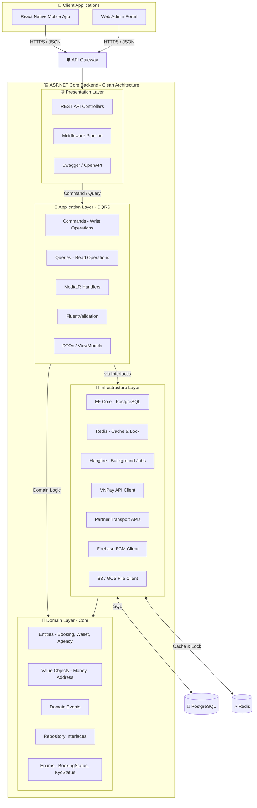
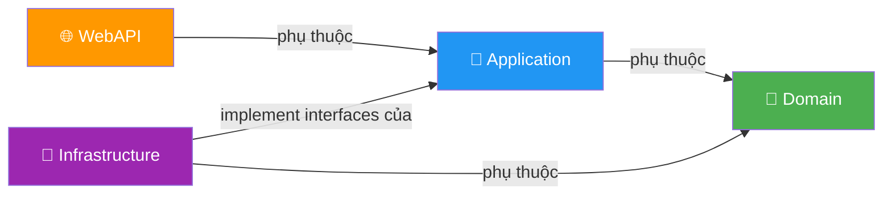
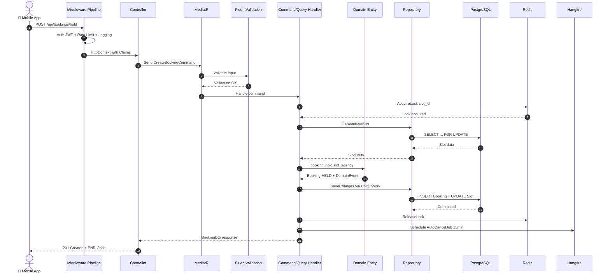
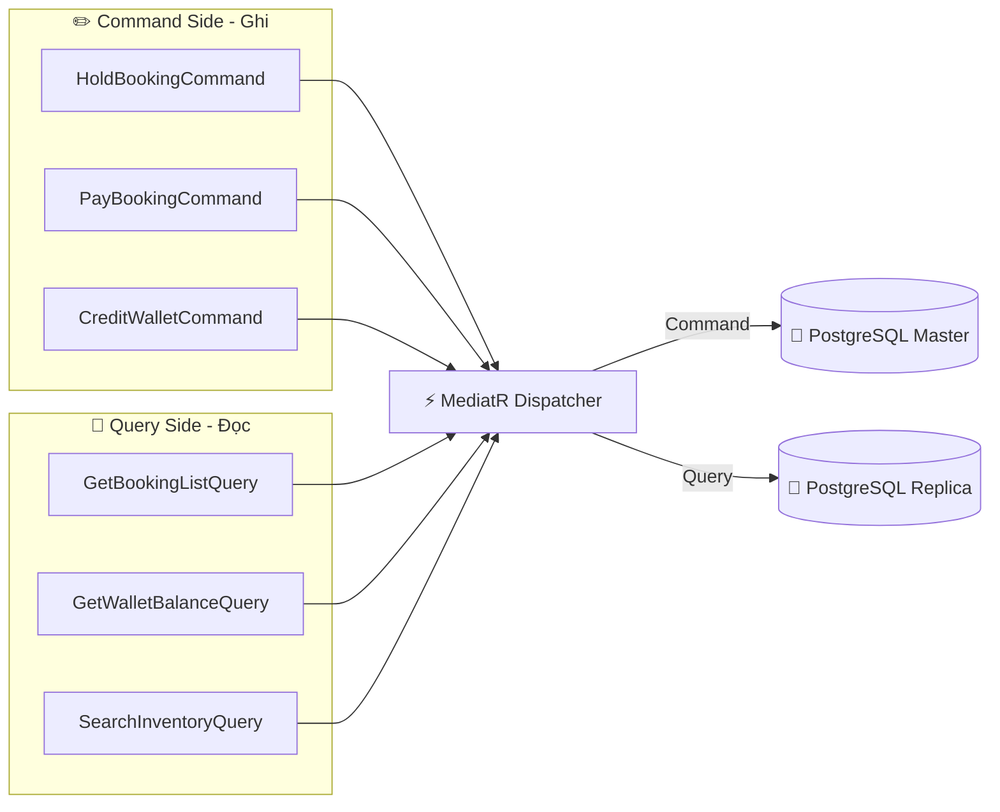
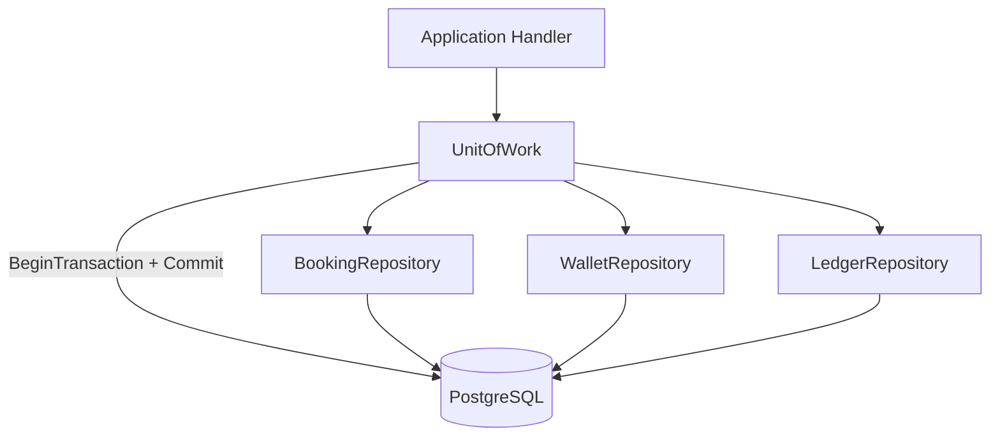
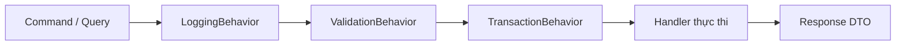
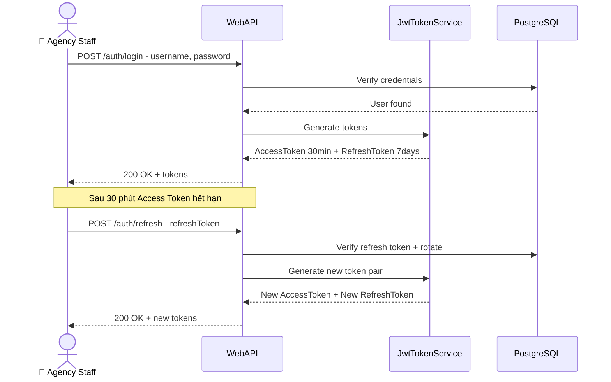
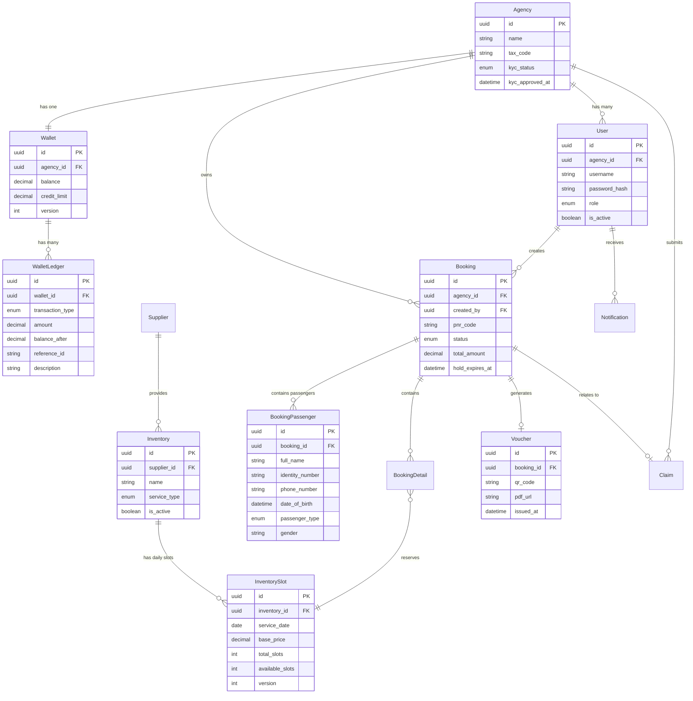

# 🧱 Thiết Kế Kiến Trúc Phần Mềm — B2B Travel Platform

> Tài liệu tổng quan về kiến trúc phần mềm của hệ thống B2B Travel Platform. Bao gồm: mô hình kiến trúc Clean Architecture + DDD, luồng xử lý request, cấu trúc thư mục code, các design pattern được áp dụng, công nghệ stack và thiết kế tầng dữ liệu.

---

## 🗺️ 1. Mô Hình Kiến Trúc Tổng Quan

Hệ thống được xây dựng theo mô hình **Clean Architecture** kết hợp **Domain-Driven Design - DDD** và **CQRS** để đảm bảo: tách biệt nghiệp vụ khỏi công nghệ, dễ viết test, dễ thay thế database/cache mà không ảnh hưởng logic.



### Quy tắc phụ thuộc - Dependency Rule



**Domain** là lõi trung tâm — không phụ thuộc vào bất kỳ tầng nào khác. **Application** chỉ phụ thuộc Domain. **Infrastructure** implement các interface do Application định nghĩa. **WebAPI** chỉ gọi Application thông qua MediatR.

---

## 📡 2. Luồng Xử Lý Request Chi Tiết



---

## 🗂️ 3. Cấu Trúc Thư Mục Code

```text
B2BTravelPlatform/
├── src/
│   ├── B2BTravelPlatform.Domain/              # 🧬 Domain Layer
│   │   ├── Entities/
│   │   │   ├── Booking.cs                     # Entity đặt chỗ + domain methods
│   │   │   ├── BookingPassenger.cs            # Entity thông tin hành khách đi tour/vé
│   │   │   ├── Wallet.cs                      # Entity ví + Credit/Debit logic
│   │   │   ├── WalletLedger.cs                # Sổ cái giao dịch ví
│   │   │   ├── Agency.cs                      # Entity đại lý
│   │   │   ├── Inventory.cs                   # Kho dịch vụ du lịch
│   │   │   ├── InventorySlot.cs               # Slot chỗ theo ngày
│   │   │   ├── Voucher.cs                     # E-Voucher / Vé điện tử
│   │   │   ├── Claim.cs                       # Khiếu nại
│   │   │   └── Notification.cs                # Thông báo
│   │   ├── Enums/
│   │   │   ├── BookingStatus.cs               # Held, Paid, Expired, Cancelled...
│   │   │   ├── KycStatus.cs                   # PendingKyc, Approved, Rejected...
│   │   │   ├── TransactionType.cs             # Credit, Debit, Refund...
│   │   │   └── UserRole.cs                    # PlatformAdmin, AgencyManager...
│   │   ├── ValueObjects/
│   │   │   ├── Money.cs                       # Kiểu tiền tệ decimal an toàn
│   │   │   └── PnrCode.cs                     # Mã đặt chỗ PNR duy nhất
│   │   ├── Events/
│   │   │   ├── BookingHeldEvent.cs             # Event khi đặt chỗ thành công
│   │   │   ├── BookingPaidEvent.cs             # Event khi thanh toán thành công
│   │   │   └── WalletCreditedEvent.cs          # Event khi nạp ví
│   │   ├── Exceptions/
│   │   │   ├── InsufficientBalanceException.cs
│   │   │   └── SlotUnavailableException.cs
│   │   └── Interfaces/
│   │       ├── IBookingRepository.cs
│   │       ├── IWalletRepository.cs
│   │       ├── IInventoryRepository.cs
│   │       └── IUnitOfWork.cs
│   │
│   ├── B2BTravelPlatform.Application/         # 🧠 Application Layer
│   │   ├── Common/
│   │   │   ├── Interfaces/
│   │   │   │   ├── ICurrentUser.cs            # Lấy thông tin user từ JWT
│   │   │   │   ├── IDistributedLockService.cs # Interface Redis Lock
│   │   │   │   ├── IVnPayService.cs           # Interface VNPay
│   │   │   │   ├── IFileStorageService.cs     # Interface upload file
│   │   │   │   └── IPushNotificationService.cs
│   │   │   ├── Behaviors/
│   │   │   │   ├── ValidationBehavior.cs      # Pipeline: auto validate trước Handler
│   │   │   │   └── LoggingBehavior.cs         # Pipeline: auto log mọi Command/Query
│   │   │   └── Mappings/
│   │   │       └── MappingProfile.cs          # AutoMapper Entity -> DTO
│   │   ├── Features/
│   │   │   ├── Auth/
│   │   │   │   ├── Commands/LoginCommand.cs
│   │   │   │   ├── Commands/RefreshTokenCommand.cs
│   │   │   │   └── Queries/GetCurrentUserQuery.cs
│   │   │   ├── Agencies/
│   │   │   │   ├── Commands/RegisterAgencyCommand.cs
│   │   │   │   ├── Commands/ApproveKycCommand.cs
│   │   │   │   └── Queries/GetAgencyListQuery.cs
│   │   │   ├── Bookings/
│   │   │   │   ├── Commands/HoldBookingCommand.cs
│   │   │   │   ├── Commands/PayBookingCommand.cs
│   │   │   │   ├── Commands/CancelBookingCommand.cs
│   │   │   │   └── Queries/GetBookingListQuery.cs
│   │   │   ├── Wallets/
│   │   │   │   ├── Commands/CreditWalletCommand.cs
│   │   │   │   ├── Commands/DebitWalletCommand.cs
│   │   │   │   └── Queries/GetWalletBalanceQuery.cs
│   │   │   ├── Inventory/
│   │   │   │   ├── Commands/CreateInventoryCommand.cs
│   │   │   │   ├── Commands/UpdateSlotCommand.cs
│   │   │   │   └── Queries/SearchInventoryQuery.cs
│   │   │   ├── Vouchers/
│   │   │   │   ├── Commands/IssueVoucherCommand.cs
│   │   │   │   └── Queries/GetVoucherQuery.cs
│   │   │   ├── Claims/
│   │   │   │   ├── Commands/CreateClaimCommand.cs
│   │   │   │   ├── Commands/ResolveClaimCommand.cs
│   │   │   │   └── Queries/GetClaimListQuery.cs
│   │   │   └── Notifications/
│   │   │       └── Queries/GetNotificationListQuery.cs
│   │   │   └── Carts/
│   │   │       ├── Commands/AddToCartCommand.cs
│   │   │       ├── Commands/RemoveFromCartCommand.cs
│   │   │       ├── Commands/UnifiedHoldCartCommand.cs
│   │   │       ├── Commands/PayCartCommand.cs
│   │   │       └── Queries/GetCartQuery.cs
│   │   └── Validators/
│   │       ├── HoldBookingValidator.cs
│   │       └── CreditWalletValidator.cs
│   │
│   ├── B2BTravelPlatform.Infrastructure/      # 🔌 Infrastructure Layer
│   │   ├── Persistence/
│   │   │   ├── AppDbContext.cs                # EF Core DbContext + Fluent API
│   │   │   ├── Configurations/               # Entity configurations
│   │   │   ├── Migrations/                   # Database migrations
│   │   │   ├── Repositories/                 # Concrete implementations
│   │   │   └── UnitOfWork.cs
│   │   ├── Services/
│   │   │   ├── VnPayService.cs               # VNPay HMAC + Payment URL + IPN
│   │   │   ├── TransportApiService.cs        # Gọi API Phương Trang / Hãng bay
│   │   │   ├── PushNotificationService.cs    # Firebase FCM
│   │   │   └── FileStorageService.cs         # S3 / GCS upload
│   │   ├── Caching/
│   │   │   ├── RedisCacheService.cs
│   │   │   └── RedisDistributedLockService.cs
│   │   ├── Identity/
│   │   │   ├── JwtTokenService.cs            # Sinh JWT + Refresh Token
│   │   │   └── CurrentUserService.cs         # Parse Claims từ HttpContext
│   │   └── BackgroundJobs/
│   │       ├── AutoCancelExpiredBookingsJob.cs
│   │       ├── SyncPartnerBookingJob.cs
│   │       └── KycExpiryReminderJob.cs
│   │
│   └── B2BTravelPlatform.WebApi/              # 🌐 Presentation Layer
│       ├── Controllers/
│       │   ├── AuthController.cs
│       │   ├── AgencyController.cs
│       │   ├── BookingController.cs
│       │   ├── CartController.cs
│       │   ├── WalletController.cs
│       │   ├── InventoryController.cs
│       │   ├── VoucherController.cs
│       │   ├── ClaimController.cs
│       │   ├── NotificationController.cs
│       │   ├── SystemConfigController.cs
│       │   └── AiAssistantController.cs
│       ├── Middlewares/
│       │   ├── GlobalExceptionMiddleware.cs
│       │   ├── RequestLoggingMiddleware.cs
│       │   └── SecurityHeadersMiddleware.cs
│       ├── Filters/
│       │   └── ApiKeyAuthFilter.cs           # Filter cho VNPay IPN endpoint
│       └── Program.cs                         # DI Registration + App Config
│
├── tests/
│   ├── B2BTravelPlatform.UnitTests/
│   └── B2BTravelPlatform.IntegrationTests/
│
├── docker-compose.yml                         # Triển khai toàn bộ hệ thống
├── Dockerfile                                 # Build image ASP.NET Core
└── .github/workflows/ci.yml                   # GitHub Actions CI/CD
```

---

## ⚙️ 4. Technology Stack

### Backend

| Công nghệ | Phiên bản | Vai trò |
| :--- | :--- | :--- |
| **ASP.NET Core** | 8.0 LTS | Web API Framework chính |
| **Entity Framework Core** | 8.x | ORM - truy vấn PostgreSQL |
| **MediatR** | 12.x | In-process message bus cho CQRS |
| **FluentValidation** | 11.x | Validate input tự động qua Pipeline |
| **AutoMapper** | 13.x | Map Entity sang DTO tự động |
| **Hangfire** | 1.8.x | Background Job Scheduler |
| **StackExchange.Redis** | 2.x | Redis Client - Cache & Distributed Lock |
| **Serilog** | 3.x | Structured Logging |
| **Swashbuckle** | 6.x | Swagger / OpenAPI documentation |

### Frontend

| Công nghệ | Phiên bản | Vai trò |
| :--- | :--- | :--- |
| **React Native** | 0.74+ | Mobile App - iOS & Android |
| **React Navigation** | 6.x | Điều hướng màn hình |
| **Axios** | 1.x | HTTP Client gọi API |
| **React Query** | 5.x | Server state management + caching |
| **AsyncStorage** | latest | Lưu trữ JWT token local |
| **Firebase SDK** | latest | Push Notification receiver |

### Database & Infrastructure

| Công nghệ | Vai trò |
| :--- | :--- |
| **PostgreSQL 16** | CSDL chính - ACID Transactions |
| **Redis 7** | Cache, Session, Distributed Lock, Idempotent Key |
| **Docker + Docker Compose** | Containerization & Deployment |
| **Nginx** | Reverse Proxy + Load Balancer |
| **Cloudflare** | WAF + SSL + DDoS Protection |

---

## 🛡️ 5. Các Design Pattern Chủ Đạo

### 5.1 CQRS - Command Query Responsibility Segregation



*   **Command**: Thay đổi dữ liệu → ghi vào Master. Mỗi Command có 1 Handler riêng biệt.
*   **Query**: Chỉ đọc dữ liệu → đọc từ Replica. Trả về DTO, không trả Entity.
*   **Tại sao dùng**: Tách biệt giúp tối ưu hiệu năng đọc/ghi độc lập, dễ scale từng phần.

### 5.2 Repository & Unit of Work



*   **Repository**: Trừu tượng hóa truy vấn DB, Application không biết dùng EF Core hay Dapper.
*   **Unit of Work**: Bao bọc nhiều Repository trong 1 DB Transaction duy nhất. Ví dụ: khi thanh toán booking, cần đồng thời trừ ví + tạo ledger + cập nhật booking status → tất cả phải thành công hoặc rollback toàn bộ.

### 5.3 MediatR Pipeline Behaviors



Mỗi request đi qua pipeline tự động: Log → Validate → Wrap Transaction → Execute Handler. Không cần viết lại logic validate/log/transaction trong mỗi Handler.

### 5.4 Domain Events

Khi một hành động nghiệp vụ xảy ra, Domain Entity phát ra Event. Các Handler lắng nghe Event để thực hiện side effects:

| Domain Event | Trigger khi | Side Effects |
| :--- | :--- | :--- |
| `BookingHeldEvent` | Đặt chỗ thành công | Schedule AutoCancelJob 15 phút |
| `BookingPaidEvent` | Thanh toán thành công | Issue Voucher + Gọi API đối tác + Push thông báo |
| `WalletCreditedEvent` | Nạp ví thành công | Push thông báo + Ghi audit log |
| `KycApprovedEvent` | Duyệt KYC đại lý | Push thông báo chúc mừng |
| `ClaimResolvedEvent` | Duyệt khiếu nại | Hoàn tiền vào ví + Push thông báo |

---

## 🔐 6. Thiết Kế Bảo Mật

### Xác thực - Authentication



*   **JWT Access Token**: Thời hạn 30 phút, chứa UserId + Role + AgencyId trong Claims.
*   **Refresh Token Rotation**: Mỗi lần dùng Refresh Token sẽ sinh token mới và hủy token cũ — chống token bị đánh cắp.

### Phân quyền - Authorization RBAC

| Endpoint | PlatformAdmin | AgencyManager | AgencyStaff | SupplierAdmin |
| :--- | :---: | :---: | :---: | :---: |
| POST /bookings/hold | — | ✅ | ✅ | — |
| POST /wallets/credit | ✅ | — | — | — |
| PUT /agencies/{id}/kyc/approve | ✅ | — | — | — |
| GET /bookings | ✅ All | ✅ Own Agency | ✅ Own Agency | — |
| POST /inventory | ✅ | — | — | ✅ Own Supplier |
| PUT /bookings/{id}/approve | — | — | — | ✅ On-Request |

---

## 💾 7. Thiết Kế Tầng Dữ Liệu - ERD Tổng Quan



### Các cột đặc biệt quan trọng

| Cột | Bảng | Ý nghĩa kiến trúc |
| :--- | :--- | :--- |
| `version` | Wallet, InventorySlot | **Optimistic Concurrency Control** - Mỗi lần UPDATE phải kiểm tra version khớp, tránh ghi đè dữ liệu cũ |
| `balance_after` | WalletLedger | Lưu số dư sau mỗi giao dịch — có thể audit trail và đối soát bất kỳ lúc nào |
| `hold_expires_at` | Booking | Thời điểm hết hạn giữ chỗ — Hangfire Job dùng để auto-cancel |
| `reference_id` | WalletLedger | Liên kết với BookingId hoặc VNPay TransactionId — truy vết nguồn gốc giao dịch |
