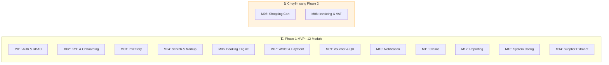

# 🚀 Giai Đoạn 1: Kiến Trúc Phần Mềm MVP — Ổn Định Để Bảo Vệ Đồ Án

> Tài liệu mô tả phạm vi kiến trúc phần mềm được triển khai trong giai đoạn MVP. Tập trung vào luồng nghiệp vụ cốt lõi, đảm bảo hệ thống chạy ổn định, dễ demo và đủ chất lượng để hội đồng duyệt.

---

## 🎯 Mục Tiêu Phase 1

*   Triển khai đầy đủ **12 module nghiệp vụ MVP** với 45 Use Case cốt lõi.
*   Code theo đúng **Clean Architecture + CQRS** — không cắt góc, không hardcode.
*   Đảm bảo 3 luồng tài chính an toàn tuyệt đối: **Giữ chỗ**, **Thanh toán ví**, **Nạp ví VNPay**.
*   Có thể demo bằng 1 lệnh `docker-compose up -d` trước hội đồng.

---

## 🏗️ 1. Phạm Vi Module Triển Khai Phase 1



### Lý do hoãn 2 module

| Module | Lý do hoãn sang Phase 2 |
| :--- | :--- |
| **M05 - Shopping Cart** | Combo Cart cần Unified Hold + Atomic Payment — logic Saga/2-Phase Commit phức tạp. Cần booking đơn lẻ ổn định trước. |
| **M08 - Invoicing & VAT** | Yêu cầu tích hợp API hóa đơn điện tử bên thứ ba + tuân thủ quy định thuế. Không ảnh hưởng đến luồng giao dịch chính. |

---

## 🔧 2. Chi Tiết Từng Tầng Kiến Trúc MVP

### 2.1 Domain Layer — Entities & Business Rules

Tầng Domain chứa logic nghiệp vụ thuần túy, không phụ thuộc framework nào.

| Entity | Vai trò | Domain Methods quan trọng |
| :--- | :--- | :--- |
| **Booking** | Đơn đặt chỗ | `Hold()` → validate + đổi status HELD. `Pay()` → validate balance + đổi PAID. `Cancel()` → hoàn slot. `Expire()` → auto-cancel. |
| **Wallet** | Ví tài chính đại lý | `Credit(amount)` → cộng balance + tạo LedgerEntry. `Debit(amount)` → kiểm tra đủ tiền + trừ balance + tạo LedgerEntry. |
| **WalletLedger** | Sổ cái giao dịch | Immutable — chỉ INSERT, không bao giờ UPDATE/DELETE. Mỗi entry lưu `balance_after` để audit. |
| **InventorySlot** | Slot chỗ theo ngày | `DecrementSlot()` → giảm available_slots + tăng version. `RestoreSlot()` → hoàn khi hủy đơn. |
| **Agency** | Đại lý du lịch | `ApproveKyc()`, `RejectKyc()`, `Suspend()` — quản lý vòng đời KYC. |
| **Voucher** | Vé điện tử | `Issue()` → sinh QR Code + link PDF. |

**Quy tắc nghiệp vụ nhúng trong Domain:**
*   Booking chỉ được Pay khi status = `HELD` và chưa hết `hold_expires_at`.
*   Wallet.Debit bắt buộc kiểm tra `balance >= amount` trước khi trừ.
*   InventorySlot.DecrementSlot kiểm tra `available_slots > 0`.
*   WalletLedger luôn ghi `balance_after = wallet.Balance` tại thời điểm giao dịch.

### 2.2 Application Layer — CQRS Handlers

Mỗi Use Case được implement bởi 1 Command Handler hoặc 1 Query Handler:

```text
Features/
├── Auth/
│   ├── Commands/
│   │   ├── LoginCommand.cs             → Xác thực + sinh JWT
│   │   ├── RefreshTokenCommand.cs      → Rotation + sinh token mới
│   │   └── ChangePasswordCommand.cs    → Đổi mật khẩu
│   └── Queries/
│       └── GetCurrentUserQuery.cs      → Lấy info user từ JWT Claims
│
├── Bookings/
│   ├── Commands/
│   │   ├── HoldBookingCommand.cs       → Redis Lock + Deduct Slot + Create Booking
│   │   ├── PayBookingCommand.cs        → Debit Wallet + Ledger + Trigger Voucher
│   │   └── CancelBookingCommand.cs     → Restore Slot + Cancel Booking
│   └── Queries/
│       ├── GetBookingListQuery.cs       → Phân trang, lọc theo status/agency
│       └── GetBookingDetailQuery.cs     → Chi tiết 1 booking kèm voucher
│
├── Wallets/
│   ├── Commands/
│   │   ├── CreditWalletCommand.cs      → Admin nạp ví + Ledger
│   │   └── DebitWalletCommand.cs       → Admin trừ ví + Ledger
│   └── Queries/
│       ├── GetWalletBalanceQuery.cs     → Số dư + hạn mức
│       └── GetWalletHistoryQuery.cs     → Lịch sử giao dịch phân trang
│
└── ... (tương tự cho Agencies, Inventory, Claims, Notifications, Vouchers)
```

### 2.3 Infrastructure Layer — Kỹ Thuật Cài Đặt

| Service | Implement Interface | Công nghệ | Ghi chú |
| :--- | :--- | :--- | :--- |
| `AppDbContext` | — | EF Core 8 | Fluent API config, DbSet cho tất cả Entities |
| `BookingRepository` | `IBookingRepository` | EF Core | Include BookingDetails + Voucher |
| `UnitOfWork` | `IUnitOfWork` | EF Core | BeginTransaction, Commit, Rollback |
| `RedisDistributedLockService` | `IDistributedLockService` | StackExchange.Redis | `SET key NX EX 30` + Release in finally |
| `RedisCacheService` | `ICacheService` | StackExchange.Redis | Idempotent Key TTL 5 phút cho VNPay IPN |
| `VnPayService` | `IVnPayService` | HttpClient | Tạo Payment URL + Verify HMAC IPN |
| `JwtTokenService` | `IJwtTokenService` | System.IdentityModel | HS256, AccessToken 30min, RefreshToken 7 days |
| `PushNotificationService` | `IPushNotificationService` | FirebaseAdmin SDK | Gửi FCM Push tới Mobile App |
| `FileStorageService` | `IFileStorageService` | AWS SDK / GCS | Upload ảnh KYC, PDF Voucher |
| `AutoCancelExpiredBookingsJob` | — | Hangfire | Recurring mỗi phút, hủy HELD quá 15 phút |
| `SyncPartnerBookingJob` | — | Hangfire | Fire-and-forget, gọi API đối tác + Retry |
| `KycExpiryReminderJob` | — | Hangfire | Recurring hàng ngày, nhắc KYC sắp hết hạn |

### 2.4 Presentation Layer — API Controllers

| Controller | Endpoints chính | Auth |
| :--- | :--- | :--- |
| `AuthController` | POST /login, POST /refresh, POST /change-password | Public / Authenticated |
| `AgencyController` | POST /register, GET /list, PUT /{id}/kyc/approve | Admin / Manager |
| `BookingController` | POST /hold, POST /{id}/pay, DELETE /{id}, GET /list | Manager, Staff |
| `WalletController` | GET /balance, GET /history, POST /credit, POST /debit | Admin / Manager, Staff |
| `PaymentController` | POST /vnpay/create-url, POST /vnpay/ipn | Manager, Staff / Public |
| `InventoryController` | GET /search, POST /, PUT /{id}/slots, DELETE /{id} | Admin, Supplier |
| `VoucherController` | GET /{bookingId}/voucher, GET /{id}/download | Manager, Staff |
| `ClaimController` | POST /, GET /list, PUT /{id}/resolve | Manager, Staff / Admin |
| `NotificationController` | GET /list, PUT /{id}/read, PUT /read-all | All authenticated |
| `SystemConfigController` | GET /, PUT / | Admin only |

---

## 🔒 3. Luồng Nghiệp Vụ Tài Chính An Toàn

### 3.1 Luồng Giữ Chỗ - Hold Booking

```text
1. Client gửi HoldBookingCommand
2. ValidationBehavior: kiểm tra input hợp lệ
3. Handler:
   a. Kiểm tra Agency KYC = APPROVED
   b. Kiểm tra Wallet.Balance >= TotalAmount
   c. Redis: AcquireLock("lock:slot:{slotId}")   ← Chống Race Condition
   d. DB: SELECT slot WHERE available_slots > 0
   e. Domain: slot.DecrementSlot()                ← OCC version check
   f. Domain: Booking.Hold(agency, slot, amount)
   g. DB: INSERT Booking + UPDATE Slot (trong 1 Transaction)
   h. Redis: ReleaseLock (trong finally block)
   i. Hangfire: Schedule AutoCancelJob(bookingId, 15min)
   j. Push: Gửi thông báo "Đặt chỗ thành công, thanh toán trong 15 phút"
4. Return: BookingDto + PNR Code
```

### 3.2 Luồng Thanh Toán - Pay Booking

```text
1. Client gửi PayBookingCommand
2. Handler:
   a. DB: SELECT Booking WHERE status = HELD AND hold_expires_at > now
   b. DB: SELECT Wallet (agency's wallet)
   c. Domain: wallet.Debit(totalAmount)            ← Balance check + Ledger
   d. Domain: booking.Pay()                        ← Status → PAID
   e. DB: UPDATE Wallet + INSERT Ledger + UPDATE Booking (trong 1 Transaction)
   f. DomainEvent: BookingPaidEvent raised
   g. Event Handler:
      - IssueVoucher → sinh QR + PDF
      - SyncPartnerBookingJob → Hangfire gọi API đối tác
      - PushNotification → "Thanh toán thành công, vé đang xuất"
3. Return: BookingDto + VoucherLink
```

### 3.3 Luồng Nạp Ví VNPay - IPN Callback

```text
1. VNPay gọi POST /vnpay/ipn với query params
2. Handler:
   a. Verify HMAC SHA512 hash → đảm bảo request thật từ VNPay
   b. Redis: CHECK idempotent key "vnpay:txn:{transactionId}"
      - Nếu TỒN TẠI → return OK ngay (đã xử lý rồi)
      - Nếu CHƯA → tiếp tục xử lý
   c. Redis: SET idempotent key TTL 5 phút
   d. DB: SELECT Wallet by AgencyId
   e. Domain: wallet.Credit(amount)                ← Balance += amount + Ledger
   f. DB: UPDATE Wallet + INSERT Ledger (trong 1 Transaction)
   g. Push: "Nạp ví thành công +{amount} VNĐ"
3. Return: {"RspCode": "00"} cho VNPay
```

---

## 🧪 4. Chiến Lược Testing MVP

| Loại Test | Phạm vi | Công cụ | Ưu tiên |
| :--- | :--- | :--- | :--- |
| **Unit Test** | Domain Entities methods: Hold, Pay, Credit, Debit, DecrementSlot | xUnit + Moq | 🔴 Bắt buộc |
| **Unit Test** | Application Handlers: HoldBooking, PayBooking, CreditWallet | xUnit + Moq | 🔴 Bắt buộc |
| **Integration Test** | API Endpoints: Auth flow, Booking flow, Wallet flow | xUnit + WebApplicationFactory | 🟡 Nên có |
| **Manual Test** | Toàn bộ luồng E2E trên Mobile App + Swagger | Postman + React Native | 🟡 Nên có |

### Unit Test bắt buộc cho Domain

```text
Booking.Hold()
  ✅ Should create booking with HELD status
  ✅ Should set hold_expires_at = now + 15 minutes
  ❌ Should throw when slot unavailable

Wallet.Debit()
  ✅ Should decrease balance and create ledger entry
  ✅ Should set balance_after correctly
  ❌ Should throw InsufficientBalanceException when balance < amount

InventorySlot.DecrementSlot()
  ✅ Should decrease available_slots by 1
  ✅ Should increment version for OCC
  ❌ Should throw when available_slots = 0
```

---

## 📋 5. Checklist Hoàn Thành Phase 1

| # | Hạng mục | Tiêu chí hoàn thành |
| :---: | :--- | :--- |
| 1 | Domain Layer | Tất cả Entities có domain methods, không có logic trong Controller/Handler |
| 2 | Application Layer | Mỗi UC có đúng 1 Command/Query Handler, FluentValidation cho mọi Command |
| 3 | Infrastructure Layer | EF Core Migrations chạy, Redis Lock hoạt động, VNPay IPN verify OK |
| 4 | WebAPI Layer | Swagger hiển thị đầy đủ endpoints, JWT Auth hoạt động |
| 5 | Background Jobs | AutoCancel HELD chạy mỗi phút, SyncPartner có Retry Policy |
| 6 | Testing | Unit test cho 3 luồng tài chính: Hold, Pay, VNPay IPN |
| 7 | Docker | `docker-compose up -d` khởi động toàn bộ: API + Redis + PostgreSQL + Hangfire |
| 8 | Security | JWT + Refresh Token Rotation + RBAC 4 roles + Idempotent VNPay |
