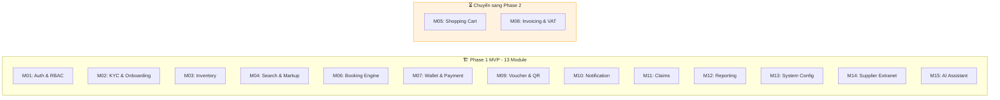

# 🚀 Giai Đoạn 1: Kiến Trúc Phần Mềm MVP — Ổn Định Để Bảo Vệ Đồ Án

> Tài liệu mô tả phạm vi kiến trúc phần mềm được triển khai trong giai đoạn MVP. Tập trung vào luồng nghiệp vụ cốt lõi, đảm bảo hệ thống chạy ổn định, dễ demo và đủ chất lượng để hội đồng duyệt.

---

## 🎯 Mục Tiêu Phase 1

*   Triển khai đầy đủ **12 module nghiệp vụ MVP** với 45 Use Case cốt lõi.
*   Code theo đúng **Clean Architecture + CQRS** — không cắt góc, không hardcode.
*   Đảm bảo 3 luồng tài chính an toàn tuyệt đối: **Giữ chỗ**, **Thanh toán ví**, **Nạp ví VNPay**.
*   Có thể demo bằng 1 lệnh `docker-compose up -d` trước hội đồng.

---

## 🏗️ 1. Phạm Vi Module Triển Khai Phase 1



### Lý do hoãn 2 module

| Module | Lý do hoãn sang Phase 2 |
| :--- | :--- |
| **M05 - Shopping Cart** | Combo Cart cần Unified Hold + Atomic Payment — logic Saga/2-Phase Commit phức tạp. Cần booking đơn lẻ ổn định trước. |
| **M08 - Invoicing & VAT** | Yêu cầu tích hợp API hóa đơn điện tử bên thứ ba + tuân thủ quy định thuế. Không ảnh hưởng đến luồng giao dịch chính. |

---

## 🔧 2. Chi Tiết Từng Tầng Kiến Trúc MVP

### 2.1 Domain Layer — Entities & Business Rules

Tầng Domain chứa logic nghiệp vụ thuần túy, không phụ thuộc framework nào.

| Entity | Vai trò | Domain Methods quan trọng |
| :--- | :--- | :--- |
| **Booking** | Đơn đặt chỗ | `Hold()` → validate + đổi status HELD. `Pay()` → validate balance + đổi PAID. `Cancel()` → hoàn slot. `Expire()` → auto-cancel. |
| **BookingPassenger** | Hành khách định danh | Chứa dữ liệu của từng khách lẻ để đặt vé và check-in (Tên, CCCD, SĐT, Ngày sinh). |
| **Wallet** | Ví tài chính đại lý | `Credit(amount)` → cộng balance + tạo LedgerEntry. `Debit(amount)` → kiểm tra đủ tiền + trừ balance + tạo LedgerEntry. |
| **WalletLedger** | Sổ cái giao dịch | Immutable — chỉ INSERT, không bao giờ UPDATE/DELETE. Mỗi entry lưu `balance_after` để audit. |
| **InventorySlot** | Slot chỗ theo ngày | `DecrementSlot()` → giảm available_slots + tăng version. `RestoreSlot()` → hoàn khi hủy đơn. |
| **Agency** | Đại lý du lịch | `ApproveKyc()`, `RejectKyc()`, `Suspend()` — quản lý vòng đời KYC. |
| **Voucher** | Vé điện tử | `Issue()` → sinh QR Code + link PDF. |

**Quy tắc nghiệp vụ nhúng trong Domain:**
*   Booking chỉ được Pay khi status = `HELD` và chưa hết `hold_expires_at`.
*   Wallet.Debit bắt buộc kiểm tra `balance >= amount` trước khi trừ.
*   InventorySlot.DecrementSlot kiểm tra `available_slots > 0`.
*   WalletLedger luôn ghi `balance_after = wallet.Balance` tại thời điểm giao dịch.

### 2.2 Application Layer — CQRS Handlers

Mỗi Use Case được implement bởi 1 Command Handler hoặc 1 Query Handler:

```text
Features/
├── Auth/
│   ├── Commands/
│   │   ├── LoginCommand.cs             → Xác thực + sinh JWT
│   │   ├── RefreshTokenCommand.cs      → Rotation + sinh token mới
│   │   └── ChangePasswordCommand.cs    → Đổi mật khẩu
│   └── Queries/
│       └── GetCurrentUserQuery.cs      → Lấy info user từ JWT Claims
│
├── Bookings/
│   ├── Commands/
│   │   ├── HoldBookingCommand.cs       → Redis Lock + Deduct Slot + Create Booking & Passengers
│   │   ├── PayBookingCommand.cs        → Debit Wallet + Ledger + Trigger Voucher
│   │   └── CancelBookingCommand.cs     → Restore Slot + Cancel Booking
│   └── Queries/
│       ├── GetBookingListQuery.cs       → Phân trang, lọc theo status/agency
│       └── GetBookingDetailQuery.cs     → Chi tiết 1 booking kèm voucher & passengers
│
├── Wallets/
│   ├── Commands/
│   │   ├── CreditWalletCommand.cs      → Admin nạp ví + Ledger
│   │   └── DebitWalletCommand.cs       → Admin trừ ví + Ledger
│   └── Queries/
│       ├── GetWalletBalanceQuery.cs     → Số dư + hạn mức
│       └── GetWalletHistoryQuery.cs     → Lịch sử giao dịch phân trang
│
├── AiAssistant/
│   ├── Commands/
│   │   └── SendAiChatCommand.cs        → Nhận text, gọi Gemini API, trả JSON combo
│   └── Services/
│       ├── IAiModelService.cs
│       └── AiModelService.cs           → Gọi trực tiếp Gemini API qua HttpClient
│
├── Inventory/
│   ├── Commands/
│   │   ├── ExportQuotationCommand.cs   → Xuất báo giá combo/dịch vụ dạng PDF/Excel
│   │   └── ...
│   └── Queries/
│       └── SearchInventoryQuery.cs     → Tìm kiếm (Staff bị ẩn markup)
│
├── Carts/
│   ├── Commands/
│   │   ├── AddToCartCommand.cs         → Thêm dịch vụ vào giỏ hàng
│   │   ├── RemoveFromCartCommand.cs    → Xóa dịch vụ khỏi giỏ hàng
│   │   ├── UnifiedHoldCartCommand.cs   → Quy trình Saga giữ chỗ toàn bộ combo
│   │   └── PayCartCommand.cs           → Thanh toán gộp combo 1 chạm
│   └── Queries/
│       └── GetCartQuery.cs             → Xem chi tiết giỏ hàng hiện tại
│
└── ... (tương tự cho Agencies, Claims, Notifications, Vouchers)
```

### 2.3 Infrastructure Layer — Kỹ Thuật Cài Đặt

| Service | Implement Interface | Công nghệ | Ghi chú |
| :--- | :--- | :--- | :--- |
| `AppDbContext` | — | EF Core 8 | Fluent API config, DbSet cho tất cả Entities |
| `BookingRepository` | `IBookingRepository` | EF Core | Include BookingDetails + Voucher |
| `UnitOfWork` | `IUnitOfWork` | EF Core | BeginTransaction, Commit, Rollback |
| `RedisDistributedLockService` | `IDistributedLockService` | StackExchange.Redis | `SET key NX EX 30` + Release in finally |
| `RedisCacheService` | `ICacheService` | StackExchange.Redis | Idempotent Key TTL 5 phút cho VNPay IPN |
| `VnPayService` | `IVnPayService` | HttpClient | Tạo Payment URL + Verify HMAC IPN |
| `JwtTokenService` | `IJwtTokenService` | System.IdentityModel | HS256, AccessToken 30min, RefreshToken 7 days |
| `PushNotificationService` | `IPushNotificationService` | FirebaseAdmin SDK | Gửi FCM Push tới Mobile App |
| `FileStorageService` | `IFileStorageService` | AWS SDK / GCS | Upload ảnh KYC, PDF Voucher |
| `AutoCancelExpiredBookingsJob` | — | Hangfire | Recurring mỗi phút, hủy HELD quá 15 phút |
| `SyncPartnerBookingJob` | — | Hangfire | Fire-and-forget, gọi API đối tác + Retry |
| `KycExpiryReminderJob` | — | Hangfire | Recurring hàng ngày, nhắc KYC sắp hết hạn |
| `AiModelService` | `IAiModelService` | HttpClient | Gọi API Google Gemini, cấu hình system instruction và tools |

### 2.4 Presentation Layer — API Controllers

| Controller | Endpoints chính | Auth |
| :--- | :--- | :--- |
| `AuthController` | POST /login, POST /refresh, POST /change-password | Public / Authenticated |
| `AgencyController` | POST /register, GET /list, PUT /{id}/kyc/approve | Admin / Manager |
| `BookingController` | POST /hold, POST /{id}/pay, DELETE /{id}, GET /list | Manager, Staff |
| `CartController` | POST /cart/add, DELETE /cart/remove, GET /cart, POST /cart/hold, POST /cart/pay | Manager, Staff |
| `WalletController` | GET /balance, GET /history, POST /credit, POST /debit | Admin / Manager, Staff |
| `PaymentController` | POST /vnpay/create-url, POST /vnpay/ipn | Manager, Staff / Public |
| `InventoryController` | GET /search, POST /, PUT /{id}/slots, DELETE /{id}, POST /export-quotation | Search: All (Staff ẩn markup) / Admin, Supplier / All (Báo giá) |
| `VoucherController` | GET /{bookingId}/voucher, GET /{id}/download | Manager, Staff |
| `ClaimController` | POST /, GET /list, PUT /{id}/resolve | Manager, Staff / Admin |
| `NotificationController` | GET /list, PUT /{id}/read, PUT /read-all | All authenticated |
| `SystemConfigController` | GET /, PUT / | Admin only |
| `AiAssistantController` | POST /ai/chat | Manager, Staff |

---

## 🔒 3. Luồng Nghiệp Vụ Tài Chính An Toàn

### 3.1 Luồng Giữ Chỗ - Hold Booking

```text
1. Client gửi HoldBookingCommand (kèm danh sách Passengers)
2. ValidationBehavior: kiểm tra input hợp lệ (Tên không dấu, định dạng CCCD/Hộ chiếu, SĐT...)
3. Handler:
   a. Kiểm tra Agency KYC = APPROVED
   b. Kiểm tra Wallet.Balance >= TotalAmount
   c. Redis: AcquireLock("lock:slot:{slotId}")   ← Chống Race Condition
   d. DB: SELECT slot WHERE available_slots > 0
   e. Domain: slot.DecrementSlot()                ← OCC version check
   f. Domain: Booking.Hold(agency, slot, amount, passengers)
   g. DB: INSERT Booking + INSERT BookingPassengers + UPDATE Slot (trong 1 Transaction)
   h. Redis: ReleaseLock (trong finally block)
   i. Hangfire: Schedule AutoCancelJob(bookingId, 15min)
   j. Push: Gửi thông báo "Đặt chỗ thành công, thanh toán trong 15 phút"
4. Return: BookingDto + PNR Code
```

### 3.2 Luồng Thanh Toán - Pay Booking

```text
1. Client gửi PayBookingCommand
2. Handler:
   a. DB: SELECT Booking WHERE status = HELD AND hold_expires_at > now
   b. DB: SELECT Wallet (agency's wallet)
   c. Domain: wallet.Debit(totalAmount)            ← Balance check + Ledger
   d. Domain: booking.Pay()                        ← Status → PAID
   e. DB: UPDATE Wallet + INSERT Ledger + UPDATE Booking (trong 1 Transaction)
   f. DomainEvent: BookingPaidEvent raised
   g. Event Handler:
      - IssueVoucher → sinh QR + PDF
      - SyncPartnerBookingJob → Hangfire gọi API đối tác
      - PushNotification → "Thanh toán thành công, vé đang xuất"
3. Return: BookingDto + VoucherLink
```

### 3.3 Luồng Nạp Ví VNPay - IPN Callback

```text
1. VNPay gọi POST /vnpay/ipn với query params
2. Handler:
   a. Verify HMAC SHA512 hash → đảm bảo request thật từ VNPay
   b. Redis: CHECK idempotent key "vnpay:txn:{transactionId}"
      - Nếu TỒN TẠI → return OK ngay (đã xử lý rồi)
      - Nếu CHƯA → tiếp tục xử lý
   c. Redis: SET idempotent key TTL 5 phút
   d. DB: SELECT Wallet by AgencyId
   e. Domain: wallet.Credit(amount)                ← Balance += amount + Ledger
   f. DB: UPDATE Wallet + INSERT Ledger (trong 1 Transaction)
   g. Push: "Nạp ví thành công +{amount} VNĐ"
3. Return: {"RspCode": "00"} cho VNPay
```

### 3.4 Luồng Xử Lý Trợ Lý AI Báo Giá & Tạo Combo

```text
1. Client gửi SendAiChatCommand ("Tìm combo đi Đà Lạt ngày 15/9 cho 2 người...")
2. Handler:
   a. Gọi IAiModelService.GenerateResponseAsync(prompt)
   b. System Instruction của Gemini yêu cầu phân tích text và dùng Tool: search_inventory
   c. HttpClient gọi Gemini API -> Gemini trả về yêu cầu gọi Function Calling
   d. Handler chặn lại, thực thi API Search nội bộ lấy danh sách phòng/vé sỉ
   e. Handler tính toán giá sỉ + tỉ lệ Markup (%) hiện tại của đại lý đó
   f. Handler gửi lại kết quả dữ liệu thô đã cộng markup cho Gemini để LLM sinh câu trả lời tự nhiên định dạng JSON đề xuất
   g. Đề xuất hiển thị 3 combo kèm thông số và nút [Đặt Combo]
3. Client nhấn nút [Đặt Combo] trên giao diện AI chat -> App chuyển hướng sang màn hình UI Hold Booking để người dùng tự xác nhận -> Gọi API Hold Booking (3.1)
* Lưu ý: AI không tự kích hoạt giữ chỗ trực tiếp để tránh tình trạng spam khóa kho (Hold) tự động.
```

### 3.5 Luồng Giỏ hàng Combo & Thanh toán gộp (Saga Orchestration)

```text
1. Client gửi UnifiedHoldCartCommand (danh sách item: vé xe slotA, khách sạn slotB, tour slotC + danh sách Passengers)
2. Handler khởi tạo Saga Orchestrator:
   a. Lần lượt thực hiện giữ chỗ (Hold) cho từng dịch vụ trong giỏ hàng.
   b. Bước 1: Redis lock slotA -> DB decrement slotA -> Thành công.
   c. Bước 2: Redis lock slotB -> DB decrement slotB -> THẤT BẠI (Ví dụ: khách sạn hết phòng).
   d. Kích hoạt Compensating Transactions (Giao dịch bù đắp):
      - Tự động hoàn lại slot kho (Increment) cho slotA ở Bước 1.
      - Giải phóng các Redis Lock đã chiếm giữ.
   e. Trả về lỗi chi tiết cho client: "Đặt combo thất bại do dịch vụ Khách sạn hết chỗ".
3. Nếu toàn bộ dịch vụ giữ chỗ thành công:
   a. Tạo các bản ghi Booking tương ứng ở trạng thái HELD (chung một PNR Code / Group ID).
   b. Lưu thông tin BookingPassenger đi kèm cho từng booking dịch vụ phù hợp.
   c. Schedule Hangfire AutoCancelJob cho từng booking (15 phút đếm ngược).
   d. Trả về danh sách Booking DTOs + PNR Code chung.
4. Đại lý gửi PayCartCommand để thanh toán gộp 1 chạm:
   a. DB: Khóa dòng số dư ví đại lý (SELECT FOR UPDATE).
   b. Kiểm tra: Số dư ví >= Tổng tiền của cả giỏ hàng combo.
   c. Thực hiện trừ tiền ví 1 lần (Single Debit) -> Tạo Ledger entry loại DEBIT cho cả combo.
   d. Cập nhật trạng thái của TẤT CẢ booking trong combo thành PAID.
   e. Phát hành E-Voucher QR Code riêng cho dịch vụ nội bộ (Tour, Khách sạn của Supplier trực tiếp trên sàn).
   f. Đối với nhà xe đối tác bên thứ ba (External Transport - Bus): Nhà xe đối tác đối chiếu thông tin hành khách (BookingPassenger) lúc đón khách để xác nhận lên xe -> đơn chuyển COMPLETED.
   g. Đối với hãng bay đối tác bên thứ ba (External Flight): Hệ thống tải vé máy bay thật (E-Ticket PDF) và gửi về cho đại lý chuyển khách tự check-in tại sân bay, đơn tự động COMPLETED sau giờ khởi hành.
```

---

## 🧪 4. Chiến Lược Testing MVP

| Loại Test | Phạm vi | Công cụ | Ưu tiên |
| :--- | :--- | :--- | :--- |
| **Unit Test** | Domain Entities methods: Hold, Pay, Credit, Debit, DecrementSlot | xUnit + Moq | 🔴 Bắt buộc |
| **Unit Test** | Application Handlers: HoldBooking, PayBooking, CreditWallet | xUnit + Moq | 🔴 Bắt buộc |
| **Integration Test** | API Endpoints: Auth flow, Booking flow, Wallet flow | xUnit + WebApplicationFactory | 🟡 Nên có |
| **Manual Test** | Toàn bộ luồng E2E trên Mobile App + Swagger | Postman + React Native | 🟡 Nên có |

### Unit Test bắt buộc cho Domain

```text
Booking.Hold()
  ✅ Should create booking with HELD status
  ✅ Should set hold_expires_at = now + 15 minutes
  ❌ Should throw when slot unavailable

Wallet.Debit()
  ✅ Should decrease balance and create ledger entry
  ✅ Should set balance_after correctly
  ❌ Should throw InsufficientBalanceException when balance < amount

InventorySlot.DecrementSlot()
  ✅ Should decrease available_slots by 1
  ✅ Should increment version for OCC
  ❌ Should throw when available_slots = 0
```

---

## 📋 5. Checklist Hoàn Thành Phase 1

| # | Hạng mục | Tiêu chí hoàn thành |
| :---: | :--- | :--- |
| 1 | Domain Layer | Tất cả Entities có domain methods, không có logic trong Controller/Handler |
| 2 | Application Layer | Mỗi UC có đúng 1 Command/Query Handler, FluentValidation cho mọi Command |
| 3 | Infrastructure Layer | EF Core Migrations chạy, Redis Lock hoạt động, VNPay IPN verify OK |
| 4 | WebAPI Layer | Swagger hiển thị đầy đủ endpoints, JWT Auth hoạt động |
| 5 | Background Jobs | AutoCancel HELD chạy mỗi phút, SyncPartner có Retry Policy |
| 6 | Testing | Unit test cho 3 luồng tài chính: Hold, Pay, VNPay IPN |
| 7 | Docker | `docker-compose up -d` khởi động toàn bộ: API + Redis + PostgreSQL + Hangfire |
| 8 | Security | JWT + Refresh Token Rotation + RBAC 4 roles + Idempotent VNPay |
| 9 | AI Assistant | Tích hợp HttpClient kết nối Gemini API, xử lý Function Calling lấy giá kèm markup |
| 10 | Shopping Cart | Triển khai giỏ hàng combo và quy trình Saga (Unified Hold + Atomic Debit) |
| 11 | Mobile App | Thiết kế REST API và WebSocket kết nối ổn định cho React Native |
