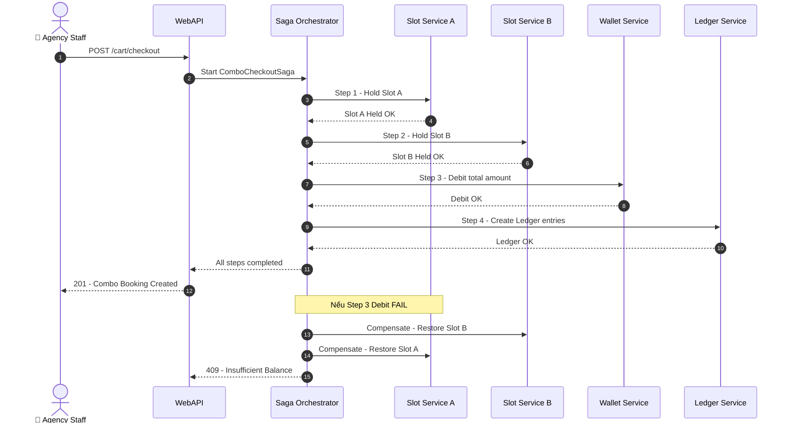
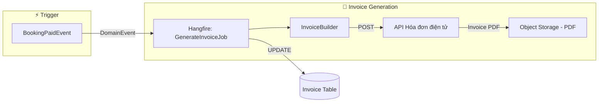
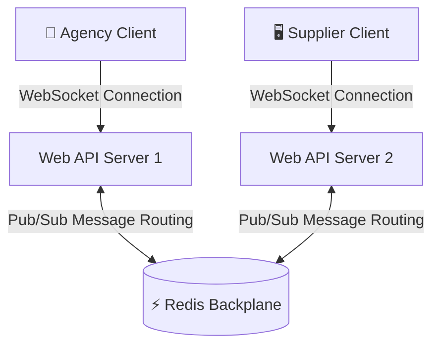
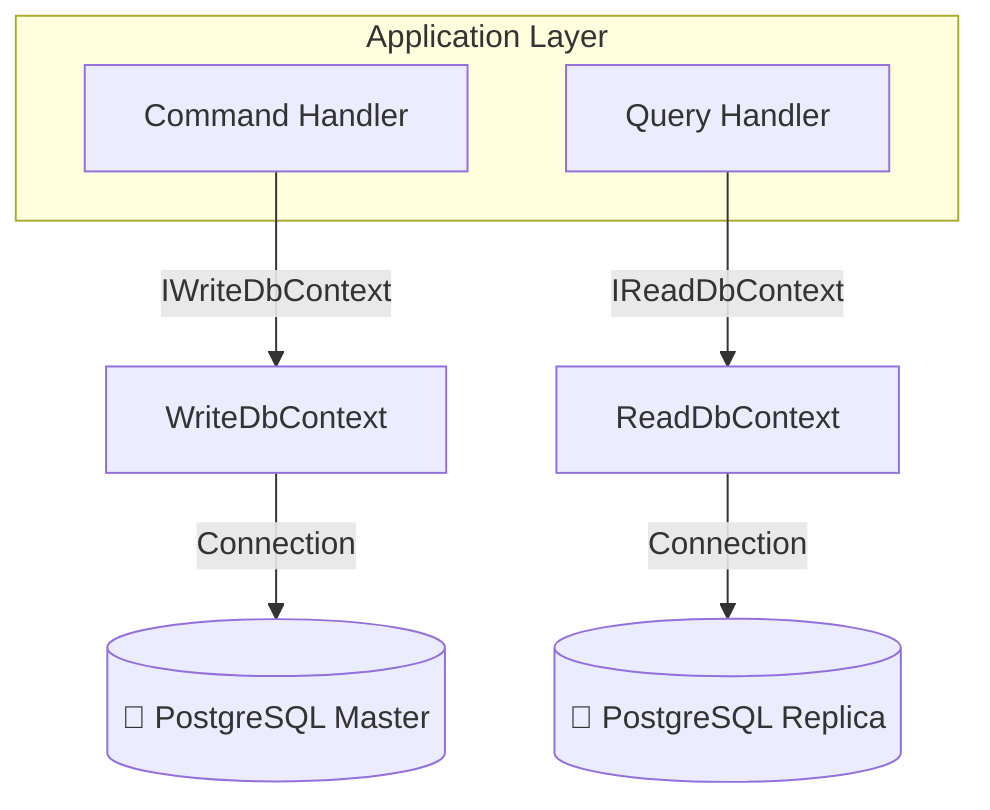
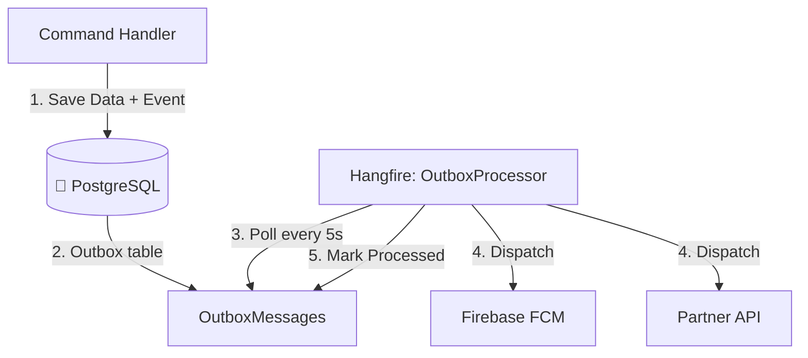
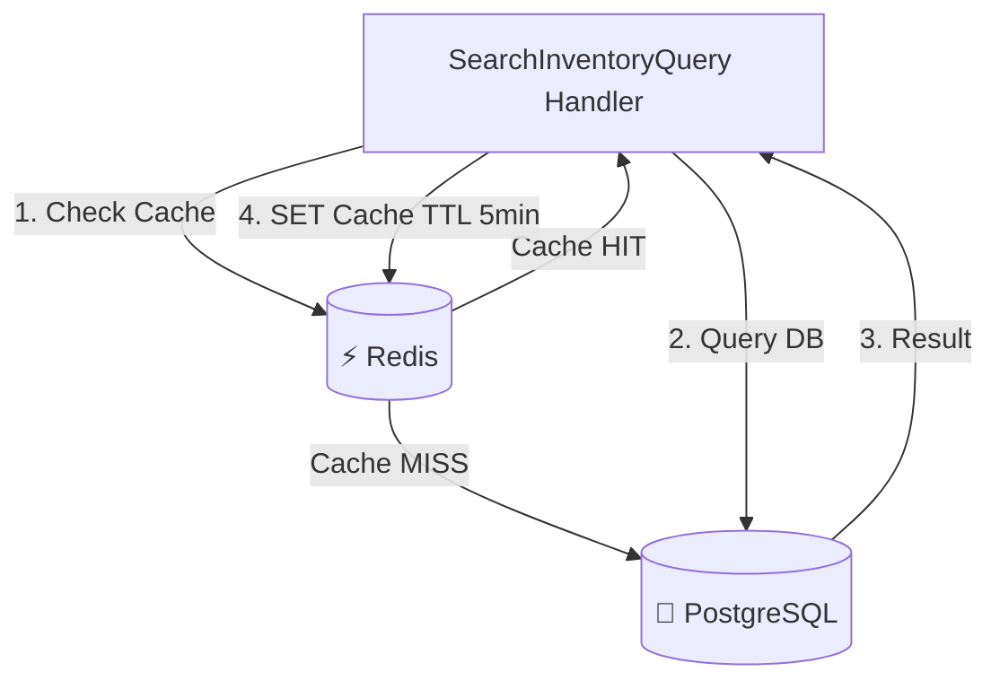
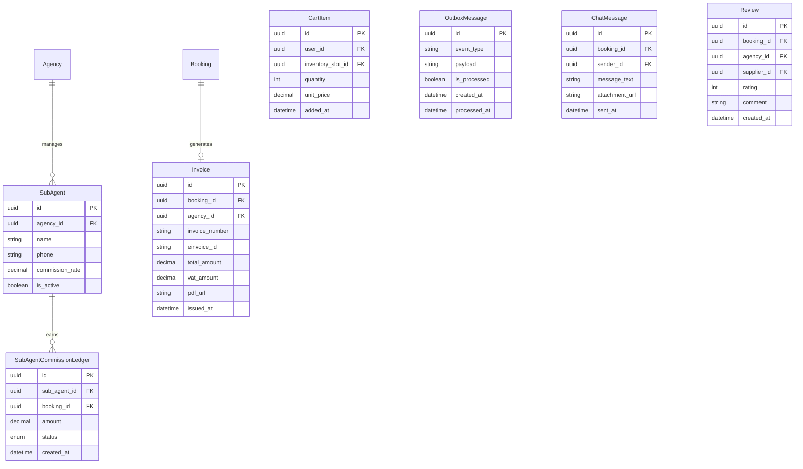

# 📈 Giai Đoạn 2: Kiến Trúc Phần Mềm Scale-Up

> Tài liệu mô tả các nâng cấp kiến trúc phần mềm khi hệ thống MVP đã vận hành ổn định. Bao gồm: module mới, pattern nâng cao, tối ưu hiệu năng và chuẩn bị cho quy mô production.
>
> **Điều kiện kích hoạt:** Phase 1 hoạt động ổn định ≥ 1 tháng, unit test pass 100%, không có bug tài chính.

---

## 🎯 Mục Tiêu Phase 2

*   Triển khai 2 module còn lại: **Shopping Cart Combo** và **Invoicing & VAT**.
*   Nâng cấp kiến trúc hỗ trợ **đa dịch vụ đồng thời** — Saga Pattern.
*   Tối ưu hiệu năng đọc bằng **Read/Write Split** PostgreSQL Master-Replica.
*   Bổ sung **hệ thống CTV** và **VietQR Auto-Credit**.
*   Event-Driven Architecture cho side effects phức tạp.

---

## 🔄 1. So Sánh Kiến Trúc Phase 1 vs Phase 2

| Thành phần | Phase 1 - MVP | Phase 2 - Scale-Up |
| :--- | :--- | :--- |
| **Booking** | Đặt từng dịch vụ đơn lẻ | Giỏ hàng Combo - đặt nhiều dịch vụ 1 lần |
| **Transaction** | UnitOfWork đơn giản | **Saga Pattern** cho Combo multi-supplier |
| **DB Read/Write** | 1 instance chung | **Read/Write Split** - Master ghi, Replica đọc |
| **Nạp ví** | VNPay duy nhất | VNPay + **VietQR biến động** phí 0% |
| **Hóa đơn** | Không có | **Hóa đơn VAT điện tử** auto-generate |
| **Phân phối** | Agency trực tiếp | Agency + **Cộng tác viên Sub-Agent** |
| **Caching** | Redis cache đơn giản | **Cache-Aside Pattern** + Cache Invalidation |
| **Event Handling** | MediatR Notification in-process | **Outbox Pattern** + reliable event delivery |

---

## 🏗️ 2. Module Mới Phase 2

### 2.1 Shopping Cart Combo - Saga Pattern

Đặt combo nhiều dịch vụ của nhiều NCC cùng lúc đòi hỏi **Orchestrator Saga** — mỗi bước có compensating action để rollback nếu thất bại:



**Cấu trúc code mới:**

```text
Features/
├── Cart/
│   ├── Commands/
│   │   ├── AddToCartCommand.cs            # Thêm dịch vụ vào giỏ (Redis)
│   │   ├── RemoveFromCartCommand.cs        # Xóa dịch vụ
│   │   └── CheckoutComboCommand.cs         # Kích hoạt Saga Orchestrator
│   ├── Queries/
│   │   └── GetCartQuery.cs                 # Xem giỏ hàng hiện tại
│   └── Sagas/
│       └── ComboCheckoutSaga.cs            # Orchestrator Saga
```

### 2.2 Invoicing & VAT - Auto-Generate



```text
Features/
├── Invoicing/
│   ├── Commands/
│   │   └── GenerateInvoiceCommand.cs       # Tạo hóa đơn VAT
│   ├── Queries/
│   │   ├── GetInvoiceListQuery.cs          # Danh sách hóa đơn
│   │   └── GetInvoiceDownloadQuery.cs      # Tải PDF hóa đơn
│   └── Services/
│       └── EInvoiceApiClient.cs            # Client gọi API hóa đơn điện tử
```

### 2.3 Sub-Agent / CTV System

```text
Features/
├── SubAgents/
│   ├── Commands/
│   │   ├── CreateSubAgentCommand.cs        # Tạo tài khoản CTV
│   │   └── ConfigureCommissionCommand.cs   # Cấu hình hoa hồng %
│   ├── Queries/
│   │   └── GetCommissionReportQuery.cs     # Báo cáo hoa hồng theo CTV
│   └── EventHandlers/
│       └── BookingPaidEventHandler.cs      # Auto tính hoa hồng khi đơn PAID
```

**Logic hoa hồng:**
1. CTV đặt đơn → trừ ví Agency Manager chính.
2. `BookingPaidEvent` → Handler tính: `commission = totalAmount * commissionRate`.
3. Cộng dồn vào `SubAgentCommissionLedger` → Agency Manager đối soát cuối tháng.

### 2.4 VietQR Auto-Credit

```text
Features/
├── VietQR/
│   ├── Commands/
│   │   ├── CreateVietQRCommand.cs          # Sinh mã QR biến động
│   │   └── ProcessBankWebhookCommand.cs    # Xử lý webhook từ PayOS/Casso
│   └── Services/
│       └── BankWebhookVerifier.cs          # Xác thực HMAC webhook ngân hàng
```

### 2.5 Real-time Chat (SignalR & Redis Backplane)



*   **SignalR Hub:** Lớp trung gian quản lý kết nối WebSocket. Client gửi tin nhắn qua `ChatHub.SendMessage(bookingId, text)`.
*   **Redis Backplane:** Khi hệ thống có nhiều instance API chạy sau Load Balancer, Redis đóng vai trò trung chuyển tin nhắn. Hub tự động publish event lên Redis, các instance khác subscribe và chuyển tin nhắn xuống client tương ứng.
*   **Cấu trúc thư mục code:**
    ```text
    Infrastructure/
    └── Identity/
        └── ChatHub.cs                      # SignalR Hub xử lý kết nối và điều hướng
    Features/
    ├── Chats/
    │   ├── Commands/
    │   │   └── SendMessageCommand.cs       # Lưu message và trigger SignalR push
    │   └── Queries/
    │       └── GetChatHistoryQuery.cs      # Lấy lịch sử chat theo BookingId
    ```

### 2.6 Review & Rating (Anti-Spam & Auto-Calculate)

*   **Anti-Spam Validation:** Trước khi ghi nhận review vào DB, FluentValidation kiểm tra:
    1. Đơn hàng phải tồn tại và thuộc về Agency thực hiện đánh giá.
    2. Trạng thái đơn hàng phải là `COMPLETED`.
    3. Trực quan hóa qua khóa duy nhất (Unique Index) cặp `BookingId` - không cho phép đánh giá lần 2.
*   **Auto-Calculate average rating:** Để tránh việc mỗi lần hiển thị sản phẩm đều tính `AVG(Rating)` làm chậm DB, ta dùng Hangfire để bất đồng bộ hóa việc tính toán.
    ```text
    [Review Created Event] 
           │
           ▼
    [Outbox Message] 
           │
           ▼
    [Hangfire: UpdateSupplierRatingJob] 
           │
           ▼
    [UPDATE Suppliers SET AverageRating = (AVG) WHERE Id = SupplierId]
    ```
*   **Cấu trúc thư mục code:**
    ```text
    Features/
    ├── Reviews/
    │   ├── Commands/
    │   │   └── CreateReviewCommand.cs      # Gửi đánh giá + Trigger Event
    │   ├── Queries/
    │   │   └── GetSupplierReviewsQuery.cs   # Xem danh sách reviews của Supplier
    │   └── EventHandlers/
    │       └── ReviewCreatedHandler.cs     # Enqueue job tính lại trung bình
    ```

---

## ⚡ 3. Nâng Cấp Kiến Trúc

### 3.1 Read/Write Split - Tối Ưu Database

Phase 1 dùng 1 DbContext cho cả đọc lẫn ghi. Phase 2 tách thành 2 DbContext:



```csharp
// DI Registration trong Program.cs
services.AddDbContext<WriteDbContext>(o => 
    o.UseNpgsql(config["ConnectionStrings:Master"]));

services.AddDbContext<ReadDbContext>(o => 
    o.UseNpgsql(config["ConnectionStrings:Replica"])
     .UseQueryTrackingBehavior(QueryTrackingBehavior.NoTracking));
```

**Lợi ích:** Tải đọc chiếm 80% request → chuyển hết sang Replica → Master chỉ xử lý ghi → giảm latency 50%.

### 3.2 Outbox Pattern - Reliable Event Delivery

Phase 1: Domain Events được xử lý in-process bởi MediatR → nếu Handler gửi Push Notification thất bại, transaction đã commit rồi không rollback được.

Phase 2: Áp dụng **Outbox Pattern** — lưu Event vào bảng `OutboxMessages` trong cùng Transaction với dữ liệu chính. Background Job đọc Outbox và dispatch event:



**Lợi ích:** Đảm bảo event LUÔN được xử lý ít nhất 1 lần (At-Least-Once Delivery), kể cả khi service restart giữa chừng.

### 3.3 Cache-Aside Pattern - Tối Ưu Tìm Kiếm



*   **Dữ liệu cache:** Kết quả tìm kiếm dịch vụ theo điểm đến + ngày. TTL = 5 phút.
*   **Cache Invalidation:** Khi NCC cập nhật slot/giá → xóa cache key liên quan.
*   **Lợi ích:** Giảm 80% query lên PostgreSQL cho tìm kiếm — endpoint phổ biến nhất.

---

## 🗄️ 4. Database Schema Mở Rộng Phase 2

### Bảng mới



### Index mới cần thiết

| Bảng | Cột | Loại Index | Lý do |
| :--- | :--- | :--- | :--- |
| `SubAgentCommissionLedger` | `sub_agent_id, created_at` | B-Tree | Báo cáo hoa hồng theo CTV + khoảng thời gian |
| `Invoice` | `agency_id, issued_at` | B-Tree | Tìm hóa đơn theo đại lý + ngày |
| `OutboxMessage` | `is_processed, created_at` | B-Tree Partial | Job poll chỉ lấy message chưa xử lý |
| `CartItem` | `user_id` | B-Tree | Mỗi user có 1 giỏ hàng |
| `ChatMessage` | `booking_id, sent_at` | B-Tree | Load lịch sử chat nhanh theo phòng/booking |
| `Review` | `supplier_id, created_at` | B-Tree | Lấy danh sách reviews mới nhất của Supplier |
| `Review` | `booking_id` | Unique B-Tree | Chống spam: Đảm bảo 1 booking chỉ được review 1 lần |

---

## 📋 5. Lộ Trình Triển Khai Phase 2

| Sprint | Module / Feature | Thay đổi kiến trúc | Rủi ro |
| :---: | :--- | :--- | :--- |
| **Sprint 1** | Read/Write Split + Cache-Aside | Tách WriteDbContext / ReadDbContext, thêm Redis cache cho Search | Thấp — không thay đổi logic, chỉ tối ưu |
| **Sprint 2** | Shopping Cart + Saga Pattern | Thêm CartController, ComboCheckoutSaga, compensating actions | Cao — cần test kỹ rollback scenario |
| **Sprint 3** | Outbox Pattern | Thêm OutboxMessage table, OutboxProcessor Job | Trung bình — refactor event handling |
| **Sprint 4** | VietQR Auto-Credit | Thêm BankWebhookController, VietQR service | Thấp — tương tự VNPay IPN flow |
| **Sprint 5** | Invoicing & VAT | Thêm Invoice entity, EInvoice API client, auto-generate job | Trung bình — phụ thuộc API bên thứ ba |
| **Sprint 6** | Sub-Agent / CTV | Thêm SubAgent entity, Commission logic, report query | Thấp — mở rộng từ Agency/Wallet đã có |
| **Sprint 7** | Real-time Chat + Rating | Thêm ChatHub, Redis Backplane, Review entity, unique checks | Trung bình — tích hợp socket & async jobs |

---

## 📊 6. Tổng Kết Công Nghệ Bổ Sung Phase 2

| Công nghệ / Pattern | Vai trò Phase 2 |
| :--- | :--- |
| **Saga Pattern** | Điều phối giao dịch phân tán cho Combo Cart multi-supplier |
| **Outbox Pattern** | Đảm bảo event delivery tin cậy - At-Least-Once |
| **Read/Write Split** | Tách biệt đọc/ghi PostgreSQL, giảm tải Master 80% |
| **Cache-Aside** | Redis cache kết quả tìm kiếm, giảm DB query |
| **PayOS / Casso SDK** | Bank Webhook cho VietQR auto-credit |
| **EInvoice API** | Xuất hóa đơn VAT điện tử tự động |
| **Microsoft.AspNetCore.SignalR** | Xây dựng kết nối WebSocket real-time phục vụ Chat Hub |
| **StackExchange.Redis (Backplane)** | Message broker đồng bộ tin nhắn Chat giữa các Web API server chạy song song |
