# 📊 Đặc Tả Actor & Use Case — B2B Travel Platform

> Tài liệu mô tả toàn bộ tác nhân (Actor), chức năng, luồng hoạt động hệ thống và sơ đồ Use Case cho dự án B2B Travel Platform.

---

## 1. Tổng Quan Hệ Thống

**B2B Travel Platform** là nền tảng giao dịch khép kín dành cho đại lý du lịch vừa/nhỏ tại Việt Nam. Hệ thống đóng vai trò trung gian phân phối dịch vụ từ nhà cung cấp sỉ (Supplier) đến đại lý bán lẻ, tối ưu hóa quy trình: **Tìm kiếm → Giữ chỗ → Thanh toán ví → Xuất voucher → Bàn giao dịch vụ QR offline**.

### Kiến trúc module hệ thống

```mermaid
graph LR
    subgraph Core["🏗 Hệ thống B2B Travel Platform"]
        M01["M01: Auth & RBAC"]
        M02["M02: KYC & Onboarding"]
        M03["M03: Inventory"]
        M04["M04: Search & Markup"]
        M05["M05: Shopping Cart"]
        M06["M06: Booking Engine"]
        M07["M07: Wallet & Payment"]
        M08["M08: Invoicing & VAT"]
        M09["M09: Voucher & QR"]
        M10["M10: Notification"]
        M11["M11: Claims & After-Sales"]
        M12["M12: Reporting & BI"]
        M13["M13: System Config"]
        M14["M14: Supplier Extranet"]
        M15["M15: AI Assistant"]
        M16["M16: Real-time Chat"]
        M17["M17: Review & Rating"]
    end
```

---

## 2. Danh Sách Actor

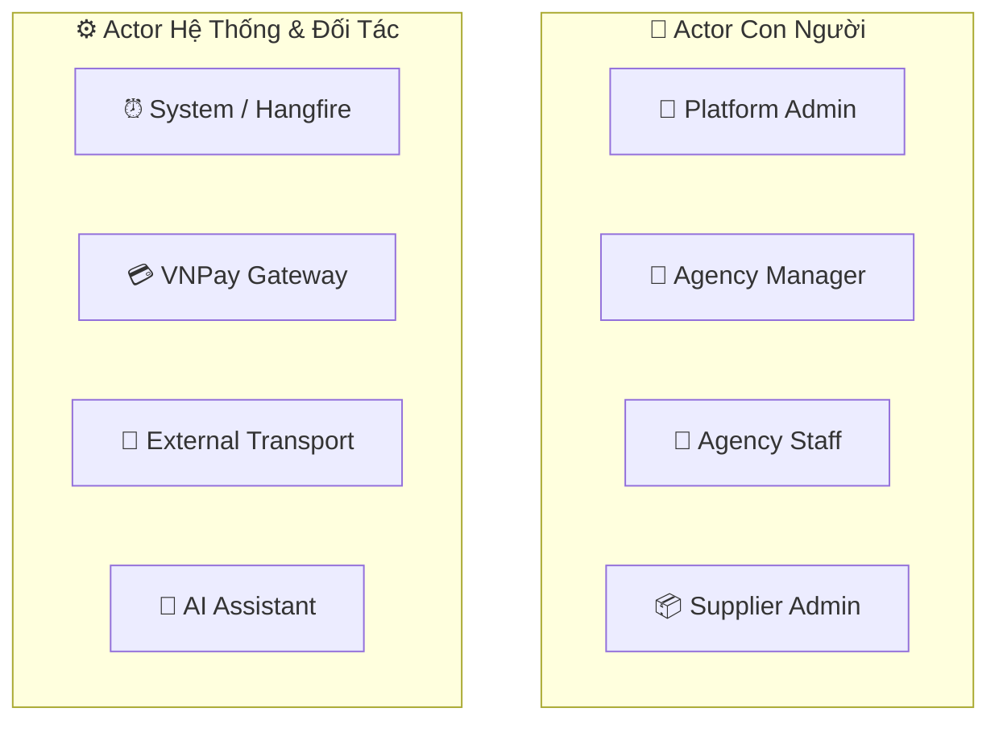
```mermaid
graph TB
    subgraph Human["👥 Actor Con Người"]
        PA["🔑 Platform Admin"]
        AM["🏢 Agency Manager"]
        AS["👤 Agency Staff"]
        SA["📦 Supplier Admin"]
    end

    subgraph System["⚙️ Actor Hệ Thống & Đối Tác"]
        SYS["⏰ System / Hangfire"]
        VNPAY["💳 VNPay Gateway"]
        EXT["🚌 External Transport"]
        AI_AST["🤖 AI Assistant"]
    end
```

| # | Actor | Loại | Mô tả |
|---|-------|------|-------|
| 1 | **Platform Admin** | Con người | Quản trị viên cấp cao nhất, toàn quyền quản lý hệ thống |
| 2 | **Agency Manager** | Con người | Chủ / Quản lý đại lý du lịch |
| 3 | **Agency Staff** | Con người | Nhân viên bán hàng tại đại lý |
| 4 | **Supplier Admin** | Con người | Quản trị viên nhà cung cấp dịch vụ (khách sạn, tour...) |
| 5 | **External Transport** | Bên ngoài | Đối tác vận chuyển (nhà xe Phương Trang, hãng bay) kết nối qua API |
| 6 | **System / Hangfire** | Hệ thống | Tác vụ nền chạy tự động (auto-cancel, đồng bộ đặt vé đối tác, nhắc KYC) |
| 7 | **VNPay Gateway** | Bên ngoài | Cổng thanh toán — gọi IPN callback khi nạp tiền thành công |
| 8 | **AI Assistant** | Hệ thống | Trợ lý AI hỗ trợ tự động tìm kiếm, báo giá và tạo combo bằng ngôn ngữ tự nhiên |

---

## 3. Chi Tiết Từng Actor & Chức Năng

---

### 3.1 🔑 Platform Admin

**Vai trò:** Quản trị viên toàn hệ thống. Phê duyệt đại lý, quản lý tài chính, cấu hình hệ thống, giải quyết khiếu nại, phát hành hóa đơn.

**Chức năng:**

| # | Chức năng | Module | Mô tả |
|---|-----------|--------|-------|
| 1 | Duyệt KYC đại lý | KYC | Phê duyệt hoặc từ chối hồ sơ KYC của đại lý mới đăng ký |
| 2 | Đình chỉ đại lý | KYC | Đình chỉ hoạt động đại lý vi phạm chính sách |
| 3 | Xem danh sách đại lý | KYC | Xem toàn bộ đại lý, lọc theo trạng thái KYC |
| 4 | Nạp tiền ví đại lý | Wallet | Nạp tiền (Credit) vào ví đại lý sau khi xác nhận chuyển khoản |
| 5 | Trừ tiền ví đại lý | Wallet | Điều chỉnh thủ công số dư ví (kèm audit log) |
| 6 | Xem tất cả booking | Booking | Xem toàn bộ đơn đặt chỗ trên hệ thống |
| 7 | Quản lý kho dịch vụ | Inventory | Tạo/cập nhật/ngừng bán dịch vụ du lịch |
| 8 | Phát hành voucher | Voucher | Phát hành voucher/phiếu dịch vụ sau khi đơn PAID |
| 9 | Duyệt khiếu nại | Claim | Duyệt hoặc từ chối yêu cầu khiếu nại từ đại lý |
| 10 | Xem dashboard & báo cáo | Report | Dashboard tổng quan, báo cáo doanh thu, giao dịch ví |
| 11 | Xuất báo cáo | Report | Xuất dữ liệu giao dịch dạng Excel |
| 12 | Cấu hình hệ thống | Config | Thiết lập tham số (phí dịch vụ, thời gian hold, API đối tác) |
| 13 | Đổi mật khẩu | Auth | Cập nhật mật khẩu cá nhân bảo mật tài khoản |
| 14 | Quản lý hóa đơn VAT (Phase 2) | Invoice | Xem danh sách và phát hành hóa đơn VAT điện tử |

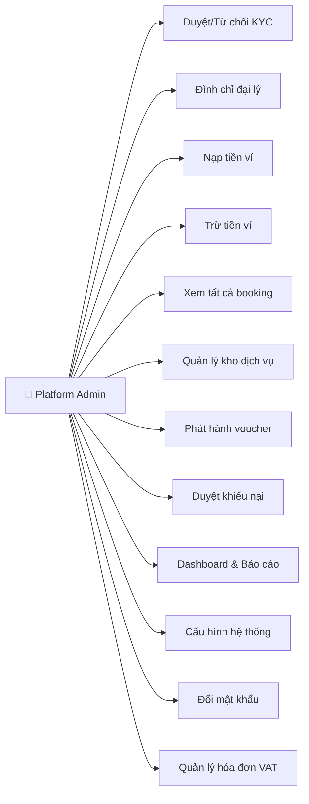
```mermaid
graph LR
    PA["🔑 Platform Admin"]

    PA --> UC_KYC["Duyệt/Từ chối KYC"]
    PA --> UC_SUSPEND["Đình chỉ đại lý"]
    PA --> UC_CREDIT["Nạp tiền ví"]
    PA --> UC_DEBIT["Trừ tiền ví"]
    PA --> UC_VIEW_BK["Xem tất cả booking"]
    PA --> UC_INV["Quản lý kho dịch vụ"]
    PA --> UC_VOUCHER["Phát hành voucher"]
    PA --> UC_CLAIM["Duyệt khiếu nại"]
    PA --> UC_REPORT["Dashboard & Báo cáo"]
    PA --> UC_CONFIG["Cấu hình hệ thống"]
    PA --> UC_PW["Đổi mật khẩu"]
    PA --> UC_INV_VAT["Quản lý hóa đơn VAT"]
```

---

### 3.2 🏢 Agency Manager

**Vai trò:** Chủ hoặc quản lý đại lý du lịch. Quản lý nhân viên, cấu hình markup, giữ chỗ, thanh toán, quản lý cộng tác viên, giao tiếp với nhà cung cấp.

**Chức năng:**

| # | Chức năng | Module | Mô tả |
|---|-----------|--------|-------|
| 1 | Đăng ký đại lý mới | Onboard | Đăng ký đại lý vào hệ thống, nộp hồ sơ KYC |
| 2 | Đổi mật khẩu & Hồ sơ | Auth | Đổi mật khẩu, cập nhật thông tin cá nhân (Tên, SĐT, Email) |
| 3 | Quản lý nhân viên | Staff | Thêm mới tài khoản Staff, Khóa/Mở khóa tài khoản nhân viên |
| 4 | Tìm kiếm dịch vụ | Search | Tìm kiếm dịch vụ sỉ (giá đã cộng markup) |
| 5 | Cấu hình markup | Search | Cập nhật tỷ lệ markup (phí dịch vụ) cho đại lý |
| 6 | Giữ chỗ (Hold) | Booking | Giữ chỗ tạm thời, nhận mã PNR, đếm ngược 15 phút |
| 7 | Hủy đơn chủ động | Booking | Hủy đơn đang HELD chủ động trước khi hết 15 phút để hoàn slot kho |
| 8 | Thanh toán (Pay) | Booking | Thanh toán đơn hàng bằng ví đại lý → xuất voucher |
| 9 | Xem số dư ví | Wallet | Xem số dư khả dụng, hạn mức tín dụng công nợ |
| 10 | Xem lịch sử ví | Wallet | Xem lịch sử các giao dịch nạp/trừ ví chi tiết (Ledger) |
| 11 | Nạp ví qua VNPay | Payment | Tạo URL thanh toán VNPay để nạp tiền vào ví |
| 12 | Tải E-Voucher | Voucher | Tải E-Voucher / Vé điện tử (PDF) về máy |
| 13 | Tạo khiếu nại | Claim | Gửi yêu cầu hoàn tiền, hủy vé, giải quyết tranh chấp |
| 14 | Xem thông báo | Notification | Nhận và quản lý thông báo hệ thống |
| 15 | Trợ lý AI Báo Giá & Combo | AI Assistant | Chat NLP nhận đề xuất combo kèm giá + markup và đặt giữ chỗ tự động |
| 16 | Giỏ hàng Combo (Phase 2) | Cart | Thêm/Xóa/Xem giỏ hàng, Hold và thanh toán combo 1 chạm (Atomic) |
| 17 | Xem/Tải hóa đơn VAT (Phase 2) | Invoice | Xem danh sách và tải file PDF hóa đơn VAT điện tử |
| 18 | Quản lý CTV / Sub-Agent (Phase 2) | Sub-Agent | Tạo tài khoản CTV, cấu hình % hoa hồng, xem báo cáo hoa hồng |
| 19 | Nạp ví VietQR (Phase 2) | Payment | Tạo VietQR biến động nạp ví tự động qua Bank Webhook (Phí 0%) |
| 20 | Chat tức thời (Phase 2) | Chat | Chat WebSocket trực tiếp với Supplier về dịch vụ đơn hàng |
| 21 | Gửi đánh giá (Phase 2) | Review | Gửi review rating từ 1-5 sao sau khi đơn hàng COMPLETED |

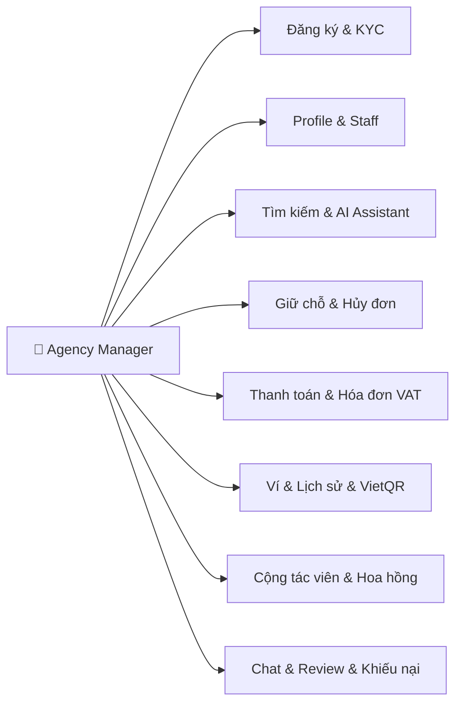
```mermaid
graph LR
    AM["🏢 Agency Manager"]

    AM --> UC_REG["Đăng ký & KYC"]
    AM --> UC_PROFILE["Profile & Staff"]
    AM --> UC_SEARCH["Tìm kiếm & AI Assistant"]
    AM --> UC_HOLD["Giữ chỗ & Hủy đơn"]
    AM --> UC_PAY["Thanh toán & Hóa đơn VAT"]
    AM --> UC_WAL["Ví & Lịch sử & VietQR"]
    AM --> UC_CTV["Cộng tác viên & Hoa hồng"]
    AM --> UC_CHAT["Chat & Review & Khiếu nại"]
```

---

### 3.3 👤 Agency Staff

**Vai trò:** Nhân viên bán hàng tại đại lý. Thực hiện nghiệp vụ hàng ngày: tìm kiếm, đặt chỗ, thanh toán, giao tiếp với nhà cung cấp.

**Chức năng:**

| # | Chức năng | Module | Mô tả |
|---|-----------|--------|-------|
| 1 | Đổi mật khẩu & Hồ sơ | Auth | Đổi mật khẩu, cập nhật thông tin cá nhân |
| 2 | Tìm kiếm dịch vụ | Search | Tìm kiếm dịch vụ du lịch (giá đã cộng markup) |
| 3 | Xem cấu hình markup | Search | Xem (chỉ đọc) tỷ lệ markup hiện tại |
| 4 | Giữ chỗ (Hold) | Booking | Giữ chỗ tạm, lock slot kho, đếm ngược 15 phút |
| 5 | Hủy đơn chủ động | Booking | Hủy đơn đang HELD chủ động trước khi hết hạn |
| 6 | Thanh toán (Pay) | Booking | Trừ ví đại lý để thanh toán đơn hàng |
| 7 | Xem số dư ví | Wallet | Xem số dư khả dụng (chỉ đọc) |
| 8 | Xem lịch sử ví | Wallet | Xem lịch sử các giao dịch nạp/trừ ví của đại lý |
| 9 | Nạp ví qua VNPay | Payment | Tạo URL thanh toán VNPay nạp ví |
| 10 | Tải E-Voucher | Voucher | Tải E-Voucher / Vé điện tử (PDF) về máy |
| 11 | Tạo khiếu nại | Claim | Gửi yêu cầu khiếu nại dịch vụ |
| 12 | Xem thông báo | Notification | Nhận thông báo hệ thống |
| 13 | Trợ lý AI Báo Giá & Combo | AI Assistant | Chat NLP nhận đề xuất combo kèm giá + markup và đặt giữ chỗ tự động |
| 14 | Giỏ hàng Combo (Phase 2) | Cart | Thêm/Xóa/Xem giỏ hàng, Hold và thanh toán combo 1 chạm (Atomic) |
| 15 | Nạp ví VietQR (Phase 2) | Payment | Tạo VietQR biến động nạp ví tự động qua Bank Webhook (Phí 0%) |
| 16 | Chat tức thời (Phase 2) | Chat | Chat WebSocket trực tiếp với Supplier về dịch vụ đơn hàng |
| 17 | Gửi đánh giá (Phase 2) | Review | Gửi review rating từ 1-5 sao sau khi đơn hàng COMPLETED |

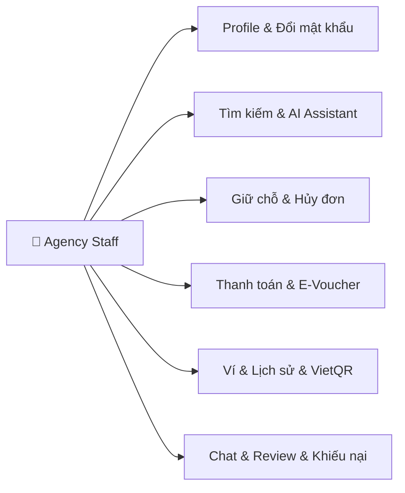
```mermaid
graph LR
    AS["👤 Agency Staff"]

    AS --> UC_PROFILE["Profile & Đổi mật khẩu"]
    AS --> UC_SEARCH["Tìm kiếm & AI Assistant"]
    AS --> UC_HOLD["Giữ chỗ & Hủy đơn"]
    AS --> UC_PAY["Thanh toán & E-Voucher"]
    AS --> UC_WAL["Ví & Lịch sử & VietQR"]
    AS --> UC_CHAT["Chat & Review & Khiếu nại"]
```

**Giới hạn so với Agency Manager:**
- ❌ Không được đăng ký đại lý mới / quản lý hồ sơ doanh nghiệp.
- ❌ Không được cập nhật cấu hình markup của đại lý.
- ❌ Không được tạo và quản lý nhân viên (Staff) hay cộng tác viên (CTV/Sub-Agent).
- Chỉ hoạt động trong phạm vi đại lý mà mình thuộc về.

---

### 3.4 📦 Supplier Admin

**Vai trò:** Quản trị viên nhà cung cấp dịch vụ du lịch. Quản lý kho dịch vụ, duyệt đơn đặt chỗ On-Request, giao tiếp với đại lý.

**Chức năng:**

| # | Chức năng | Module | Mô tả |
|---|-----------|--------|-------|
| 1 | Đổi mật khẩu | Auth | Cập nhật mật khẩu cá nhân bảo vệ tài khoản |
| 2 | Xem dashboard NCC | Supplier | Thống kê đơn hàng, doanh thu của nhà cung cấp |
| 3 | Xem đơn chờ duyệt | Supplier | Danh sách booking On-Request đang chờ xác nhận |
| 4 | Duyệt đơn đặt chỗ | Booking | Xác nhận đơn On-Request → chuyển CONFIRMED |
| 5 | Từ chối đơn đặt chỗ | Booking | Từ chối đơn → hoàn tiền tạm giữ cho đại lý |
| 6 | Xem dịch vụ | Inventory | Xem danh sách dịch vụ của NCC mình |
| 7 | Tạo dịch vụ mới | Inventory | Tạo tour, phòng khách sạn, vé mới |
| 8 | Cập nhật slot | Inventory | Cập nhật số lượng, giá slot theo ngày |
| 9 | Ngừng bán dịch vụ | Inventory | Dừng bán 1 dịch vụ |
| 10 | Xem thông báo | Notification | Nhận thông báo đơn mới, yêu cầu duyệt |
| 11 | Chat tức thời (Phase 2) | Chat | Chat WebSocket trực tiếp với Agency về dịch vụ đơn hàng |
| 12 | Xem đánh giá (Phase 2) | Review | Xem các review rating và ý kiến phản hồi từ đại lý |

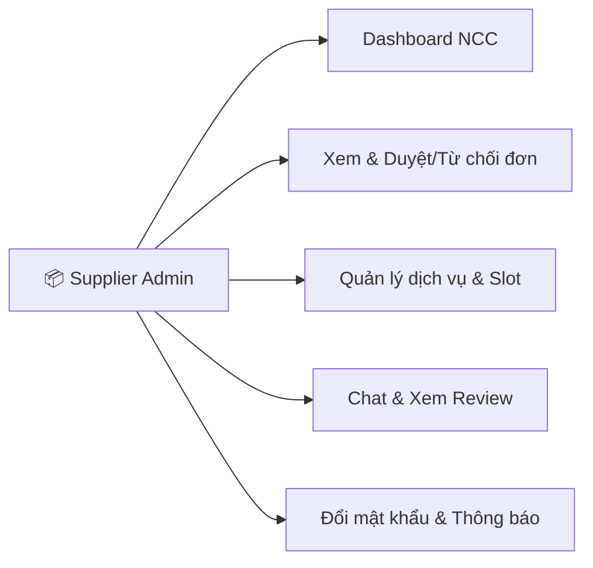
```mermaid
graph LR
    SA["📦 Supplier Admin"]

    SA --> UC_DASH["Dashboard NCC"]
    SA --> UC_PENDING["Xem & Duyệt/Từ chối đơn"]
    SA --> UC_SVC["Quản lý dịch vụ & Slot"]
    SA --> UC_CHAT["Chat & Xem Review"]
    SA --> UC_PW["Đổi mật khẩu & Thông báo"]
```

**Quy tắc nghiệp vụ quan trọng:**
- Duyệt đơn On-Request phải trong **3 tiếng** (hoặc trước 21:00 đêm hôm trước ngày đi)
- Thay đổi giá sỉ chỉ áp dụng cho booking mới (Price Freeze)
- Chỉ quản lý dịch vụ của nhà cung cấp mình

---

### 3.5 🚌 External Transport (Đối tác vận chuyển bên ngoài)

**Vai trò:** Đối tác vận chuyển ngoại vi (Nhà xe như Phương Trang, Hãng máy bay) kết nối qua API tích hợp.

**Chức năng:**

| # | Chức năng | Module | Mô tả |
|---|-----------|--------|-------|
| 1 | Nhận thông tin đặt chỗ | Voucher | Nhận dữ liệu đặt chỗ và thông tin khách hàng từ hệ thống qua API |
| 2 | Xác minh check-in | Voucher | Xác minh và làm thủ tục lên xe/lên máy bay cho khách hàng bằng vé điện tử/E-Voucher |

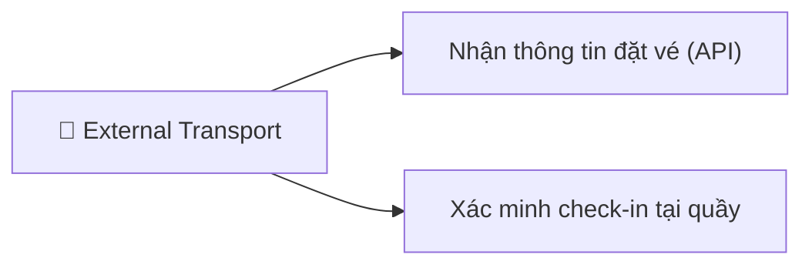
```mermaid
graph LR
    EXT["🚌 External Transport"]

    EXT --> UC_API["Nhận thông tin đặt vé (API)"]
    EXT --> UC_CI["Xác minh check-in tại quầy"]
```

**Đặc điểm vận hành đặc biệt:**
- Không sử dụng ứng dụng di động nội bộ của hệ thống; việc tương tác được tự động hóa qua API kết nối hệ thống bên thứ ba.
- Khách hàng tự chịu trách nhiệm và chi phí di chuyển từ nhà tới bến xe/nhà ga/sân bay.

---

### 3.6 ⏰ System / Hangfire (Tác vụ nền)

**Vai trò:** Actor phi con người. Thực hiện các tác vụ tự động chạy nền theo lịch hoặc sự kiện.

**Chức năng:**

| # | Tác vụ | Trigger | Mô tả |
|---|--------|---------|-------|
| 1 | Auto-cancel đơn HELD quá hạn | Mỗi phút | Hủy booking HELD sau 15 phút, hoàn slot kho |
| 2 | Auto-cancel On-Request quá hạn | Mỗi phút | Hủy đơn PENDING_SUPPLIER_APPROVAL quá 3 tiếng hoặc quá 21:00 |
| 3 | Đồng bộ đặt vé đối tác | Tức thời / Định kỳ | Gọi API chuyển thông tin đặt chỗ sang Nhà xe/Hãng bay |
| 4 | Nhắc KYC sắp hết hạn | Hàng ngày | Gửi thông báo 30 ngày trước ngày hết hạn KYC |
| 5 | Auto-suspend KYC quá hạn | Hàng ngày | Chuyển đại lý sang SUSPENDED nếu KYC hết hạn mà chưa gia hạn |

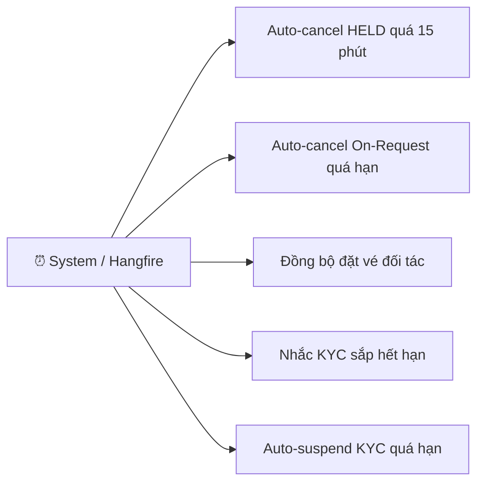
```mermaid
graph LR
    SYS["⏰ System / Hangfire"]

    SYS --> JOB1["Auto-cancel HELD quá 15 phút"]
    SYS --> JOB2["Auto-cancel On-Request quá hạn"]
    SYS --> JOB3["Đồng bộ đặt vé đối tác"]
    SYS --> JOB4["Nhắc KYC sắp hết hạn"]
    SYS --> JOB5["Auto-suspend KYC quá hạn"]
```

---

### 3.7 💳 VNPay Gateway (Bên ngoài)

**Vai trò:** Cổng thanh toán bên ngoài hệ thống. Gọi IPN callback khi giao dịch nạp ví hoàn tất.

**Chức năng:**

| # | Chức năng | Mô tả |
|---|-----------|-------|
| 1 | IPN Callback | Gửi kết quả thanh toán (thành công/thất bại) về endpoint hệ thống |

**Luồng hoạt động:**
1. Đại lý tạo URL thanh toán VNPay
2. Chuyển hướng sang trang thanh toán VNPay
3. Khách hoàn tất thanh toán
4. VNPay gọi IPN callback → hệ thống xác minh hash → nạp ví đại lý → ghi Wallet Ledger

---

### 3.8 🤖 Trợ Lý AI Báo Giá & Tạo Combo Tự Động (AI Travel Agent Assistant)

**Vai trò:** Actor hệ thống (Phase 2). Trích xuất ý định của người dùng bằng ngôn ngữ tự nhiên, tích hợp API nội bộ để tính toán giá, markup và tạo combo đặt chỗ tự động.

**Chức năng:**

| # | Chức năng | Trigger / Mô tả |
|---|-----------|-----------------|
| 1 | Phân tích yêu cầu combo | Nhận câu lệnh chatbot từ Agency Staff → Trích xuất điểm đi, điểm đến, ngày đi, ngân sách, số khách |
| 2 | Báo giá & tạo combo tự động | Gọi API search nội bộ, tính toán giá sỉ + markup, đề xuất 3 combo tối ưu kèm nút Giữ chỗ |
| 3 | Tự động giữ chỗ | Gọi API Hold Booking khi người dùng ấn nút chọn trên giao diện chat của AI |

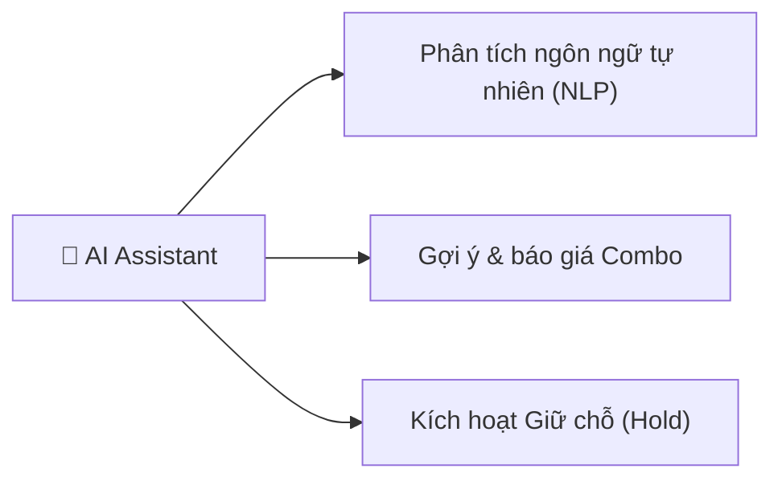
```mermaid
graph LR
    AI_AST["🤖 AI Assistant"]

    AI_AST --> UC_NLP["Phân tích ngôn ngữ tự nhiên (NLP)"]
    AI_AST --> UC_VAL["Gợi ý & báo giá Combo"]
    AI_AST --> UC_AUTO_HOLD["Kích hoạt Giữ chỗ (Hold)"]
```

---

## 4. Luồng Hoạt Động Tổng Thể Hệ Thống

### 4.1 Luồng chính: Tìm kiếm → Đặt chỗ → Thanh toán → Bàn giao

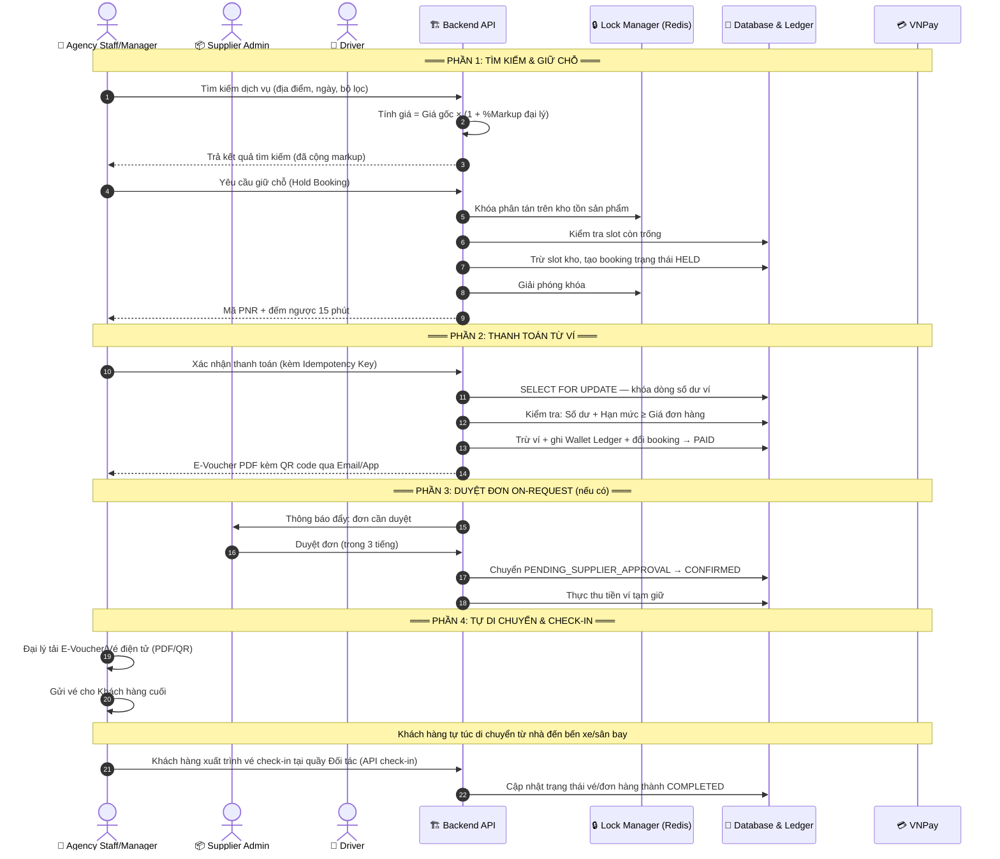
```mermaid
sequenceDiagram
    autonumber
    actor Staff as 👤 Agency Staff/Manager
    actor Supplier as 📦 Supplier Admin
    actor Driver as 🚗 Driver
    participant API as 🏗 Backend API
    participant Lock as 🔒 Lock Manager (Redis)
    participant DB as 💾 Database & Ledger
    participant VNPay as 💳 VNPay

    Note over Staff, VNPay: ═══ PHẦN 1: TÌM KIẾM & GIỮ CHỖ ═══

    Staff->>API: Tìm kiếm dịch vụ (địa điểm, ngày, bộ lọc)
    API->>API: Tính giá = Giá gốc × (1 + %Markup đại lý)
    API-->>Staff: Trả kết quả tìm kiếm (đã cộng markup)

    Staff->>API: Yêu cầu giữ chỗ (Hold Booking)
    API->>Lock: Khóa phân tán trên kho tồn sản phẩm
    API->>DB: Kiểm tra slot còn trống
    API->>DB: Trừ slot kho, tạo booking trạng thái HELD
    API->>Lock: Giải phóng khóa
    API-->>Staff: Mã PNR + đếm ngược 15 phút

    Note over Staff, VNPay: ═══ PHẦN 2: THANH TOÁN TỪ VÍ ═══

    Staff->>API: Xác nhận thanh toán (kèm Idempotency Key)
    API->>DB: SELECT FOR UPDATE — khóa dòng số dư ví
    API->>DB: Kiểm tra: Số dư + Hạn mức ≥ Giá đơn hàng
    API->>DB: Trừ ví + ghi Wallet Ledger + đổi booking → PAID
    API-->>Staff: E-Voucher PDF kèm QR code qua Email/App

    Note over Staff, VNPay: ═══ PHẦN 3: DUYỆT ĐƠN ON-REQUEST (nếu có) ═══

    API->>Supplier: Thông báo đẩy: đơn cần duyệt
    Supplier->>API: Duyệt đơn (trong 3 tiếng)
    API->>DB: Chuyển PENDING_SUPPLIER_APPROVAL → CONFIRMED
    API->>DB: Thực thu tiền ví tạm giữ

    Note over Staff, VNPay: ═══ PHẦN 4: TỰ DI CHUYỂN & CHECK-IN ═══

    Staff->>Staff: Đại lý tải E-Voucher/Vé điện tử (PDF/QR)
    Staff->>Staff: Gửi vé cho Khách hàng cuối
    Note over Staff, VNPay: Khách hàng tự túc di chuyển từ nhà đến bến xe/sân bay
    Staff->>API: Khách hàng xuất trình vé check-in tại quầy Đối tác (API check-in)
    API->>DB: Cập nhật trạng thái vé/đơn hàng thành COMPLETED
```

### 4.2 Luồng nạp ví qua VNPay

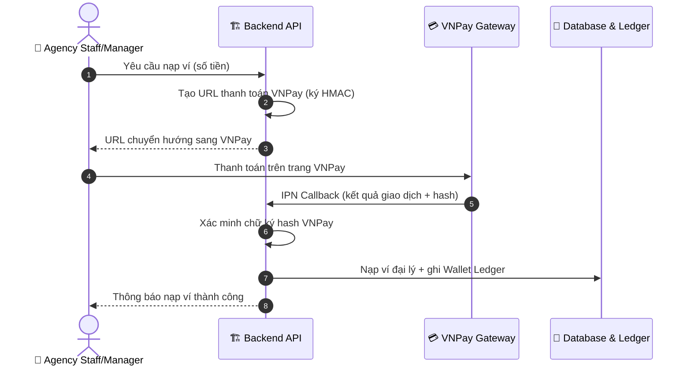
```mermaid
sequenceDiagram
    autonumber
    actor Staff as 👤 Agency Staff/Manager
    participant API as 🏗 Backend API
    participant VNPay as 💳 VNPay Gateway
    participant DB as 💾 Database & Ledger

    Staff->>API: Yêu cầu nạp ví (số tiền)
    API->>API: Tạo URL thanh toán VNPay (ký HMAC)
    API-->>Staff: URL chuyển hướng sang VNPay

    Staff->>VNPay: Thanh toán trên trang VNPay
    VNPay->>API: IPN Callback (kết quả giao dịch + hash)

    API->>API: Xác minh chữ ký hash VNPay
    API->>DB: Nạp ví đại lý + ghi Wallet Ledger
    API-->>Staff: Thông báo nạp ví thành công
```

### 4.3 Luồng KYC đại lý

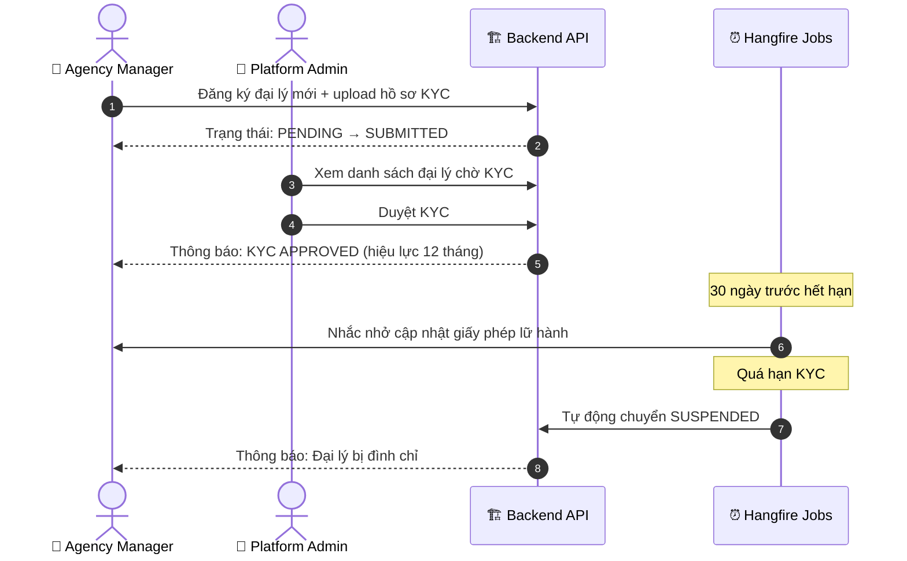
```mermaid
sequenceDiagram
    autonumber
    actor AM as 🏢 Agency Manager
    actor PA as 🔑 Platform Admin
    participant API as 🏗 Backend API
    participant Jobs as ⏰ Hangfire Jobs

    AM->>API: Đăng ký đại lý mới + upload hồ sơ KYC
    API-->>AM: Trạng thái: PENDING → SUBMITTED

    PA->>API: Xem danh sách đại lý chờ KYC
    PA->>API: Duyệt KYC
    API-->>AM: Thông báo: KYC APPROVED (hiệu lực 12 tháng)

    Note over Jobs: 30 ngày trước hết hạn
    Jobs->>AM: Nhắc nhở cập nhật giấy phép lữ hành

    Note over Jobs: Quá hạn KYC
    Jobs->>API: Tự động chuyển SUSPENDED
    API-->>AM: Thông báo: Đại lý bị đình chỉ
```

### 4.4 Luồng Trợ lý AI Báo Giá & Tự động giữ chỗ (AI Assistant - Phase 1)

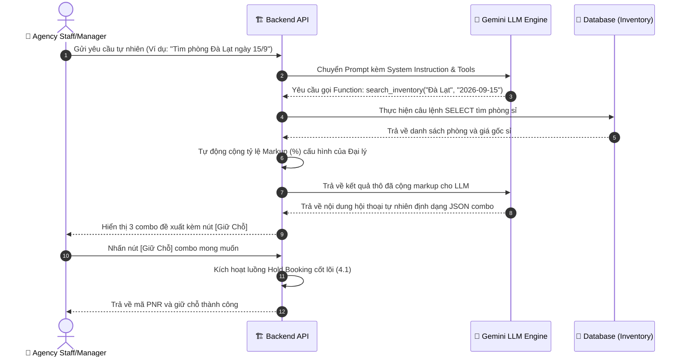
```mermaid
sequenceDiagram
    autonumber
    actor Staff as 👤 Agency Staff/Manager
    participant API as 🏗 Backend API
    participant AI as 🤖 Gemini LLM Engine
    participant DB as 💾 Database (Inventory)

    Staff->>API: Gửi yêu cầu tự nhiên (Ví dụ: "Tìm phòng Đà Lạt ngày 15/9")
    API->>AI: Chuyển Prompt kèm System Instruction & Tools
    AI-->>API: Yêu cầu gọi Function: search_inventory("Đà Lạt", "2026-09-15")
    API->>DB: Thực hiện câu lệnh SELECT tìm phòng sỉ
    DB-->>API: Trả về danh sách phòng và giá gốc sỉ
    API->>API: Tự động cộng tỷ lệ Markup (%) cấu hình của Đại lý
    API->>AI: Trả về kết quả thô đã cộng markup cho LLM
    AI-->>API: Trả về nội dung hội thoại tự nhiên định dạng JSON combo
    API-->>Staff: Hiển thị 3 combo đề xuất kèm nút [Giữ Chỗ]

    Staff->>API: Nhấn nút [Giữ Chỗ] combo mong muốn
    API->>API: Kích hoạt luồng Hold Booking cốt lõi (4.1)
    API-->>Staff: Trả về mã PNR và giữ chỗ thành công
```

### 4.5 Luồng Giỏ Hàng Combo Đa Dịch Vụ (Shopping Cart - Phase 2)

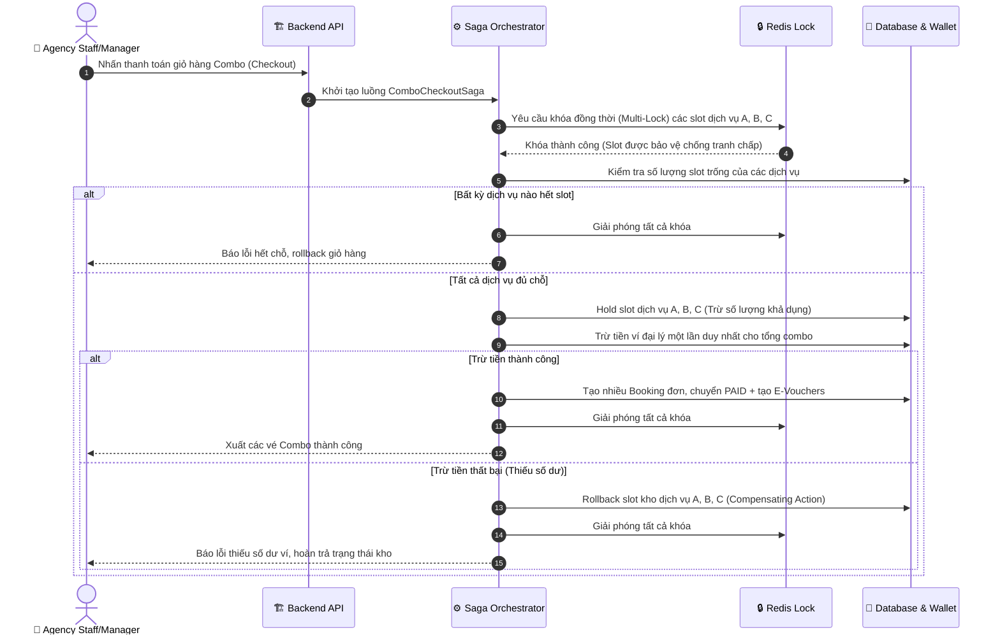
```mermaid
sequenceDiagram
    autonumber
    actor Staff as 👤 Agency Staff/Manager
    participant API as 🏗 Backend API
    participant Saga as ⚙️ Saga Orchestrator
    participant Lock as 🔒 Redis Lock
    participant DB as 💾 Database & Wallet

    Staff->>API: Nhấn thanh toán giỏ hàng Combo (Checkout)
    API->>Saga: Khởi tạo luồng ComboCheckoutSaga
    
    Saga->>Lock: Yêu cầu khóa đồng thời (Multi-Lock) các slot dịch vụ A, B, C
    Lock-->>Saga: Khóa thành công (Slot được bảo vệ chống tranh chấp)

    Saga->>DB: Kiểm tra số lượng slot trống của các dịch vụ
    alt Bất kỳ dịch vụ nào hết slot
        Saga->>Lock: Giải phóng tất cả khóa
        Saga-->>Staff: Báo lỗi hết chỗ, rollback giỏ hàng
    else Tất cả dịch vụ đủ chỗ
        Saga->>DB: Hold slot dịch vụ A, B, C (Trừ số lượng khả dụng)
        Saga->>DB: Trừ tiền ví đại lý một lần duy nhất cho tổng combo
        alt Trừ tiền thành công
            Saga->>DB: Tạo nhiều Booking đơn, chuyển PAID + tạo E-Vouchers
            Saga->>Lock: Giải phóng tất cả khóa
            Saga-->>Staff: Xuất các vé Combo thành công
        else Trừ tiền thất bại (Thiếu số dư)
            Saga->>DB: Rollback slot kho dịch vụ A, B, C (Compensating Action)
            Saga->>Lock: Giải phóng tất cả khóa
            Saga-->>Staff: Báo lỗi thiếu số dư ví, hoàn trả trạng thái kho
        end
    end
```

### 4.6 Luồng Chat tức thời giữa Đại lý ↔ Nhà cung cấp (Real-time Chat - Phase 2)

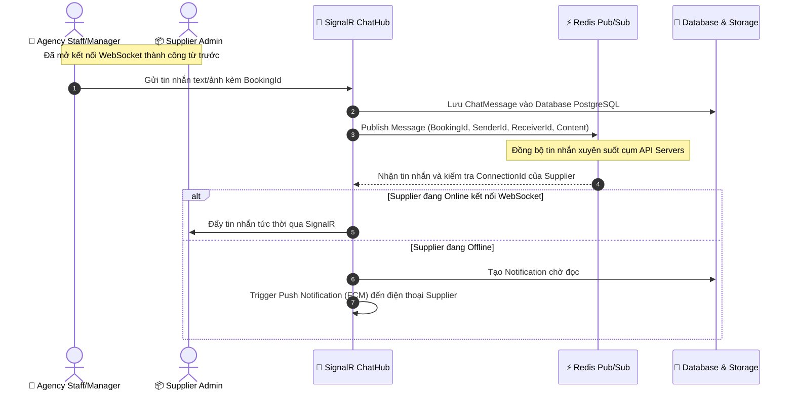
```mermaid
sequenceDiagram
    autonumber
    actor Staff as 👤 Agency Staff/Manager
    actor Supplier as 📦 Supplier Admin
    participant Hub as 🔌 SignalR ChatHub
    participant Redis as ⚡ Redis Pub/Sub
    participant DB as 💾 Database & Storage

    Note over Staff, Supplier: Đã mở kết nối WebSocket thành công từ trước
    Staff->>Hub: Gửi tin nhắn text/ảnh kèm BookingId
    Hub->>DB: Lưu ChatMessage vào Database PostgreSQL
    Hub->>Redis: Publish Message (BookingId, SenderId, ReceiverId, Content)
    
    Note over Redis: Đồng bộ tin nhắn xuyên suốt cụm API Servers
    Redis-->>Hub: Nhận tin nhắn và kiểm tra ConnectionId của Supplier
    
    alt Supplier đang Online kết nối WebSocket
        Hub->>Supplier: Đẩy tin nhắn tức thời qua SignalR
    else Supplier đang Offline
        Hub->>DB: Tạo Notification chờ đọc
        Hub->>Hub: Trigger Push Notification (FCM) đến điện thoại Supplier
    end
```

### 4.7 Luồng Đánh giá & Phản hồi dịch vụ (Review & Rating - Phase 2)

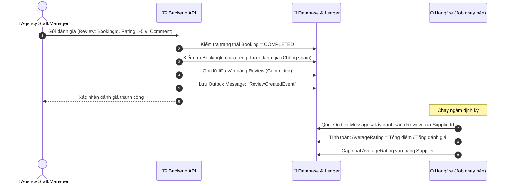
```mermaid
sequenceDiagram
    autonumber
    actor Staff as 👤 Agency Staff/Manager
    participant API as 🏗 Backend API
    participant DB as 💾 Database & Ledger
    participant Job as ⏰ Hangfire (Job chạy nền)

    Staff->>API: Gửi đánh giá (Review: BookingId, Rating 1-5★, Comment)
    API->>DB: Kiểm tra trạng thái Booking = COMPLETED
    API->>DB: Kiểm tra BookingId chưa từng được đánh giá (Chống spam)
    
    API->>DB: Ghi dữ liệu vào bảng Review (Committed)
    API->>DB: Lưu Outbox Message: "ReviewCreatedEvent"
    API-->>Staff: Xác nhận đánh giá thành công

    Note over Job: Chạy ngầm định kỳ
    Job->>DB: Quét Outbox Message & lấy danh sách Review của SupplierId
    Job->>DB: Tính toán: AverageRating = Tổng điểm / Tổng đánh giá
    Job->>DB: Cập nhật AverageRating vào bảng Supplier
```

### 4.8 Luồng Nạp Ví tự động qua VietQR (VietQR Auto-Credit - Phase 2)

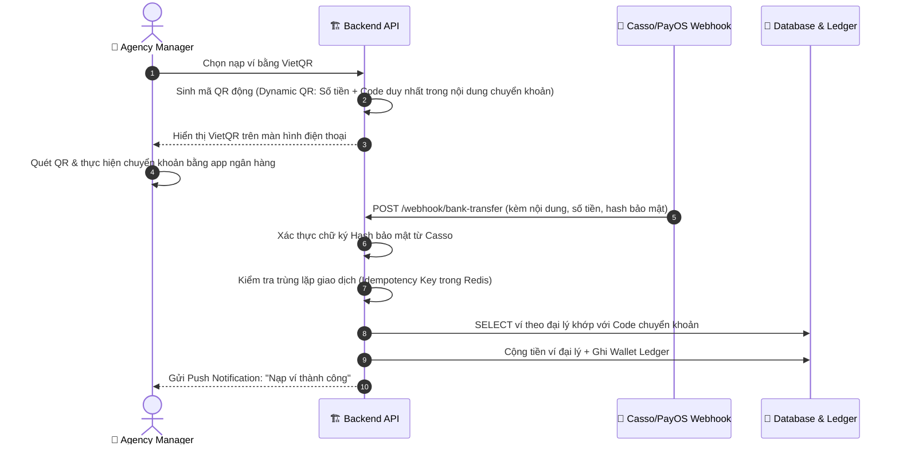
```mermaid
sequenceDiagram
    autonumber
    actor AM as 🏢 Agency Manager
    participant API as 🏗 Backend API
    participant Casso as 🔌 Casso/PayOS Webhook
    participant DB as 💾 Database & Ledger

    AM->>API: Chọn nạp ví bằng VietQR
    API->>API: Sinh mã QR động (Dynamic QR: Số tiền + Code duy nhất trong nội dung chuyển khoản)
    API-->>AM: Hiển thị VietQR trên màn hình điện thoại

    AM->>AM: Quét QR & thực hiện chuyển khoản bằng app ngân hàng
    Casso->>API: POST /webhook/bank-transfer (kèm nội dung, số tiền, hash bảo mật)
    
    API->>API: Xác thực chữ ký Hash bảo mật từ Casso
    API->>API: Kiểm tra trùng lặp giao dịch (Idempotency Key trong Redis)
    
    API->>DB: SELECT ví theo đại lý khớp với Code chuyển khoản
    API->>DB: Cộng tiền ví đại lý + Ghi Wallet Ledger
    API-->>AM: Gửi Push Notification: "Nạp ví thành công"
```

---

## 5. Sơ Đồ Use Case Tổng Hợp Theo Module

### 5.1 Module: Xác thực & Quản lý người dùng

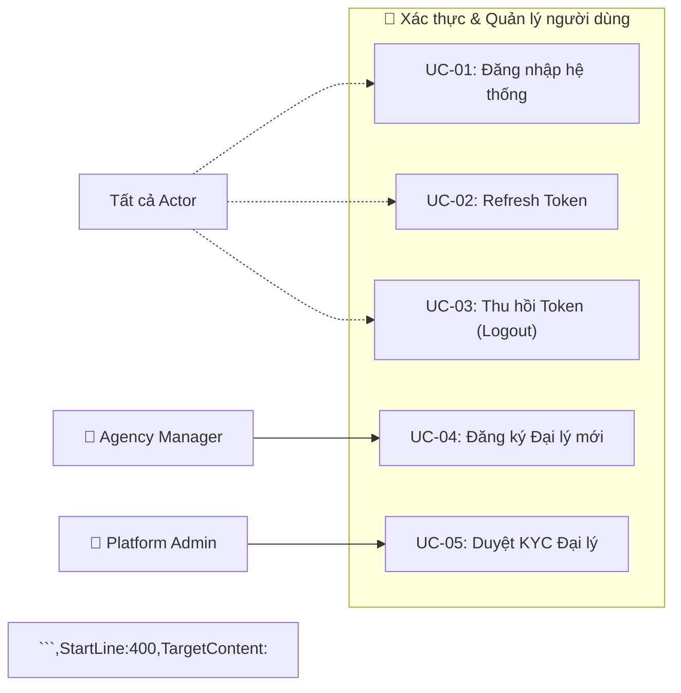
```mermaid
graph LR
    subgraph UC_Auth["🔐 Xác thực & Quản lý người dùng"]
        UC01["UC-01: Đăng nhập hệ thống"]
        UC02["UC-02: Refresh Token"]
        UC03["UC-03: Thu hồi Token (Logout)"]
        UC04["UC-04: Đăng ký Đại lý mới"]
        UC05["UC-05: Duyệt KYC Đại lý"]
    end

    ALL["Tất cả Actor"] -.-> UC01
    ALL -.-> UC02
    ALL -.-> UC03
    PA["🔑 Platform Admin"] --> UC05
    AM["🏢 Agency Manager"] --> UC04
```,StartLine:400,TargetContent:
```

### 5.2 Module: KYC & Quản lý Đại lý

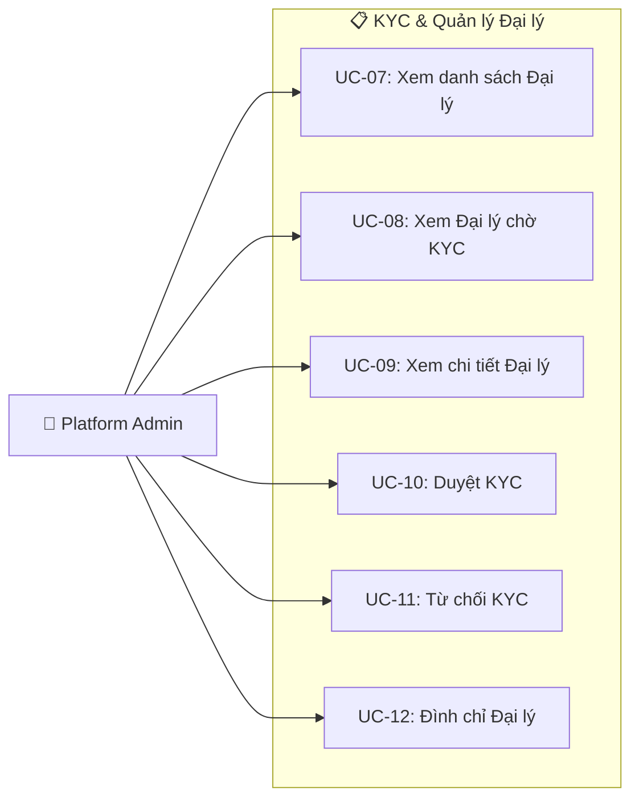
```mermaid
graph LR
    subgraph UC_KYC["📋 KYC & Quản lý Đại lý"]
        UC07["UC-07: Xem danh sách Đại lý"]
        UC08["UC-08: Xem Đại lý chờ KYC"]
        UC09["UC-09: Xem chi tiết Đại lý"]
        UC10["UC-10: Duyệt KYC"]
        UC11["UC-11: Từ chối KYC"]
        UC12["UC-12: Đình chỉ Đại lý"]
    end

    PA["🔑 Platform Admin"] --> UC07
    PA --> UC08
    PA --> UC09
    PA --> UC10
    PA --> UC11
    PA --> UC12
```

### 5.3 Module: Tìm kiếm & Markup

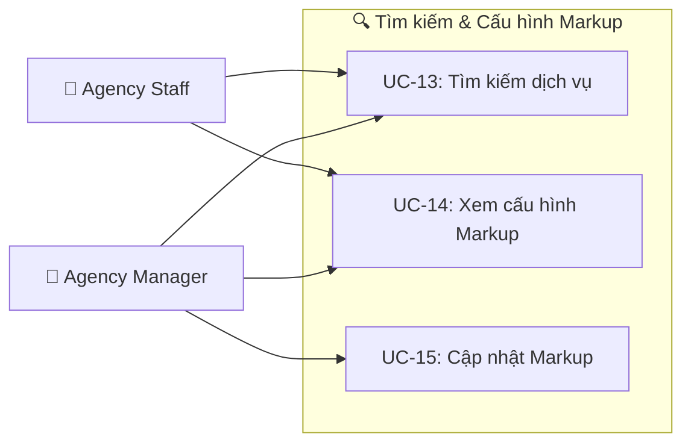
```mermaid
graph LR
    subgraph UC_Search["🔍 Tìm kiếm & Cấu hình Markup"]
        UC13["UC-13: Tìm kiếm dịch vụ"]
        UC14["UC-14: Xem cấu hình Markup"]
        UC15["UC-15: Cập nhật Markup"]
    end

    AS["👤 Agency Staff"] --> UC13
    AS --> UC14
    AM["🏢 Agency Manager"] --> UC13
    AM --> UC14
    AM --> UC15
```

### 5.4 Module: Đặt chỗ (Booking)

```mermaid
graph LR
    subgraph UC_Booking["📝 Đặt chỗ"]
        UC16["UC-16: Giữ chỗ (Hold)"]
        UC17["UC-17: Thanh toán đặt chỗ (Pay)"]
        UC18["UC-18: Xem tất cả đơn đặt chỗ"]
        UC19["UC-19: Duyệt đơn đặt chỗ"]
        UC20["UC-20: Từ chối đơn đặt chỗ"]
        UC21["UC-21: Auto-cancel đơn quá hạn"]
    end

    AS["👤 Agency Staff"] --> UC16
    AS --> UC17
    AM["🏢 Agency Manager"] --> UC16
    AM --> UC17
    PA["🔑 Platform Admin"] --> UC18
    SA["📦 Supplier Admin"] --> UC19
    SA --> UC20
    SYS["⏰ Hangfire"] --> UC21

    UC17 -.-> |"«include»"| PAY_DEBIT["Trừ ví Đại lý"]
    UC16 -.-> |"«include»"| SLOT_DEC["Giảm Slot tồn kho"]
```

### 5.5 Module: Ví tài chính (Wallet)

```mermaid
graph LR
    subgraph UC_Wallet["💰 Ví tài chính"]
        UC22["UC-22: Xem số dư ví"]
        UC23["UC-23: Nạp tiền vào ví (Credit)"]
        UC24["UC-24: Trừ tiền ví (Debit)"]
    end

    AS["👤 Agency Staff"] --> UC22
    AM["🏢 Agency Manager"] --> UC22
    PA["🔑 Platform Admin"] --> UC23
    PA --> UC24

    UC23 -.-> |"«include»"| LEDGER["Tạo WalletLedger entry"]
    UC24 -.-> |"«include»"| LEDGER
```

### 5.6 Module: Thanh toán VNPay

```mermaid
graph LR
    subgraph UC_Payment["💳 Thanh toán VNPay"]
        UC25["UC-25: Tạo URL thanh toán VNPay"]
        UC26["UC-26: Xử lý IPN Callback"]
    end

    AS["👤 Agency Staff"] --> UC25
    AM["🏢 Agency Manager"] --> UC25
    VNPAY["💳 VNPay Gateway"] --> UC26

    UC26 -.-> |"«include»"| CREDIT["Nạp ví Đại lý"]
```

### 5.7 Module: Kho dịch vụ (Inventory)

```mermaid
graph LR
    subgraph UC_Inventory["📦 Kho dịch vụ"]
        UC27["UC-27: Xem danh sách dịch vụ"]
        UC28["UC-28: Tạo dịch vụ mới"]
        UC29["UC-29: Xem slot theo dịch vụ"]
        UC30["UC-30: Cập nhật slot"]
        UC31["UC-31: Ngừng bán dịch vụ"]
    end

    PA["🔑 Platform Admin"] --> UC27
    PA --> UC28
    PA --> UC29
    PA --> UC30
    PA --> UC31
    SA["📦 Supplier Admin"] --> UC27
    SA --> UC28
    SA --> UC29
    SA --> UC30
    SA --> UC31
```

### 5.8 Module: Nhà cung cấp (Supplier Extranet)

```mermaid
graph LR
    subgraph UC_Supplier["🏭 Quản lý Nhà cung cấp"]
        UC32["UC-32: Xem Dashboard NCC"]
        UC33["UC-33: Xem đơn chờ duyệt"]
        UC34["UC-34: Duyệt đơn đặt chỗ"]
        UC35["UC-35: Từ chối đơn đặt chỗ"]
    end

    SA["📦 Supplier Admin"] --> UC32
    SA --> UC33
    SA --> UC34
    SA --> UC35
```

### 5.9 Module: Voucher & Tích hợp vận chuyển

```mermaid
graph LR
    subgraph UC_Voucher["🎫 Voucher & Tích hợp vận chuyển"]
        UC36["UC-36: Phát hành E-Voucher / Vé điện tử"]
        UC37["UC-37: Gửi thông tin đặt vé sang Nhà xe/Hãng bay"]
        UC38["UC-38: Tải E-Voucher / Vé điện tử"]
    end

    PA["🔑 Platform Admin"] --> UC36
    SYS["⏰ System / Hangfire"] --> UC37
    AS["👤 Agency Staff"] --> UC38
    AM["🏢 Agency Manager"] --> UC38
```

### 5.10 Module: Khiếu nại (Claim)

```mermaid
graph LR
    subgraph UC_Claim["📢 Khiếu nại"]
        UC39["UC-39: Tạo khiếu nại"]
        UC40["UC-40: Xem chi tiết khiếu nại"]
        UC41["UC-41: Xem danh sách khiếu nại"]
        UC42["UC-42: Duyệt khiếu nại"]
        UC43["UC-43: Từ chối khiếu nại"]
    end

    AS["👤 Agency Staff"] --> UC39
    AS --> UC40
    AS --> UC41
    AM["🏢 Agency Manager"] --> UC39
    AM --> UC40
    AM --> UC41
    PA["🔑 Platform Admin"] --> UC42
    PA --> UC43
```

### 5.11 Module: Thông báo (Notification)

```mermaid
graph LR
    subgraph UC_Notify["🔔 Thông báo"]
        UC44["UC-44: Xem thông báo"]
        UC45["UC-45: Đánh dấu đã đọc"]
        UC46["UC-46: Đánh dấu tất cả đã đọc"]
    end

    ALL["Tất cả User đã đăng nhập"] --> UC44
    ALL --> UC45
    ALL --> UC46
```

### 5.12 Module: Báo cáo & Cấu hình hệ thống

```mermaid
graph LR
    subgraph UC_Report["📊 Báo cáo & Cấu hình"]
        UC47["UC-47: Xem Dashboard tổng quan"]
        UC48["UC-48: Xem báo cáo doanh thu"]
        UC49["UC-49: Xem giao dịch ví"]
        UC50["UC-50: Xuất báo cáo giao dịch"]
        UC51["UC-51: Xem cấu hình hệ thống"]
        UC52["UC-52: Cập nhật cấu hình hệ thống"]
    end

    PA["🔑 Platform Admin"] --> UC47
    PA --> UC48
    PA --> UC49
    PA --> UC50
    PA --> UC51
    PA --> UC52
```

### 5.13 Module: Giỏ hàng Combo (Shopping Cart - Phase 2)

```mermaid
graph LR
    subgraph UC_Cart["🛒 Giỏ hàng Combo"]
        UC60["UC-60: Thêm dịch vụ vào giỏ"]
        UC61["UC-61: Xóa dịch vụ khỏi giỏ"]
        UC62["UC-62: Xem giỏ hàng"]
        UC63["UC-63: Hold toàn bộ combo"]
        UC64["UC-64: Thanh toán combo 1 chạm"]
    end

    AS["👤 Agency Staff"] --> UC60
    AS --> UC61
    AS --> UC62
    AS --> UC63
    AS --> UC64
    AM["🏢 Agency Manager"] --> UC60
    AM --> UC61
    AM --> UC62
    AM --> UC63
    AM --> UC64
```

### 5.14 Module: Hóa đơn & VAT (Invoicing - Phase 2)

```mermaid
graph LR
    subgraph UC_Invoice["🧾 Hóa đơn & VAT"]
        UC65["UC-65: Tạo hóa đơn VAT"]
        UC66["UC-66: Xem danh sách hóa đơn"]
        UC67["UC-67: Tải hóa đơn PDF"]
    end

    PA["🔑 Platform Admin"] --> UC65
    PA --> UC66
    AM["🏢 Agency Manager"] --> UC66
    AM --> UC67
    SYS["⏰ System / Hangfire"] -.-> |"Tự động tạo"| UC65
```

### 5.15 Module: Cộng tác viên / Sub-Agent (Phase 2)

```mermaid
graph LR
    subgraph UC_SubAgent["👥 Cộng tác viên (Sub-Agent)"]
        UC68["UC-68: Tạo tài khoản CTV"]
        UC69["UC-69: Cấu hình hoa hồng CTV"]
        UC70["UC-70: Xem báo cáo hoa hồng"]
    end

    AM["🏢 Agency Manager"] --> UC68
    AM --> UC69
    AM --> UC70
```

### 5.16 Module: Chat thời gian thực (Real-time Chat - Phase 2)

```mermaid
graph LR
    subgraph UC_Chat["💬 Chat thời gian thực"]
        UC74["UC-74: Gửi tin nhắn tức thời"]
        UC75["UC-75: Nhận tin nhắn tức thời"]
        UC76["UC-76: Xem lịch sử chat theo Booking"]
    end

    AM["🏢 Agency Manager"] --> UC74
    AM --> UC75
    AM --> UC76
    AS["👤 Agency Staff"] --> UC74
    AS --> UC75
    AS --> UC76
    SA["📦 Supplier Admin"] --> UC74
    SA --> UC75
    SA --> UC76
```

### 5.17 Module: Đánh giá & Phản hồi (Review & Rating - Phase 2)

```mermaid
graph LR
    subgraph UC_Review["⭐ Đánh giá & Phản hồi"]
        UC77["UC-77: Gửi đánh giá dịch vụ"]
        UC78["UC-78: Xem danh sách đánh giá"]
        UC79["UC-79: Tự động tính toán điểm uy tín"]
    end

    AM["🏢 Agency Manager"] --> UC77
    AS["👤 Agency Staff"] --> UC77
    AM --> UC78
    AS --> UC78
    SA["📦 Supplier Admin"] --> UC78
    SYS["⏰ System / Hangfire"] --> UC79
```

### 5.18 Module: Trợ Lý AI Báo Giá & Tạo Combo (AI Assistant - Phase 1)

```mermaid
graph LR
    subgraph UC_AIAssistant["🤖 Trợ Lý AI Báo Giá & Tạo Combo"]
        UC80["UC-80: Nhập yêu cầu bằng ngôn ngữ tự nhiên"]
        UC81["UC-81: Nhận đề xuất combo kèm báo giá"]
        UC82["UC-82: Kích hoạt giữ chỗ từ chat của AI"]
    end

    AM["🏢 Agency Manager"] --> UC80
    AM --> UC81
    AM --> UC82
    AS["👤 Agency Staff"] --> UC80
    AS --> UC81
    AS --> UC82
    AI_AST["🤖 AI Assistant"] --> UC81
    AI_AST --> UC82
```

---

## 6. Ma Trận Actor × Module (Bản Đầy Đủ Phase 1 & Phase 2)

| Module | Platform Admin | Agency Manager | Agency Staff | Supplier Admin | External Transport | System | VNPay | AI Assistant |
|--------|:---:|:---:|:---:|:---:|:---:|:---:|:---:|:---:|
| Auth & Profile (M01) | ✅ | ✅ | ✅ | ✅ | — | — | — | — |
| KYC (M02) | ✅ Duyệt | 📝 Nộp | — | — | — | ⏰ Nhắc | — | — |
| Inventory (M03) | ✅ | — | — | ✅ | — | — | — | — |
| Search & Markup (M04) | — | ✅ R/W | ✅ R | — | — | — | — | 🤖 Hỗ trợ tìm |
| Shopping Cart (M05 - P2) | — | ✅ | ✅ | — | — | — | — | — |
| Booking Engine (M06) | 👁 Xem all | ✅ Hold/Pay/Cancel | ✅ Hold/Pay/Cancel | ✅ Approve | — | ⏰ Cancel | — | 🤖 Auto Hold |
| Wallet (M07) | ✅ Credit/Debit | 👁 View | 👁 View | — | — | — | — | — |
| Invoicing & VAT (M08 - P2) | ✅ Generate | 👁 View | — | — | — | ⏰ Auto | — | — |
| Voucher & QR (M09) | ✅ Issue | 👁 View (Tải) | 👁 View (Tải) | — | 🚌 (Nhận API) | ⏰ Đồng bộ | — | — |
| Notification (M10) | ✅ | ✅ | ✅ | ✅ | — | — | — | — |
| Claim (M11) | ✅ Resolve | ✅ Create | ✅ Create | — | — | — | — | — |
| Report & Config (M12/13) | ✅ | — | — | — | — | — | — | — |
| Supplier Extranet (M14) | — | — | — | ✅ | — | — | — | — |
| AI Assistant (M15 - P1) | — | ✅ Chat | ✅ Chat | — | — | — | — | 🤖 Generate |
| Real-time Chat (M16 - P2) | — | ✅ R/W | ✅ R/W | ✅ R/W | — | — | — | — |
| Review & Rating (M17 - P2) | — | 📝 Gửi | 📝 Gửi | 👁 Xem | — | ⏰ Auto-Calc | — | — |
| VietQR Auto-Credit (P2) | — | ✅ | ✅ | — | — | — | — | — |

**Chú thích:** ✅ Toàn quyền · 👁 Chỉ xem · 📝 Tạo/Nộp · ⏰ Tự động · 🤖 Tích hợp AI · 🚌 Kết nối API · 📩 Callback · R/W Đọc-Ghi · R Chỉ đọc

---

## 7. Phân Quyền RBAC

```mermaid
graph TD
    subgraph Roles["🔐 Vai trò hệ thống"]
        R1["PLATFORM_ADMIN"]
        R2["AGENCY_MANAGER"]
        R3["AGENCY_STAFF"]
        R4["SUPPLIER_ADMIN"]
    end

    R1 -->|"Toàn quyền"| ALL["Tất cả 17 Module"]
    R2 -->|"Quản lý đại lý"| AGM["Auth, Onboarding, Search, Booking, Wallet, Payment, Claim, Notification, Chat, Review, Cart, Invoice, Sub-Agent"]
    R3 -->|"Bán hàng"| AGS["Auth, Search, Booking, Wallet, Payment, Claim, Notification, Chat, Review, Cart"]
    R4 -->|"Quản lý NCC"| SUP["Auth, Inventory, Booking (Approve), Supplier Portal, Notification, Chat, Review"]
```

### Quy tắc phân quyền
1. **Mỗi User chỉ có 1 Role** — không hỗ trợ đa vai trò
2. **Agency Staff thuộc về 1 Agency** — chỉ truy cập dữ liệu đại lý mình
3. **Supplier Admin thuộc về 1 Supplier** — chỉ quản lý NCC mình
4. **Platform Admin** — không bị giới hạn phạm vi dữ liệu

---

## 📌 Ghi Chú Tài Liệu

- **Đường nét liền (→)**: Actor trực tiếp sử dụng Use Case
- **Đường nét đứt (-.->)**: Tất cả Actor đều có quyền / Use Case «include»
- **System / Hangfire**: Tác vụ tự động chạy nền (auto-cancel, đồng bộ vé đối tác, nhắc KYC)
- **VNPay Gateway**: Actor ngoài hệ thống — chỉ gọi IPN callback
- Tài liệu này được tổng hợp từ SRS và Use Case Diagram gốc của dự án
