# 🏗️ Giai Đoạn 1: Use Case Cốt Lõi — MVP Đưa Hội Đồng Duyệt

> Tài liệu liệt kê đầy đủ các Use Case được triển khai trong phiên bản MVP (Minimum Viable Product), đảm bảo hệ thống vận hành được luồng nghiệp vụ chính: **Đăng ký → KYC → Tìm kiếm → Giữ chỗ → Thanh toán → Xuất vé → Khiếu nại**.
>
> Đây là phiên bản ổn định đưa hội đồng duyệt trước khi mở rộng.

---

## 📊 Tổng quan MVP

*   **Tổng số Use Case MVP:** 45 UC
*   **Số Actor:** 7 (4 con người + 3 hệ thống/đối tác)
*   **Số Module triển khai:** 12 / 14 module (trừ Invoicing & VAT, Shopping Cart — chuyển sang Phase 2)

---

## 🗺️ Sơ Đồ Use Case Tổng Quan MVP

```mermaid
graph LR
    %% ──────────────────────────────────────
    %% ACTORS
    %% ──────────────────────────────────────
    PA["🔑 Platform Admin"]
    AM["🏢 Agency Manager"]
    AS["👤 Agency Staff"]
    SA["📦 Supplier Admin"]
    EXT["🚌 External Transport"]
    SYS["⏰ System / Hangfire"]
    VNPAY["💳 VNPay Gateway"]

    subgraph B2B["🏗 B2B TRAVEL PLATFORM — MVP"]
        %% Auth & Profile
        UC01["UC-01: Đăng nhập & Cấp Token"]
        UC02["UC-02: Refresh Token"]
        UC03["UC-03: Thu hồi Token (Logout)"]
        UC04["UC-04: Đăng ký Đại lý mới"]
        UC55["UC-55: Đổi mật khẩu"]
        UC56["UC-56: Cập nhật hồ sơ cá nhân"]

        %% KYC
        UC07["UC-07: Xem danh sách Đại lý"]
        UC08["UC-08: Xem Đại lý chờ KYC"]
        UC10["UC-10: Duyệt KYC"]
        UC11["UC-11: Từ chối KYC"]
        UC12["UC-12: Đình chỉ Đại lý"]

        %% Staff Management
        UC57["UC-57: Thêm nhân viên đại lý"]
        UC58["UC-58: Khóa/Mở khóa nhân viên"]

        %% Search & Markup
        UC13["UC-13: Tìm kiếm dịch vụ"]
        UC14["UC-14: Xem Markup"]
        UC15["UC-15: Cập nhật Markup"]

        %% Booking
        UC16["UC-16: Giữ chỗ (Hold)"]
        UC17["UC-17: Thanh toán (Pay)"]
        UC18["UC-18: Xem tất cả đơn"]
        UC19["UC-19: Duyệt đơn On-Request"]
        UC20["UC-20: Từ chối đơn On-Request"]
        UC21["UC-21: Auto-cancel quá hạn"]
        UC53["UC-53: Hủy đơn chủ động"]

        %% Wallet
        UC22["UC-22: Xem số dư ví"]
        UC23["UC-23: Nạp tiền ví (Credit)"]
        UC24["UC-24: Trừ tiền ví (Debit)"]
        UC54["UC-54: Xem lịch sử giao dịch ví"]

        %% Payment
        UC25["UC-25: Tạo URL nạp ví VNPay"]
        UC26["UC-26: Xử lý IPN Callback"]

        %% Inventory
        UC27["UC-27: Xem danh sách dịch vụ"]
        UC28["UC-28: Tạo dịch vụ mới"]
        UC30["UC-30: Cập nhật slot/giá"]
        UC31["UC-31: Ngừng bán dịch vụ"]

        %% Supplier
        UC32["UC-32: Dashboard NCC"]
        UC33["UC-33: Xem đơn chờ duyệt"]

        %% Voucher
        UC36["UC-36: Phát hành E-Voucher"]
        UC37["UC-37: Gọi API đối tác"]
        UC38["UC-38: Tải E-Voucher"]

        %% Claim
        UC39["UC-39: Tạo khiếu nại"]
        UC42["UC-42: Duyệt khiếu nại"]
        UC43["UC-43: Từ chối khiếu nại"]

        %% Notification
        UC44["UC-44: Xem thông báo"]
        UC45["UC-45: Đánh dấu đã đọc"]

        %% Report & Config
        UC47["UC-47: Dashboard báo cáo"]
        UC49["UC-49: Xem giao dịch Ledger"]
        UC50["UC-50: Xuất báo cáo Excel"]
        UC52["UC-52: Cấu hình hệ thống"]
    end

    %% ──────────────────────────────────────
    %% CONNECTIONS
    %% ──────────────────────────────────────
    PA --> UC01
    PA --> UC10
    PA --> UC11
    PA --> UC12
    PA --> UC07
    PA --> UC08
    PA --> UC18
    PA --> UC23
    PA --> UC24
    PA --> UC36
    PA --> UC42
    PA --> UC43
    PA --> UC47
    PA --> UC49
    PA --> UC50
    PA --> UC52
    PA --> UC55

    AM --> UC01
    AM --> UC04
    AM --> UC13
    AM --> UC14
    AM --> UC15
    AM --> UC16
    AM --> UC17
    AM --> UC53
    AM --> UC22
    AM --> UC54
    AM --> UC25
    AM --> UC38
    AM --> UC39
    AM --> UC44
    AM --> UC57
    AM --> UC58
    AM --> UC55
    AM --> UC56

    AS --> UC01
    AS --> UC13
    AS --> UC14
    AS --> UC16
    AS --> UC17
    AS --> UC53
    AS --> UC22
    AS --> UC54
    AS --> UC25
    AS --> UC38
    AS --> UC39
    AS --> UC44
    AS --> UC45
    AS --> UC55
    AS --> UC56

    SA --> UC01
    SA --> UC27
    SA --> UC28
    SA --> UC30
    SA --> UC31
    SA --> UC19
    SA --> UC20
    SA --> UC32
    SA --> UC33
    SA --> UC44
    SA --> UC55

    SYS --> UC21
    SYS --> UC37
    VNPAY --> UC26
    EXT --> UC37
    EXT --> UC38
```

---

## 📝 Chi Tiết Use Case MVP Theo Module

### Module 1: Xác thực & Quản lý Hồ sơ (Auth & Profile)

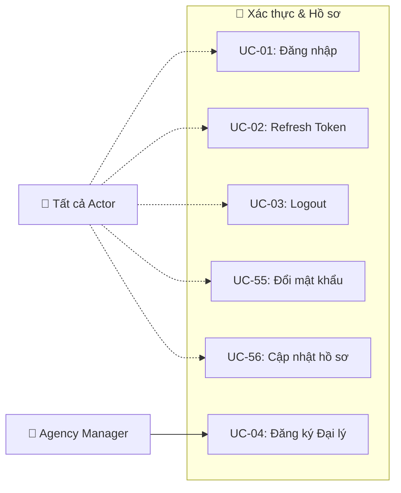

| UC | Actor | Mô tả | Điều kiện tiên quyết |
|---|---|---|---|
| UC-01 | Tất cả | Đăng nhập bằng username/password, nhận JWT Access Token + Refresh Token | Tài khoản đã tồn tại, KYC APPROVED (trừ Admin) |
| UC-02 | Tất cả | Gia hạn Access Token bằng Refresh Token khi hết hạn | Refresh Token còn hiệu lực |
| UC-03 | Tất cả | Thu hồi Refresh Token, đăng xuất khỏi hệ thống | Đã đăng nhập |
| UC-04 | Agency Manager | Đăng ký đại lý mới: nhập thông tin DN, upload ảnh KYC → trạng thái `PENDING_KYC` | Chưa có tài khoản |
| UC-55 | Tất cả | Đổi mật khẩu (nhập mật khẩu cũ + mật khẩu mới) | Đã đăng nhập |
| UC-56 | Agency Manager, Staff | Cập nhật thông tin cá nhân (tên, SĐT, email) | Đã đăng nhập |

---

### Module 2: KYC & Quản lý Đại lý

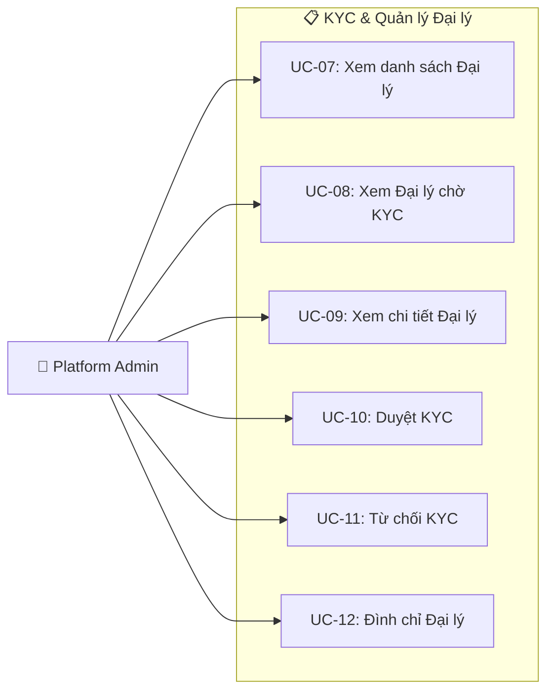

| UC | Actor | Mô tả | Hậu điều kiện |
|---|---|---|---|
| UC-07 | Platform Admin | Xem toàn bộ đại lý, lọc theo trạng thái KYC, phân trang | — |
| UC-08 | Platform Admin | Lọc đại lý đang chờ xét duyệt KYC (`PENDING_KYC`) | — |
| UC-09 | Platform Admin | Xem chi tiết 1 đại lý: thông tin DN, ảnh KYC, lịch sử giao dịch | — |
| UC-10 | Platform Admin | Phê duyệt KYC → trạng thái `APPROVED` → đại lý được giao dịch | Gửi Push thông báo cho đại lý |
| UC-11 | Platform Admin | Từ chối KYC kèm lý do → trạng thái `REJECTED` | Gửi Push thông báo + lý do từ chối |
| UC-12 | Platform Admin | Đình chỉ đại lý vi phạm → trạng thái `SUSPENDED` → chặn đăng nhập | Gửi Push thông báo + lý do đình chỉ |

---

### Module 3: Quản lý Nhân viên Đại lý (Staff Management) — MỚI BỔ SUNG

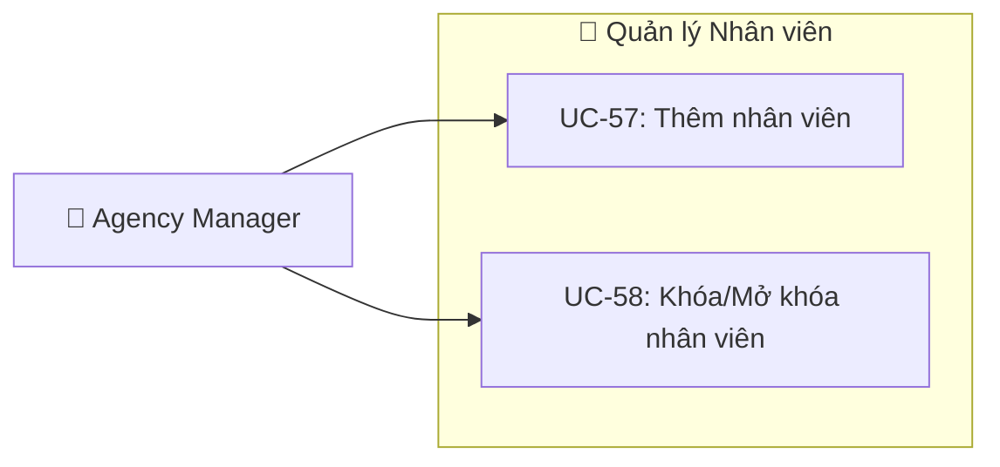

| UC | Actor | Mô tả | Ràng buộc |
|---|---|---|---|
| UC-57 | Agency Manager | Tạo tài khoản Agency Staff mới thuộc đại lý mình (nhập username, tên, SĐT) | Staff chỉ thuộc về đúng 1 đại lý |
| UC-58 | Agency Manager | Khóa hoặc mở khóa tài khoản nhân viên (nhân viên bị khóa không đăng nhập được) | Chỉ khóa Staff của đại lý mình |

---

### Module 4: Tìm kiếm & Markup

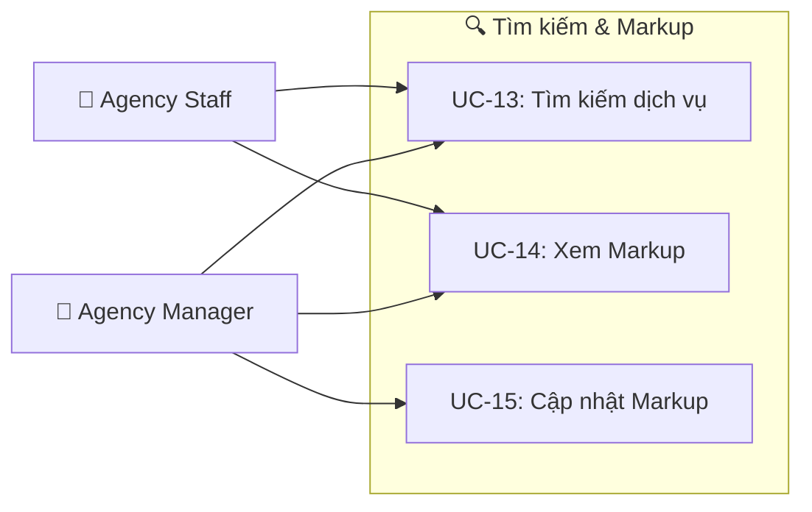

| UC | Actor | Mô tả | Quy tắc nghiệp vụ |
|---|---|---|---|
| UC-13 | Agency Manager, Staff | Tìm kiếm dịch vụ du lịch (khách sạn, tour, vé xe/máy bay) theo điểm đến, ngày, số khách. Giá hiển thị = giá sỉ + Markup đại lý. | Chỉ hiển thị dịch vụ có slot > 0 và Status = Active |
| UC-14 | Agency Manager, Staff | Xem tỷ lệ Markup hiện tại của đại lý mình | Staff chỉ xem (Read-Only) |
| UC-15 | Agency Manager | Cập nhật tỷ lệ Markup (%) áp dụng cho tất cả dịch vụ hoặc theo loại dịch vụ | Thay đổi Markup chỉ ảnh hưởng đơn mới, không ảnh hưởng đơn đã Hold/Paid |

---

### Module 5: Đặt chỗ (Booking Engine)

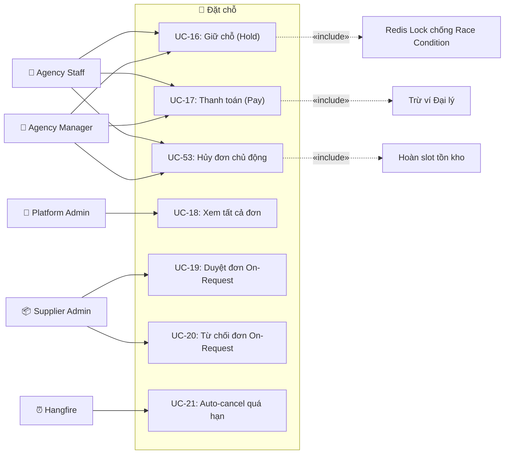

| UC | Actor | Mô tả | Quy tắc nghiệp vụ |
|---|---|---|---|
| UC-16 | Agency Manager, Staff | Giữ chỗ tạm thời (Hold): Redis Lock khóa slot → trừ tồn kho → tạo đơn `HELD` → đếm ngược 15 phút | Nếu đại lý KYC ≠ APPROVED hoặc ví ≤ 0 → từ chối |
| UC-17 | Agency Manager, Staff | Thanh toán đơn HELD: trừ ví đại lý → chuyển trạng thái `PAID` → trigger phát hành voucher | Đơn phải ở trạng thái `HELD` và chưa hết hạn 15 phút |
| UC-53 | Agency Manager, Staff | **MỚI** — Hủy đơn đang `HELD` chủ động trước khi hết 15 phút: hoàn slot tồn kho, chuyển `CANCELLED` | Chỉ hủy được đơn của đại lý mình, chỉ khi status = `HELD` |
| UC-18 | Platform Admin | Xem toàn bộ đơn đặt chỗ trên hệ thống (lọc theo trạng thái, đại lý, ngày) | — |
| UC-19 | Supplier Admin | Duyệt đơn On-Request → chuyển `CONFIRMED` → thông báo cho đại lý | Phải duyệt trong 3 tiếng hoặc trước 21:00 |
| UC-20 | Supplier Admin | Từ chối đơn On-Request → hoàn tiền tạm giữ → thông báo đại lý | — |
| UC-21 | System / Hangfire | Tự động hủy đơn `HELD` quá 15 phút: hoàn slot kho, chuyển `EXPIRED` | Chạy mỗi phút (Recurring Job) |

---

### Module 6: Ví tài chính (Wallet)

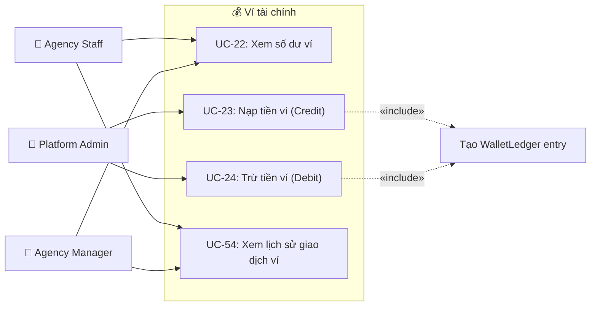

| UC | Actor | Mô tả | Quy tắc nghiệp vụ |
|---|---|---|---|
| UC-22 | Agency Manager, Staff | Xem số dư ví khả dụng (Available Balance) và hạn mức công nợ (Credit Limit) | Staff chỉ xem ví của đại lý mình |
| UC-23 | Platform Admin | Nạp tiền (Credit) vào ví đại lý sau khi xác nhận chuyển khoản ngân hàng | Bắt buộc ghi Ledger entry loại `CREDIT` kèm ghi chú |
| UC-24 | Platform Admin | Trừ tiền (Debit) khỏi ví đại lý (điều chỉnh thủ công, xử lý hoàn tiền) | Bắt buộc ghi Ledger entry loại `DEBIT` kèm lý do, audit log |
| UC-54 | Agency Manager, Staff | **MỚI** — Xem lịch sử giao dịch ví chi tiết (nạp/trừ/thanh toán), lọc theo ngày, phân trang | Chỉ xem giao dịch của đại lý mình |

---

### Module 7: Thanh toán VNPay

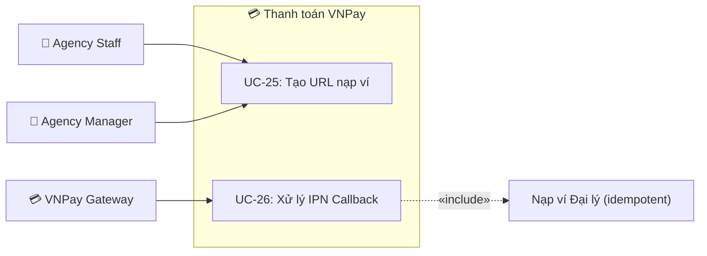

| UC | Actor | Mô tả | Quy tắc nghiệp vụ |
|---|---|---|---|
| UC-25 | Agency Manager, Staff | Tạo URL thanh toán VNPay với số tiền chỉ định, chuyển hướng đại lý sang trang VNPay | Số tiền tối thiểu 50.000 VNĐ |
| UC-26 | VNPay Gateway | VNPay gọi IPN callback báo thanh toán thành công → hệ thống xác minh HMAC hash → nạp ví → ghi Ledger | **Idempotent**: Redis TTL 5 phút chống trùng webhook |

---

### Module 8: Kho dịch vụ (Inventory)

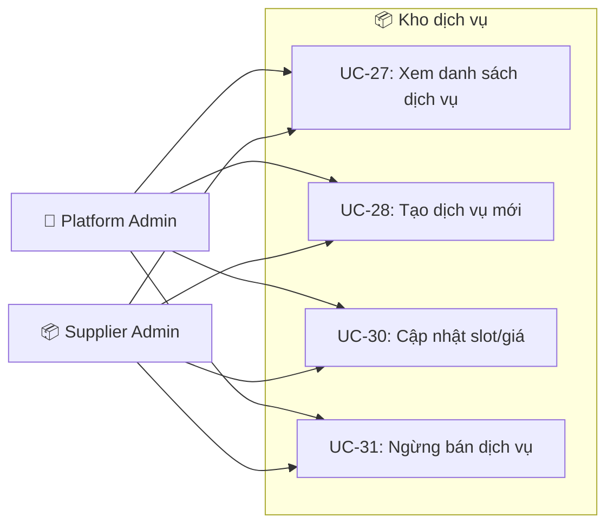

| UC | Actor | Mô tả | Quy tắc nghiệp vụ |
|---|---|---|---|
| UC-27 | Platform Admin, Supplier Admin | Xem danh sách dịch vụ (khách sạn, tour, vé). Supplier Admin chỉ thấy dịch vụ của NCC mình | Phân trang, lọc theo loại/trạng thái |
| UC-28 | Platform Admin, Supplier Admin | Tạo sản phẩm dịch vụ mới: nhập tên, mô tả, giá sỉ, loại, điểm đến, slot theo ngày | Supplier Admin chỉ tạo cho NCC mình |
| UC-30 | Platform Admin, Supplier Admin | Cập nhật số lượng slot và giá sỉ theo ngày | Thay đổi giá áp dụng cho booking mới (Price Freeze cho đơn cũ) |
| UC-31 | Platform Admin, Supplier Admin | Ngừng bán dịch vụ: chuyển Status = Inactive, không hiển thị khi tìm kiếm | Không ảnh hưởng đơn đã Paid |

---

### Module 9: Nhà cung cấp (Supplier Extranet)

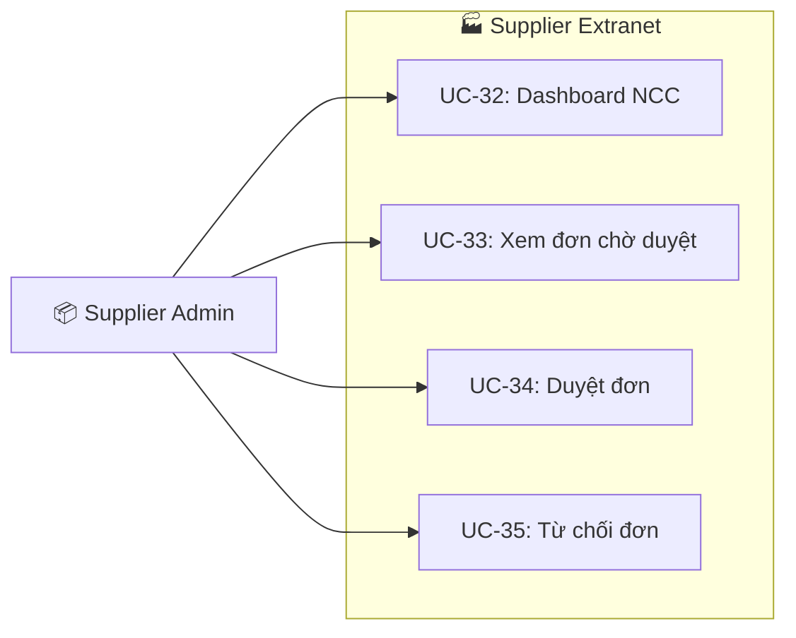

| UC | Actor | Mô tả |
|---|---|---|
| UC-32 | Supplier Admin | Dashboard tổng quan: tổng booking, doanh thu, tỷ lệ duyệt/từ chối |
| UC-33 | Supplier Admin | Danh sách booking On-Request đang chờ xác nhận (phân trang, lọc theo ngày) |
| UC-34 | Supplier Admin | Duyệt đơn On-Request → `CONFIRMED` → thông báo cho đại lý |
| UC-35 | Supplier Admin | Từ chối đơn On-Request → hoàn tiền → thông báo đại lý |

---

### Module 10: Voucher & Tích hợp vận chuyển

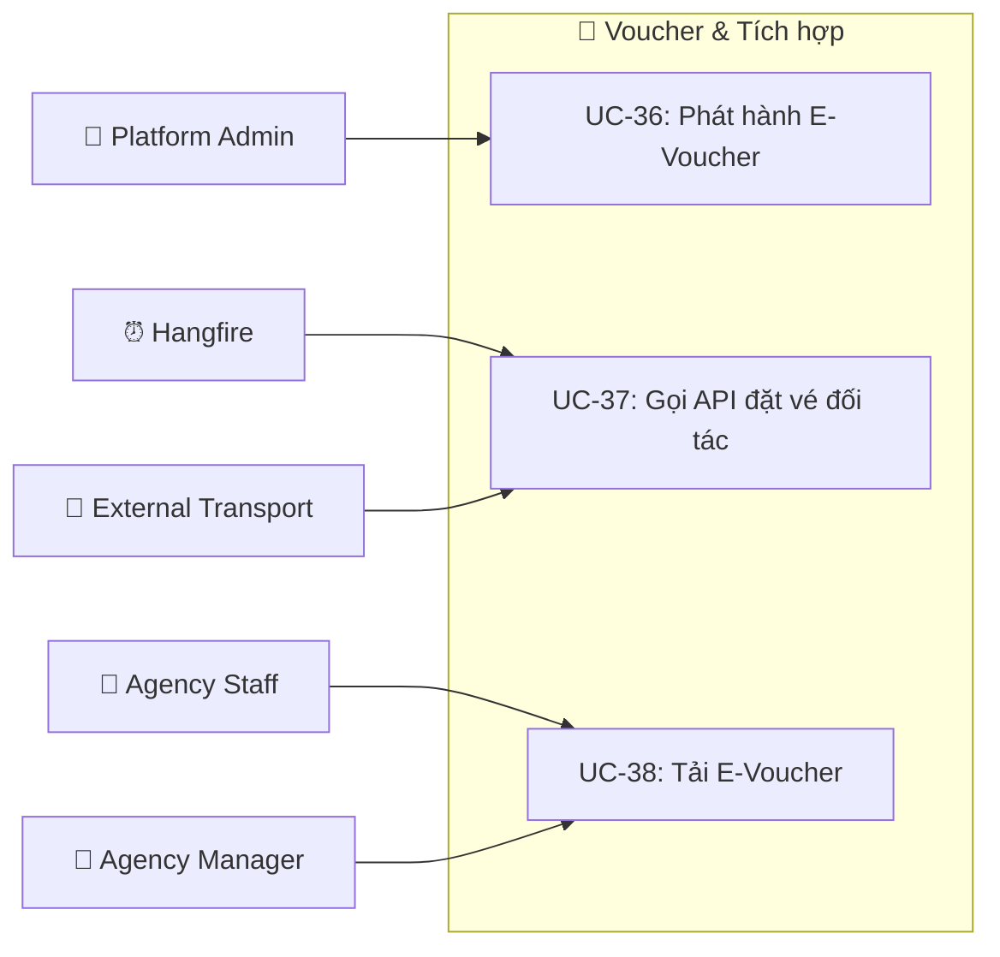

| UC | Actor | Mô tả | Quy tắc nghiệp vụ |
|---|---|---|---|
| UC-36 | Platform Admin | Phát hành E-Voucher / Vé điện tử (PDF) sau khi đơn `PAID` | Voucher chứa mã QR duy nhất để check-in |
| UC-37 | System / Hangfire, External Transport | Background Job gọi API đối tác (Phương Trang, hãng bay) để đồng bộ thông tin đặt vé | Retry Policy: Exponential Backoff (1p → 5p → 15p → 1h) |
| UC-38 | Agency Manager, Staff, External Transport | Tải file PDF E-Voucher / Vé điện tử về máy | File lưu trên Object Storage (S3/GCS) |

---

### Module 11: Khiếu nại (Claims & After-Sales)

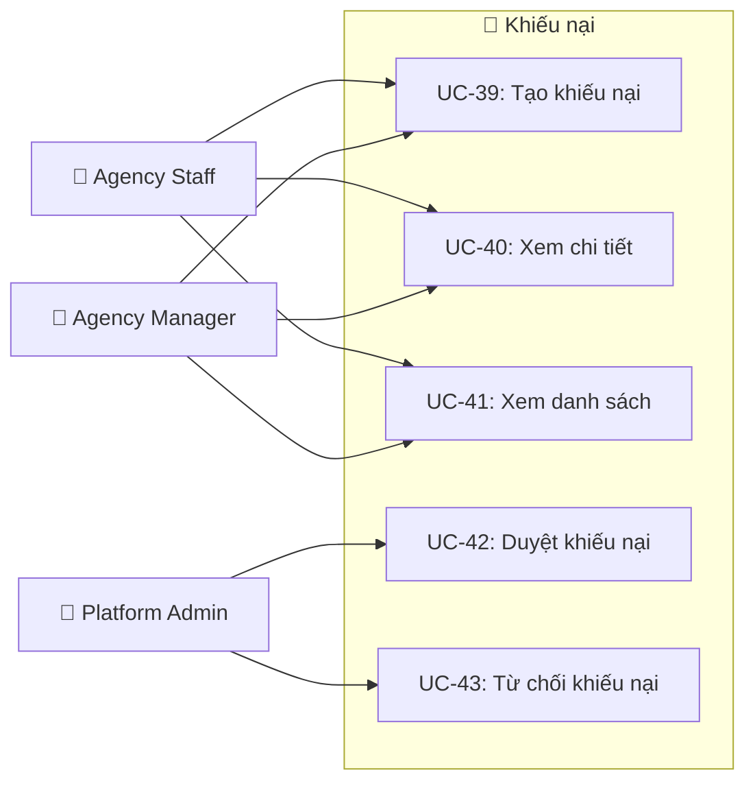

| UC | Actor | Mô tả | Quy tắc nghiệp vụ |
|---|---|---|---|
| UC-39 | Agency Manager, Staff | Tạo yêu cầu khiếu nại (hoàn tiền, hủy vé, tranh chấp dịch vụ) kèm mô tả chi tiết | Phải gắn với 1 booking ID cụ thể |
| UC-40 | Agency Manager, Staff | Xem chi tiết 1 khiếu nại đã tạo (trạng thái, phản hồi Admin) | Chỉ xem khiếu nại của đại lý mình |
| UC-41 | Agency Manager, Staff | Xem danh sách khiếu nại đã gửi (lọc theo trạng thái) | — |
| UC-42 | Platform Admin | Duyệt khiếu nại: chấp nhận → hoàn tiền vào ví đại lý (Credit) → ghi Ledger | Gửi Push thông báo kết quả |
| UC-43 | Platform Admin | Từ chối khiếu nại kèm lý do → trạng thái `REJECTED` | Gửi Push thông báo + lý do |

---

### Module 12: Thông báo (Notification)

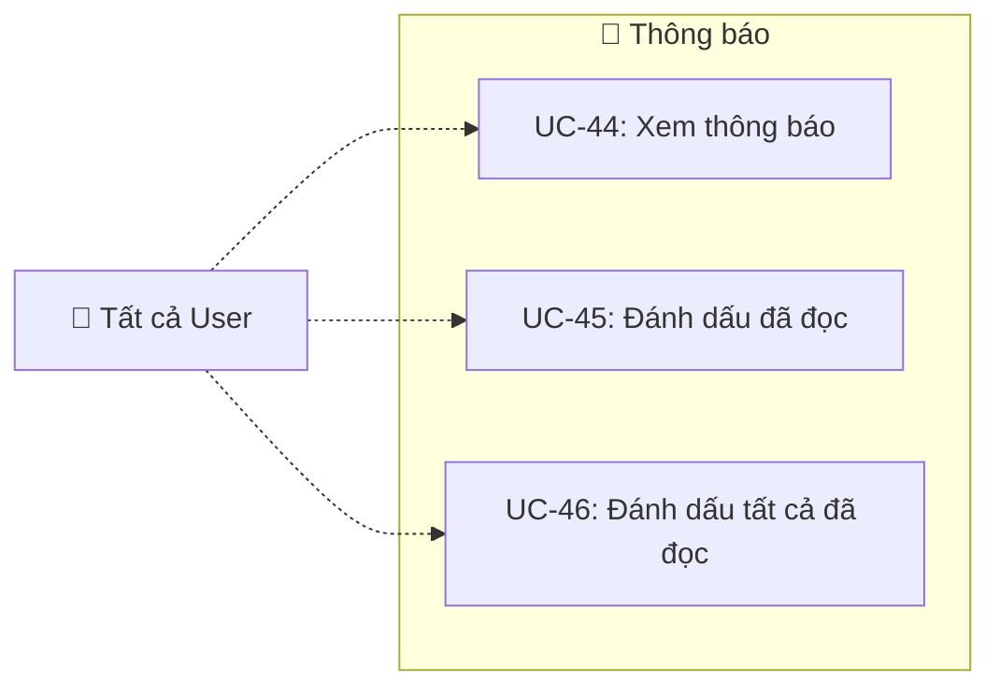

| UC | Actor | Mô tả |
|---|---|---|
| UC-44 | Tất cả | Xem danh sách thông báo (đơn mới, KYC duyệt, nạp ví thành công, khiếu nại...) — phân trang |
| UC-45 | Tất cả | Đánh dấu 1 thông báo đã đọc |
| UC-46 | Tất cả | Đánh dấu tất cả thông báo đã đọc |

---

### Module 13: Báo cáo & Cấu hình hệ thống

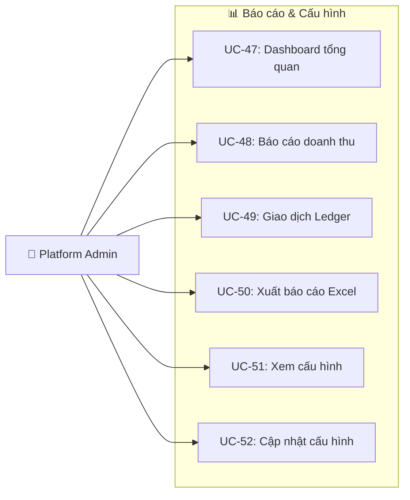

| UC | Actor | Mô tả |
|---|---|---|
| UC-47 | Platform Admin | Dashboard tổng quan: tổng booking, doanh thu, số đại lý, biểu đồ xu hướng |
| UC-48 | Platform Admin | Báo cáo doanh thu chi tiết theo khoảng thời gian, theo đại lý, theo dịch vụ |
| UC-49 | Platform Admin | Xem toàn bộ giao dịch Wallet Ledger (nạp/trừ/thanh toán/hoàn tiền) |
| UC-50 | Platform Admin | Xuất dữ liệu báo cáo dạng file Excel (.xlsx) |
| UC-51 | Platform Admin | Xem cấu hình hệ thống hiện tại (phí dịch vụ, thời gian hold, API key đối tác) |
| UC-52 | Platform Admin | Cập nhật tham số cấu hình toàn sàn |

---

### Tác vụ nền tự động (System / Hangfire)

| # | Tác vụ | Trigger | Mô tả |
|---|---|---|---|
| 1 | Auto-cancel đơn `HELD` quá hạn | Mỗi phút | Hủy booking HELD sau 15 phút → hoàn slot kho → chuyển `EXPIRED` |
| 2 | Auto-cancel đơn On-Request quá hạn | Mỗi phút | Hủy đơn `PENDING_SUPPLIER_APPROVAL` quá 3 tiếng hoặc quá 21:00 |
| 3 | Đồng bộ đặt vé đối tác | Tức thời (Event-driven) | Gọi API nhà xe/hãng bay chuyển thông tin đặt chỗ + Retry |
| 4 | Nhắc KYC sắp hết hạn | Hàng ngày 08:00 | Push thông báo 30 ngày trước ngày hết hạn KYC |
| 5 | Auto-suspend KYC quá hạn | Hàng ngày 00:00 | Chuyển đại lý sang `SUSPENDED` nếu KYC quá hạn chưa gia hạn |

---

## 📊 Ma Trận Actor × Module (MVP)

| Module | Platform Admin | Agency Manager | Agency Staff | Supplier Admin | System | VNPay | Ext. Transport |
|--------|:---:|:---:|:---:|:---:|:---:|:---:|:---:|
| Auth & Profile | ✅ | ✅ | ✅ | ✅ | — | — | — |
| KYC | ✅ Duyệt/Từ chối | 📝 Nộp | — | — | ⏰ Nhắc/Suspend | — | — |
| Staff Management | — | ✅ Quản lý | — | — | — | — | — |
| Search & Markup | — | ✅ R/W | ✅ R | — | — | — | — |
| Booking | 👁 Xem all | ✅ Hold/Pay/Cancel | ✅ Hold/Pay/Cancel | ✅ Approve/Reject | ⏰ Auto-cancel | — | — |
| Wallet | ✅ Credit/Debit | 👁 View + History | 👁 View + History | — | — | — | — |
| VNPay Payment | — | ✅ | ✅ | — | — | 📩 IPN | — |
| Inventory | ✅ | — | — | ✅ | — | — | — |
| Supplier Extranet | — | — | — | ✅ | — | — | — |
| Voucher | ✅ Issue | 👁 Tải | 👁 Tải | — | ⏰ Sync API | — | 🚌 Nhận API |
| Claim | ✅ Resolve | ✅ Create | ✅ Create | — | — | — | — |
| Notification | ✅ | ✅ | ✅ | ✅ | — | — | — |
| Report & Config | ✅ | — | — | — | — | — | — |

**Chú thích:** ✅ Toàn quyền · 👁 Chỉ xem · 📝 Tạo/Nộp · ⏰ Tự động · 🚌 API · 📩 Callback · R/W Đọc-Ghi · R Chỉ đọc
