# 📊 Sơ Đồ Use Case Tóm Tắt (Phase 1 MVP Summary)

> **Tài liệu tối ưu hiển thị trên GitHub:** Sơ đồ Use Case tổng hợp duy nhất dưới đây được thiết kế theo chiều dọc (**Top-Down**) và gom nhóm Use Case theo phân hệ cột để tránh bị kéo rộng chiều ngang, giúp hiển thị cân đối và rõ nét nhất trên giao diện GitHub.

---

## 🗺️ 1. Sơ Đồ Use Case Tổng Thể Phase 1 (MVP)

```mermaid
graph TD
    %% ACTORS
    PA["🔑 Platform Admin"]
    AM["🏢 Agency Manager"]
    AS["👤 Agency Staff"]
    SA["📦 Supplier Admin"]
    SYS["⏰ System / Hangfire"]
    VNPAY["💳 VNPay Gateway"]

    subgraph B2B_Platform["🏗️ HỆ THỐNG B2B TRAVEL PLATFORM (MVP)"]
        
        %% Nhóm 1: Admin & KYC
        subgraph Admin_Section["🛡️ Phân Hệ Admin & KYC"]
            UC_G02["UC-G02: Phê duyệt hồ sơ KYC"]
            UC_G12["UC-G12: Quản lý ví & Sổ cái Ledger"]
        end

        %% Nhóm 2: Tìm kiếm & Đặt chỗ (Agency)
        subgraph Agency_Section["🛒 Phân Hệ Đại Lý (Agency)"]
            UC_G01["UC-G01: Quản lý tài khoản"]
            UC_G03["UC-G03: Tìm kiếm & Markup"]
            UC_G04["UC-G04: Xuất báo giá lẻ (Quotation)"]
            UC_G05["UC-G05: Trợ lý AI tư vấn combo"]
            UC_G06["UC-G06: Quản lý giỏ hàng combo"]
            UC_G07["UC-G07: Giữ chỗ & Thanh toán gộp (Saga)"]
            UC_G09["UC-G09: Hủy đơn (Chủ động/Tự động)"]
            UC_G10["UC-G10: Tải E-Voucher / Vé điện tử"]
            UC_G13["UC-G13: Nạp tiền ví qua VNPay"]
        end

        %% Nhóm 3: Supplier & Check-in
        subgraph Supplier_Section["📦 Phân Hệ Nhà Cung Cấp (Supplier)"]
            UC_G08["UC-G08: Duyệt đơn On-Request"]
            UC_G11["UC-G11: Xác nhận đón khách (Check-in)"]
        end
    end

    %% CONNECTIONS (Nhân sự liên kết đến Use Case)
    PA --> UC_G02 & UC_G12
    
    AM --> UC_G01 & UC_G03 & UC_G04 & UC_G05 & UC_G06 & UC_G07 & UC_G09 & UC_G10 & UC_G12 & UC_G13
    AS --> UC_G01 & UC_G03 & UC_G04 & UC_G05 & UC_G06 & UC_G07 & UC_G09 & UC_G10 & UC_G12
    
    SA --> UC_G01 & UC_G08 & UC_G11

    %% CONNECTIONS (Hệ thống ngoài tự động liên kết đến Use Case)
    SYS -.-> UC_G09 & UC_G10
    VNPAY -.-> UC_G13
```

---

## 📝 2. Bảng Mô Tả Nghiệp Vụ Tóm Tắt

| Mã Use Case | Tên Use Case Tóm Tắt | Actor Chính | Nội dung nghiệp vụ cốt lõi |
| :--- | :--- | :--- | :--- |
| **UC-G01** | Quản lý tài khoản | Đại lý, NCC, Admin | Quản lý đăng ký mới, đăng nhập cấp JWT, và thay đổi mật khẩu/hồ sơ của tất cả nhân sự. |
| **UC-G02** | Phê duyệt hồ sơ KYC | Platform Admin | Thẩm định và duyệt/từ chối hồ sơ pháp lý của Đại lý mới đăng ký để mở khóa quyền giao dịch. |
| **UC-G03** | Tìm kiếm & Markup | Agency Manager/Staff | Tìm kiếm kho phòng khách sạn, vé xe, tour. Manager tự cấu hình % markup (lợi nhuận đại lý) cộng vào giá gốc. |
| **UC-G04** | Xuất báo giá lẻ | Agency Manager/Staff | Trích xuất thông tin hành trình và giá bán lẻ đã cộng Markup thành file PDF/Excel gửi trực tiếp cho khách lẻ. |
| **UC-G05** | Trợ lý AI tư vấn | Agency Manager/Staff | Nhập yêu cầu bằng ngôn ngữ tự nhiên, AI phân tích dữ liệu kho sỉ để đề xuất combo tối ưu kèm liên kết giữ chỗ nhanh. |
| **UC-G06** | Quản lý giỏ hàng | Agency Manager/Staff | Cho phép thêm/bớt nhiều dịch vụ du lịch (tour, phòng, xe) vào một giỏ hàng trước khi tiến hành giữ chỗ đồng thời. |
| **UC-G07** | Giữ chỗ & Thanh toán gộp | Agency Manager/Staff | **Saga Pattern:** Giữ chỗ đồng thời toàn bộ dịch vụ trong giỏ hàng (khóa kho 15p) và thanh toán gộp 1 lần từ ví đại lý. |
| **UC-G08** | Duyệt đơn On-Request | Supplier Admin | Phê duyệt thủ công các yêu cầu đặt chỗ đối với các dịch vụ không khóa slot tự động (cần NCC check phòng/xe thực tế). |
| **UC-G09** | Hủy đơn đặt chỗ | Đại lý, Hangfire | Đại lý chủ động hủy đơn giữ chỗ để giải phóng kho, hoặc hệ thống tự động hủy và hoàn kho sau 15 phút nếu chưa thanh toán. |
| **UC-G10** | Phát hành E-Voucher | Đại lý, Hệ thống | Sinh mã QR và file PDF E-Voucher cho dịch vụ nội bộ, hoặc gọi API đối tác bên thứ ba xuất vé thật (Bus/Flight E-Ticket). |
| **UC-G11** | Xác nhận đón (Check-in) | Supplier Admin, Đại lý | **Check-in phân loại:** - *Tour/Khách sạn:* Supplier quét QR Voucher trên điện thoại khách. - *Nhà xe đối tác:* Tài xế đối chiếu thông tin hành khách (CCCD/Tên). - *Hãng bay:* Khách tự check-in trực tiếp tại sân bay bằng vé điện tử nhận được. |
| **UC-G12** | Quản lý ví tài chính | Agency Manager/Staff | Xem số dư ví tiền mặt, hạn mức tín dụng công nợ tạm ứng, và truy vấn lịch sử giao dịch (sổ cái ledger không thể sửa đổi). |
| **UC-G13** | Nạp tiền ví qua VNPay | Agency Manager, VNPay | Sinh link thanh toán online qua VNPay, tự động cập nhật số dư ví đại lý ngay lập tức khi giao dịch thành công (IPN callback). |
