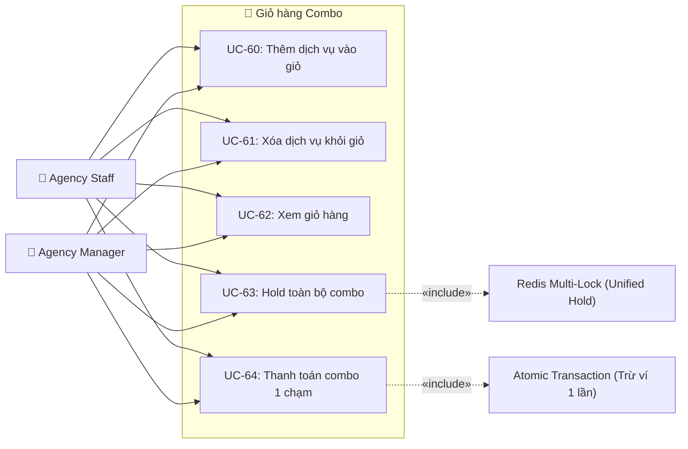
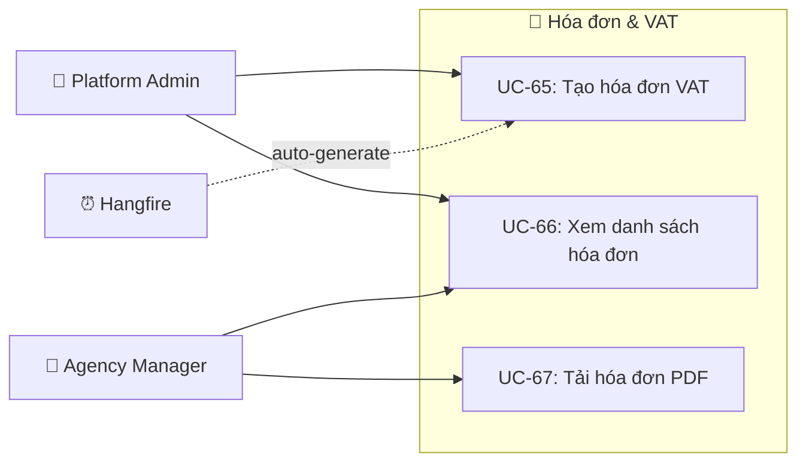
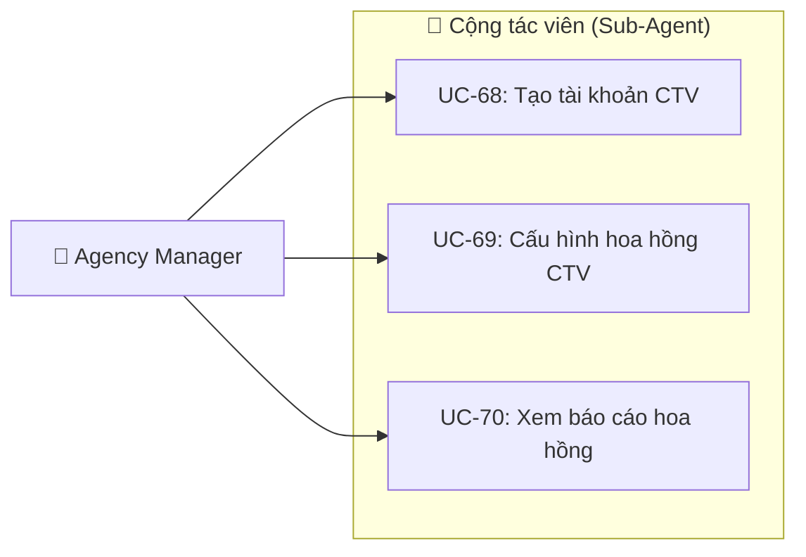
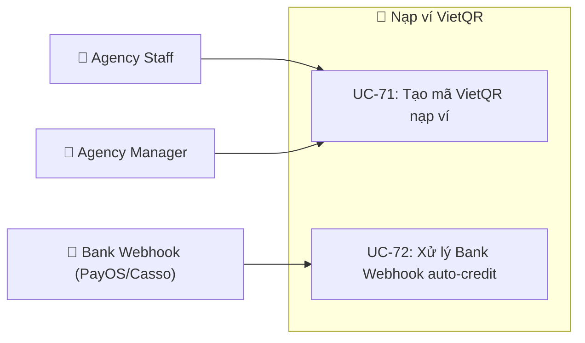
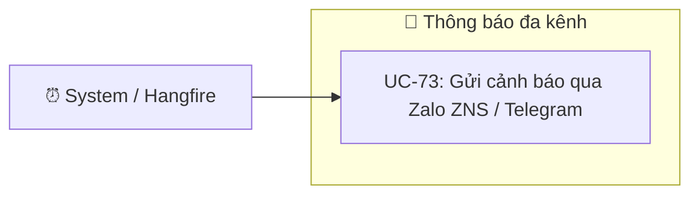

# 📈 Giai Đoạn 2: Use Case Mở Rộng — Scale-Up Khi Hệ Thống Ổn Định

> Tài liệu liệt kê các Use Case nâng cao sẽ được triển khai **sau khi Giai đoạn 1 (MVP) đã vận hành ổn định** và được hội đồng duyệt. Các tính năng này giúp hệ thống mở rộng quy mô, tăng trải nghiệm người dùng và tối ưu vận hành.
>
> **Điều kiện kích hoạt:** Giai đoạn 1 hoạt động ổn định ≥ 1 tháng, không có lỗi nghiêm trọng, có ≥ 20 đại lý sử dụng thực tế.

---

## 📊 Tổng quan Phase 2

*   **Use Case mới bổ sung:** 14 UC
*   **Module mới:** Invoicing & VAT (M08), Shopping Cart (M05)
*   **Actor mới:** Sub-Agent / CTV (mở rộng từ Agency Staff)
*   **Tổng UC sau Phase 2:** 45 (MVP) + 14 (Scale-up) = **59 UC**

---

## 🔄 So sánh Phase 1 vs Phase 2

| Tiêu chí | Phase 1 (MVP) | Phase 2 (Scale-Up) |
|---|---|---|
| **Đặt chỗ** | Đặt từng dịch vụ riêng lẻ | Giỏ hàng combo đa dịch vụ, thanh toán 1 lần |
| **Nạp ví** | VNPay (có phí giao dịch) | VietQR biến động (phí 0%) |
| **Hóa đơn** | Không có | Xuất hóa đơn VAT điện tử |
| **Cộng tác viên** | Không hỗ trợ | Hệ thống Sub-Agent + chia hoa hồng tự động |
| **Thông báo** | Push Notification (FCM) | Thêm Zalo ZNS / Telegram Bot |
| **KYC** | Duyệt thủ công | AI OCR tự động duyệt |
| **Tìm kiếm** | Tìm thủ công | AI tư vấn combo + gợi ý Markup |

---

## 📝 Chi Tiết Use Case Phase 2

---

### Module mới: Giỏ hàng Combo (Shopping Cart — M05)

> **Lý do chuyển sang Phase 2:** Giỏ hàng combo đòi hỏi cơ chế **Unified Hold** (khóa đồng thời nhiều dịch vụ của nhiều NCC) và **Atomic Payment** (thanh toán nguyên tử cho cả combo). Đây là logic phức tạp cần kiến trúc Saga/2-Phase Commit, chỉ triển khai khi booking đơn lẻ (Phase 1) đã ổn định.

| UC | Actor | Mô tả | Quy tắc nghiệp vụ |
|---|---|---|---|
| UC-60 | Agency Manager, Staff | Thêm dịch vụ (phòng, vé xe, tour) vào giỏ hàng tạm — hỗ trợ nhiều NCC khác nhau | Giỏ hàng lưu trong Redis với TTL 30 phút |
| UC-61 | Agency Manager, Staff | Xóa 1 dịch vụ cụ thể khỏi giỏ hàng | — |
| UC-62 | Agency Manager, Staff | Xem toàn bộ giỏ hàng: danh sách dịch vụ, tổng giá (bao gồm Markup), tổng slot | — |
| UC-63 | Agency Manager, Staff | Unified Hold: hệ thống khóa Redis Lock cho **toàn bộ** dịch vụ trong giỏ cùng lúc → nếu bất kỳ dịch vụ nào hết slot → rollback tất cả | Tất cả-hoặc-không (All-or-Nothing) |
| UC-64 | Agency Manager, Staff | Thanh toán combo: 1 lệnh trừ ví cho tổng tiền → tạo nhiều booking riêng → phát hành nhiều voucher | DB Transaction bao bọc toàn bộ → rollback nếu lỗi |

---

### Module mới: Hóa đơn & VAT (Invoicing — M08)

> **Lý do chuyển sang Phase 2:** Tích hợp hóa đơn điện tử VAT yêu cầu kết nối API bên thứ ba (VNInvoice, eHoaDon...) và tuân thủ quy định thuế phức tạp. Giai đoạn MVP ưu tiên luồng giao dịch cốt lõi trước.

| UC | Actor | Mô tả | Quy tắc nghiệp vụ |
|---|---|---|---|
| UC-65 | Platform Admin, System | Tạo hóa đơn VAT điện tử cho đơn hàng đã PAID → gọi API nhà cung cấp hóa đơn điện tử | Auto-generate bởi Hangfire sau khi đơn chuyển `PAID` |
| UC-66 | Platform Admin, Agency Manager | Xem danh sách hóa đơn đã phát hành (lọc theo đại lý, khoảng thời gian) | — |
| UC-67 | Agency Manager | Tải file PDF hóa đơn VAT | Lưu trên Object Storage |

---

### Mở rộng: Cổng Cộng Tác Viên (Sub-Agent / CTV)

> **Lý do chuyển sang Phase 2:** Hệ thống CTV đòi hỏi mô hình phân cấp tài khoản (Agency → Sub-Agent), ví riêng/ví ảo, và cơ chế chia hoa hồng real-time. Cần kiến trúc Wallet Ledger ổn định (Phase 1) trước khi mở rộng.

| UC | Actor | Mô tả | Quy tắc nghiệp vụ |
|---|---|---|---|
| UC-68 | Agency Manager | Tạo tài khoản CTV dưới đại lý mình (username, tên, SĐT, mức hoa hồng %) | CTV đăng nhập bằng role `SUB_AGENT`, chỉ thấy dịch vụ và markup do Agency Manager cấu hình |
| UC-69 | Agency Manager | Cấu hình tỷ lệ hoa hồng (%) hoặc số tiền cố định cho mỗi CTV | Hoa hồng tự động cộng dồn vào ví ảo CTV khi đơn hàng `PAID` |
| UC-70 | Agency Manager | Xem báo cáo tổng hợp hoa hồng theo CTV, khoảng thời gian, trạng thái chi trả | — |

---

### Mở rộng: Nạp ví VietQR biến động (Dynamic QR Auto-Credit)

> **Lý do chuyển sang Phase 2:** Tích hợp Bank Webhook (PayOS, Casso) yêu cầu hợp đồng với nhà cung cấp dịch vụ tài chính và tuân thủ quy định ngân hàng. Giai đoạn MVP sử dụng VNPay quen thuộc trước.

| UC | Actor | Mô tả | Quy tắc nghiệp vụ |
|---|---|---|---|
| UC-71 | Agency Manager, Staff | Tạo mã VietQR biến động chứa: tài khoản sàn + số tiền + nội dung mã hóa duy nhất | Hiển thị QR trực tiếp trên App |
| UC-72 | Bank Webhook | Ngân hàng đẩy webhook khi nhận chuyển khoản → hệ thống đối chiếu nội dung → auto nạp ví trong 2-3 giây | **Idempotent** bằng Redis TTL, **phí giao dịch 0%** |

---

### Mở rộng: Thông báo đa kênh (Zalo ZNS / Telegram Bot)

| UC | Actor | Mô tả | Quy tắc nghiệp vụ |
|---|---|---|---|
| UC-73 | System / Hangfire | Gửi thông báo nhắc nhở qua Zalo ZNS hoặc Telegram Bot khi: đơn sắp hết hạn hold (còn 5 phút), KYC sắp hết hạn, nạp ví thành công | Tin nhắn kèm nút tương tác: [Thanh Toán Ngay] / [Xem Chi Tiết] |

---

## 🤖 Hướng Phát Triển AI (Nghiên Cứu Dài Hạn)

Các tính năng AI dưới đây thuộc hướng nghiên cứu dài hạn, có thể đưa vào phần **"Hướng phát triển tương lai"** trong báo cáo đồ án:

| # | Tính năng AI | Mô tả | Công nghệ |
|---|---|---|---|
| 1 | **AI Travel Agent Assistant** | Chat AI tạo combo du lịch bằng ngôn ngữ tự nhiên + Function Calling gọi API tìm kiếm nội bộ | LLM (Gemini/GPT) + RAG |
| 2 | **AI OCR Auto-KYC** | Tự động quét ảnh Giấy phép lữ hành, trích xuất thông tin, đối chiếu CSDL doanh nghiệp quốc gia | Vision LLM + OCR |
| 3 | **AI Smart Markup Optimizer** | Gợi ý tỷ lệ Markup tối ưu theo mùa vụ, xu hướng thị trường, dữ liệu lịch sử | Machine Learning |
| 4 | **AI Fraud Detection** | Phát hiện hành vi gian lận: spam hold booking, lạm dụng hoàn tiền, tài khoản bất thường | Anomaly Detection |

---

## 📋 Lộ Trình Triển Khai Phase 2

Thực hiện từng bước, mỗi bước là 1 sprint (2 tuần), ưu tiên tính năng có giá trị kinh doanh cao nhất:

| Sprint | Tính năng | Số UC | Lý do ưu tiên |
| :---: | :--- | :---: | :--- |
| **Sprint 1** | Giỏ hàng Combo (Shopping Cart) | 5 UC | Nghiệp vụ cốt lõi nhất sau MVP: đặt combo tăng doanh thu 2-3x |
| **Sprint 2** | Nạp ví VietQR + Bank Webhook | 2 UC | Giảm phí giao dịch từ 1.2% xuống 0%, tăng lợi nhuận sàn |
| **Sprint 3** | Hóa đơn VAT điện tử | 3 UC | Yêu cầu pháp lý bắt buộc cho doanh nghiệp |
| **Sprint 4** | Cổng CTV & Chia hoa hồng | 3 UC | Mở rộng mạng lưới phân phối, tăng số đại lý gián tiếp |
| **Sprint 5** | Thông báo đa kênh (Zalo/Telegram) | 1 UC | Tăng tỷ lệ chuyển đổi đơn hàng thành công |

---

## 📊 Ma Trận Actor × Module (Phase 2 — Bổ sung)

| Module Phase 2 | Platform Admin | Agency Manager | Agency Staff | Supplier Admin | System | Bank Webhook |
|---|:---:|:---:|:---:|:---:|:---:|:---:|
| Shopping Cart (Combo) | — | ✅ | ✅ | — | — | — |
| Invoicing & VAT | ✅ Generate | 👁 View + Download | — | — | ⏰ Auto-generate | — |
| Sub-Agent / CTV | — | ✅ Quản lý | — | — | — | — |
| VietQR Auto-Credit | — | ✅ | ✅ | — | — | 📩 Webhook |
| Thông báo đa kênh | — | — | — | — | ⏰ Auto-send | — |

**Chú thích:** ✅ Toàn quyền · 👁 Chỉ xem · ⏰ Tự động · 📩 Callback
