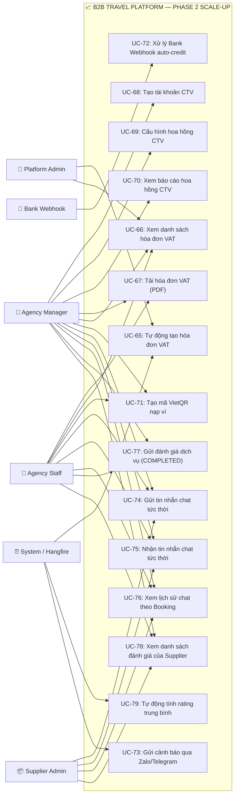

# 📊 Bản Đồ Use Case Toàn Diện — B2B Travel Platform

> Tài liệu tổng hợp toàn bộ sơ đồ và danh sách Use Case của dự án B2B Travel Platform, bao gồm cả Giai đoạn 1 (MVP) và Giai đoạn 2 (Scale-up).
>
> **Tổng quy mô dự án:** 68 Use Cases | 17 Modules | 8 Actors

---

## 🗺️ 1. Sơ Đồ Use Case Tổng Quan

Để hội đồng dễ theo dõi và phản biện, sơ đồ Use Case của dự án được chia làm 2 phần theo đúng lộ trình phát triển:

### 1.1 Sơ đồ Phase 1: MVP & Trợ lý AI (50 Use Cases)

```mermaid
graph LR
    %% ACTORS
    PA["🔑 Platform Admin"]
    AM["🏢 Agency Manager"]
    AS["👤 Agency Staff"]
    SA["📦 Supplier Admin"]
    EXT["🚌 External Transport"]
    SYS["⏰ System / Hangfire"]
    VNPAY["💳 VNPay Gateway"]
    AI_AST["🤖 AI Assistant"]

    subgraph B2B_MVP["🏗 B2B TRAVEL PLATFORM — PHASE 1 MVP"]
        %% Auth & Profile
        UC01["UC-01: Đăng nhập & Cấp Token"]
        UC02["UC-02: Refresh Token"]
        UC03["UC-03: Thu hồi Token (Logout)"]
        UC04["UC-04: Đăng ký Đại lý mới"]
        UC55["UC-55: Đổi mật khẩu"]
        UC56["UC-56: Cập nhật hồ sơ cá nhân"]

        %% KYC
        UC07["UC-07: Xem danh sách Đại lý"]
        UC08["UC-08: Xem Đại lý chờ KYC"]
        UC10["UC-10: Duyệt KYC"]
        UC11["UC-11: Từ chối KYC"]
        UC12["UC-12: Đình chỉ Đại lý"]

        %% Staff Management
        UC57["UC-57: Thêm nhân viên đại lý"]
        UC58["UC-58: Khóa/Mở khóa nhân viên"]

        %% Search & Markup
        UC13["UC-13: Tìm kiếm dịch vụ"]
        UC14["UC-14: Xem Markup"]
        UC15["UC-15: Cập nhật Markup"]

        %% Booking Engine
        UC16["UC-16: Giữ chỗ (Hold)"]
        UC17["UC-17: Thanh toán (Pay)"]
        UC18["UC-18: Xem tất cả đơn"]
        UC19["UC-19: Duyệt đơn On-Request"]
        UC20["UC-20: Từ chối đơn On-Request"]
        UC21["UC-21: Auto-cancel quá hạn"]
        UC53["UC-53: Hủy đơn HELD chủ động"]

        %% Wallet
        UC22["UC-22: Xem số dư ví"]
        UC23["UC-23: Nạp tiền ví (Credit)"]
        UC24["UC-24: Trừ tiền ví (Debit)"]
        UC54["UC-54: Xem lịch sử giao dịch ví"]

        %% Payment VNPay
        UC25["UC-25: Tạo URL nạp ví VNPay"]
        UC26["UC-26: Xử lý IPN Callback"]

        %% Inventory
        UC27["UC-27: Xem danh sách dịch vụ"]
        UC28["UC-28: Tạo dịch vụ mới"]
        UC30["UC-30: Cập nhật slot/giá"]
        UC31["UC-31: Ngừng bán dịch vụ"]

        %% Supplier
        UC32["UC-32: Dashboard NCC"]
        UC33["UC-33: Xem đơn chờ duyệt"]

        %% Voucher
        UC36["UC-36: Phát hành E-Voucher"]
        UC37["UC-37: Gọi API đặt chỗ đối tác"]
        UC38["UC-38: Tải E-Voucher"]

        %% Claim
        UC39["UC-39: Tạo khiếu nại"]
        UC42["UC-42: Duyệt khiếu nại"]
        UC43["UC-43: Từ chối khiếu nại"]

        %% Notification
        UC44["UC-44: Xem thông báo"]
        UC45["UC-45: Đánh dấu đã đọc"]

        %% Report & Config
        UC47["UC-47: Dashboard báo cáo"]
        UC49["UC-49: Xem giao dịch Ledger"]
        UC50["UC-50: Xuất báo cáo Excel"]
        UC52["UC-52: Cập nhật cấu hình hệ thống"]

        %% AI Assistant
        UC80["UC-80: Nhập yêu cầu bằng chatbot (NLP)"]
        UC81["UC-81: Nhận đề xuất combo kèm báo giá"]
        UC82["UC-82: Nhận link đặt giữ chỗ từ chat AI (Không tự Hold)"]
        UC83["UC-83: Xuất báo giá du lịch (Export Quotation)"]
        UC84["UC-84: Quét QR check-in đón khách"]

        %% Shopping Cart (Chuyển sang Phase 1)
        UC60["UC-60: Thêm dịch vụ vào giỏ combo"]
        UC61["UC-61: Xóa dịch vụ khỏi giỏ combo"]
        UC62["UC-62: Xem giỏ hàng combo"]
        UC63["UC-63: Hold toàn bộ combo (Saga)"]
        UC64["UC-64: Thanh toán combo 1 chạm"]
    end

    %% CONNECTIONS
    PA --> UC10 & UC11 & UC12 & UC07 & UC08 & UC18 & UC23 & UC24 & UC36 & UC42 & UC43 & UC47 & UC49 & UC50 & UC52
    AM --> UC04 & UC15 & UC57 & UC58 & UC80 & UC81 & UC82 & UC83 & UC60 & UC61 & UC62 & UC63 & UC64
    AM --> UC14
    AS --> UC80 & UC81 & UC82 & UC83 & UC60 & UC61 & UC62 & UC63 & UC64
    AS & AM --> UC01 & UC13 & UC16 & UC17 & UC53 & UC22 & UC54 & UC25 & UC38 & UC39 & UC44 & UC45 & UC55 & UC56 & UC60 & UC61 & UC62 & UC63 & UC64
    SA --> UC01 & UC27 & UC28 & UC30 & UC31 & UC19 & UC20 & UC32 & UC33 & UC44 & UC55 & UC84
    SYS --> UC21 & UC37
    VNPAY --> UC26
    EXT --> UC37 & UC38
    AI_AST --> UC81 & UC82
```

---

### 1.2 Sơ đồ Phase 2: Scale-Up & Nâng Cao (20 Use Cases)

---

## 📝 2. Danh Sách Use Cases Chi Tiết Theo Module

---

### Module 1: Xác thực & Tài khoản (Auth & RBAC)
*   **UC-01:** Đăng nhập & Cấu Token.
*   **UC-02:** Gia hạn Token.
*   **UC-03:** Đăng xuất.
*   **UC-04:** Đăng ký Đại lý mới.
*   **UC-55:** Đổi mật khẩu tài khoản.
*   **UC-56:** Cập nhật thông tin hồ sơ cá nhân.

### Module 2: Quản lý KYC (KYC & Onboarding)
*   **UC-07:** Xem danh sách Đại lý toàn sàn.
*   **UC-08:** Xem danh sách Đại lý chờ duyệt KYC.
*   **UC-10:** Phê duyệt KYC.
*   **UC-11:** Từ chối KYC.
*   **UC-12:** Đình chỉ hoạt động đại lý vi phạm.

### Module 3: Quản lý Nhân Viên (Staff Management)
*   **UC-57:** Thêm nhân viên đại lý mới.
*   **UC-58:** Khóa/Mở khóa tài khoản nhân viên.

### Module 4: Tìm kiếm & Markup (Search & Markup)
*   **UC-13:** Tìm kiếm dịch vụ du lịch (giá sỉ + markup).
*   **UC-14:** Xem cấu hình tỷ lệ Markup của đại lý (Chỉ dành cho Agency Manager - Staff bị ẩn).
*   **UC-15:** Cập nhật tỷ lệ Markup (Chỉ dành cho Agency Manager).
*   **UC-83:** Xuất báo giá du lịch (Export Quotation) - dành cho cả Manager và Staff.

### Module 5: Trợ Lý AI Báo Giá (AI Assistant - Phase 1)
*   **UC-80:** Nhập yêu cầu bằng chatbot ngôn ngữ tự nhiên (NLP).
*   **UC-81:** Nhận đề xuất combo kèm báo giá tự động đã tính markup.
*   **UC-82:** Nhận link đặt giữ chỗ từ chat AI (Không tự động kích hoạt giữ chỗ).

### Module 6: Động Cơ Đặt Chỗ (Booking Engine)
*   **UC-16:** Đặt giữ chỗ tạm thời (Hold PNR) kèm theo khai báo thông tin hành khách - đếm ngược 15 phút.
*   **UC-17:** Thanh toán đơn hàng (Pay) - trừ số dư ví đại lý.
*   **UC-18:** Xem danh sách đơn đặt chỗ toàn sàn.
*   **UC-19:** Duyệt đơn đặt chỗ On-Request.
*   **UC-20:** Từ chối đơn đặt chỗ On-Request.
*   **UC-21:** Auto-cancel đơn giữ chỗ quá hạn.
*   **UC-53:** Hủy đơn hàng HELD chủ động trước khi hết 15 phút.
*   **UC-84:** Xác nhận đón khách (Check-in) - Quét QR cho dịch vụ nội bộ hoặc Đối chiếu thông tin cho nhà xe bên thứ 3.

### Module 7: Ví Tài Chính (Wallet & Payment)
*   **UC-22:** Xem số dư ví đại lý và hạn mức tín dụng công nợ.
*   **UC-23:** Nạp tiền vào ví đại lý (Platform Admin duyệt).
*   **UC-24:** Trừ tiền ví đại lý (Platform Admin điều chỉnh).
*   **UC-54:** Xem lịch sử giao dịch ví chi tiết (Ledger).

### Module 8: Cổng Thanh Toán VNPay (Payment Gateway)
*   **UC-25:** Tạo URL nạp tiền ví đại lý qua cổng VNPay.
*   **UC-26:** Xử lý IPN Callback từ VNPay.

### Module 9: Quản lý Kho Dịch Vụ (Inventory)
*   **UC-27:** Xem danh sách dịch vụ của nhà cung cấp.
*   **UC-28:** Đăng tải dịch vụ du lịch mới.
*   **UC-30:** Cập nhật số lượng chỗ trống và giá sỉ theo từng ngày.
*   **UC-31:** Ngừng bán dịch vụ du lịch.

### Module 10: Extranet Nhà Cung Cấp (Supplier Extranet)
*   **UC-32:** Xem dashboard thống kê đơn hàng và doanh thu của NCC.
*   **UC-33:** Xem danh sách đơn On-Request chờ phê duyệt.

### Module 11: Phát Hành Vé Điện Tử (Voucher & QR)
*   **UC-36:** Tự động phát hành E-Voucher kèm mã QR Code sau khi PAID.
*   **UC-37:** Gọi API đồng bộ đặt vé đối tác vận chuyển bên ngoài.
*   **UC-38:** Tải E-Voucher / Vé điện tử (PDF).

### Module 12: Khiếu Nại & Hậu Mãi (Claims)
*   **UC-39:** Tạo yêu cầu khiếu nại.
*   **UC-42:** Phê duyệt khiếu nại (Tự động hoàn tiền vào ví).
*   **UC-43:** Từ chối yêu cầu khiếu nại.

### Module 13: Thông Báo Hệ Thống (Notification)
*   **UC-44:** Xem danh sách thông báo in-app.
*   **UC-45:** Đánh dấu thông báo đã đọc.

### Module 14: Báo Cáo & Cấu Hình Sàn (Reporting & Config)
*   **UC-47:** Xem Dashboard báo cáo doanh thu.
*   **UC-49:** Xem lịch sử Ledger giao dịch toàn sàn.
*   **UC-50:** Xuất báo cáo giao dịch ví ra file Excel.
*   **UC-52:** Cập nhật cấu hình hệ thống.

### Module 15: Giỏ Hàng Combo (Shopping Cart - Phase 2)
*   **UC-60:** Thêm dịch vụ vào giỏ hàng combo.
*   **UC-61:** Xóa dịch vụ khỏi giỏ hàng combo.
*   **UC-62:** Xem chi tiết giỏ hàng combo.
*   **UC-63:** Unified Hold: Khóa đồng thời nhiều dịch vụ.
*   **UC-64:** Thanh toán combo 1 chạm.

### Module 16: Hóa Đơn Điện Tử (Invoicing & VAT - Phase 2)
*   **UC-65:** Tự động tạo hóa đơn VAT điện tử qua API bên thứ ba.
*   **UC-66:** Xem danh sách hóa đơn VAT đã phát hành.
*   **UC-67:** Tải file PDF hóa đơn điện tử.

### Module 17: Cộng Tác Viên (Sub-Agent / CTV - Phase 2)
*   **UC-68:** Tạo tài khoản CTV trực thuộc đại lý.
*   **UC-69:** Cấu hình tỷ lệ chia sẻ hoa hồng cho CTV.
*   **UC-70:** Xem báo cáo doanh thu và hoa hồng của CTV.

### Module 18: Nạp Ví VietQR (VietQR Payment - Phase 2)
*   **UC-71:** Tạo mã VietQR biến động hiển thị số tiền nạp.
*   **UC-72:** Xử lý Bank Webhook tự động cộng tiền ví (Phí 0%).

### Module 19: Chat Thời Gian Thực (Real-time Chat - Phase 2)
*   **UC-74:** Gửi tin nhắn text, hình ảnh đến đối tác.
*   **UC-75:** Nhận tin nhắn chat đẩy tức thời qua SignalR.
*   **UC-76:** Xem lại toàn bộ lịch sử tin nhắn chat theo BookingId.

### Module 20: Đánh Giá & Phản Hồi (Review & Rating - Phase 2)
*   **UC-77:** Gửi đánh giá dịch vụ khi đơn COMPLETED.
*   **UC-78:** Xem danh sách đánh giá công khai của nhà cung cấp.
*   **UC-79:** Tự động tính toán lại điểm rating trung bình của Supplier.

### Module 21: Gửi Cảnh Báo Ngoài Sàn (Alert Notification - Phase 2)
*   **UC-73:** Gửi thông báo tự động qua Zalo ZNS / Telegram Bot.

---

## 📊 3. Ma Trận Actor × Use Case (MVP + Scale-Up)

Bảng phân phối quyền hạn kích hoạt và tương tác của các tác nhân đối với toàn bộ Use Case:

| Use Case | Platform Admin | Agency Manager | Agency Staff | Supplier Admin | System | VNPay / Bank | AI Assistant |
|---|:---:|:---:|:---:|:---:|:---:|:---:|:---:|
| **Auth (01-03, 55, 56)** | ✅ | ✅ | ✅ | ✅ | — | — | — |
| **KYC (04, 07-12)** | ✅ Duyệt | 📝 Nộp | — | — | ⏰ Suspend | — | — |
| **Staff (57, 58)** | — | ✅ | — | — | — | — | — |
| **Search/Markup (13-15, 83)**| — | ✅ R/W/Export | ✅ R/Export (Ẩn UC14) | — | — | — | 🤖 Gợi ý |
| **Booking (16-21, 53, 84)** | 👁 Xem | ✅ Hold/Pay | ✅ Hold/Pay | ✅ Duyệt/Check-in | ⏰ Hủy | — | 🤖 Link đặt |
| **Wallet (22-24, 54)** | ✅ Credit | 👁 Xem | 👁 Xem | — | — | — | — |
| **Payment (25, 26, 71, 72)**| — | ✅ | ✅ | — | — | 📩 Webhook | — |
| **Inventory (27-31)** | ✅ | — | — | ✅ | — | — | — |
| **Supplier (32, 33)** | — | — | — | ✅ | — | — | — |
| **Voucher (36-38)** | ✅ Phát | 👁 Tải | 👁 Tải | — | ⏰ Sync | 🚌 API | — |
| **Claim (39-43)** | ✅ Duyệt | ✅ Tạo | ✅ Tạo | — | — | — | — |
| **Noti (44-46, 73)** | ✅ | ✅ | ✅ | ✅ | ⏰ Send | — | — |
| **Report/Config (47-52)**| ✅ | — | — | — | — | — | — |
| **Cart (60-64 - P2)** | — | ✅ | ✅ | — | — | — | — |
| **Invoice (65-67 - P2)** | ✅ | 👁 Xem | — | — | ⏰ Auto | — | — |
| **Sub-Agent (68-70 - P2)**| — | ✅ | — | — | — | — | — |
| **Chat (74-76 - P2)** | — | ✅ R/W | ✅ R/W | ✅ R/W | — | — | — |
| **Review (77-79 - P2)** | — | 📝 Gửi | 📝 Gửi | 👁 Xem | ⏰ Auto | — | — |

**Chú thích:** ✅ Toàn quyền · 👁 Chỉ xem · 📝 Tạo/Gửi · ⏰ Tác vụ nền tự động · 📩 Webhook/Callback · 🤖 AI hỗ trợ · 🚌 API đối tác kết nối
