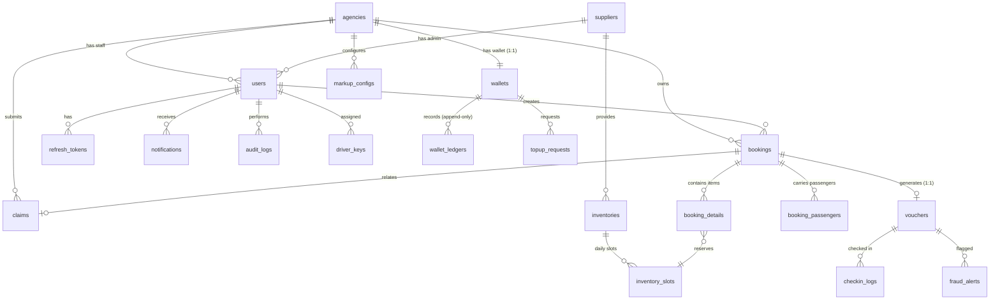

# 🗄️ B2B Travel Platform — Database ERD & Architecture Document

> **Tài liệu ERD (Entity Relationship Diagram) và mô tả kiến trúc dữ liệu cho B2B Travel Platform.**
> Engine: PostgreSQL 16 (Supabase Cloud + Docker Local) | 21 bảng | 13 Enum types | 20 Indexes | 16 Triggers | 24 Migrations | RLS Enabled (Backend-Only Access Model)

---

## 🔐 Mô Hình Bảo Mật Access Model: Backend-Only

> [!IMPORTANT]
> Tất cả 21 bảng trong hệ thống đã được bật **Row Level Security (RLS)** với chính sách **Default Deny All**.
> Mọi ứng dụng Client (Mobile App, Web Admin) **KHÔNG** gọi trực tiếp REST API của Supabase bằng client key (`anon` / `authenticated`).
> **TẤT CẢ REQUEST BẮT BUỘC ĐI QUA ASP.NET CORE BACKEND API** qua kết nối PostgreSQL Direct / Service Role.

---

## 🗺️ 1. Sơ Đồ Quan Hệ Tổng Thể (Mermaid ERD)



---

## 📊 2. Danh Sách 21 Bảng Theo 6 Nhóm Nghiệp Vụ

| Nhóm | Tên bảng | Mô tả |
| :--- | :--- | :--- |
| **👥 1. Identity & Access** | `agencies` | Đại lý du lịch (chứa KYC status: PENDING_KYC, APPROVED...) |
| | `suppliers` | Nhà cung cấp dịch vụ (khách sạn, tour, nhà xe) |
| | `users` | Người dùng 5 roles (Admin, Agency Manager/Staff, Supplier Admin, Driver) |
| | `refresh_tokens` | JWT refresh tokens cho token rotation |
| **💰 2. Financial** | `wallets` | Ví tài chính đại lý (1:1), có balance, reserved, credit_limit, OCC version |
| | `wallet_ledgers` | Sổ cái giao dịch **APPEND-ONLY** (chỉ INSERT, cấm UPDATE/DELETE) |
| | `topup_requests` | Yêu cầu nạp tiền ví qua VNPay / Chuyển khoản (có idempotent key & tenant check) |
| | `markup_configs` | Cấu hình lợi nhuận % và fixed VND cho mỗi đại lý theo loại dịch vụ |
| **📦 3. Inventory** | `inventories` | Kho dịch vụ du lịch (Khách sạn, Tour, Xe, Bay), có flag `requires_approval` |
| | `inventory_slots` | Slot chỗ theo ngày (base_price, available_slots, OCC version) |
| **🎫 4. Booking** | `bookings` | Đơn đặt chỗ (PnrCode, GroupId combo, State Machine status, HoldExpiresAt, math check) |
| | `booking_details` | Chi tiết dịch vụ trong booking (khóa giá + markup tại thời điểm hold, subtotal check) |
| | `booking_passengers` | Thông tin hành khách định danh (Tên, CCCD/Passport, Ngày sinh, Loại KH) |
| **📱 5. Delivery & QR** | `vouchers` | E-Voucher điện tử 1:1 với booking (chứa HMAC-SHA256 signed QR) |
| | `driver_keys` | Khóa bí mật HMAC-SHA256 per-driver xoay vòng mỗi 24h (unique user + date) |
| | `checkin_logs` | Lịch sử quét QR (phân biệt Online scan / Offline scan, GPS lat/lng range check) |
| | `fraud_alerts` | Cảnh báo gian lận (Double check-in, Signature mismatch, GPS mismatch) |
| **🔧 6. System & Support** | `claims` | Khiếu nại after-sales (Hoàn tiền, đổi ngày, penalty calculation, tenant check) |
| | `notifications` | Thông báo push cho ứng dụng mobile / web |
| | `audit_logs` | Nhật ký hành động quản trị (**APPEND-ONLY**, cấm UPDATE/DELETE) |
| | `system_configs` | Cấu hình hệ thống key-value (hold timeout, max markup...) |

---

## 🔒 3. Bảo Vệ Dữ Liệu & Ràng Buộc (Constraints & Triggers)

1. **Sổ Cái & Audit Logs Bất Biến (Immutable Ledger & Logs):**
   - Trigger `trg_prevent_ledger_update/delete` và `trg_prevent_audit_log_update/delete` cấm 100% việc UPDATE/DELETE trên `wallet_ledgers` và `audit_logs`.

2. **Kiểm Tra Cross-Tenant Data Integrity:**
   - Trigger `trg_validate_tenant_cross_reference` tự động kiểm tra trước khi `INSERT/UPDATE` trên `topup_requests`, `bookings`, `claims` để đảm bảo user/wallet/booking thuộc đúng đại lý sở hữu.

3. **Chống Overbooking (Optimistic Concurrency Control - OCC):**
   - Bảng `wallets` và `inventory_slots` đều có cột `version INTEGER`. Mỗi câu `UPDATE` phải kèm `WHERE version = @oldVersion` và tăng `version = version + 1`.

4. **Toàn Vẹn Tài Chính & Toán Học (CHECK Constraints):**
   - `wallets`: `balance >= -credit_limit` & `balance - reserved_balance >= -credit_limit`
   - `inventory_slots`: `available_slots >= 0 AND available_slots <= total_slots`
   - `markup_configs`: `percent_markup >= 0 AND percent_markup <= 50`
   - `bookings`: `total_amount = total_net_amount + total_markup_amount`
   - `booking_details`: `subtotal = quantity * (locked_unit_price + locked_markup)`

---

## 🚀 4. Hướng Dẫn Khởi Tạo Database

1. Đăng nhập Supabase → Mở **SQL Editor**
2. Chạy lệnh reset:
   ```sql
   DROP SCHEMA public CASCADE;
   CREATE SCHEMA public;
   ```
3. Mở file `db/scripts/full_schema.sql` → Copy toàn bộ → Paste & Run
4. Mở file `db/seeds/seed_all.sql` → Copy toàn bộ → Paste & Run
5. Hệ thống đã có đầy đủ 21 bảng, 13 enums, 20 indexes, 16 triggers và dữ liệu demo!
