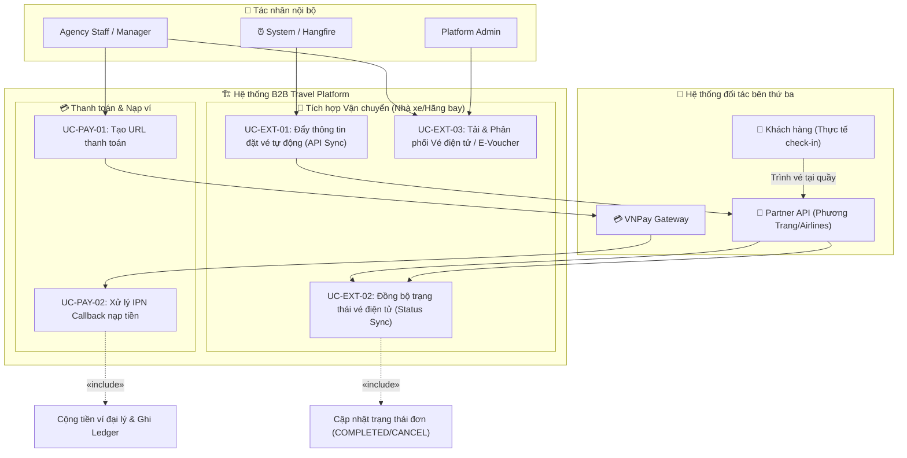

# 🚌 Sơ Đồ Use Case Tích Hợp Bên Thứ Ba (External Systems Integration)

> Tài liệu mô tả chi tiết sơ đồ Use Case bao quát cách hệ thống B2B Travel Platform kết nối và tương tác với các hệ thống dịch vụ bên thứ ba (Cổng thanh toán VNPay, Nhà xe Phương Trang, Hãng hàng không).

---

## 1. Sơ Đồ Use Case Tổng Quan Bên Thứ Ba

Sơ đồ dưới đây thể hiện ranh giới hệ thống (System Boundary) của B2B Travel Platform và các điểm chạm API với các đối tác ngoại vi:

---

## 2. Đặc Tả Chi Tiết Các Use Case Tương Tác Bên Thứ Ba

### 2.1 Nhóm Use Case: Thanh toán & Nạp ví (VNPay Gateway)

#### UC-PAY-01: Tạo URL thanh toán
*   **Tác nhân chính:** Agency Staff hoặc Agency Manager.
*   **Tương tác bên thứ ba:** VNPay Gateway.
*   **Mô tả:** Đại lý yêu cầu nạp tiền vào ví B2B. Hệ thống của ta sẽ sinh mã đơn hàng, tính checksum bằng thuật toán HMAC-SHA256 với mã khóa bí mật, tạo URL chuyển hướng và chuyển đại lý sang trang thanh toán của VNPay.

#### UC-PAY-02: Xử lý IPN Callback nạp tiền
*   **Tác nhân chính:** VNPay Gateway (External Caller).
*   **Mô tả:** Sau khi đại lý thanh toán thành công trên ứng dụng ngân hàng, VNPay tự động gọi đến webhook API của ta (IPN URL) để báo kết quả. Hệ thống xác minh chữ ký bảo mật, kiểm tra Idempotency tránh trùng lặp giao dịch, nạp tiền vào ví đại lý và ghi nhận Sổ cái tài chính (Wallet Ledger).

---

### 2.2 Nhóm Use Case: Tích hợp Vận chuyển (Phương Trang Bus / Airlines API)

#### UC-EXT-01: Đẩy thông tin đặt vé tự động (API Sync)
*   **Tác nhân chính:** System / Hangfire (Chạy tự động ngay khi đơn hàng chuyển sang trạng thái `PAID`).
*   **Tương tác bên thứ ba:** Partner API (Hệ thống nhà xe Phương Trang hoặc Hãng bay).
*   **Mô tả:** Hệ thống tự động đóng gói dữ liệu hành khách (Họ tên, SĐT, chuyến đi, số ghế) và gọi API đặt chỗ của đối tác. Đối tác xử lý và trả về mã vé điện tử / E-ticket code chính thức.

#### UC-EXT-02: Đồng bộ trạng thái vé điện tử (Status Sync)
*   **Tác nhân chính:** Partner API (Hoặc hệ thống quét check-in của đối tác gọi về).
*   **Mô tả:** Khi khách hàng đến bến xe/quầy làm thủ tục và lên xe, nhân viên đối tác thực hiện quét check-in. Hệ thống đối tác sẽ gọi API đồng bộ trạng thái về B2B Travel Platform để cập nhật đơn hàng thành `COMPLETED` (Hoàn thành vòng đời đơn).

#### UC-EXT-03: Tải & Phân phối Vé điện tử / E-Voucher
*   **Tác nhân chính:** Agency Staff / Manager.
*   **Mô tả:** Sau khi đối tác xác nhận và trả về mã vé, đại lý có thể xem và tải xuống vé điện tử (chứa mã QR hoặc mã đặt chỗ của nhà xe/hãng bay) dưới dạng file PDF/Hình ảnh để gửi cho khách hàng sử dụng khi di chuyển.

---

## 📌 Ghi Chú Luồng Vận Hành Thực Tế

1.  **Ranh giới trách nhiệm di chuyển:** Khách hàng tự túc di chuyển từ nhà tới bến xe/sân bay. B2B Travel Platform chỉ chịu trách nhiệm phân phối vé điện tử hợp lệ của đối tác đến tay đại lý.
2.  **Tính sẵn sàng cao (High Availability):** Giao tiếp qua API với nhà xe/hãng bay được bảo vệ bằng hàng đợi tin nhắn (Message Queue) để tránh mất mát dữ liệu khi hệ thống đối tác gặp sự cố nghẽn mạng hoặc tạm dừng hoạt động.
