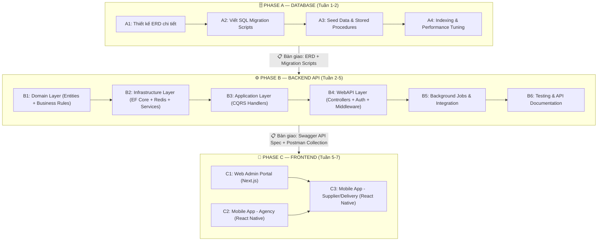
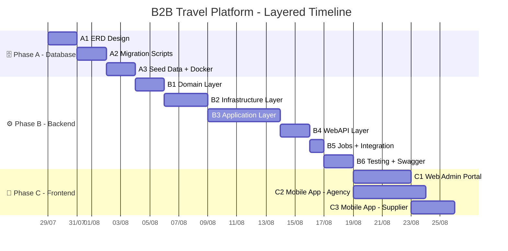

# 🚀 Kế Hoạch Triển Khai B2B Travel Platform — Bottom-Up Layered Approach

> **Triết lý:** Xây nhà từ móng lên nóc. Mỗi tầng (DB → BE → FE) được làm **chuyên sâu, hoàn chỉnh** trước khi chuyển sang tầng tiếp theo. Điểm bàn giao giữa các tầng là **Contracts** rõ ràng (ERD, API Spec, UI Wireframe).

---

## 🗺️ Tổng Quan Kiến Trúc 3 Tầng



---

## 🎯 Tại Sao Tách Riêng Từng Tầng?

| Lợi ích | Giải thích |
| :--- | :--- |
| **Chuyên sâu hơn** | Khi tập trung 100% vào DB, bạn sẽ phát hiện edge cases schema sớm hơn (thiếu cột, sai kiểu dữ liệu) trước khi code BE |
| **Dễ demo từng phần** | Hội đồng có thể đánh giá: DB schema → API hoạt động → UI hoàn chỉnh. Mỗi tầng đều có deliverable rõ ràng |
| **Giảm rework** | Sửa 1 cột DB sau khi đã code 20 API endpoints = đau đớn. Làm DB xong trước = sửa miễn phí |
| **Dễ chia việc** | Nếu có teammate: 1 người làm DB + BE, 1 người làm FE song song sau khi có Swagger API Spec |
| **Hướng phát triển rõ** | Phase 2 (Scale-up) chỉ cần thêm migration + thêm endpoints + thêm screens — không phá kiến trúc cũ |

---

# 🗄️ PHASE A — DATABASE DESIGN & IMPLEMENTATION
**Thời gian:** ~5-7 ngày | **Deliverable:** ERD hoàn chỉnh + Migration SQL + Seed Data

---

## A1: Thiết Kế ERD Chi Tiết (Entity Relationship Diagram)

### Danh sách bảng cần tạo (21 bảng)

```mermaid
erDiagram
    %% ============ CORE IDENTITY ============
    agencies ||--o{ users : "has many"
    agencies ||--|| wallets : "has one"
    agencies ||--o{ markup_configs : "has many"

    %% ============ FINANCIAL ============
    wallets ||--o{ wallet_ledgers : "has many"
    wallets ||--o{ topup_requests : "has many"

    %% ============ INVENTORY ============
    suppliers ||--o{ inventories : "provides"
    inventories ||--o{ inventory_slots : "has daily slots"

    %% ============ BOOKING ============
    users ||--o{ bookings : "creates"
    agencies ||--o{ bookings : "owns"
    bookings ||--o{ booking_details : "contains items"
    bookings ||--o{ booking_passengers : "contains passengers"
    booking_details }o--|| inventory_slots : "reserves"

    %% ============ DELIVERY ============
    bookings ||--o| vouchers : "generates"
    users ||--o{ driver_keys : "assigned"
    vouchers ||--o{ checkin_logs : "checked in"

    %% ============ AFTER-SALES ============
    agencies ||--o{ claims : "submits"
    bookings ||--o| claims : "relates to"

    %% ============ SYSTEM ============
    users ||--o{ notifications : "receives"
    users ||--o{ refresh_tokens : "has"
    users ||--o{ audit_logs : "actions"

    agencies {
        uuid id PK
        string name
        string tax_code UK
        string business_license_url
        string travel_license_url
        enum kyc_status "PENDING_KYC|APPROVED|REJECTED|SUSPENDED"
        datetime kyc_approved_at
        datetime kyc_expires_at
        string rejection_reason
        datetime created_at
        datetime updated_at
    }

    users {
        uuid id PK
        uuid agency_id FK "nullable - Admin has no agency"
        uuid supplier_id FK "nullable"
        string username UK
        string email
        string phone
        string password_hash
        enum role "PlatformAdmin|AgencyManager|AgencyStaff|SupplierAdmin|DeliveryStaff"
        boolean is_active
        string avatar_url
        datetime created_at
        datetime updated_at
    }

    suppliers {
        uuid id PK
        string name
        string contact_email
        string contact_phone
        string address
        boolean is_active
        datetime created_at
    }

    wallets {
        uuid id PK
        uuid agency_id FK UK
        decimal balance "Số dư thực"
        decimal reserved_balance "Tạm giữ cho On-Request"
        decimal credit_limit "Hạn mức nợ"
        int version "OCC"
        boolean is_locked
        datetime created_at
        datetime updated_at
    }

    wallet_ledgers {
        uuid id PK
        uuid wallet_id FK
        enum transaction_type "CREDIT|DEBIT|REFUND|RESERVE_HOLD|RESERVE_RELEASE|RESERVE_CONFIRM"
        decimal amount
        decimal balance_after
        string reference_id "BookingId hoặc TopupId"
        string description
        datetime created_at
    }

    topup_requests {
        uuid id PK
        uuid wallet_id FK
        uuid agency_id FK
        decimal amount
        string payment_method "VNPAY|BANK_TRANSFER"
        string transaction_code UK
        enum status "PENDING|SUCCESS|CANCELLED|FAILED"
        string vnpay_txn_ref
        jsonb vnpay_response_data
        datetime created_at
        datetime updated_at
    }

    markup_configs {
        uuid id PK
        uuid agency_id FK
        enum service_type "HOTEL|TOUR|BUS|FLIGHT"
        decimal percent_markup "0-50%"
        decimal fixed_markup "Cộng cố định VND"
        datetime created_at
        datetime updated_at
    }

    inventories {
        uuid id PK
        uuid supplier_id FK
        string name
        string description
        enum service_type "HOTEL|TOUR|BUS|FLIGHT"
        string location
        string thumbnail_url
        boolean requires_approval "On-Request flag"
        boolean is_active
        jsonb metadata "Thông tin bổ sung (tiện ích, rating...)"
        datetime created_at
        datetime updated_at
    }

    inventory_slots {
        uuid id PK
        uuid inventory_id FK
        date service_date
        decimal base_price
        int total_slots
        int available_slots
        int version "OCC"
        datetime created_at
        datetime updated_at
    }

    bookings {
        uuid id PK
        uuid agency_id FK
        uuid created_by FK
        string pnr_code UK
        string group_id "Nhóm combo"
        enum status "HELD|PENDING_SUPPLIER_APPROVAL|CONFIRMED|PAID|COMPLETED|CANCELLED|REFUNDED|PENDING_REFUND"
        decimal total_net_amount "Giá gốc"
        decimal total_markup_amount "Tiền markup"
        decimal total_amount "Net + Markup"
        string cancellation_reason
        datetime hold_expires_at
        datetime supplier_approval_deadline
        datetime created_at
        datetime updated_at
    }

    booking_details {
        uuid id PK
        uuid booking_id FK
        uuid inventory_slot_id FK
        int quantity
        decimal locked_unit_price "Giá tại thời điểm hold"
        decimal locked_markup "Markup tại thời điểm hold"
        decimal subtotal
    }

    booking_passengers {
        uuid id PK
        uuid booking_id FK
        string full_name
        string identity_number "CCCD/Passport"
        string phone_number
        date date_of_birth
        enum passenger_type "ADULT|CHILD|INFANT"
        string gender
    }

    vouchers {
        uuid id PK
        uuid booking_id FK UK
        string voucher_code UK
        string qr_payload "JSON signed data"
        string pdf_url
        enum status "ACTIVE|CHECKED_IN|EXPIRED|CANCELLED"
        uuid assigned_driver_id FK "Tài xế phụ trách"
        datetime issued_at
        datetime expires_at
    }

    driver_keys {
        uuid id PK
        uuid user_id FK "DeliveryStaff user"
        string secret_key_encrypted "AES-256 encrypted"
        date valid_date "Ngày có hiệu lực"
        boolean is_revoked
        datetime created_at
    }

    checkin_logs {
        uuid id PK
        uuid voucher_id FK
        uuid scanned_by FK "Driver user_id"
        boolean is_online "Online or Offline scan"
        decimal gps_latitude
        decimal gps_longitude
        datetime scanned_at
        datetime synced_at "null if not synced yet"
        boolean is_fraud_flagged
    }

    claims {
        uuid id PK
        uuid booking_id FK
        uuid agency_id FK
        uuid submitted_by FK
        enum claim_type "REFUND|DATE_CHANGE|COMPLAINT"
        enum status "PENDING|APPROVED|REJECTED"
        string reason
        decimal penalty_amount "Phí phạt"
        decimal refund_amount "Số tiền hoàn"
        string resolution_note
        uuid resolved_by FK
        datetime created_at
        datetime resolved_at
    }

    notifications {
        uuid id PK
        uuid user_id FK
        enum type "BOOKING_HELD|BOOKING_PAID|BOOKING_CANCELLED|WALLET_CREDITED|KYC_APPROVED|SUPPLIER_APPROVAL|CLAIM_RESOLVED"
        string title
        string body
        string reference_id "ID đối tượng liên quan"
        boolean is_read
        datetime created_at
    }

    refresh_tokens {
        uuid id PK
        uuid user_id FK
        string token_hash UK
        datetime expires_at
        boolean is_revoked
        datetime created_at
    }

    audit_logs {
        uuid id PK
        uuid user_id FK
        string action "CONFIG_CHANGED|WALLET_MANUAL_CREDIT|KYC_APPROVED..."
        string entity_type
        string entity_id
        jsonb old_values
        jsonb new_values
        string ip_address
        datetime created_at
    }

    system_configs {
        uuid id PK
        string config_key UK
        string config_value
        string description
        datetime updated_at
        uuid updated_by FK
    }

    fraud_alerts {
        uuid id PK
        uuid voucher_id FK
        uuid online_checkin_log_id FK
        uuid offline_checkin_log_id FK
        string alert_type "DOUBLE_CHECKIN|INVALID_SIGNATURE"
        jsonb details "GPS coords, timestamps..."
        boolean is_resolved
        datetime created_at
    }
```

### Indexes quan trọng

| Bảng | Index | Loại | Lý do |
| :--- | :--- | :--- | :--- |
| `agencies` | `tax_code` | UNIQUE | Chống trùng MST |
| `users` | `username` | UNIQUE | Login lookup |
| `users` | `agency_id, role` | COMPOSITE | Filter nhân viên theo đại lý |
| `bookings` | `pnr_code` | UNIQUE | Tra cứu PNR |
| `bookings` | `agency_id, status` | COMPOSITE | Dashboard đại lý |
| `bookings` | `status, hold_expires_at` | COMPOSITE | AutoCancel Job scan |
| `inventory_slots` | `inventory_id, service_date` | COMPOSITE + UNIQUE | Tra slot theo ngày |
| `wallet_ledgers` | `wallet_id, created_at` | COMPOSITE | Lịch sử giao dịch |
| `topup_requests` | `transaction_code` | UNIQUE | Idempotent VNPay |
| `vouchers` | `voucher_code` | UNIQUE | QR lookup |
| `vouchers` | `booking_id` | UNIQUE | 1 booking → 1 voucher |
| `notifications` | `user_id, is_read` | COMPOSITE | Unread count |

### Constraints & Rules tại tầng DB

```sql
-- Wallet balance không được âm quá credit_limit
ALTER TABLE wallets ADD CONSTRAINT chk_wallet_balance
    CHECK (balance >= -credit_limit);

-- Inventory slots không được âm
ALTER TABLE inventory_slots ADD CONSTRAINT chk_slots_non_negative
    CHECK (available_slots >= 0);

-- Wallet Ledger chỉ INSERT (trigger chặn UPDATE/DELETE)
-- Markup không được âm
ALTER TABLE markup_configs ADD CONSTRAINT chk_markup_non_negative
    CHECK (percent_markup >= 0 AND fixed_markup >= 0);

-- Percent markup tối đa 50% (cấu hình qua system_configs)
ALTER TABLE markup_configs ADD CONSTRAINT chk_markup_max
    CHECK (percent_markup <= 50);
```

### ✅ Definition of Done — A1
- [ ] ERD diagram hoàn chỉnh 21 bảng (có thể render được bằng Mermaid)
- [ ] Tất cả FK, UK, CHECK constraints được xác định
- [ ] Index plan cho các truy vấn chính

---

## A2: SQL Migration Scripts

Viết migration files tuần tự, có thể rollback:

```text
db/migrations/
├── V001__create_agencies_table.sql
├── V002__create_suppliers_table.sql
├── V003__create_users_table.sql
├── V004__create_wallets_and_ledgers.sql
├── V005__create_topup_requests.sql
├── V006__create_markup_configs.sql
├── V007__create_inventories_and_slots.sql
├── V008__create_bookings_and_details.sql
├── V009__create_booking_passengers.sql
├── V010__create_vouchers_and_driver_keys.sql
├── V011__create_checkin_logs_and_fraud_alerts.sql
├── V012__create_claims.sql
├── V013__create_notifications.sql
├── V014__create_refresh_tokens.sql
├── V015__create_audit_logs.sql
├── V016__create_system_configs.sql
├── V017__create_indexes.sql
├── V018__add_constraints_and_triggers.sql
└── V019__seed_system_configs.sql
```

### ✅ Definition of Done — A2
- [ ] Chạy tất cả migration files trên PostgreSQL 16 không lỗi
- [ ] Chạy rollback từng file không lỗi
- [ ] Schema match 100% với ERD

---

## A3: Seed Data

```text
db/seeds/
├── seed_platform_admin.sql        # 1 admin account mặc định
├── seed_system_configs.sql        # Hold timeout, max markup, rate limits
├── seed_demo_agencies.sql         # 2-3 đại lý demo + wallets
├── seed_demo_suppliers.sql        # 2 suppliers (1 hotel, 1 tour)
├── seed_demo_inventories.sql      # 5-10 dịch vụ demo + slots
└── seed_demo_users.sql            # Staff accounts cho mỗi agency
```

### ✅ Definition of Done — A3
- [ ] Seed data chạy thành công
- [ ] Có thể login với admin account
- [ ] Có dữ liệu demo để test API ngay khi BE hoàn thành

---

## A4: Docker PostgreSQL + Init Script

```text
docker-compose.yml:
  postgres:
    image: postgres:16-alpine
    volumes:
      - ./db/migrations:/docker-entrypoint-initdb.d/migrations
      - ./db/seeds:/docker-entrypoint-initdb.d/seeds
      - postgres_data:/var/lib/postgresql/data
    environment:
      POSTGRES_DB: b2b_travel
      POSTGRES_USER: b2b_admin
      POSTGRES_PASSWORD: ${DB_PASSWORD}
```

### ✅ Definition of Done — PHASE A Tổng
- [ ] `docker-compose up postgres` → DB sẵn sàng với full schema + seed data
- [ ] ERD document cập nhật vào `docs/database/`
- [ ] Có thể kết nối bằng DBeaver/pgAdmin và thấy đầy đủ 21 bảng

---

# ⚙️ PHASE B — BACKEND API DEVELOPMENT
**Thời gian:** ~12-15 ngày | **Deliverable:** Swagger API Spec hoàn chỉnh + Postman Collection

> [!IMPORTANT]
> Phase B bắt đầu **sau khi Phase A hoàn thành**. Backend code dựa trên ERD đã duyệt — không đoán schema.

---

## B1: Domain Layer (~2 ngày)
**Mục tiêu:** Toàn bộ business logic thuần túy, zero framework dependency.

| Nhóm | Files | Nội dung chính |
| :--- | :--- | :--- |
| **Enums** | 10 files | BookingStatus, KycStatus, UserRole, TransactionType, ServiceType, ClaimType, ClaimStatus, NotificationType, PassengerType, VoucherStatus |
| **Value Objects** | 3 files | Money.cs, PnrCode.cs, Address.cs |
| **Entities** | 15 files | Agency, User, Supplier, Wallet, WalletLedger, MarkupConfig, Inventory, InventorySlot, Booking, BookingDetail, BookingPassenger, Voucher, Claim, Notification, Cart/CartItem |
| **Domain Events** | 10 files | BookingHeld/Paid/Cancelled, WalletCredited/Debited, KycApproved/Rejected, VoucherIssued/CheckedIn, ClaimResolved |
| **Exceptions** | 6 files | InsufficientBalance, SlotUnavailable, BookingExpired, InvalidBookingState, DuplicateTaxCode, KycNotApproved |
| **Interfaces** | 10 files | IBookingRepo, IWalletRepo, IInventoryRepo, IAgencyRepo, IUserRepo, IVoucherRepo, IClaimRepo, INotificationRepo, ICartRepo, IUnitOfWork |

### ✅ Definition of Done — B1
- [ ] Unit test pass cho: `Wallet.Credit/Debit`, `InventorySlot.Decrement/Restore`, `Booking.Hold/Pay/Cancel`
- [ ] Domain project có **0 NuGet dependencies** ngoài .NET BCL

---

## B2: Infrastructure Layer (~3 ngày)
**Mục tiêu:** EF Core DbContext, Repository implementations, Redis, External Services.

| Nhóm | Files | Nội dung |
| :--- | :--- | :--- |
| **Persistence** | AppDbContext.cs + 15 EntityConfig files + UnitOfWork.cs | Fluent API mapping, indexes, constraints |
| **Repositories** | 9 files | Concrete implementations of Domain interfaces |
| **Caching** | RedisCacheService.cs + RedisDistributedLockService.cs | Cache + Distributed Lock |
| **Identity** | JwtTokenService.cs + CurrentUserService.cs | JWT HS256 + HttpContext Claims |
| **External** | VnPayService.cs + PushNotificationService.cs + FileStorageService.cs + AiModelService.cs | VNPay HMAC, FCM, S3/GCS upload, Gemini API |
| **Background** | AutoCancelExpiredBookingsJob.cs + ReconcileVnPayJob.cs + KycExpiryReminderJob.cs + DriverKeyRotationJob.cs | Hangfire jobs |

### ✅ Definition of Done — B2
- [ ] EF Core Migration `InitialCreate` chạy thành công, schema khớp Phase A
- [ ] Redis PING thành công
- [ ] UnitOfWork commit/rollback hoạt động

---

## B3: Application Layer (~5 ngày)
**Mục tiêu:** Mỗi Use Case = 1 Command/Query Handler. CQRS + MediatR Pipeline.

### Thứ tự triển khai (theo dependency):

**Đợt 1 — Foundation (Không phụ thuộc module khác):**
| Module | Commands | Queries |
| :--- | :--- | :--- |
| Auth (M01) | Login, RefreshToken, ChangePassword | GetCurrentUser |
| Agency & KYC (M02) | RegisterAgency, ApproveKyc, RejectKyc | GetAgencyList, GetAgencyDetail |
| System Config (M13) | UpdateSystemConfig | GetSystemConfig |

**Đợt 2 — Data Layer (Phụ thuộc Auth):**
| Module | Commands | Queries |
| :--- | :--- | :--- |
| Inventory (M03) | CreateInventory, UpdateSlot, DeleteInventory | SearchInventory |
| Wallet (M07) | CreditWallet, DebitWallet | GetWalletBalance, GetWalletHistory |
| VNPay Payment | CreateVnPayUrl, ProcessVnPayIpn | — |
| Markup (M04) | ConfigureMarkup | — (tích hợp vào SearchInventory) |

**Đợt 3 — Core Business (Phụ thuộc Inventory + Wallet):**
| Module | Commands | Queries |
| :--- | :--- | :--- |
| Cart (M05) | AddToCart, RemoveFromCart | GetCart |
| Booking (M06) | HoldBooking, PayBooking, CancelBooking | GetBookingList, GetBookingDetail |
| Saga | UnifiedHoldCart, PayCart | — |
| Supplier (M14) | ApproveBooking, RejectBooking | GetPendingApprovals |

**Đợt 4 — Delivery & Support (Phụ thuộc Booking):**
| Module | Commands | Queries |
| :--- | :--- | :--- |
| Voucher (M09) | IssueVoucher, SyncOfflineCheckIns | GetVoucher, DownloadVoucherPdf |
| Claims (M11) | CreateClaim, ResolveClaim | GetClaimList |
| Notification (M10) | MarkAsRead, MarkAllRead | GetNotificationList |
| Reporting (M12) | ExportReport | GetRevenueReport, GetReconciliationReport |
| AI Assistant (M15) | SendAiChat | — |

### ✅ Definition of Done — B3
- [ ] Mỗi UC có đúng 1 Handler + 1 Validator (FluentValidation)
- [ ] MediatR Pipeline: Logging → Validation → Transaction → Handler

---

## B4: WebAPI Layer (~2 ngày)
**Mục tiêu:** REST Controllers + Middleware + Swagger.

| Controller | Endpoints | Auth |
| :--- | :--- | :--- |
| AuthController | 3 endpoints | Public / Authenticated |
| AgencyController | 5 endpoints | Admin / Manager |
| InventoryController | 5 endpoints | Supplier / All |
| BookingController | 5 endpoints | Manager, Staff |
| CartController | 5 endpoints | Manager, Staff |
| WalletController | 4 endpoints | Admin / Manager, Staff |
| PaymentController | 2 endpoints | Manager / Public (IPN) |
| VoucherController | 3 endpoints | Manager, Staff, Delivery |
| ClaimController | 3 endpoints | Manager, Staff / Admin |
| NotificationController | 3 endpoints | All authenticated |
| SystemConfigController | 2 endpoints | Admin only |
| AiAssistantController | 1 endpoint | Manager, Staff |
| ReportController | 3 endpoints | Admin / Manager |

### Middleware Stack:
```text
Request → SecurityHeaders → Serilog Logging → JWT Auth → Rate Limiting → CORS → Controller
```

### ✅ Definition of Done — B4
- [ ] Swagger UI hiển thị đầy đủ ~44 endpoints
- [ ] JWT Auth + RBAC chặn đúng role
- [ ] Global Exception Handler trả JSON error chuẩn

---

## B5: Background Jobs & Integration (~1 ngày)

| Job | Schedule | Logic |
| :--- | :--- | :--- |
| AutoCancelExpiredBookings | Mỗi phút | Hủy HELD quá 15 phút |
| AutoCancelPendingApproval | Mỗi phút | Hủy PENDING quá cut-off time |
| ReconcileVnPayPending | Mỗi 5 phút | Quét PENDING > 10p → QueryDR |
| NightlyBalanceReconciliation | 00:05 hàng đêm | SUM(Ledger) vs wallet.balance |
| KycExpiryReminder | Hàng ngày | Nhắc KYC sắp hết hạn 30 ngày |
| DriverKeyRotation | 00:00 hàng ngày | Xoay DriverSecretKey 24h |

---

## B6: Testing & API Documentation (~2 ngày)

| Loại Test | Phạm vi | Công cụ |
| :--- | :--- | :--- |
| Unit Test | Domain Entities + Application Handlers | xUnit + Moq |
| Integration Test | API Endpoints (Auth, Booking, Wallet flow) | xUnit + WebApplicationFactory + Testcontainers |
| Swagger | Annotations cho tất cả endpoints | Swashbuckle |
| Postman | Collection + Environment cho demo | Postman Export |

### ✅ Definition of Done — PHASE B Tổng
- [ ] `dotnet build` thành công
- [ ] `dotnet test` → all green
- [ ] `docker-compose up -d` → API + Redis + PostgreSQL + Hangfire chạy
- [ ] Swagger UI: 44 endpoints với request/response examples
- [ ] Postman Collection export sẵn cho Phase C
- [ ] Tài liệu API cập nhật vào `docs/api/`

---

# 📱 PHASE C — FRONTEND DEVELOPMENT
**Thời gian:** ~8-10 ngày | **Deliverable:** Web Admin Portal + Mobile App hoạt động

> [!IMPORTANT]
> Phase C bắt đầu **sau khi Phase B có Swagger API Spec ổn định**. Frontend consume API — không hardcode data.

---

## C1: Web Admin Portal (Next.js) — ~4 ngày

| Module | Screens | Ưu tiên |
| :--- | :--- | :--- |
| Auth | Login, Forgot Password | 🔴 Bắt buộc |
| Dashboard | Thống kê tổng quan (GMV, bookings, wallets) | 🔴 Bắt buộc |
| Agency Management | Danh sách đại lý, Chi tiết KYC, Approve/Reject | 🔴 Bắt buộc |
| Wallet Management | Danh sách ví, Ledger history, Manual Credit/Debit | 🔴 Bắt buộc |
| Booking Management | Danh sách booking, Chi tiết, Cancel/Refund | 🟡 Nên có |
| System Config | Key-Value editor | 🟡 Nên có |
| Audit Logs | Bảng log hoạt động | 🟢 Gợi ý |
| Reports | Charts + Excel export | 🟡 Nên có |

## C2: Mobile App — Agency (React Native) — ~5 ngày

| Module | Screens | Ưu tiên |
| :--- | :--- | :--- |
| Auth | Login, Profile | 🔴 Bắt buộc |
| Search | Search form, Results list, Detail page | 🔴 Bắt buộc |
| Cart | Cart view, Add/Remove items | 🔴 Bắt buộc |
| Booking | Hold confirmation, Pay, Booking list, Detail | 🔴 Bắt buộc |
| Wallet | Balance, History, VNPay top-up | 🔴 Bắt buộc |
| Voucher | View voucher, QR code display, PDF download | 🔴 Bắt buộc |
| AI Assistant | Chat interface, Combo suggestions | 🟡 Nên có |
| Notifications | Notification list, Mark read | 🟡 Nên có |
| Markup Config | Cấu hình % markup (Manager only) | 🟡 Nên có |

## C3: Mobile App — Supplier & Delivery (React Native) — ~3 ngày

| Module | Screens | Ưu tiên |
| :--- | :--- | :--- |
| Supplier - Pending Orders | Danh sách đơn chờ duyệt, Approve/Reject | 🔴 Bắt buộc |
| Supplier - Inventory | Quản lý kho, Cập nhật slot | 🟡 Nên có |
| Delivery - Check-in | QR Scanner (camera), Offline mode | 🔴 Bắt buộc |
| Delivery - Trip List | Danh sách đón khách hôm nay | 🔴 Bắt buộc |
| Delivery - Sync | Auto-sync offline logs when online | 🔴 Bắt buộc |

### ✅ Definition of Done — PHASE C Tổng
- [ ] Web Admin Portal deploy được, login + CRUD hoạt động
- [ ] Mobile App build APK/IPA thành công
- [ ] Toàn bộ luồng E2E: Register → KYC → Search → Cart → Hold → Pay → Voucher → Check-in

---

# 📅 Timeline Tổng



> [!TIP]
> **Tổng thời gian ước tính:** ~27-33 ngày làm việc (~6-7 tuần).
> **C1 và C2** có thể chạy **song song** vì consume cùng API.

---

# 🔴 Rủi Ro & Biện Pháp

| # | Rủi ro | Mức | Biện pháp |
| :---: | :--- | :---: | :--- |
| 1 | Thay đổi schema DB sau khi đã code BE | 🔴 | Phase A phải duyệt ERD kỹ trước khi sang B |
| 2 | API spec thay đổi khi FE đang code | 🟡 | Swagger + Postman collection là contract cứng |
| 3 | Saga Pattern phức tạp | 🔴 | Unit test mọi nhánh fail + compensating |
| 4 | React Native build lỗi trên các thiết bị | 🟡 | Test sớm trên emulator + 1 thiết bị thật |
| 5 | VNPay sandbox không ổn định | 🟡 | Mock VnPayService cho dev, test thật khi deploy |

---

## Open Questions

> [!IMPORTANT]
> **Q1:** Bạn muốn tôi bắt đầu **Phase A (Database)** ngay bây giờ không? Tôi sẽ tạo ERD chi tiết + viết toàn bộ migration SQL.

> [!IMPORTANT]
> **Q2:** Bạn có **1 mình** hay có **teammate**? Nếu có 2 người, 1 người có thể bắt đầu FE wireframe song song với BE.

> [!IMPORTANT]
> **Q3:** Về **Mobile App**, bạn muốn dùng **React Native** (như tài liệu gốc) hay muốn đổi sang **Flutter** (cũng được nhắc đến trong tài liệu kiến trúc)?

> [!IMPORTANT]
> **Q4:** Bạn có muốn dùng **EF Core Code-First Migration** (auto-generate từ C# Entities) hay **SQL-First** (viết SQL tay rồi EF Core reverse-engineer)?
