# 📊 Sơ Đồ Use Case Tổng Quan Toàn Hệ Thống (Overall Use Case Diagram)

> Tài liệu này chứa sơ đồ Use Case tổng quan và bao quát toàn bộ 12 phân hệ chức năng của dự án B2B Travel Platform, thể hiện đầy đủ mối liên kết giữa các Actor nội bộ/ngoại vi với tất cả các Use Case cốt lõi.

---

## 1. Sơ Đồ Use Case Tổng Quan Toàn Diện (Mermaid)

Sơ đồ sử dụng mô hình luồng từ trái qua phải (Left-to-Right), bố trí các Actor chính ở hai bên biên để tránh giao cắt đường nối, giúp sơ đồ bao quát nhưng vẫn cực kỳ rõ ràng và dễ đọc.

```mermaid
graph LR
    %% ──────────────────────────────────────────────────────────
    %% ĐỊNH NGHĨA ACTORS (TÁC NHÂN)
    %% ──────────────────────────────────────────────────────────
    subgraph InternalActors["👥 Tác nhân nội bộ (App/Portal)"]
        PA["🔑 Platform Admin"]
        AM["🏢 Agency Manager"]
        AS["👤 Agency Staff"]
    end

    subgraph ExternalActors["⚙️ Hệ thống & Đối tác ngoài"]
        SA["📦 Supplier Admin"]
        EXT["🚌 External Transport"]
        SYS["⏰ System / Hangfire"]
        VNPAY["💳 VNPay Gateway"]
    end

    %% ──────────────────────────────────────────────────────────
    %% RANH GIỚI HỆ THỐNG & CÁC USE CASE
    %% ──────────────────────────────────────────────────────────
    subgraph B2B_System["🏗 RANH GIỚI HỆ THỐNG B2B TRAVEL PLATFORM"]
        
        subgraph Mod_Auth["🔐 1. Xác thực & KYC đại lý"]
            UC_Login["UC-01: Đăng nhập & Token"]
            UC_Register["UC-04: Đăng ký đại lý"]
            UC_KYC_Approve["UC-10: Duyệt KYC"]
            UC_KYC_Reject["UC-11: Từ chối KYC"]
            UC_Suspend["UC-12: Đình chỉ đại lý"]
        end

        subgraph Mod_Search["🔍 2. Tìm kiếm & Cấu hình Markup"]
            UC_Search["UC-13: Tìm kiếm dịch vụ"]
            UC_Markup_View["UC-14: Xem Markup"]
            UC_Markup_Update["UC-15: Cập nhật Markup"]
        end

        subgraph Mod_Booking["📝 3. Đặt chỗ (Booking Engine)"]
            UC_Hold["UC-16: Giữ chỗ (Hold PNR)"]
            UC_Pay["UC-17: Thanh toán ví (Pay)"]
            UC_View_Book["UC-18: Xem tất cả đơn hàng"]
            UC_Approve_Req["UC-19/20: Duyệt/Từ chối đơn On-Request"]
            UC_Autocancel["UC-21: Tự động hủy đơn quá hạn"]
        end

        subgraph Mod_Wallet["💰 4. Ví tài chính & Thanh toán"]
            UC_Wallet_View["UC-22: Xem số dư & Hạn mức"]
            UC_Adj_Wallet["UC-23/24: Nạp/Trừ ví thủ công"]
            UC_VNPay_Url["UC-25: Tạo link nạp ví VNPay"]
            UC_VNPay_IPN["UC-26: Xử lý IPN nạp tiền"]
        end

        subgraph Mod_Inventory["📦 5. Quản lý Kho dịch vụ"]
            UC_Inv_View["UC-27: Xem danh sách dịch vụ"]
            UC_Inv_Create["UC-28: Tạo dịch vụ mới"]
            UC_Inv_Update["UC-30: Cập nhật slot/giá"]
            UC_Inv_Stop["UC-31: Ngừng bán dịch vụ"]
        end

        subgraph Mod_Voucher["🎫 6. Voucher & Tích hợp vận chuyển"]
            UC_Vou_Issue["UC-36: Phát hành E-Voucher"]
            UC_Vou_Sync["UC-37: Đồng bộ đơn sang Nhà xe/Hãng bay"]
            UC_Vou_Download["UC-38: Tải vé & Tự check-in"]
        end

        subgraph Mod_Claims["📢 7. Khiếu nại (Claims)"]
            UC_Claim_Create["UC-39: Tạo khiếu nại hoàn/hủy"]
            UC_Claim_Resolve["UC-42/43: Phê duyệt/Từ chối khiếu nại"]
        end

        subgraph Mod_Reports["📊 8. Báo cáo & Cấu hình sàn"]
            UC_Rep_Dash["UC-47: Xem Dashboard doanh số"]
            UC_Rep_Ledger["UC-49: Xem giao dịch Ledger"]
            UC_Sys_Config["UC-52: Cập nhật tham số hệ thống"]
        end

        subgraph Mod_Notify["🔔 9. Hệ thống Thông báo"]
            UC_Noti_View["UC-44: Xem thông báo"]
            UC_Noti_Read["UC-45/46: Đánh dấu đã đọc"]
        end
    end

    %% ──────────────────────────────────────────────────────────
    %% ĐƯỜNG KẾT NỐI (RELATIONSHIPS)
    %% ──────────────────────────────────────────────────────────

    %% 1. Tác nhân nội bộ (Trái) kết nối các Use Case
    %% Platform Admin
    PA --> UC_KYC_Approve
    PA --> UC_KYC_Reject
    PA --> UC_Suspend
    PA --> UC_View_Book
    PA --> UC_Adj_Wallet
    PA --> UC_Inv_View
    PA --> UC_Vou_Issue
    PA --> UC_Claim_Resolve
    PA --> UC_Rep_Dash
    PA --> UC_Rep_Ledger
    PA --> UC_Sys_Config

    %% Agency Manager
    AM --> UC_Register
    AM --> UC_Markup_Update
    AM --> UC_Search
    AM --> UC_Markup_View
    AM --> UC_Hold
    AM --> UC_Pay
    AM --> UC_Wallet_View
    AM --> UC_VNPay_Url
    AM --> UC_Vou_Download
    AM --> UC_Claim_Create

    %% Agency Staff
    AS --> UC_Search
    AS --> UC_Markup_View
    AS --> UC_Hold
    AS --> UC_Pay
    AS --> UC_Wallet_View
    AS --> UC_VNPay_Url
    AS --> UC_Vou_Download
    AS --> UC_Claim_Create

    %% Tất cả Actor đăng nhập sử dụng
    LeftActors -.-> UC_Login
    LeftActors -.-> UC_Noti_View
    LeftActors -.-> UC_Noti_Read
    SA -.-> UC_Login
    SA -.-> UC_Noti_View
    SA -.-> UC_Noti_Read

    %% 2. Tác nhân ngoài & Hệ thống (Phải) kết nối các Use Case
    %% Supplier Admin
    SA --> UC_Approve_Req
    SA --> UC_Inv_View
    SA --> UC_Inv_Create
    SA --> UC_Inv_Update
    SA --> UC_Inv_Stop

    %% System / Hangfire
    SYS --> UC_Autocancel
    SYS --> UC_Vou_Sync

    %% VNPay Gateway
    VNPAY --> UC_VNPay_IPN

    %% External Transport (Nhà xe/Hãng bay)
    EXT --> UC_Vou_Sync
    EXT --> UC_Vou_Download

    %% Mối quan hệ Include/Extend quan trọng trong Booking & Wallet
    UC_Pay -.-> |"«include»"| UC_Hold
    UC_VNPay_IPN -.-> |"«include»"| UC_Adj_Wallet
```

---

## 2. Ý Nghĩa Của Sơ Đồ Đối Với Hội Đồng Phản Biện

1.  **Tính Rõ Ràng (Clarity):** Sơ đồ tách biệt rõ ràng khu vực của người dùng nghiệp vụ (bên trái) và các đối tác công nghệ, hệ thống tự động (bên phải), giúp hội đồng dễ dàng nhận biết ai làm việc gì.
2.  **Tính Khép Kín (End-to-End):** Thể hiện trọn vẹn luồng từ khi đại lý đăng ký (`UC-04`), tìm kiếm và cấu hình giá (`UC-13`, `UC-15`), thực hiện đặt chỗ thanh toán (`UC-16`, `UC-17`), nạp ví tự động (`UC-26`), đẩy đơn sang nhà xe đối tác (`UC-37`), cho tới khi xuất hóa đơn báo cáo (`UC-47`).
3.  **Tích Hợp API Chặt Chẽ:** Làm nổi bật vai trò của **VNPay** và **External Transport** trong việc nhận đồng bộ đơn hàng tự động mà không cần vận hành thủ công.
