# 📊 Use Case Diagram — B2B Travel Platform

> Sơ đồ Use Case tổng quan cho hệ thống B2B Travel Platform, dựa trên phân tích mã nguồn thực tế.

---

## Sơ đồ tổng quan

```mermaid
graph LR
    %% ──────────────────────────────────────────────────────────
    %% ĐỊNH NGHĨA ACTORS (TÁC NHÂN TỰ DO ĐỂ TỰ ĐỘNG CĂN BIÊN 2 BÊN)
    %% ──────────────────────────────────────────────────────────
    PA["🔑 Platform Admin"]
    AM["🏢 Agency Manager"]
    AS["👤 Agency Staff"]

    SA["📦 Supplier Admin"]
    EXT["🚌 External Transport"]
    SYS["⏰ System / Hangfire"]
    VNPAY["💳 VNPay Gateway"]

    %% ──────────────────────────────────────────────────────────
    %% RANH GIỚI HỆ THỐNG VỚI 3 CỘT DỌC USE CASE SONG SONG Ở GIỮA
    %% ──────────────────────────────────────────────────────────
    subgraph B2B_System["🏗 RANH GIỚI HỆ THỐNG B2B TRAVEL PLATFORM"]
        
        %% Cột 1: Xác thực, KYC & Cấu hình quản trị
        subgraph Col_Admin["🔐 Cột 1: Quản trị & KYC"]
            UC_Login["UC-01: Đăng nhập & Cấp Token"]
            UC_Register["UC-04: Đăng ký đại lý mới"]
            UC_KYC_Approve["UC-10: Phê duyệt KYC đại lý"]
            UC_KYC_Reject["UC-11: Từ chối KYC đại lý"]
            UC_Suspend["UC-12: Đình chỉ đại lý vi phạm"]
            UC_Sys_Config["UC-52: Cập nhật cấu hình toàn sàn"]
            UC_Rep_Dash["UC-47: Xem Dashboard báo cáo"]
            UC_Rep_Ledger["UC-49: Xem giao dịch Ledger"]
        end

        %% Cột 2: Nghiệp vụ Tìm kiếm, Đặt chỗ & Ví tiền
        subgraph Col_Booking["📝 Cột 2: Đặt chỗ & Ví tiền"]
            UC_Search["UC-13: Tìm kiếm dịch vụ sỉ"]
            UC_Markup_View["UC-14: Xem Markup đại lý"]
            UC_Markup_Update["UC-15: Cập nhật tỷ lệ Markup"]
            UC_Hold["UC-16: Giữ chỗ tạm thời (Hold PNR)"]
            UC_Pay["UC-17: Thanh toán đơn bằng ví"]
            UC_Wallet_View["UC-22: Xem số dư ví & Hạn mức"]
            UC_Adj_Wallet["UC-23/24: Nạp/Trừ ví thủ công"]
            UC_VNPay_Url["UC-25: Tạo link nạp VNPay"]
            UC_VNPay_IPN["UC-26: IPN Callback nạp tiền"]
        end

        %% Cột 3: Tích hợp Vận chuyển, Kho hàng & Hậu mãi
        subgraph Col_Services["📦 Cột 3: Dịch vụ & Hậu mãi"]
            UC_Inv_View["UC-27: Xem danh sách dịch vụ sỉ"]
            UC_Inv_Create["UC-28: Tạo sản phẩm dịch vụ mới"]
            UC_Inv_Update["UC-30: Cập nhật slot chỗ/giá"]
            UC_Inv_Stop["UC-31: Ngừng bán sản phẩm"]
            UC_Approve_Req["UC-19/20: Duyệt On-Request"]
            UC_Autocancel["UC-21: Tự động hủy đơn"]
            UC_Vou_Issue["UC-36: Phát hành E-Voucher / Vé"]
            UC_Vou_Sync["UC-37: Gọi API đặt chỗ sang đối tác"]
            UC_Vou_Download["UC-38: Tải vé & Tự check-in"]
            UC_Claim_Create["UC-39: Tạo khiếu nại hoàn/hủy"]
            UC_Claim_Resolve["UC-42/43: Duyệt/Từ chối khiếu nại"]
            UC_Noti_View["UC-44: Xem danh sách thông báo"]
            UC_Noti_Read["UC-45/46: Đánh dấu đã đọc"]
        end
    end

    %% ──────────────────────────────────────────────────────────
    %% ĐƯỜNG KẾT NỐI (RELATIONSHIPS)
    %% ──────────────────────────────────────────────────────────

    %% 1. Tác nhân nội bộ (Đặt ở lề bên trái sơ đồ)
    PA --> UC_KYC_Approve
    PA --> UC_KYC_Reject
    PA --> UC_Suspend
    PA --> UC_View_Book
    PA --> UC_Adj_Wallet
    PA --> UC_Inv_View
    PA --> UC_Vou_Issue
    PA --> UC_Claim_Resolve
    PA --> UC_Rep_Dash
    PA --> UC_Rep_Ledger
    PA --> UC_Sys_Config
    PA --> UC_Login
    PA --> UC_Noti_View
    PA --> UC_Noti_Read

    AM --> UC_Register
    AM --> UC_Markup_Update
    AM --> UC_Search
    AM --> UC_Markup_View
    AM --> UC_Hold
    AM --> UC_Pay
    AM --> UC_Wallet_View
    AM --> UC_VNPay_Url
    AM --> UC_Vou_Download
    AM --> UC_Claim_Create
    AM --> UC_Login
    AM --> UC_Noti_View
    AM --> UC_Noti_Read

    AS --> UC_Search
    AS --> UC_Markup_View
    AS --> UC_Hold
    AS --> UC_Pay
    AS --> UC_Wallet_View
    AS --> UC_VNPay_Url
    AS --> UC_Vou_Download
    AS --> UC_Claim_Create
    AS --> UC_Login
    AS --> UC_Noti_View
    AS --> UC_Noti_Read

    %% 2. Tác nhân ngoài & Hệ thống (Đặt ở lề bên phải sơ đồ)
    SA --> UC_Inv_View
    SA --> UC_Inv_Create
    SA --> UC_Inv_Update
    SA --> UC_Inv_Stop
    SA --> UC_Approve_Req
    SA --> UC_Login
    SA --> UC_Noti_View
    SA --> UC_Noti_Read

    SYS --> UC_Autocancel
    SYS --> UC_Vou_Sync

    VNPAY --> UC_VNPay_IPN

    EXT --> UC_Vou_Sync
    EXT --> UC_Vou_Download
```

---

## 1. Module: Xác thực & Quản lý người dùng (Auth)

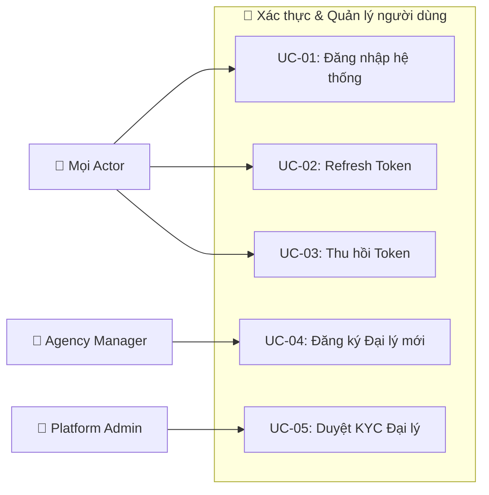

| Use Case | Actor chính | Mô tả |
|----------|------------|-------|
| UC-01 | Tất cả | Đăng nhập bằng username/password, nhận JWT Token |
| UC-02 | Tất cả | Gia hạn access token bằng refresh token |
| UC-03 | Tất cả | Thu hồi refresh token (đăng xuất) |
| UC-04 | Agency Manager | Đăng ký đại lý mới vào hệ thống (chờ KYC) |
| UC-05 | Platform Admin | Duyệt / Từ chối KYC của đại lý |

---

## 2. Module: KYC & Quản lý Đại lý (KYC)

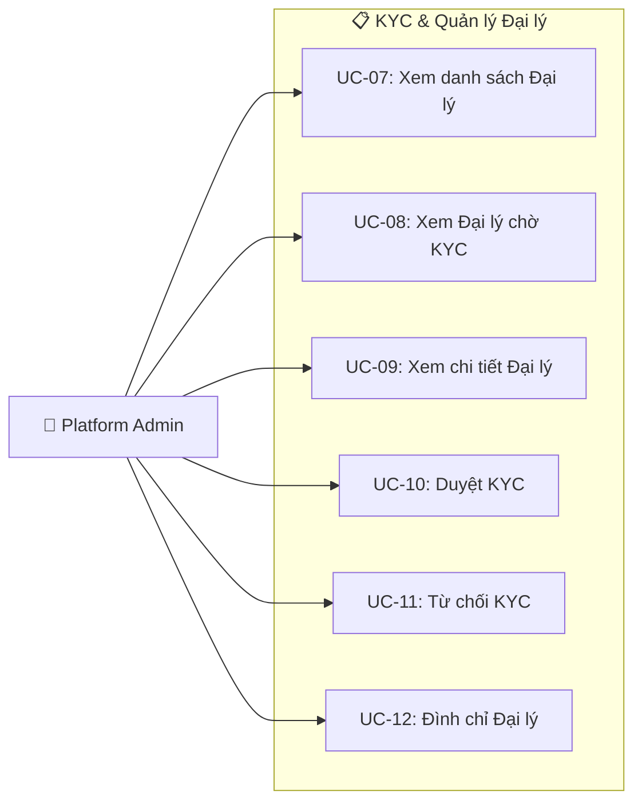

| Use Case | Mô tả |
|----------|-------|
| UC-07 | Xem toàn bộ đại lý trên hệ thống |
| UC-08 | Lọc đại lý đang chờ xét duyệt KYC (phân trang) |
| UC-09 | Xem chi tiết thông tin 1 đại lý cụ thể |
| UC-10 | Phê duyệt KYC → đại lý được phép giao dịch |
| UC-11 | Từ chối KYC → đại lý phải bổ sung hồ sơ |
| UC-12 | Đình chỉ hoạt động đại lý vi phạm |

---

## 3. Module: Tìm kiếm & Markup (Search)

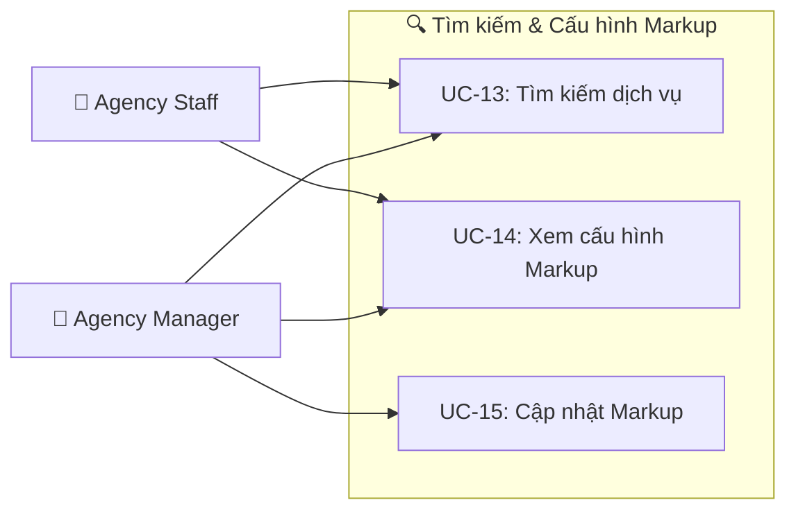

| Use Case | Actor | Mô tả |
|----------|-------|-------|
| UC-13 | Agency Staff/Manager | Tìm kiếm dịch vụ du lịch (khách sạn, tour, vé, v.v.) |
| UC-14 | Agency Staff/Manager | Xem cấu hình markup (phí dịch vụ) hiện tại |
| UC-15 | Agency Manager | Cập nhật tỷ lệ markup cho đại lý |

---

## 4. Module: Đặt chỗ (Booking)

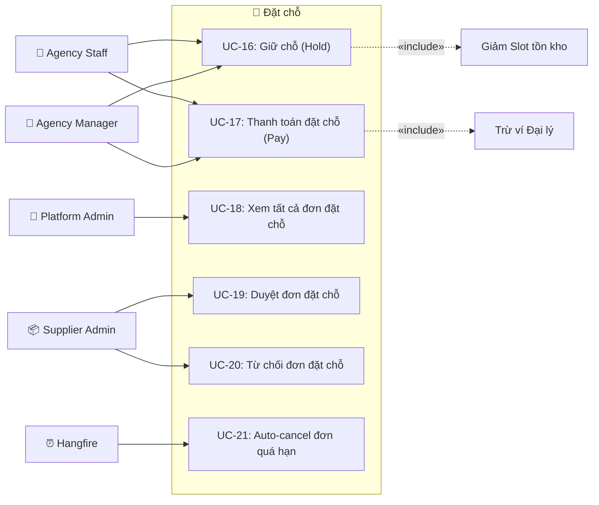

| Use Case | Actor | Mô tả |
|----------|-------|-------|
| UC-16 | Agency Staff/Manager | Giữ chỗ (HELD) — lock slot, reserve balance |
| UC-17 | Agency Staff/Manager | Xác nhận thanh toán → trừ ví đại lý |
| UC-18 | Platform Admin | Xem toàn bộ đơn trên hệ thống |
| UC-19 | Supplier Admin | Duyệt đơn đặt chỗ cần xác nhận |
| UC-20 | Supplier Admin | Từ chối đơn → hoàn tiền cho đại lý |
| UC-21 | System (Hangfire) | Tự động hủy đơn HELD quá thời hạn |

---

## 5. Module: Ví tài chính (Wallet)

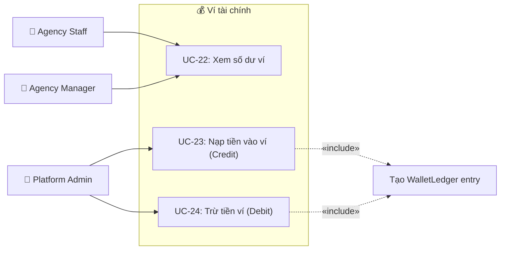

| Use Case | Actor | Mô tả |
|----------|-------|-------|
| UC-22 | Agency Staff/Manager | Xem số dư khả dụng, hạn mức tín dụng |
| UC-23 | Platform Admin | Nạp tiền vào ví đại lý (phê duyệt nạp tiền) |
| UC-24 | Platform Admin | Trừ tiền ví đại lý (điều chỉnh thủ công) |

---

## 6. Module: Thanh toán (Payment — VNPay)

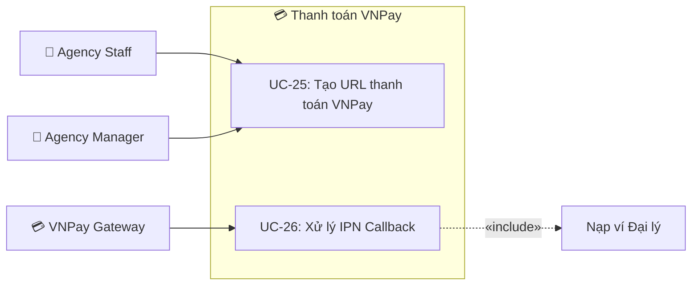

---

## 7. Module: Kho dịch vụ (Inventory)

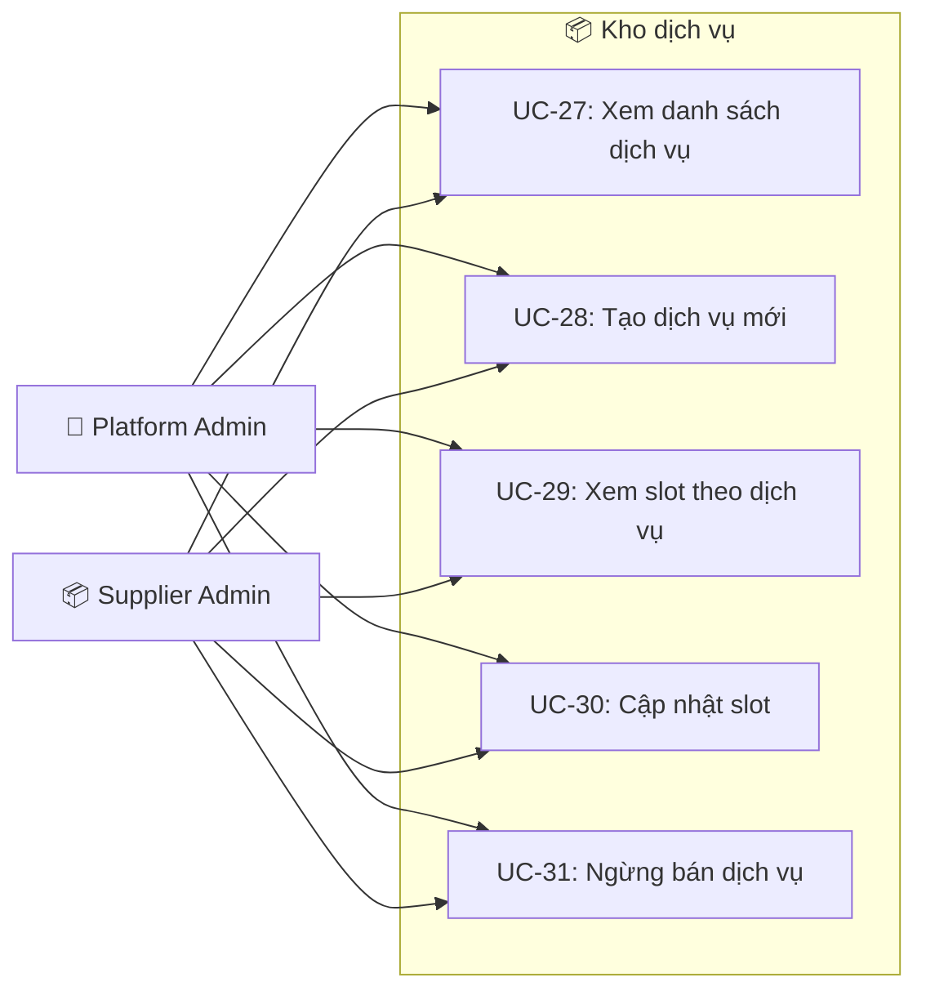

| Use Case | Mô tả |
|----------|-------|
| UC-27 | Xem danh sách dịch vụ của nhà cung cấp |
| UC-28 | Tạo dịch vụ du lịch mới (tour, khách sạn, vé...) |
| UC-29 | Xem slot/tồn kho theo khoảng thời gian |
| UC-30 | Cập nhật số lượng, giá slot |
| UC-31 | Dừng bán 1 dịch vụ |

---

## 8. Module: Nhà cung cấp (Supplier)

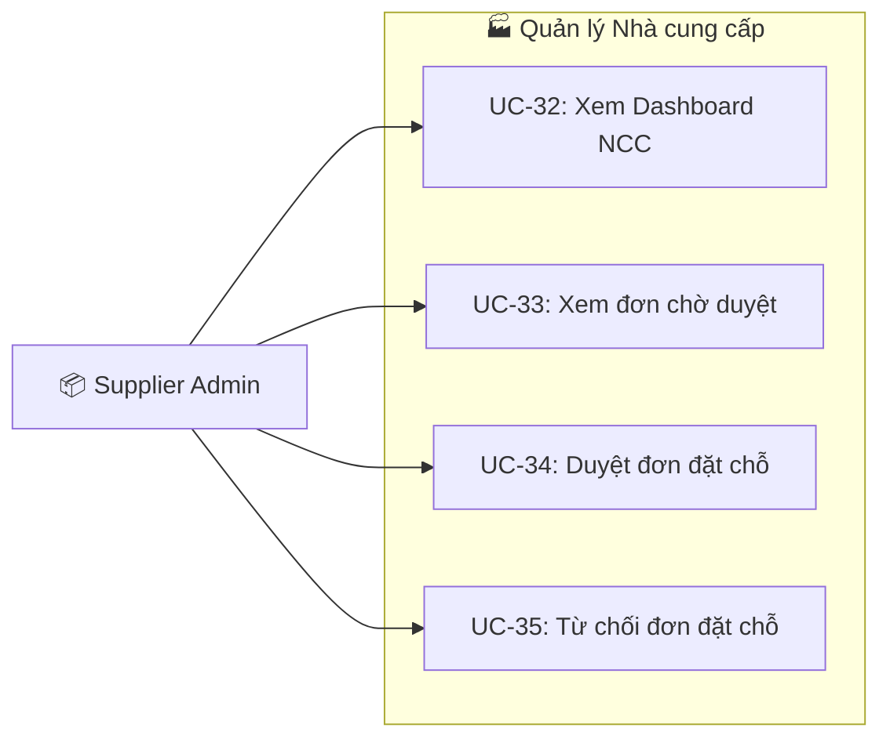

---

## 9. Module: Voucher & Tích hợp vận chuyển

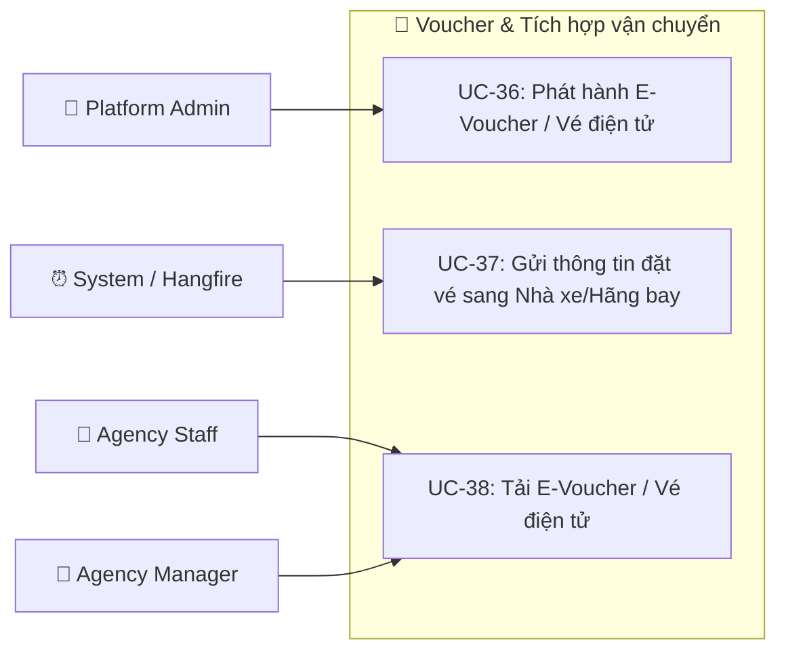

| Use Case | Actor | Mô tả |
|----------|-------|-------|
| UC-36 | Platform Admin | Phát hành E-Voucher / Vé điện tử sau khi đơn hàng được thanh toán |
| UC-37 | System / Hangfire | Gọi API đồng bộ thông tin đặt chỗ với Nhà xe (vd: Phương Trang) hoặc Hãng bay |
| UC-38 | Agency Staff/Manager | Tải E-Voucher / Vé điện tử để gửi cho khách hàng tự check-in |

---

## 10. Module: Khiếu nại (Claim)

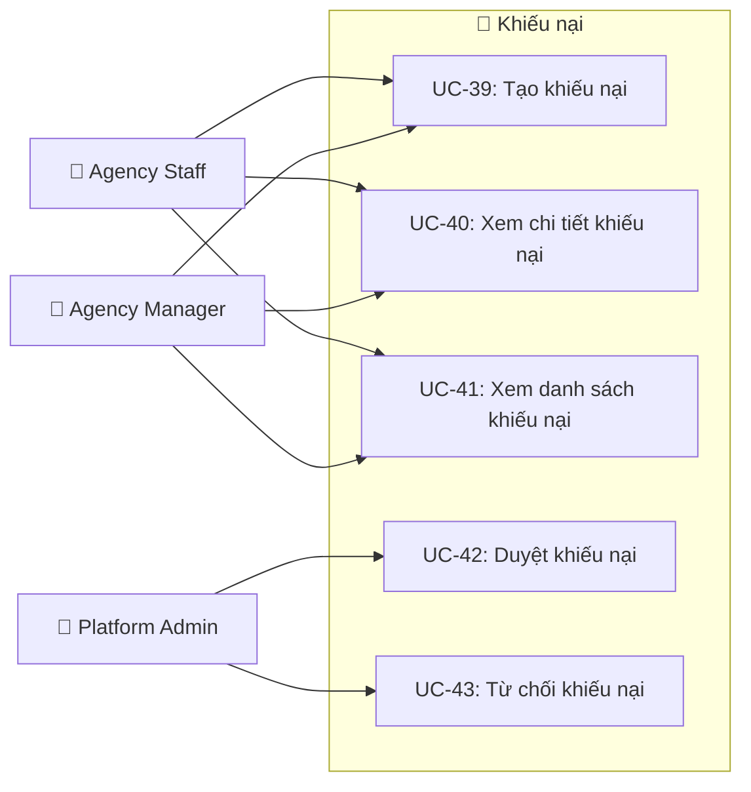

---

## 11. Module: Thông báo (Notification)

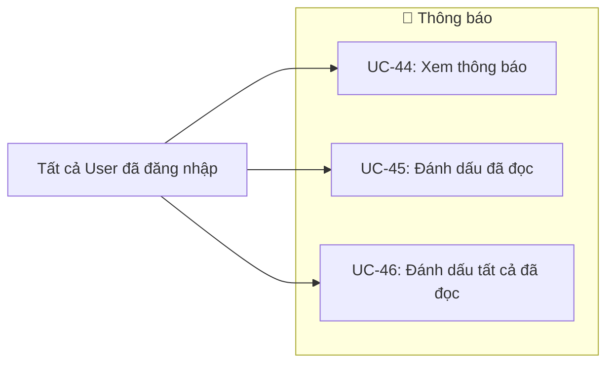

---

## 12. Module: Báo cáo & Cấu hình hệ thống

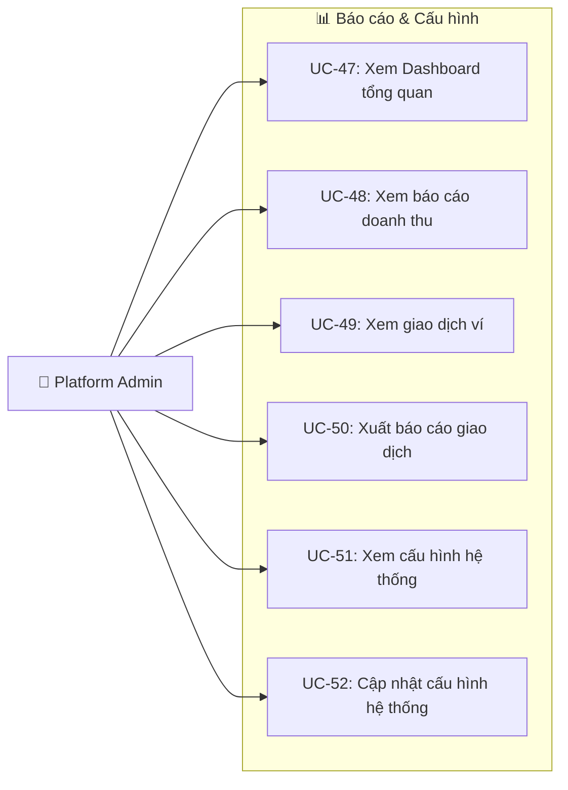

---

## 🎯 Ma trận Actor × Use Case tổng hợp

| Module | Platform Admin | Agency Manager | Agency Staff | Supplier Admin | External Transport | System |
|--------|:---:|:---:|:---:|:---:|:---:|:---:|
| Auth (Đăng nhập/Token) | ✅ | ✅ | ✅ | ✅ | — | — |
| KYC (Quản lý đại lý) | ✅ | — | — | — | — | — |
| Search (Tìm kiếm) | — | ✅ | ✅ | — | — | — |
| Booking (Đặt chỗ) | ✅ (xem all) | ✅ (hold/pay) | ✅ (hold/pay) | ✅ (duyệt/từ chối) | — | ✅ (auto-cancel) |
| Wallet (Ví) | ✅ (credit/debit) | ✅ (xem) | ✅ (xem) | — | — | — |
| Payment (VNPay) | — | ✅ | ✅ | — | — | ✅ (IPN) |
| Inventory (Kho) | ✅ | — | — | ✅ | — | — |
| Voucher & Vận chuyển | ✅ (phát hành) | ✅ (tải về) | ✅ (tải về) | — | 🚌 (nhận API) | ✅ (đồng bộ) |
| Claim (Khiếu nại) | ✅ (duyệt) | ✅ (tạo) | ✅ (tạo) | — | — | — |
| Report (Báo cáo) | ✅ | — | — | — | — | — |
| Config (Hệ thống) | ✅ | — | — | — | — | — |
| Notification | ✅ | ✅ | ✅ | ✅ | — | — |

---

## 📌 Ghi chú

- **Đường nét liền (→)**: Actor trực tiếp sử dụng Use Case
- **Đường nét đứt (`«include»`)**: Use Case bao gồm use case phụ
- **System / Hangfire**: Các tác vụ tự động chạy nền (auto-cancel đơn quá hạn, đồng bộ đặt vé đối tác, v.v.)
- **VNPay Gateway**: Actor ngoài hệ thống — gọi IPN callback khi thanh toán hoàn tất
- **External Transport**: Đối tác vận chuyển ngoại vi (Nhà xe như Phương Trang, Hãng máy bay) kết nối qua API tích hợp. Khách hàng tự chủ động di chuyển đến bến xe/sân bay và check-in với đối tác bằng E-Voucher/Vé điện tử. SYSTEM tự động gọi API đồng bộ thông tin đặt chỗ sau khi thanh toán.
