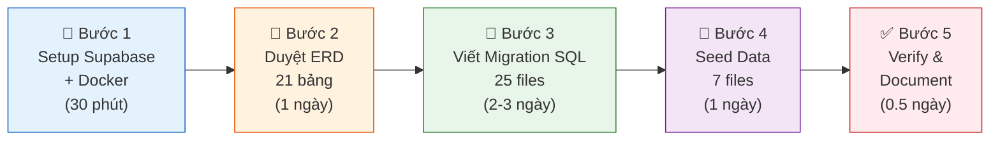
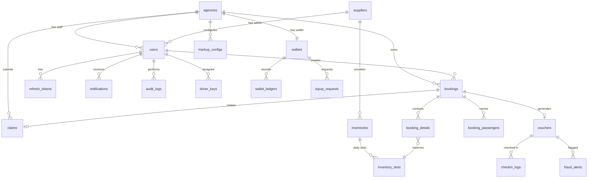

# 🗄️ Phase A — DATABASE: Kế Hoạch Triển Khai Chi Tiết

> **Nền tảng:** Supabase Free (Cloud) + Docker Local (Dev offline)
> **Database:** PostgreSQL 16 | **21 bảng** | **12 enum types**
> **Thời gian:** ~5-7 ngày

---

## 🗺️ Quy Trình 5 Bước



---

## 🔧 Bước 1: Setup Môi Trường (~30 phút)

### 1A. Tạo Project trên Supabase

```text
1. Truy cập https://supabase.com → Sign up (GitHub account)
2. New Project:
   - Name: b2b-travel-platform
   - Database Password: <tạo mật khẩu mạnh, lưu lại>
   - Region: Southeast Asia (Singapore)
3. Sau khi tạo xong → vào Settings > Database:
   - Copy Connection String (URI):
     postgresql://postgres.<ref>:<password>@aws-0-ap-southeast-1.pooler.supabase.com:6543/postgres
   - Copy Direct Connection:
     postgresql://postgres.<ref>:<password>@db.<ref>.supabase.co:5432/postgres
4. Lưu vào file .env (KHÔNG commit lên Git):
   DATABASE_URL=postgresql://postgres...
```

### 1B. Tạo Docker Local (Dev Offline)

```yaml
# docker-compose.yml (chỉ phần DB — dùng khi dev offline)
services:
  postgres-local:
    image: postgres:16-alpine
    container_name: b2b_postgres_local
    ports:
      - "5432:5432"
    environment:
      POSTGRES_DB: b2b_travel
      POSTGRES_USER: b2b_admin
      POSTGRES_PASSWORD: LocalDev2026!
    volumes:
      - postgres_data:/var/lib/postgresql/data
    healthcheck:
      test: ["CMD-SHELL", "pg_isready -U b2b_admin -d b2b_travel"]
      interval: 5s
      timeout: 5s
      retries: 5

volumes:
  postgres_data:
```

### 1C. Cấu trúc thư mục DB

```text
db/
├── migrations/              # 25 file SQL tạo schema (chạy tuần tự)
├── seeds/                   # 7 file SQL dữ liệu demo
├── docker-compose.yml       # Local PostgreSQL container
└── run_migrations.sh        # Script chạy tất cả migrations
```

### ✅ Done khi:
- [ ] Supabase project tạo xong, có connection string
- [ ] `.env` file có `DATABASE_URL`
- [ ] Docker Compose chạy được `docker-compose up -d postgres-local`
- [ ] `.gitignore` có dòng `.env`

---

## 📐 Bước 2: Duyệt ERD — 21 Bảng (~1 ngày)

> [!IMPORTANT]
> **Đây là bước quan trọng nhất.** Bạn PHẢI review kỹ ERD trước khi viết SQL.
> Thay đổi ERD = 0đ. Thay đổi SQL sau khi đã code 20 API = rất tốn công.

### 2A. Sơ đồ quan hệ tổng thể (ERD)



### 2B. Phân nhóm 6 nhóm nghiệp vụ

| Nhóm | Bảng | Mô tả |
| :--- | :--- | :--- |
| **👥 Identity** (4) | `suppliers`, `agencies`, `users`, `refresh_tokens` | Quản lý người dùng, đại lý, nhà cung cấp |
| **💰 Financial** (4) | `wallets`, `wallet_ledgers`, `topup_requests`, `markup_configs` | Ví tài chính, sổ cái, nạp tiền, cấu hình markup |
| **📦 Inventory** (2) | `inventories`, `inventory_slots` | Kho dịch vụ và slot chỗ theo ngày |
| **🎫 Booking** (3) | `bookings`, `booking_details`, `booking_passengers` | Đơn đặt chỗ, chi tiết, hành khách |
| **📱 Delivery** (4) | `vouchers`, `driver_keys`, `checkin_logs`, `fraud_alerts` | E-Voucher, QR check-in, chống gian lận |
| **🔧 System** (4) | `claims`, `notifications`, `audit_logs`, `system_configs` | Khiếu nại, thông báo, nhật ký, cấu hình |

### 2C. Chi tiết từng bảng (23 bảng chính — bạn review tại đây)

> Bảng chi tiết cột, kiểu dữ liệu đã có trong plan DB trước đó (21 bảng).
> Tôi sẽ **xuất file ERD riêng** vào `docs/database/erd.md` khi bạn duyệt xong.

### ✅ Done khi:
- [ ] Bạn đã review 21 bảng, xác nhận không cần thêm/bớt/sửa
- [ ] ERD diagram lưu vào `docs/database/erd.md`

---

## 📝 Bước 3: Viết Migration SQL — 25 Files (~2-3 ngày)

### Thứ tự tạo (6 đợt theo dependency FK)

| Đợt | Migration Files | Bảng tạo |
| :--- | :--- | :--- |
| **Đợt 0** | `V001__create_extensions_and_enums.sql` | Extensions (uuid-ossp, pgcrypto) + 12 enum types |
| **Đợt 1** | `V002` → `V004` | `suppliers`, `agencies`, `system_configs` |
| **Đợt 2** | `V005` → `V008` | `users`, `wallets`, `markup_configs`, `inventories` |
| **Đợt 3** | `V009` → `V015` | `refresh_tokens`, `wallet_ledgers`, `topup_requests`, `inventory_slots`, `notifications`, `audit_logs`, `driver_keys` |
| **Đợt 4** | `V016` → `V017` | `bookings`, `claims` |
| **Đợt 5** | `V018` → `V020` | `booking_details`, `booking_passengers`, `vouchers` |
| **Đợt 6** | `V021` → `V022` | `checkin_logs`, `fraud_alerts` |
| **Index** | `V023` | Tất cả indexes (17 indexes) |
| **Rules** | `V024` | CHECK constraints + Triggers |

### Danh sách 25 files đầy đủ:

```text
db/migrations/
├── V001__create_extensions_and_enums.sql       # uuid-ossp + 12 enums
├── V002__create_suppliers.sql                  
├── V003__create_agencies.sql                   
├── V004__create_system_configs.sql             
├── V005__create_users.sql                      # FK → agencies, suppliers
├── V006__create_wallets.sql                    # FK → agencies (1:1)
├── V007__create_markup_configs.sql             # FK → agencies
├── V008__create_inventories.sql                # FK → suppliers
├── V009__create_refresh_tokens.sql             # FK → users
├── V010__create_wallet_ledgers.sql             # FK → wallets (append-only)
├── V011__create_topup_requests.sql             # FK → wallets, agencies
├── V012__create_inventory_slots.sql            # FK → inventories
├── V013__create_notifications.sql              # FK → users
├── V014__create_audit_logs.sql                 # FK → users
├── V015__create_driver_keys.sql                # FK → users
├── V016__create_bookings.sql                   # FK → agencies, users
├── V017__create_claims.sql                     # FK → bookings, agencies, users
├── V018__create_booking_details.sql            # FK → bookings, inventory_slots
├── V019__create_booking_passengers.sql         # FK → bookings
├── V020__create_vouchers.sql                   # FK → bookings, users
├── V021__create_checkin_logs.sql               # FK → vouchers, users
├── V022__create_fraud_alerts.sql               # FK → vouchers, checkin_logs
├── V023__create_indexes.sql                    # 17 indexes
├── V024__create_constraints_and_triggers.sql   # CHECK + trigger
└── V025__create_init_script.sql                # Gộp file init cho Docker
```

### Quy tắc viết SQL:
- Mỗi file **độc lập**, chạy tuần tự
- Mỗi file có **header comment** (mô tả, dependencies, ngày tạo)
- Dùng `IF NOT EXISTS` để idempotent (chạy lại không lỗi)
- FK dùng `ON DELETE RESTRICT` (mặc định — không cho xóa cha khi còn con)
- `TIMESTAMPTZ` cho tất cả cột thời gian (timezone-aware)
- `DECIMAL(18,2)` cho tiền tệ VND

### ✅ Done khi:
- [ ] 25 files SQL viết xong
- [ ] Chạy tuần tự trên Supabase SQL Editor → không lỗi
- [ ] `\dt` trên Supabase → hiện 21 bảng
- [ ] `\dT` → hiện 12 enum types
- [ ] Chạy trên Docker Local → kết quả giống hệt

---

## 🌱 Bước 4: Seed Data — 7 Files (~1 ngày)

| File | Nội dung | Dữ liệu |
| :--- | :--- | :--- |
| `seed_01_system_configs.sql` | Cấu hình hệ thống | `hold_timeout_minutes=15`, `max_markup_percent=50`, `max_payment_attempts=5`... |
| `seed_02_platform_admin.sql` | Tài khoản quản trị | username: `admin`, password: `Admin@123` (BCrypt hash) |
| `seed_03_demo_suppliers.sql` | 2 nhà cung cấp demo | "Mường Thanh Nha Trang" (Hotel), "Phú Quốc Explorer" (Tour) |
| `seed_04_demo_agencies.sql` | 2 đại lý + wallets | 1 `APPROVED` (balance 50M), 1 `PENDING_KYC` |
| `seed_05_demo_users.sql` | 5 users | 1 manager + 2 staff (đại lý 1), 1 supplier admin, 1 delivery |
| `seed_06_demo_inventories.sql` | 5 dịch vụ + slots | 2 hotel rooms, 2 tours, 1 bus — slots cho 7 ngày tới |
| `seed_07_demo_markup.sql` | Markup configs | Đại lý 1: Hotel +5%, Tour +50k VND |

### ✅ Done khi:
- [ ] Seed chạy xong trên Supabase
- [ ] Login admin thành công (khi BE sẵn sàng)
- [ ] Có dữ liệu demo đủ để test search, booking, wallet

---

## ✅ Bước 5: Verify & Document (~0.5 ngày)

### Checklist kiểm tra

| # | Kiểm tra | Lệnh / Cách |
| :--- | :--- | :--- |
| 1 | 21 bảng tồn tại | Supabase Dashboard → Table Editor |
| 2 | 12 enums tồn tại | SQL: `SELECT typname FROM pg_type WHERE typtype = 'e'` |
| 3 | FK relationships đúng | SQL: `SELECT * FROM information_schema.table_constraints WHERE constraint_type = 'FOREIGN KEY'` |
| 4 | Indexes đầy đủ (17) | SQL: `SELECT indexname FROM pg_indexes WHERE schemaname = 'public'` |
| 5 | CHECK constraints | Test INSERT vi phạm → bị reject |
| 6 | Trigger chặn UPDATE ledger | `UPDATE wallet_ledgers SET amount = 0` → bị chặn |
| 7 | Seed data có dữ liệu | `SELECT count(*) FROM users` → có records |
| 8 | Docker Local khớp | Chạy migrations trên Docker → so sánh schema |

### Tài liệu xuất ra

```text
docs/database/
├── erd.md                    # ERD Mermaid diagram + mô tả quan hệ
├── data_dictionary.md        # Chi tiết từng cột, kiểu, ý nghĩa
├── indexes_and_constraints.md # Danh sách indexes + constraints + triggers
└── seed_data_guide.md        # Hướng dẫn seed data + demo accounts
```

### ✅ Definition of Done — Phase A hoàn tất

| # | Tiêu chí | ✅ |
|---|----------|---|
| 1 | Supabase có 21 bảng + 12 enums | ⬜ |
| 2 | 25 migration files trong `db/migrations/` | ⬜ |
| 3 | 7 seed files trong `db/seeds/` | ⬜ |
| 4 | Docker Local chạy `docker-compose up` → DB sẵn sàng | ⬜ |
| 5 | Tài liệu ERD + Data Dictionary trong `docs/database/` | ⬜ |
| 6 | Connection string lưu trong `.env` (không commit Git) | ⬜ |
| 7 | `.gitignore` có `.env` | ⬜ |
| 8 | Teammate có thể connect Supabase bằng connection string | ⬜ |

---

## 🚦 Bước Tiếp Theo Ngay Bây Giờ

Sau khi bạn duyệt plan này, tôi sẽ thực hiện theo thứ tự:

```text
① Bạn tạo Supabase project (tôi hướng dẫn từng bước)
② Tôi viết 25 migration SQL files
③ Chạy migrations trên Supabase
④ Viết 7 seed data files
⑤ Tạo Docker Compose cho local dev
⑥ Xuất tài liệu ERD + Data Dictionary
```
